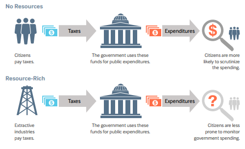

## Table of Contents

## What is the Resource Curse?

The Resource Curse is when countries that have a lot of natural resources, like oil or minerals, don't become rich and prosperous. Instead, these countries often face many problems. This happens because having a lot of resources can lead to bad government, corruption, and fighting over the resources. Instead of helping the country grow, the resources can make things worse.

For example, when a country finds a lot of oil, the government might start to depend too much on the money from selling oil. They might not take care of other parts of the economy, like farming or manufacturing. This can make the country's economy weak. Also, the money from resources can lead to corruption, where leaders take the money for themselves instead of using it to help the people. This can cause conflict and make it hard for the country to develop properly.

## Which countries are most affected by the Resource Curse?

Many countries in Africa suffer from the Resource Curse. Nigeria is a big example. Nigeria has a lot of oil, but many people there are still very poor. The oil money often goes to a few rich people instead of helping everyone. This has caused a lot of problems, like fighting and corruption. Another African country, Angola, also has a lot of oil but faces similar issues. The government there has not used the oil money to help the people, so many Angolans live in poverty.

In South America, Venezuela is a clear case of the Resource Curse. Venezuela has huge oil reserves, but the country is in a big crisis. The government has used oil money badly, leading to a broken economy and many people leaving the country. In the Middle East, countries like Iraq and Libya have a lot of oil but also face many problems. In these countries, the oil wealth has not made life better for most people and has led to conflict and instability.

Overall, the Resource Curse affects many countries around the world, especially those with a lot of oil. These countries often struggle with poverty, corruption, and conflict, even though they have valuable resources.

## How does the discovery of natural resources impact a country's economy?

When a country finds a lot of natural resources like oil or minerals, it can change the economy in big ways. At first, it might seem like a good thing because the country can make a lot of money from selling these resources. This money can help the government pay for things like schools and hospitals. But often, the government starts to rely too much on this money. They might not spend time and effort on other parts of the economy, like farming or making things. This can make the economy weak because it depends too much on one thing.

Also, the money from natural resources can lead to big problems. Leaders might take the money for themselves instead of using it to help the people. This is called corruption. When this happens, it can make people angry and lead to fighting over who gets to control the resources. This can make the country unstable and unsafe. In the end, the discovery of natural resources can make a country's economy worse instead of better if it is not managed well.

## What are the social impacts of the Resource Curse?

The Resource Curse can make life hard for people in a country. When a country finds a lot of natural resources, the money from these resources often goes to a few rich people instead of helping everyone. This can make many people stay poor, even though the country is making a lot of money. People might not have good schools, hospitals, or jobs. This can make them feel left out and unhappy with their government.

Also, the Resource Curse can cause fighting and conflict. When there is a lot of money from natural resources, different groups might fight over who gets to control it. This can lead to war and make the country unsafe. People might have to leave their homes because of the fighting. This can break families apart and make life very hard for everyone. In the end, the Resource Curse can make people's lives worse instead of better.

## Can the Resource Curse lead to political instability?

Yes, the Resource Curse can lead to political instability. When a country finds a lot of natural resources, the money from these resources can make the government and leaders very powerful. They might use this money to stay in power instead of helping the people. This can make people angry and unhappy with their leaders. They might protest or even try to overthrow the government, which can cause a lot of chaos and fighting.

Also, different groups might fight over who gets to control the resources and the money that comes from them. This fighting can turn into civil war, making the country very unstable. People might not trust the government anymore, and this can make it hard for the country to have a stable political system. In the end, the Resource Curse can make a country's politics very unstable and dangerous.

## What role does governance play in mitigating the Resource Curse?

Good governance is very important in helping a country avoid the Resource Curse. When leaders use the money from natural resources wisely, they can help everyone in the country, not just a few rich people. They can spend money on schools, hospitals, and jobs. This can make life better for everyone and help the country grow strong. Good leaders also make sure the money is shared fairly and not just taken by a few people. This helps to keep people happy and the country stable.

Bad governance, on the other hand, can make the Resource Curse worse. If leaders are corrupt and take the money for themselves, it can make people very angry. They might start fighting over who gets to control the resources. This can lead to war and make the country very unstable. When the government does not use the money to help everyone, it can make people feel left out and unhappy. Good governance is key to making sure the money from natural resources helps the country and its people instead of hurting them.

## How can the Resource Curse affect a country's long-term economic development?

The Resource Curse can hurt a country's long-term economic development by making it too dependent on one resource. When a country relies a lot on money from oil or minerals, it might not spend time and effort on other parts of the economy, like farming or making things. This can make the economy weak because if the price of the resource goes down, the country will have big problems. Also, the government might not plan for the future and save money for when the resources run out. This can make it hard for the country to grow and develop over time.

The Resource Curse can also lead to corruption and bad government, which can slow down long-term economic growth. When leaders take the money from resources for themselves, it does not help the people or the economy. This can make people angry and cause fighting, which can destroy businesses and make it hard for the economy to grow. If the country is always fighting over resources, it will be hard for it to build strong industries and have a healthy economy in the long run. Good governance and planning are key to making sure the money from resources helps the country grow and develop over time.

## What strategies have been successful in overcoming the Resource Curse?

Some countries have found ways to beat the Resource Curse by making good rules about how to use the money from natural resources. Norway is a great example. They found a lot of oil, but they made a plan to save some of the money for the future. They put the money into a special fund, called the Government Pension Fund Global. This fund helps to make sure Norway can still have money even after the oil runs out. They also make sure to spend money on other parts of the economy, like schools and businesses, so they are not just relying on oil. By doing this, Norway has been able to grow and stay stable.

Another way to fight the Resource Curse is to make sure the government is open and honest about how they use the money from resources. Countries like Botswana have done this well with their diamonds. They have clear rules about how the money is spent, and they share this information with the people. This helps to stop corruption and makes sure the money is used to help everyone. By having good leaders and clear rules, countries can use their natural resources to grow and develop over time, instead of letting the resources cause problems.

## How does the Resource Curse relate to the concept of Dutch Disease?

The Resource Curse and Dutch Disease are connected because they both talk about how finding a lot of natural resources can hurt a country's economy. Dutch Disease is when a country finds a lot of resources, like oil or gas, and the money from these resources makes the country's currency stronger. When the currency gets stronger, it can make other parts of the economy, like farming or making things, less competitive. This is because the country's goods become more expensive for other countries to buy. So, even though the country is making a lot of money from resources, other parts of the economy can get weaker.

The Resource Curse can make Dutch Disease worse. When a country depends too much on money from resources, it might not take care of other parts of the economy. This can lead to problems like corruption and fighting over who gets to control the resources. Both the Resource Curse and Dutch Disease show that finding a lot of natural resources can cause big problems if the country does not manage the money well. Good planning and rules can help a country avoid these problems and use the resources to grow and develop.

## What are the environmental consequences associated with the Resource Curse?

The Resource Curse can lead to big problems for the environment. When a country finds a lot of natural resources like oil or minerals, companies might start to dig and drill a lot to get them out. This can hurt the land, water, and air. For example, oil spills can happen, which can kill animals and plants and make water dirty. Mining can also create a lot of waste that can pollute rivers and destroy forests. When the government is more interested in making money from resources than protecting the environment, these problems can get worse.

Also, the Resource Curse can make it hard for a country to take care of the environment in the long run. If the government spends all its money on getting resources out of the ground, it might not have money left to clean up the mess or protect nature. This can lead to long-lasting damage to the environment. In the end, the rush to get rich from natural resources can harm the land and water, making life harder for people and animals that live there.

## How do international trade and global markets influence the Resource Curse?

International trade and global markets can make the Resource Curse worse. When a country finds a lot of natural resources, it might start to sell them to other countries. The price of these resources can go up and down a lot because of what is happening in the global market. If the price goes down, the country can have big problems because it depends too much on selling these resources. Also, big companies from other countries might come in to take the resources. These companies might not care about the people or the environment in the country. They just want to make money, which can lead to more problems and make the Resource Curse worse.

On the other hand, global markets can also help a country deal with the Resource Curse if it is managed well. If the country sells its resources wisely and saves some of the money, it can use that money to help other parts of the economy grow. For example, the country can use the money to build schools and hospitals or to start new businesses. This can help the country not depend too much on just one resource. Also, being part of international trade can help the country learn from other places that have dealt with the Resource Curse well. By working with other countries and following good rules, a country can use its resources to grow and develop over time.

## What theoretical models explain the mechanisms of the Resource Curse?

One way to understand the Resource Curse is through the "Dutch Disease" model. This model says that when a country finds a lot of resources like oil or minerals, it can make the country's money (currency) stronger. When the currency gets stronger, it can make other things the country makes, like food or cars, more expensive for other countries to buy. This can hurt other parts of the economy because they can't sell as much. The country might start to depend too much on selling the resources and not take care of other parts of the economy. This can make the whole economy weak if the price of the resources goes down.

Another model is the "Rentier State" theory. This model says that when a country makes a lot of money from resources, the government might not need to tax the people as much. Without taxes, people might not care as much about what the government does because they don't feel like they are paying for it. This can make the government less responsible and more likely to be corrupt. The government might use the money from resources to stay in power instead of helping the people. This can lead to problems like fighting over who gets to control the resources and make the country unstable.

The "Institutional Quality" model also helps explain the Resource Curse. This model says that having a lot of resources can make the government and leaders very powerful. If the leaders are not honest and good at their job, they might use the money from resources in bad ways. They might take the money for themselves instead of using it to help the people. This can make people angry and cause fighting. Good rules and leaders can help a country use its resources well, but bad leaders can make the Resource Curse worse.

## References & Further Reading

[1]: Sachs, J. D., & Warner, A. M. (1995). ["Natural Resource Abundance and Economic Growth."](https://www.nber.org/papers/w5398) National Bureau of Economic Research Working Paper No. 5398.

[2]: Auty, R. M. (1993). ["Sustaining Development in Mineral Economies: The Resource Curse Thesis."](https://archive.org/details/sustainingdevelo0000auty) Routledge.

[3]: Ross, M. L. (2012). ["The Oil Curse: How Petroleum Wealth Shapes the Development of Nations."](https://www.jstor.org/stable/j.ctt7s3wz) Princeton University Press.

[4]: Gylfason, T. (2001). ["Natural Resources, Education, and Economic Development."](https://www.sciencedirect.com/science/article/pii/S0014292101001271) Oxford Review of Economic Policy, 15(1), 1-20.

[5]: Mehlum, H., Moene, K., & Torvik, R. (2006). ["Institutions and the Resource Curse."](https://onlinelibrary.wiley.com/doi/full/10.1111/j.1468-0297.2006.01045.x) The Economic Journal, 116(508), 1-20.

[6]: Van der Ploeg, F., & Poelhekke, S. (2009). ["Volatility and the Natural Resource Curse."](https://www.jstor.org/stable/27784157) Journal of Economic Growth, 14(4), 285-311.