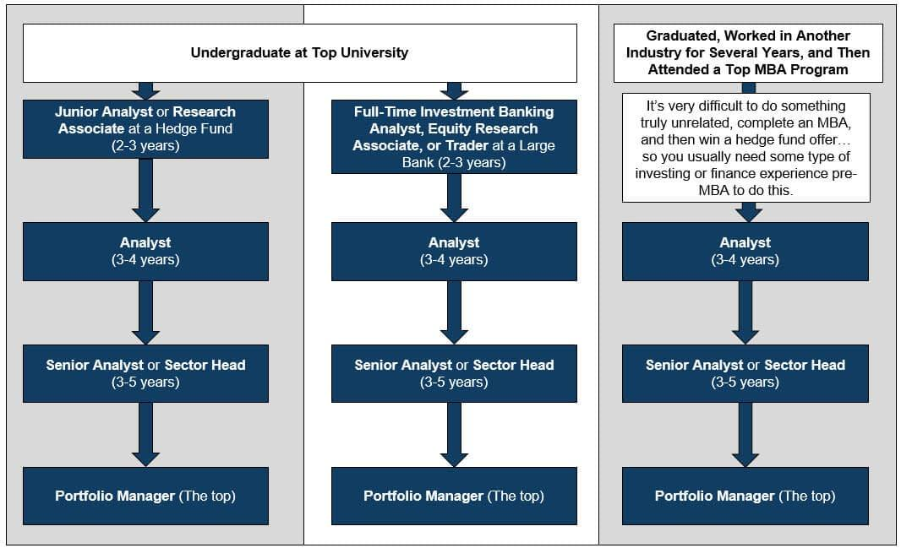

## Table of Contents

## What is a hedge fund and what role does an analyst play in it?

A hedge fund is a type of investment fund that pools money from investors to invest in a wide range of assets. Unlike mutual funds, hedge funds can use more complex strategies, like borrowing money to make investments or betting that the price of an asset will go down. The goal of a hedge fund is to make money for its investors, often by trying to make profits no matter what the market is doing.

An analyst in a hedge fund is someone who helps the fund make smart investment choices. They do this by researching companies, markets, and economic trends to find good investment opportunities. The analyst looks at lots of data and information to figure out which investments might make money and which ones might not. Their job is really important because their research and advice help the fund managers decide where to put the investors' money.

## What are the basic responsibilities of a hedge fund analyst?

A hedge fund analyst's main job is to research and analyze different investments. They look at companies, markets, and economic trends to find good opportunities for the hedge fund to invest in. This involves collecting a lot of data, reading financial reports, and using special tools to understand how different investments might perform. The analyst needs to be good at math and understanding numbers because they have to make sense of all this information to see if an investment is a smart choice.

Once the analyst has done their research, they need to share what they've found with the rest of the team, especially the fund managers. They write reports and sometimes give presentations to explain why they think a certain investment is a good idea. The fund managers use this information to decide where to put the investors' money. So, a big part of the analyst's job is to communicate clearly and make sure everyone understands their recommendations.

## How does a hedge fund analyst conduct market research?

A [hedge fund](/wiki/hedge-fund-trading-strategies) analyst starts their market research by gathering a lot of information. They look at financial reports from companies, read news articles, and use special databases that have lots of data about different markets. They also talk to people who know a lot about specific industries, like experts or other analysts. By collecting all this information, the analyst can start to understand what's happening in the market and where there might be good investment opportunities.

Once the analyst has all this information, they use special tools and methods to analyze it. They might use computer programs to look at big sets of data and find patterns or trends. They also do something called "[fundamental analysis](/wiki/fundamental-analysis)," which means they look closely at a company's financial health to see if it's a good investment. By putting all this together, the analyst can figure out which investments might make money and which ones might not. This helps them give good advice to the hedge fund managers about where to invest the fund's money.

## What financial models do hedge fund analysts typically use?

Hedge fund analysts use different financial models to help them make smart investment choices. One common model is the discounted cash flow (DCF) model. This model helps analysts figure out how much a company is worth by looking at the money it will make in the future and then bringing that money back to today's value. They use this to see if a company's stock is a good buy. Another model is the comparative valuation model, where analysts compare a company to similar companies to see if it's priced right. They look at things like price-to-earnings ratios to make these comparisons.

Analysts also use the Black-Scholes model a lot, especially when they're looking at options and other kinds of derivatives. This model helps them predict how much an option might be worth in the future based on things like the stock's price, how much it moves around, and how long until the option expires. For understanding how different investments affect each other, analysts might use the Capital Asset Pricing Model (CAPM). This model helps them see how risky an investment is compared to the whole market and figure out what kind of return they should expect. By using these models, analysts can make better guesses about which investments will do well and help the hedge fund make more money.

## How do hedge fund analysts identify investment opportunities?

Hedge fund analysts identify investment opportunities by doing a lot of research. They start by looking at lots of information about different companies and markets. They read financial reports, check news articles, and use special databases to find out what's going on. They also talk to experts who know a lot about specific industries. By collecting all this information, analysts can start to see patterns and trends that might show where there's a good chance to make money.

Once they have all the information, analysts use special tools and models to make sense of it. They might use something called a discounted cash flow model to see if a company is a good investment by looking at its future earnings. They also compare companies to others in the same industry to see if they're a good buy. By using these models and their research, analysts can figure out which investments are likely to do well and give good advice to the hedge fund managers about where to put the fund's money.

## What are the key performance indicators that hedge fund analysts monitor?

Hedge fund analysts keep an eye on many key performance indicators to see how well their investments are doing. They look at things like the return on investment, which tells them how much money they're making from their investments. They also watch the [volatility](/wiki/volatility-trading-strategies) of their investments, which shows how much the prices go up and down. Another important thing they check is the alpha, which measures how much better their investments are doing compared to the overall market. By looking at these indicators, analysts can see if their investment choices are working well.

Analysts also pay attention to the Sharpe ratio, which helps them understand how much return they're getting for the risk they're taking. They look at the beta of their investments to see how much they move with the market. They also keep track of the drawdown, which shows the biggest drop in value their investments have had. These indicators help analysts figure out if they need to change their strategies or if they should keep going with what they're doing. By watching these key performance indicators, hedge fund analysts can make better decisions to help their funds grow.

## How do hedge fund analysts manage and mitigate risk?

Hedge fund analysts manage and mitigate risk by first figuring out what risks they might face. They look at how much the prices of their investments might go up and down, called volatility. They also think about things like the economy, interest rates, and even world events that could affect their investments. By understanding these risks, analysts can choose investments that are less likely to lose money or find ways to protect their investments, like using options or other financial tools to hedge against losses.

Once they know the risks, hedge fund analysts use different strategies to lower them. They might spread their money across lots of different investments, called diversification, so if one investment does badly, it won't hurt the whole fund. They also set limits on how much they can lose on any single investment, called stop-loss orders. By keeping a close eye on their investments and using these strategies, analysts can help make sure the hedge fund loses less money and keeps making profits for its investors.

## What reporting and communication duties does a hedge fund analyst have?

A hedge fund analyst has to share what they find out with the rest of the team, especially the fund managers. They write reports that explain their research and why they think certain investments are a good idea. These reports need to be clear and easy to understand because they help the fund managers make decisions about where to put the investors' money. Sometimes, the analyst also gives presentations to explain their findings in more detail. This helps everyone on the team understand the analyst's recommendations and why they matter.

Besides sharing their research, hedge fund analysts also have to keep everyone updated on how the investments are doing. They create regular reports that show how well the investments are performing and whether they're meeting the fund's goals. These reports include key performance indicators like return on investment and risk levels. By doing this, the analyst helps the fund managers and investors see if the fund's strategies are working and if they need to make any changes. Keeping everyone informed is a big part of the analyst's job because it helps the whole team make smart decisions.

## How does a hedge fund analyst contribute to portfolio management?

A hedge fund analyst helps with portfolio management by doing a lot of research to find good investments. They look at companies, markets, and economic trends to figure out which investments might make money. They use special tools and models to understand how different investments might perform. By doing this research, the analyst gives the fund managers important information they need to decide where to put the investors' money. The analyst's job is to make sure the portfolio includes investments that will help the fund grow and make profits.

The analyst also helps manage the portfolio by keeping an eye on how the investments are doing. They watch key performance indicators like return on investment and risk levels to see if the investments are meeting the fund's goals. If something isn't working well, the analyst suggests changes to the portfolio. They might recommend selling some investments and buying new ones to keep the portfolio strong. By doing this, the analyst helps the fund managers make smart choices that can lead to better results for the investors.

## What advanced analytical tools and techniques are used by expert hedge fund analysts?

Expert hedge fund analysts use advanced tools like [machine learning](/wiki/machine-learning) and [artificial intelligence](/wiki/ai-artificial-intelligence) to find patterns in big sets of data. These tools help them look at lots of information quickly and make better guesses about which investments might do well. They also use something called quantitative analysis, where they use math and computer programs to understand how different investments might behave. This helps them make smart choices about where to put the fund's money.

Another important tool is called risk management software. This helps analysts see how much risk their investments might have and find ways to lower that risk. They use techniques like stress testing, where they see how their investments would do if something bad happened in the market. By using these advanced tools and techniques, expert hedge fund analysts can make better decisions and help the fund grow.

## How do hedge fund analysts stay updated with regulatory changes and compliance requirements?

Hedge fund analysts stay updated with regulatory changes and compliance requirements by keeping a close eye on news and updates from regulatory bodies like the Securities and Exchange Commission (SEC). They often subscribe to newsletters and alerts from these organizations to make sure they know about any new rules or changes. They also attend industry conferences and webinars where experts talk about the latest regulatory updates. By doing this, analysts can understand how these changes might affect their work and the investments they recommend.

In addition to staying informed through external sources, hedge fund analysts work closely with the compliance teams within their firms. These teams help make sure that the fund follows all the rules and regulations. Analysts often have regular meetings with compliance officers to discuss any new requirements and how to meet them. This teamwork helps analysts stay on top of compliance issues and make sure their investment strategies are always in line with the law.

## What are the career progression opportunities for a hedge fund analyst?

A hedge fund analyst can move up in their career in different ways. They might start as a junior analyst and, with time and experience, become a senior analyst. As a senior analyst, they take on more responsibility and lead bigger projects. They might also move into a portfolio manager role, where they make the big decisions about where to invest the fund's money. This is a big step up because portfolio managers have a lot of influence on the fund's success.

Another path for a hedge fund analyst is to become a research director. In this job, they manage a team of analysts and make sure everyone's research is top-notch. They also help set the direction for the fund's research efforts. Some analysts might even start their own hedge funds if they have enough experience and money. This can be a big challenge, but it can also be very rewarding if the new fund does well. Overall, there are many ways for a hedge fund analyst to grow their career and take on new challenges.

## References & Further Reading

[1]: [Advances in Financial Machine Learning](https://www.amazon.com/Advances-Financial-Machine-Learning-Marcos/dp/1119482089) by Marcos Lopez de Prado

[2]: [Evidence-Based Technical Analysis: Applying the Scientific Method and Statistical Inference to Trading Signals](https://www.amazon.com/Evidence-Based-Technical-Analysis-Scientific-Statistical/dp/0470008741) by David Aronson

[3]: [Machine Learning for Algorithmic Trading](https://github.com/stefan-jansen/machine-learning-for-trading) by Stefan Jansen

[4]: [Quantitative Trading: How to Build Your Own Algorithmic Trading Business](https://www.amazon.com/Quantitative-Trading-Build-Algorithmic-Business/dp/1119800064) by Ernest P. Chan

[5]: [Algorithms for Hyper-Parameter Optimization](https://papers.nips.cc/paper/4443-algorithms-for-hyper-parameter-optimization.pdf) by Bergstra, J., Bardenet, R., Bengio, Y., & Kégl, B. (2011). Advances in Neural Information Processing Systems 24.