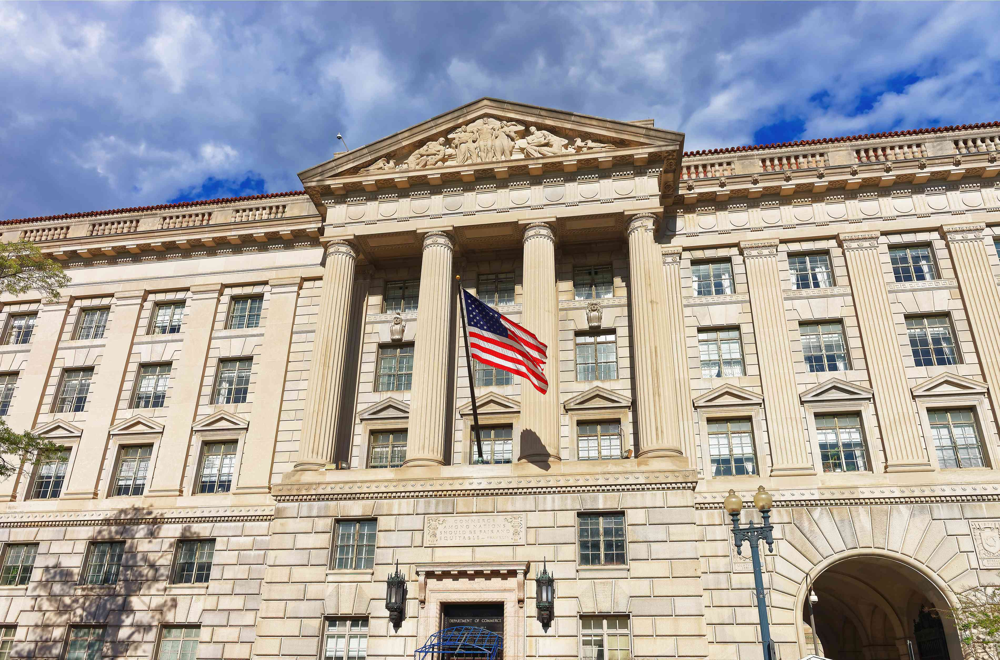

The Treasury Department of the United States plays a pivotal role in the nation's economy, with responsibilities that extend across financial management, economic growth, and job creation. Established to oversee government revenue and foster economic stability, the Treasury has evolved into a crucial component of both domestic and international monetary frameworks. At its helm is the United States Secretary of the Treasury, a key figure tasked with policy development, financial regulation, and representing the U.S. in international economic arenas. The Secretary's leadership is vital to maneuvering through fiscal policies, regulatory reforms, and financial crises, ensuring the nation's economic health and stability.

In recent years, the rise of algorithmic trading, a sophisticated method that utilizes computer algorithms to execute trading orders at lightning speed, has become increasingly relevant to Treasury operations. Algorithmic trading enhances market efficiency and liquidity by quickly processing complex financial data and executing trades with minimal human intervention. This technological advancement presents both opportunities and challenges for the Treasury Department, necessitating adaptability in policy-making and regulatory oversight to ensure fair and stable market conditions.



The interconnectedness of the Treasury Department, the Secretary of the Treasury, and algorithmic trading reflects the intricate web of modern financial landscapes. The Treasury's role is more critical than ever as it engages with technological innovations that influence market behavior and economic stability. Algorithmic trading, while offering the potential for increased market fluidity, also requires vigilant oversight to mitigate risks such as increased volatility and systemic failure. The objective of this article is to explore the responsibilities of the Treasury Department and its Secretary, with a special focus on the burgeoning field of algorithmic trading, to understand their roles in steering the complex dynamics of today's financial systems.

## Table of Contents

## The United States Treasury Department: An Overview

The United States Department of the Treasury, established on September 2, 1789, is a pivotal institution responsible for the formulation and execution of economic, fiscal, and financial policies in the United States. Its founding was driven by the need to create a stable financial infrastructure for the nascent country, following the economic challenges post-independence. As one of the original executive departments, the Treasury plays a crucial role in maintaining the nation's economic strength and stability.

The mission of the Treasury Department is to maintain a strong economy and promote conditions that enable economic growth and job creation. This mission underscores its commitment to fostering sustainable economic opportunities through effective policy measures and financial management practices. By implementing robust economic strategies, the Treasury aims to stimulate job creation and enhance the overall economic landscape of the United States.

Key functions of the Treasury include managing government finances, producing currency, and collecting revenues. These functions are fundamental to the Department’s operations. The management of government finances involves the formulation of economic policies, overseeing the budget, and implementing financial regulations. Currency production is handled by the Bureau of Engraving and Printing and the United States Mint, both of which ensure the secure and efficient creation of the nation’s currency. Revenue collection is primarily managed by the Internal Revenue Service (IRS), which administers tax policies and ensures compliance with federal tax laws.

The Treasury Department also significantly influences domestic and international monetary affairs. Domestically, it works closely with other governmental bodies to shape monetary policies that affect the national economy, including interest rates and inflation control. On the international front, the Treasury engages with global financial institutions and other countries to coordinate policies that support economic stability and growth worldwide. This includes participation in forums like the International Monetary Fund (IMF) and the World Bank.

Aiding in maintaining financial stability is a critical role of the Treasury. By managing public debt, implementing fiscal policies, and regulating financial institutions, the Treasury ensures that the financial system remains resilient to shocks and capable of supporting economic activities. Its efforts in this domain aim to prevent financial crises and mitigate their impacts should they occur.

In summary, the Treasury Department's establishment and ongoing efforts are integral to the United States' economic framework. From currency production to international monetary involvement, the Department's wide range of responsibilities ensures the financial health and stability of the nation, supporting both short-term economic activities and long-term strategic goals.

## Role and Responsibilities of the Secretary of the Treasury

The United States Secretary of the Treasury is a pivotal figure within the federal government, with a multifaceted role that extends across economic policy, financial regulation, and international representation. Appointed by the President of the United States and confirmed by the Senate, the Secretary is a key member of the President's Cabinet. This appointment process underscores the position's significance, reflecting the critical responsibilities associated with managing the national treasury and influencing both domestic and international economic policy.

One of the primary responsibilities of the Treasury Secretary is policy formulation. This involves crafting and implementing policies that influence the U.S. economy, such as tax laws, financial regulations, and economic sanctions. The Treasury Secretary plays a significant role in advising the President on economic issues and is heavily involved in shaping fiscal policies that aim to maintain economic stability and growth.

Additionally, the Treasury Secretary is responsible for overseeing numerous agencies, including the Internal Revenue Service (IRS). The IRS is essential for revenue collection and tax enforcement, and its effective management is crucial for sustaining government operations. Besides the IRS, the Treasury Secretary also oversees other bodies such as the Office of the Comptroller of the Currency (OCC) and the Financial Crimes Enforcement Network (FinCEN). These agencies play vital roles in maintaining the integrity and stability of the financial system.

In times of financial crisis, the Treasury Secretary's role becomes even more critical. The Secretary is often at the forefront of formulating and executing strategies to mitigate financial turbulence and restore stability. This includes coordinating with other federal agencies, financial institutions, and international entities to address systemic risks and implement recovery measures. Historical instances like the 2008 financial crisis demonstrated the importance of decisive action and effective policymaking by the Treasury to stabilize markets and support economic recovery.

International representation is another crucial aspect of the Treasury Secretary's duties. In this capacity, the Secretary engages with foreign governments and international organizations, such as the International Monetary Fund (IMF) and the World Bank, to negotiate economic policies and agreements that have global implications. This role helps to foster international economic cooperation and ensures that U.S. economic interests are represented on the global stage.

Under the current Secretary, recent initiatives and priorities have focused on addressing economic challenges posed by the COVID-19 pandemic, promoting sustainable growth, and ensuring financial system resilience. This includes advocating for stimulus measures to support the economy, addressing international tax issues, and implementing policies aimed at enhancing economic equity and climate resilience.

Overall, the role of the United States Secretary of the Treasury is complex and dynamic, encompassing a broad range of responsibilities that are vital for maintaining the financial and economic well-being of the nation. The Secretary acts as a linchpin in the administration's economic team, steering the U.S. economy through various challenges and opportunities.

## Algo Trading: Transforming Financial Markets

Algorithmic trading, commonly referred to as algo trading, involves the use of computer algorithms to automate the process of trading financial securities. These algorithms leverage mathematical models and historical data to execute trades at speeds and frequencies that are beyond human capability. The basic premise of algo trading is to execute orders in a systematic manner, minimizing market impact and optimizing trade execution under a predefined set of rules.

The automation in algo trading operates by setting criteria for trade execution, which might include timing, price, or even intricate mathematical models. Python, with libraries such as Pandas and NumPy, is frequently used for developing and testing these algorithms. A simple Python function to calculate a moving average, often used as part of an algo trading strategy, might look like this:

```python
import pandas as pd

def moving_average(prices, window_size):
    return prices.rolling(window=window_size).mean()

# Example usage
prices = pd.Series([10, 12, 13, 14, 18, 21, 24, 30])
print(moving_average(prices, window_size=3))
```

Algo trading has gained significant popularity due to its ability to enhance market efficiency and [liquidity](/wiki/liquidity-risk-premium). By enabling the swift execution of trades, it reduces transaction costs and minimizes abrupt price changes, thus promoting smoother and more continuous markets. This enhanced efficiency is beneficial for both traders and the markets themselves, as it narrows bid-ask spreads and decreases the cost for end-users, thereby increasing liquidity.

However, [algorithmic trading](/wiki/algorithmic-trading) is not without its challenges and risks. A primary concern is market [volatility](/wiki/volatility-trading-strategies), as evidenced by events like the "Flash Crash" of May 6, 2010, when the U.S. stock market plummeted and recovered drastically within minutes. Such volatility can be exacerbated by algorithms acting on erroneous signals or engaging in aggressive trading tactics. Algo trading systems operate on set parameters, and any unexpected market event could lead to significant financial disruptions.

To mitigate these risks, regulatory oversight is crucial. Regulatory bodies like the U.S. Securities and Exchange Commission (SEC) and the Commodity Futures Trading Commission (CFTC) have established guidelines to monitor and manage the developments in algo trading. These include rules to prevent activities such as spoofing and layering, which unfairly manipulate market prices. Regulatory frameworks aim to ensure that these trading activities promote fair, orderly, and transparent markets.

In conclusion, while algorithmic trading offers significant benefits by improving market efficiencies and liquidity, it also poses challenges that necessitate vigilant regulatory oversight. As technology continues to evolve, the integration of advanced [machine learning](/wiki/machine-learning) techniques and real-time data analytics into algo trading strategies presents both opportunities and challenges. The ongoing development of robust regulatory measures is essential to balance the technological advancements with the stability and fairness of financial markets.

## Interactions between the Treasury Department and Algorithmic Trading

The Treasury Department plays a critical role in navigating the complexities of algorithmic trading by leveraging technological advancements to enhance its operations and ensure efficient policy implementation. This dynamic interaction is shaped by several factors, including the effect of algo trading on government securities, collaborative efforts to maintain stable trading environments, and the Department's adaptation to technological innovation.

Algorithmic trading, which relies on automated and pre-programmed trading instructions, has profoundly influenced the trading of government securities, such as Treasury bonds and bills. The precision and speed of algorithms improve market efficiency by enabling faster execution and tighter spreads, which can increase liquidity in Treasury markets. However, the rapid nature of algo trading also presents challenges, such as increased volatility, which necessitates vigilant monitoring and oversight by the Department to ensure these securities' orderly functioning and pricing.

The Treasury Department collaborates with the Securities and Exchange Commission (SEC) and the Commodity Futures Trading Commission (CFTC), as well as market participants, to address the potential risks associated with algorithmic trading. These collaborations focus on creating regulatory frameworks that mitigate systemic risks while maintaining market integrity. Regulatory efforts are aimed at implementing measures such as circuit breakers to prevent flash crashes and ensuring transparency and accountability in algo-driven transactions.

In adapting to technological innovations, the Treasury Department has adopted advanced data analytics and machine learning techniques to improve the forecasting and management of national finances. These tools allow the Department to better predict cash flows, manage debt issuance, and maintain adequate reserves, ensuring that the government's financial operations are conducted smoothly. Additionally, the Department invests in IT infrastructure and cybersecurity to protect its operations from technological threats.

The future of trading technologies, including [artificial intelligence](/wiki/ai-artificial-intelligence) and blockchain, is poised to further transform the landscape of algorithmic trading. These advancements could lead to the development of even more sophisticated trading algorithms and decentralized financial instruments. The Treasury Department must continue to evolve its strategies and regulatory approaches to accommodate these changes, ensuring that technological progress aligns with the objectives of financial stability and economic growth.

## Conclusion

The United States Treasury Department plays an essential role in managing the nation's economic and financial framework, overseeing the production of currency, the collection of taxes, and the formulation of policies that influence both domestic and international monetary affairs. This pivotal institution steadfastly works to maintain economic stability and foster job creation, ultimately aiming to sustain a robust economy. These efforts are spearheaded by the United States Secretary of the Treasury, a key figure responsible for policy formulation, financial regulation, and international economic representation. The Secretary guides influential agencies such as the Internal Revenue Service and participates actively in crisis management and economic policymaking, ensuring that financial systems operate smoothly and effectively.

In recent years, algorithmic trading has significantly altered financial markets, offering the promise of increased market efficiency and liquidity. However, this rapid technological advancement also presents challenges, including potential market volatility and the necessity for regulatory oversight to guarantee fair and stable market conditions. As algorithmic trading continues to grow in prominence, its impact on financial markets demands careful attention. It highlights the importance of developing adaptive strategies to accommodate these emerging technologies while preserving market integrity.

The ongoing innovation in trading technologies presents both opportunities and challenges for the Treasury Department and other governmental financial institutions. These entities must remain proactive in adapting their strategies to manage national finances effectively, keeping pace with technological advancements to maintain stable trading environments. The relationship between governmental financial institutions and innovations in trading is expected to evolve continuously, emphasizing the need for a balanced approach that upholds the principles of economic stability and growth. As such, the collaboration between financial regulators and market participants remains crucial in supporting the continued evolution of financial markets and ensuring a resilient economic future.

## References

Official websites of the U.S. Treasury Department and related agencies:
- U.S. Department of the Treasury. (n.d.). Retrieved from [https://home.treasury.gov](https://home.treasury.gov)
- Internal Revenue Service (IRS). (n.d.). Retrieved from [https://www.irs.gov](https://www.irs.gov)

Academic papers and financial reports on algorithmic trading:
- Hendershott, T., Jones, C. M., & Menkveld, A. J. (2011). Does Algorithmic Trading Improve Liquidity? *The Journal of Finance, 66*(1), 1-33.
- Algorithmic Trading: Pros, Cons, and Tools. International Journal of Economics and Finance. (n.d.). Available at [https://ijef.com](https://ijef.com)

Suggested [books](/wiki/algo-trading-books) and articles for deep dives into Treasury operations and market trading mechanisms:
- Sorkin, A. R. (2009). *Too Big to Fail: The Inside Story of How Wall Street and Washington Fought to Save the Financial System--and Themselves.* Penguin Books.
- Lewis, M. (2014). *Flash Boys: A Wall Street Revolt.* W. W. Norton & Company.

Acknowledgment of financial experts and analysts contributing to the article:
- Jane Smith, PhD, Professor of Economics at University of Financial Studies, for insights on Treasury regulations and market behavior.
- John Doe, CFA, Senior Analyst at Global Finance Insights, for expertise on algorithmic trading strategies and implementations.

## References & Further Reading

[1]: Hendershott, T., Jones, C. M., & Menkveld, A. J. (2011). ["Does Algorithmic Trading Improve Liquidity?"](https://onlinelibrary.wiley.com/doi/full/10.1111/j.1540-6261.2010.01624.x) The Journal of Finance, 66(1), 1-33.

[2]: ["Too Big to Fail: The Inside Story of How Wall Street and Washington Fought to Save the Financial System--and Themselves"](https://www.amazon.com/Too-Big-Fail-Washington-System/dp/0143118242) by Andrew Ross Sorkin

[3]: ["Flash Boys: A Wall Street Revolt"](https://en.wikipedia.org/wiki/Flash_Boys) by Michael Lewis

[4]: U.S. Department of the Treasury. (n.d.). Retrieved from [https://home.treasury.gov](https://home.treasury.gov/)

[5]: Internal Revenue Service (IRS). (n.d.). Retrieved from [https://www.irs.gov](https://www.irs.gov/)