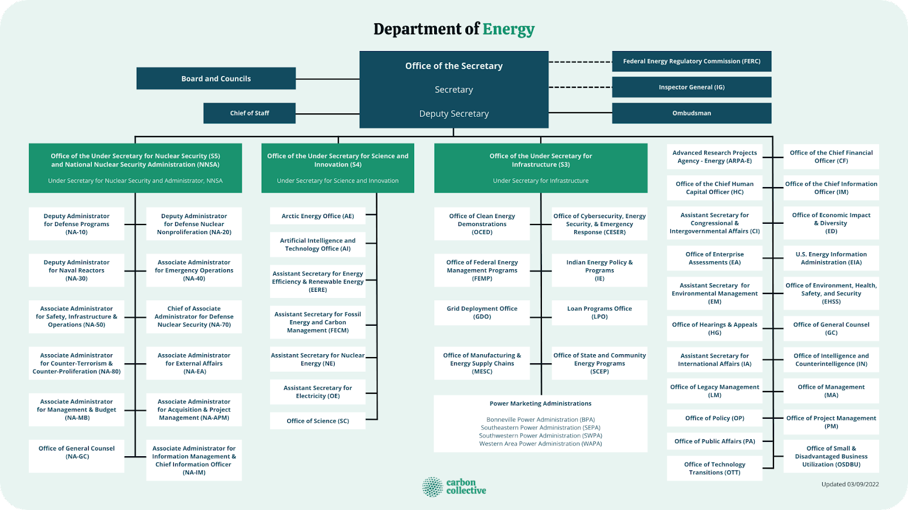

## Table of Contents

## What is the role of the United States Secretary of Energy?

The United States Secretary of Energy is a very important person in the government. They are in charge of the Department of Energy. This department works on things like making sure we have enough energy, keeping our nuclear weapons safe, and helping with science and technology.

The Secretary of Energy helps make rules about energy. They work with other countries to share energy and keep it safe. They also help find new ways to use energy that are good for the environment. This job is important because it helps keep our country running and safe.

## Who appoints the Secretary of Energy and how is the appointment confirmed?

The President of the United States appoints the Secretary of Energy. This means the President chooses who they think is the best person for the job. The President looks at different people and decides who will help the country the most with energy issues.

After the President picks someone, the appointment needs to be confirmed by the Senate. The Senate is a group of people who make laws and check the President's choices. They have a special committee that talks to the person the President picked. If the Senate agrees that the person is good for the job, they vote to confirm them. If most of the Senators vote yes, then the person becomes the Secretary of Energy.

## What are the primary responsibilities of the Secretary of Energy?

The Secretary of Energy is in charge of making sure the country has enough energy. They work on finding new ways to get energy, like solar or wind power, which are good for the environment. They also help make rules about how energy is used and shared. This job is important because it helps keep our homes, schools, and businesses running.

Another big part of the Secretary's job is to keep our nuclear weapons safe. They work with other countries to make sure no one uses nuclear weapons the wrong way. They also help with science and technology, trying to find new ways to use energy that are better for the planet. This makes the Secretary of Energy a key person in keeping the country safe and helping it grow.

## How does the Secretary of Energy contribute to national security?

The Secretary of Energy helps keep our country safe by making sure our nuclear weapons are secure. They work with the military to look after these weapons and make sure they are only used when really needed. This is important because nuclear weapons can be very dangerous if they fall into the wrong hands. The Secretary also works with other countries to make rules about nuclear weapons, so everyone follows the same safety steps.

Another way the Secretary of Energy helps with national security is by making sure we have enough energy. If we don't have enough energy, it can cause problems that might make our country less safe. The Secretary works on finding new ways to get energy, like solar or wind power, which are good for the environment and help keep our country strong. By making sure we have enough energy, the Secretary helps keep our homes, hospitals, and military bases running smoothly, which is important for national security.

## What is the Secretary of Energy's role in managing the nation's energy resources?

The Secretary of Energy plays a big role in managing the nation's energy resources. They make sure we have enough energy for everyone. This means they look at how we get energy, like from oil, gas, or renewable sources like solar and wind. They also help make rules about how energy is used and shared. This is important because it helps keep our homes, schools, and businesses running smoothly.

Another part of their job is to find new ways to use energy that are good for the environment. They work on projects that help us use less energy or find cleaner ways to get it. By doing this, they help make sure we have enough energy for the future and that it doesn't harm our planet. This is a big responsibility because it affects everyone in the country.

## How does the Secretary of Energy influence energy policy and legislation?

The Secretary of Energy has a big say in making energy rules and laws. They work closely with the President and Congress to come up with new ideas about how we should use and share energy. The Secretary can suggest new laws that help us use energy in a better way. For example, they might suggest laws that make it easier to use solar power or that help us save energy. When these ideas are turned into laws, it changes how everyone in the country uses energy.

The Secretary also helps make rules that everyone has to follow about energy. These rules can be about how we get energy, like from oil or wind, or how we use it. The Secretary works with other government groups to make sure these rules are fair and good for the country. By doing this, they help make sure we have enough energy and that it's used in a way that's good for the environment. This is important because it affects everyone and helps keep our country strong and safe.

## What agencies and departments does the Secretary of Energy oversee?

The Secretary of Energy is in charge of the Department of Energy. This department has many different parts that help with energy and science. Some of the big parts are the National Nuclear Security Administration, which looks after our nuclear weapons, and the Energy Efficiency and Renewable Energy office, which works on using less energy and finding new ways to get energy like solar and wind.

The Secretary also oversees the Office of Science, which helps with research and new technology. Another important part is the Office of Fossil Energy and Carbon Management, which deals with coal, oil, and natural gas and tries to make them cleaner. The Secretary makes sure all these parts work together to help keep our country safe and have enough energy.

Other agencies under the Secretary's watch include the Office of Electricity, which works on the power grid, and the Office of Cybersecurity, Energy Security, and Emergency Response, which helps keep our energy systems safe from attacks. All these parts together help the Secretary manage our energy and keep it secure.

## How does the Secretary of Energy address environmental concerns related to energy production?

The Secretary of Energy works hard to make sure energy production is good for the environment. They help find new ways to use energy that do not hurt the planet. For example, they support using more solar and wind power, which are clean and do not make pollution. The Secretary also makes rules about how we can use coal, oil, and gas in a way that is less harmful to the environment. They work on projects that help us use less energy overall, which means less pollution.

Another way the Secretary helps is by working with scientists and other countries to find new technology that is good for the environment. They fund research that looks for ways to make energy cleaner. This can include finding ways to capture carbon from power plants so it doesn't go into the air. By doing all these things, the Secretary of Energy helps make sure we can have the energy we need without harming our planet.

## What role does the Secretary of Energy play in advancing renewable energy technologies?

The Secretary of Energy helps push forward new ways to use energy from the sun, wind, and other natural sources. They do this by giving money to scientists and companies to study and build new technology. This helps make solar panels, wind turbines, and other clean energy tools better and cheaper. The Secretary also makes rules that encourage people and businesses to use renewable energy. By doing this, they help make sure more people start using clean energy, which is good for the environment.

Another way the Secretary helps is by working with other countries to share ideas and technology about renewable energy. They go to meetings and talk with other leaders to find the best ways to use clean energy around the world. This helps everyone learn from each other and make progress faster. By focusing on renewable energy, the Secretary of Energy helps make sure we have enough power for the future while also keeping our planet safe and healthy.

## How does the Secretary of Energy collaborate with international partners on energy issues?

The Secretary of Energy works with other countries to make sure everyone has enough energy and uses it in a safe way. They go to meetings with leaders from other places to talk about energy. They share ideas and plans about how to use energy better. This helps everyone learn from each other and work together to solve big energy problems. For example, they might talk about how to use less oil and more solar power, which is good for the environment.

The Secretary also helps make agreements with other countries about energy. These agreements can be about sharing new technology or working together on big projects. By doing this, the Secretary helps make sure that energy is used in a way that is good for everyone. They also work on keeping nuclear energy safe and making sure no one uses it in a dangerous way. This kind of teamwork is important because it helps keep the world safe and makes sure we have enough energy for the future.

## What are the challenges faced by the Secretary of Energy in balancing energy needs with environmental protection?

The Secretary of Energy faces a big challenge in trying to make sure we have enough energy while also protecting the environment. People need energy for their homes, schools, and businesses, but some ways of getting energy, like using coal and oil, can harm the environment by making pollution. The Secretary has to find ways to use these energy sources in a cleaner way or find new sources that do not hurt the planet. This can be hard because new technology can be expensive and take a long time to develop.

Another challenge is that different people and groups want different things. Some people want to keep using oil and coal because it's what they know and it's cheaper right now. Others want to switch to renewable energy like solar and wind because it's better for the environment. The Secretary has to listen to everyone and make decisions that are fair and good for the country. They have to work with other countries too, because energy problems affect everyone around the world. Balancing all these needs and wants is a big job that takes a lot of planning and teamwork.

## How does the Secretary of Energy ensure the safety and security of nuclear materials?

The Secretary of Energy works hard to keep our nuclear materials safe. They are in charge of the National Nuclear Security Administration, which looks after our nuclear weapons and makes sure they are secure. The Secretary makes rules about how to handle these materials so they don't get into the wrong hands. They also work with the military to make sure our nuclear weapons are only used when really needed and are always safe.

Another way the Secretary helps keep nuclear materials secure is by working with other countries. They go to meetings and make agreements with other leaders to make sure everyone follows the same safety rules. This helps stop bad people from getting nuclear materials and using them in dangerous ways. By doing all these things, the Secretary of Energy helps keep our country and the world safe from nuclear threats.

## References & Further Reading

[1]: Bergstra, J., Bardenet, R., Bengio, Y., & Kégl, B. (2011). ["Algorithms for Hyper-Parameter Optimization."](https://papers.nips.cc/paper/4443-algorithms-for-hyper-parameter-optimization) Advances in Neural Information Processing Systems 24.

[2]: ["Advances in Financial Machine Learning"](https://www.amazon.com/Advances-Financial-Machine-Learning-Marcos/dp/1119482089) by Marcos Lopez de Prado

[3]: ["Evidence-Based Technical Analysis: Applying the Scientific Method and Statistical Inference to Trading Signals"](https://www.amazon.com/Evidence-Based-Technical-Analysis-Scientific-Statistical/dp/0470008741) by David Aronson

[4]: ["Machine Learning for Algorithmic Trading"](https://github.com/stefan-jansen/machine-learning-for-trading) by Stefan Jansen

[5]: ["Quantitative Trading: How to Build Your Own Algorithmic Trading Business"](https://www.amazon.com/Quantitative-Trading-Build-Algorithmic-Business/dp/1119800064) by Ernest P. Chan