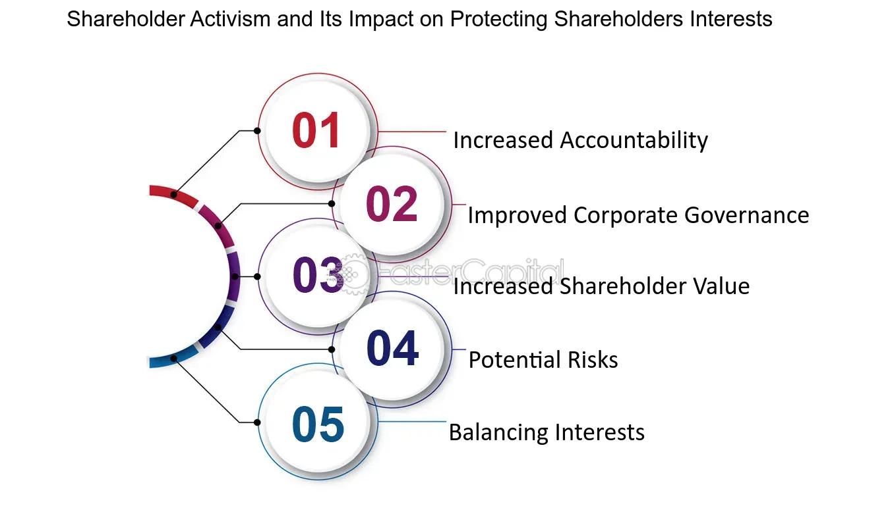

## Table of Contents

## What does responsibility for shareholders' interests mean?

Responsibility for shareholders' interests means that the people running a company, like the managers and the board of directors, need to make decisions that help the people who own the company's stocks. These shareholders want the value of their stocks to go up and to get money from the company through dividends. So, the company leaders have to think about how their choices will affect the shareholders' money.

This responsibility is important because shareholders are the owners of the company. If the company does well, the shareholders benefit. But if the company does poorly, the shareholders lose money. That's why company leaders need to balance different goals and risks to make sure they are doing what's best for the shareholders. It's all about making smart choices to keep the shareholders happy and their investments safe.

## Why is it important for a company to consider shareholders' interests?

It's important for a company to consider shareholders' interests because shareholders are the owners of the company. When a company does well, the value of the shareholders' stocks goes up, and they might get dividends, which is like a reward for owning the stock. If the company doesn't do well, the value of the stocks can go down, and shareholders might lose money. So, by focusing on what's good for the shareholders, the company is trying to make sure it's doing well and keeping its owners happy.

Also, shareholders have a say in how the company is run. They vote on important decisions and can even change who is in charge if they're not happy. If a company doesn't pay attention to what shareholders want, the shareholders might decide to sell their stocks, which can make the stock price drop. Or they might vote to change the people running the company. So, it's really important for a company to keep its shareholders in mind to keep the business strong and successful.

## Who is typically responsible for protecting shareholders' interests within a company?

The board of directors is mainly responsible for looking after shareholders' interests in a company. They are chosen by the shareholders to make big decisions and to watch over the company's leaders, like the CEO. The board makes sure the company is doing things that will make the shareholders' investments grow and stay safe. They do this by setting goals for the company, checking how well the company is doing, and making sure the company follows the law and does things the right way.

The company's managers, like the CEO and other top leaders, also have a big job in protecting shareholders' interests. They run the day-to-day stuff and make choices that should help the company do well. They need to keep the board happy and make sure their decisions help the company make money and grow, which is good for the shareholders. If the managers do a good job, the shareholders are happy, and if they don't, the board might decide to change the managers.

## How do shareholders express their interests to the company?

Shareholders express their interests to the company mainly by voting at shareholder meetings. These meetings happen regularly, and shareholders can vote on big decisions like who should be on the board of directors or if the company should do certain things. By voting, shareholders can show what they want the company to focus on and make sure the company is doing things that will help their investments grow.

Another way shareholders express their interests is by talking directly to the company. They can write letters, go to meetings, or use the company's website to share their thoughts and ideas. This helps the board of directors and the managers understand what the shareholders care about and what they want the company to do. It's a way for shareholders to give feedback and make sure their voices are heard.

Sometimes, shareholders also express their interests by buying or selling stocks. If they think the company is doing a good job, they might buy more stocks, which can make the stock price go up. If they're not happy, they might sell their stocks, which can make the stock price go down. This sends a message to the company about how well it's doing in the eyes of the shareholders.

## What are the common ways companies can demonstrate responsibility towards shareholders?

Companies can show they care about shareholders by making sure the business is doing well and making money. They do this by setting goals that will make the company grow and by making smart choices about how to spend money. For example, they might invest in new projects that will bring in more money or they might cut costs to make the company more efficient. When the company does well, it can pay dividends to shareholders, which is like sharing some of the profits with them. This makes shareholders happy because they see their investment paying off.

Another way companies show responsibility is by being open and honest with shareholders. They do this by sharing important information about how the company is doing through reports and meetings. Shareholders can then see if the company is meeting its goals and if their money is being used wisely. Companies also listen to what shareholders want by letting them vote on big decisions, like who should be on the board of directors. This way, shareholders feel like they have a say in how the company is run, which makes them feel more connected to the company and more confident in their investment.

## What legal obligations do companies have towards their shareholders?

Companies have to follow certain laws to make sure they treat their shareholders fairly. One big rule is that they have to share important information with shareholders. This means they need to tell shareholders how the company is doing through regular reports. These reports help shareholders understand if the company is making money or if it's facing problems. If a company doesn't share this information, it could get in trouble with the law. Another rule is that companies have to let shareholders vote on big decisions. This includes choosing the board of directors and deciding on big changes to the company. This gives shareholders a say in how the company is run.

Another legal obligation is that companies need to act in the best interest of their shareholders. This means the people running the company, like the board of directors and managers, should make decisions that help the company grow and make money. They can't use the company's money for their own benefit or do things that hurt the shareholders. If they do, they could be breaking the law and might have to pay fines or even go to jail. By following these rules, companies show they care about their shareholders and are working to keep their investments safe and growing.

## How do board members ensure they are acting in the best interest of shareholders?

Board members make sure they are acting in the best interest of shareholders by keeping a close eye on the company's performance. They do this by regularly checking financial reports and other important information to see if the company is making money and growing. If the company is not doing well, the board will ask the managers what's going wrong and what they can do to fix it. They might also set goals for the managers to work towards, like making more money or saving costs. By doing all this, the board helps make sure the company is working hard to make the shareholders' investments grow.

The board also makes sure they are acting in the best interest of shareholders by being open and honest with them. They do this by sharing important information through regular reports and meetings. This way, shareholders can see how the company is doing and if their money is being used wisely. The board also listens to what shareholders want by letting them vote on big decisions, like choosing new board members or approving big changes to the company. By giving shareholders a say in how the company is run, the board shows that they care about the shareholders' interests and are working to keep their investments safe and growing.

## What role do shareholder meetings play in addressing shareholders' interests?

Shareholder meetings are important because they give shareholders a chance to talk about what they want from the company. At these meetings, shareholders can vote on big decisions like choosing who should be on the board of directors or if the company should make big changes. This voting helps make sure the company is doing what the shareholders think is best. It's like the shareholders are telling the company what they want, and the company needs to listen.

These meetings also help shareholders learn more about how the company is doing. The company's leaders share reports and updates at the meetings, so shareholders can see if the company is making money and growing. If shareholders have questions or concerns, they can ask the company's leaders right there. This helps the shareholders feel more connected to the company and more confident that their investments are being looked after.

## How can conflicts of interest affect the responsibility towards shareholders?

Conflicts of interest can make it hard for a company to take care of its shareholders. When someone in the company, like a board member or a manager, has their own interests that don't match what's good for the shareholders, they might make choices that help themselves but hurt the shareholders. For example, a manager might want to buy a company that their friend owns, even if it's not a good deal for the shareholders. This can make the company lose money and make the shareholders unhappy.

To keep the company focused on what's best for shareholders, it's important to watch out for these conflicts. The board of directors needs to make sure everyone in the company is making choices that help the shareholders, not just themselves. They can do this by setting rules about what people can and can't do, and by making sure everyone is honest about any other interests they might have. By doing this, the board helps keep the company strong and the shareholders happy.

## What are some advanced strategies companies use to maximize shareholder value?

Companies use several smart ways to make sure shareholders get the most value from their investments. One way is by buying back their own stocks. When a company buys back its stocks, it's like saying, "We think our stocks are a good deal right now." This can make the stock price go up because there are fewer stocks out there, and shareholders might get a bigger piece of the company's profits. Another way is by investing in new projects or businesses that can grow fast and make a lot of money. If these projects do well, the company's value goes up, and shareholders are happy because their stocks are worth more.

Another strategy is to pay attention to how much the company is worth compared to other companies in the same business. If a company sees it's not doing as well as others, it might try to change things to get better. This could mean finding new ways to save money, making the company more efficient, or even buying other companies that can help it grow. By keeping an eye on what others are doing and trying to do better, the company can make sure it's giving shareholders the best chance to make money.

## How do regulatory bodies monitor and enforce responsibility towards shareholders?

Regulatory bodies make sure companies are doing what's right for their shareholders by setting rules and watching over them. They look at the reports companies have to share with shareholders to see if the companies are telling the truth about how they're doing. If a company isn't sharing all the important information or if it's not letting shareholders vote on big decisions, the regulatory body can step in. They might make the company fix the problem or even fine them if they're breaking the rules. This helps keep companies honest and focused on what's best for their shareholders.

Sometimes, regulatory bodies also look into complaints from shareholders who think the company isn't treating them fairly. If they find that the company's leaders are making choices that help themselves but hurt the shareholders, they can take action. This could mean making the leaders pay money back or even taking them to court. By doing all this, regulatory bodies help make sure that companies are always working to keep their shareholders' investments safe and growing.

## What are the long-term implications for companies that fail to responsibly manage shareholders' interests?

If a company doesn't take care of its shareholders' interests, it can face big problems in the long run. Shareholders might start selling their stocks because they're not happy with how the company is doing. When a lot of people sell their stocks, the price can go down a lot. This makes it harder for the company to get new money from investors, which it needs to grow and do new things. If the company keeps doing badly, it might even have to close down or be bought by another company.

Over time, a company that doesn't look after its shareholders can also lose trust. People might stop believing in the company's leaders and not want to invest in it anymore. This can make it hard for the company to find good people to work for them or to do business with them. Without trust and support from shareholders, the company can struggle to stay strong and successful. So, it's really important for a company to always think about what's best for its shareholders.

## References & Further Reading

1. Jensen, M.C., & Meckling, W.H. (1976). "Theory of the Firm: Managerial Behavior, Agency Costs and Ownership Structure." This seminal paper explores the relationship between shareholders and corporate management, laying the foundation for modern shareholder theory. It discusses the agency costs associated with ownership structures and managerial incentives. [Journal of Financial Economics, 3(4), 305-360](https://www.sciencedirect.com/science/article/abs/pii/0304405X7690026X).

2. Freeman, R.E. (1984). "Strategic Management: A Stakeholder Approach." This book introduces the stakeholder theory, suggesting that companies should account for all stakeholders' needs, not just shareholders. It has been pivotal in shaping CSR and ethical business perspectives.

3. Fama, E.F., & Jensen, M.C. (1983). "Separation of Ownership and Control." This research examines how corporate governance mechanisms can align management and shareholders' interests by separating decision management and decision control. [Journal of Law and Economics, 26(2), 301-325](https://www.jstor.org/stable/725104).

4. Hull, J. (2018). "Options, Futures, and Other Derivatives." Often cited in discussions of modern financial markets, Hull's textbook offers insights into derivative trading, including algorithmic trading's role in shaping market dynamics.

5. Aldridge, I., & Krawciw, S. (2017). "Real-Time Risk: What Investors Should Know About FinTech, High-Frequency Trading, and Flash Crashes." This work by Aldridge and Krawciw provides a detailed look into algorithmic trading technologies and their impact on market risks, highlighting both opportunities and potential pitfalls associated with high-frequency trading.

6. Eccles, R.G., Ioannou, I., & Serafeim, G. (2014). "The Impact of Corporate Sustainability on Organizational Processes and Performance." This study presents empirical evidence on how proactive sustainability strategies can enhance financial performance, offering a blueprint for integrating CSR in investment strategies. [Management Science, 60(11), 2835-2857](https://doi.org/10.1287/mnsc.2014.1984).

7. Black, F., & Scholes, M. (1973). "The Pricing of Options and Corporate Liabilities." This foundational paper introduced the Black-Scholes model, a critical tool in financial economics, particularly valuable for risk assessment in algorithmic trading. [Journal of Political Economy, 81(3), 637-654](https://www.jstor.org/stable/1831029).

8. Cumming, D., & Johan, S. (2013). "Institutional Investors and Corporate Governance: Best Practices for Increasing Corporate Value." This book offers insights into how institutional investors can influence corporate governance practices to align with sustainable financial and societal principles.

9. Barberis, N., & Thaler, R. (2003). "A Survey of Behavioral Finance." This review provides an overview of the behavioral aspects influencing stock markets, including insights into how algorithmic trading strategies can be affected by investor psychology. [Handbook of the Economics of Finance, 1-B, 1053-1128](https://doi.org/10.1016/S1574-0102(03)01027-6).

10. Hasbrouck, J., & Saar, G. (2013). "Low-Latency Trading." This research paper examines the role and impact of low-latency, high-frequency trading in financial markets, providing empirical data on its benefits and risks. [Journal of Financial Markets, 16(4), 646-679](https://doi.org/10.1016/j.finmar.2013.06.006).

