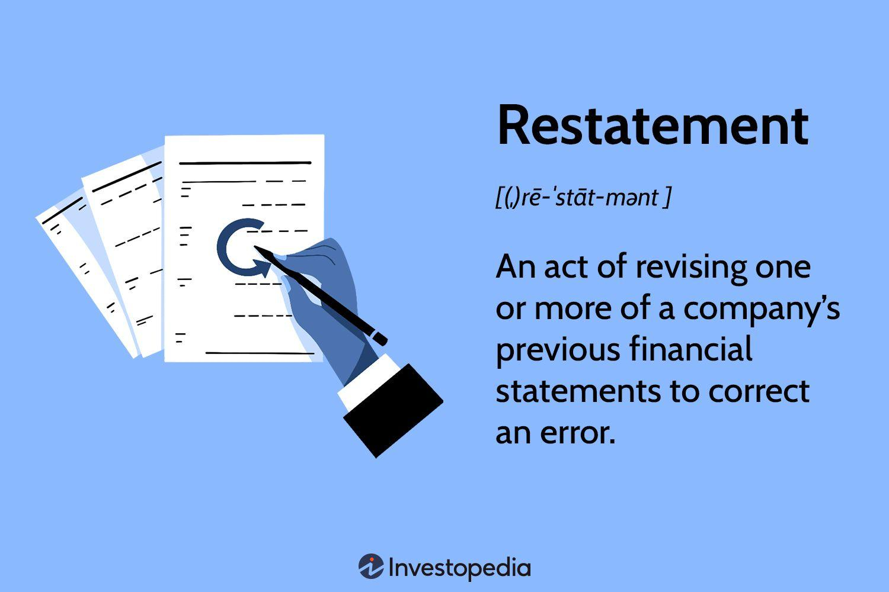

## Table of Contents

## What is a restatement in accounting?

A restatement in accounting happens when a company needs to change its financial statements because they found mistakes or new information. This can happen if the company made errors in how they recorded their money, or if they need to follow new accounting rules. It's like fixing a math problem after you find out you did it wrong the first time.

When a company restates its financials, it tells everyone that the old numbers were not right and gives new, correct numbers. This is important because people who invest money in the company, like shareholders, need to trust the financial information. If a company restates too often, it might make people think the company is not good at keeping track of its money, which can be bad for the company's reputation.

## Why might a company need to restate its financial statements?

A company might need to restate its financial statements if it finds mistakes in the numbers it reported before. These mistakes can happen because someone made an error when adding up the money, or maybe they used the wrong way to count some things according to the accounting rules. Sometimes, the company might find out that someone did something wrong on purpose, like hiding money problems. When these issues come up, the company has to fix the numbers to make sure they are correct.

Another reason a company might need to restate its financials is if there are changes in the accounting rules. These rules can change over time, and what was okay to do before might not be okay anymore. When that happens, the company has to go back and change its old financial statements to match the new rules. This helps make sure that everyone looking at the company's money information is seeing it the right way, according to the latest standards.

## What are the common causes of financial restatements?

One common cause of financial restatements is errors in how the company records its money. These errors can happen when someone makes a mistake in adding up numbers or uses the wrong way to count things according to accounting rules. Sometimes, these mistakes are found later, and the company has to fix them. Another cause can be if someone in the company did something wrong on purpose, like hiding money problems. When this happens, the company needs to fix the numbers to show the real situation.

Another reason for restatements is changes in accounting rules. These rules can change over time, and what was okay to do before might not be okay anymore. When the rules change, companies have to go back and change their old financial statements to match the new rules. This makes sure that everyone looking at the company's money information sees it the right way, according to the latest standards.

Sometimes, restatements happen because of big events like mergers or acquisitions. When a company buys another company, it has to combine all the money information. If there are mistakes or different ways of counting money between the two companies, it might lead to a restatement. This helps make sure the new, combined financial statements are correct and follow the rules.

## How does a restatement affect a company's financial position?

When a company restates its financial statements, it can change how much money the company seems to have or owe. If the restatement shows the company made less money than it thought, it might look like the company is not doing as well as before. This can make people who invest in the company worried because they might think the company is not good at keeping track of its money. If the restatement shows the company made more money, it might look better, but people might still be upset because the company got the numbers wrong the first time.

Restatements can also affect how people trust the company. If a company has to restate its financials a lot, people might think it is not good at managing its money or that it is hiding problems. This can make it harder for the company to get loans or attract new investors. On the other hand, if the restatement fixes a big mistake and makes the company's financial position look better, it might help the company in the long run by showing that it is trying to be honest and fix its errors.

## What are the legal requirements for restating financial statements?

When a company finds mistakes in its financial statements, it has to follow certain rules to fix them. In the United States, the main rule comes from the Securities and Exchange Commission (SEC). The SEC says that if a company's financial statements were wrong and it's important enough, the company has to fix them. This means they have to tell everyone about the mistake and give new, correct numbers. They also have to explain why the mistake happened and what they are doing to make sure it doesn't happen again.

Companies also have to follow rules from accounting groups like the Financial Accounting Standards Board (FASB). These rules say how companies should count their money and what they should do if they find mistakes. If a company doesn't follow these rules, it can get in trouble with the SEC or other groups that watch over businesses. So, it's really important for companies to be careful and fix any big mistakes they find in their financial statements.

## Who is responsible for ensuring the accuracy of financial restatements?

The main people responsible for making sure financial restatements are correct are the company's accountants and the people who run the company, like the CEO and CFO. These people have to check all the numbers again and fix any mistakes they find. They need to make sure the new numbers follow all the accounting rules and show the real situation of the company's money.

The company also has to work with outside people, like auditors, to make sure the restatements are right. Auditors are like special accountants who check the company's work to see if everything is correct. They help make sure the company is being honest and following the rules. If the auditors find more mistakes, the company has to fix those too. This helps keep everyone's trust in the company's financial information.

## What are the steps involved in the restatement process?

When a company finds a mistake in its financial statements, it starts the restatement process by figuring out what went wrong. The company's accountants and the people in charge, like the CEO and CFO, look at all the numbers again to find the error. They check if it was a simple mistake, like adding up numbers wrong, or if someone did something wrong on purpose. Once they know what the mistake is, they work out how to fix it. This might mean changing how they counted some things or using a different accounting rule.

After figuring out the mistake, the company fixes the numbers and makes new financial statements. They have to make sure these new numbers are right and follow all the rules. The company also has to tell everyone about the mistake and the new numbers. They do this by writing a report that explains what happened and what they did to fix it. Before they can share the new statements, they usually have to show them to outside auditors. These auditors check the new numbers to make sure they are correct and that the company followed the rules. Once the auditors say it's okay, the company can share the new financial statements with everyone.

## How do regulatory bodies like the SEC oversee financial restatements?

The Securities and Exchange Commission (SEC) is in charge of making sure companies follow the rules when they restate their financial statements. If a company finds a big mistake in its numbers, it has to tell the SEC about it. The SEC looks at the new numbers and the company's explanation to make sure everything is correct and that the company followed the rules. If the SEC finds that the company did not fix the mistake right or did not tell everyone about it, the SEC can make the company do it again or even punish them.

The SEC also works with other groups like the Public Company Accounting Oversight Board (PCAOB) to keep an eye on how companies and their auditors handle restatements. The PCAOB checks the work of the auditors to make sure they are doing a good job. If the auditors missed big mistakes or did not check the new numbers well enough, the PCAOB can tell the SEC, and the SEC can take action to make sure the company fixes its financial statements correctly. This helps keep the financial information of companies honest and trustworthy.

## What are the potential consequences of failing to restate financials when necessary?

If a company does not fix its financial statements when it finds a mistake, it can get into big trouble. The Securities and Exchange Commission (SEC) might punish the company. This can mean the company has to pay a lot of money or the people in charge, like the CEO, might even go to jail. The company could also get in trouble with other groups that watch over businesses. Not fixing the numbers can make people who invest in the company very upset because they might lose trust in the company.

Not restating financials can also hurt the company's reputation. If people think the company is not good at keeping track of its money or is hiding problems, they might not want to invest in it or do business with it. This can make it harder for the company to get loans or attract new investors. In the long run, not fixing mistakes in financial statements can make the company's situation worse and cause more problems.

## How can a company minimize the risk of needing to restate its financials?

A company can lower the chance of needing to restate its financials by making sure it has good ways to check its numbers. This means having strong rules and steps for how to count money and keep track of it. The company should also train its workers well so they know how to do things right. It's important to have people who are good at accounting and who can spot mistakes early. Using computer programs that help with accounting can also make things easier and less likely to go wrong.

Another way to avoid restatements is by always keeping up with the latest accounting rules. These rules can change, and if a company doesn't follow them, it might have to fix its numbers later. The company should also have outside auditors check its work regularly. These auditors can find mistakes before they become big problems. By being careful and checking things often, a company can make sure its financial statements are correct and avoid the need for restatements.

## What role do auditors play in the restatement process?

Auditors are really important when a company needs to fix its financial statements. They are like special accountants who check the company's work to make sure everything is correct. When a company finds a mistake and wants to restate its financials, the auditors look at the new numbers to see if they are right. They check if the company followed all the rules and if the new numbers show the real situation of the company's money. If the auditors find more mistakes, they tell the company, and the company has to fix those too.

Having auditors involved helps keep everyone's trust in the company's financial information. If the auditors say the new numbers are okay, people who invest in the company feel more sure that the numbers are right. This can help the company's reputation and make it easier for them to get loans or attract new investors. Auditors make sure the restatement process is done the right way, so the company can move forward with correct and trustworthy financial statements.

## How do restatements impact investor confidence and market perception?

When a company restates its financial statements, it can shake up investor confidence. If the restatement shows the company made less money than it thought, investors might worry that the company isn't doing as well as they believed. They might think the company is bad at keeping track of its money or hiding problems. This can make investors pull their money out or decide not to invest more. If a company has to restate its financials a lot, it can really hurt its reputation and make people trust it less.

On the other hand, if the restatement fixes a big mistake and shows the company is doing better than before, it might help in the long run. Investors might feel better knowing the company is trying to be honest and fix its errors. But even then, the fact that the company got the numbers wrong the first time can still make people nervous. Overall, restatements can make the market see the company differently, sometimes in a good way if it's fixing a problem, but often in a bad way if it shows the company can't be trusted with its numbers.

## References & Further Reading

[1]: Graham, J. R., Harvey, C. R., & Rajgopal, S. (2005). ["The economic implications of corporate financial reporting."](https://www.sciencedirect.com/science/article/pii/S0165410105000571) Journal of Accounting and Economics, 40(1-3), 3-73.

[2]: Zeff, S. A. (2007). ["The SEC Rules Historical Cost Accounting: 1934 to the 1970s"](https://papers.ssrn.com/sol3/papers.cfm?abstract_id=956163) Journal of Financial and Quantitative Analysis, 42(2), 255-273.

[3]: Dechow, P., Ge, W., & Schrand, C. (2010). ["Understanding earnings quality: A review of the proxies, their determinants and their consequences."](https://www.sciencedirect.com/science/article/pii/S0165410110000339) Journal of Accounting and Economics, 50(2-3), 344-401.

[4]: Brown, L. D., & Caylor, M. L. (2006). ["Corporate governance and firm valuation."](https://www.sciencedirect.com/science/article/pii/S0278425406000482) Journal of Accounting and Public Policy, 25(4), 409-434.

[5]: ["The Sarbanes-Oxley Act of 2002"](https://www.congress.gov/bill/107th-congress/house-bill/3763) - Full text available on Congress.gov

[6]: Brunnermeier, M. K., & Pedersen, L. H. (2009). ["Market Liquidity and Funding Liquidity."](https://www.princeton.edu/~markus/research/papers/liquidity.pdf) The Review of Financial Studies, 22(6), 2201-2238.

[7]: Daniel, K., & Titman, S. (2006). ["Market Reactions to Tangible and Intangible Information."](https://onlinelibrary.wiley.com/doi/abs/10.1111/j.1540-6261.2006.00884.x) The Review of Financial Studies, 19(4), 1285-1319.

[8]: ["Financial Statement Restatements: Trends, Market Impacts, Regulatory Responses, and Remaining Challenges"](https://www.gao.gov/assets/gao-03-395r.pdf) by the United States Government Accountability Office (GAO).

[9]: Lopez de Prado, M. (2018). ["Advances in Financial Machine Learning"](https://www.amazon.com/Advances-Financial-Machine-Learning-Marcos/dp/1119482089) Wiley.

Please note that access to full articles may be subject to subscription or purchase, based on the hosting platform's conditions.