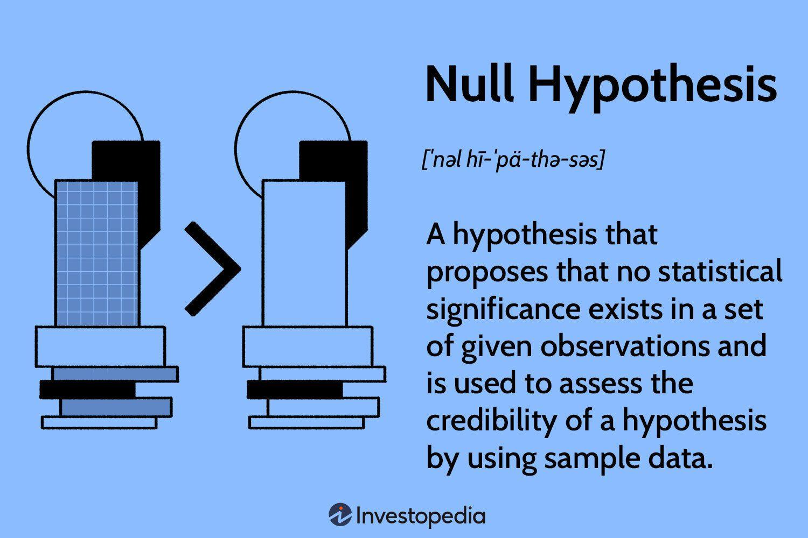

The rise of the digital age has had a profound impact on various industries, notably transforming the restaurant and food delivery sectors. This transformation is primarily driven by the increasing accessibility and sophistication of technology, which has reshaped consumer expectations and competitive dynamics. As competition intensifies, businesses increasingly seek unique data insights to gain a competitive edge and better understand evolving market trends.

Alternative data has emerged as a crucial tool in this context. It refers to non-traditional data sources that provide fresh insights beyond conventional metrics like sales figures and foot traffic. In the restaurant and food delivery industries, examples of alternative data include geo-location information, transaction records from credit and debit cards, and real-time social media interactions. Such data offers the advantage of real-time insights, enabling organizations to make faster, more informed decisions about their operations and marketing strategies.



This article discusses the significance of alternative data in both the restaurant and food delivery domains and its application in algorithmic trading. Understanding and leveraging alternative data can guide strategic planning, improve customer satisfaction, and drive sustainable business growth. Moreover, the insights derived from such data are not confined to the food services industry alone but extend to financial markets, where they are used to identify new trading signals and investment opportunities.

The exploration of leading alternative data providers will demonstrate how businesses can leverage these insights. Providers supply data that is invaluable for making strategic marketing and operational decisions, with potential impacts ranging from predicting consumer preferences to understanding competitive positioning. Therefore, understanding the role of alternative data is key to achieving a competitive advantage in today's digital marketplace.

## Table of Contents

## Understanding Alternative Data

Alternative data refers to non-traditional sources of information that can offer unique insights into consumer behavior and market dynamics. In the restaurant and food delivery sectors, these data sources extend beyond conventional metrics like sales figures or customer counts. Instead, they encompass datasets such as geo-location information, credit and debit card transaction records, and social media activity.

Geo-location data provides valuable insights into consumer movements and habits, revealing where potential customers are spending their time and how they engage with physical spaces related to dining and delivery. This information can be crucial for identifying high-traffic areas ideal for restaurant locations or delivery zones.

Credit and debit card transaction data give a window into purchasing patterns and consumer spending, offering a detailed view of preferences and behaviors in real-time. By analyzing transaction records, businesses can discern trends in menu item popularity, peak ordering times, and spending habits across different demographics.

Social media activity serves as another rich source of [alternative data](/wiki/best-alternative-data). Platforms such as Twitter, Instagram, and Facebook allow consumers to share their dining experiences and opinions, creating a valuable repository of real-time consumer sentiment. By employing natural language processing and sentiment analysis, businesses can understand public perception and respond to emerging trends or potential issues more swiftly than through traditional feedback mechanisms.

Unlike traditional datasets, which may suffer from time lags and offer only retrospective insights, alternative data sources provide real-time information, enabling businesses to make decisions more quickly and accurately. This capacity for timely insights is crucial for responding to rapidly changing market conditions and maintaining competitiveness.

Incorporating alternative data into strategic decision-making processes can reveal nuanced understandings of consumer preferences and enhance the ability to predict future trends. As such, this data is pivotal for businesses looking to innovate and capture market opportunities in an evolving digital landscape.

## Alternative Data in Restaurants & Food Delivery

Alternative data is crucial for the restaurant and food delivery sectors because it offers insights beyond traditional sales figures and foot traffic metrics. By integrating diverse data sources, businesses can gain a holistic view of market dynamics and consumer behavior.

A primary use case of alternative data is in identifying emerging consumer preferences. The data extracted from sources such as credit card transactions provides detailed information about consumer purchasing habits. For instance, by analyzing aggregated transaction data, a restaurant owner can detect a rising demand for specific cuisines or new dietary trends, such as plant-based eating. This information allows businesses to adapt their menu offerings accordingly.

Another significant application involves understanding competitive positioning. Through social sentiment analysis, restaurants can evaluate public perceptions of their brand relative to competitors. Social media platforms serve as rich data repositories where consumer sentiments are frequently expressed. Natural language processing (NLP) techniques can be used to extract and categorize these sentiments, providing a clear understanding of customer satisfaction and areas needing improvement. For instance, a surge in negative comments regarding delivery speed could prompt a restaurant to reevaluate and optimize its delivery operations.

Alternative data also facilitates real-time market analysis, enabling businesses to respond promptly to changing conditions. Unlike periodic sales reports, alternative data streams can provide continuous insights, allowing for agile strategy adjustments. This immediacy is essential in a competitive and fast-paced environment, as it supports proactive decision-making rather than reactive responses. 

By leveraging these insights, restaurants and food delivery services can enhance customer satisfaction and improve their market position. Utilizing alternative data not only aligns businesses with consumer expectations but also gives them an edge through informed, data-driven strategies.

## Alternative Data in Algorithmic Trading

Algorithmic trading has increasingly harnessed alternative data to enhance financial models and trading strategies. The integration of such data provides novel trading signals and opportunities, allowing traders to remain competitive in a rapidly evolving market. 

Real-time data streamlining plays a crucial role in this process by enabling traders to make informed decisions with unprecedented speed. For example, by analyzing restaurant trends, traders can gain insights into the performance of sectors tied to consumer spending, such as the food and beverage industry or retail. An uptick in dining behavior, revealed through data sources like geolocation or transaction records, might indicate increased consumer confidence, prompting a potential bullish outlook on related stocks.

Consumer spending data also serves as a predictive tool for economic forecasts. By tracking aggregate credit and debit card transactions, traders can infer macroeconomic conditions. A rise in spending likely signals economic growth, potentially influencing [interest rate](/wiki/interest-rate-trading-strategies) decisions and currency valuations. 

Algorithmic models can incorporate these alternative datasets using [machine learning](/wiki/machine-learning) algorithms to refine predictions and detect trading opportunities. Python libraries like `pandas` for data manipulation and `scikit-learn` for machine learning provide the necessary tools for handling such data efficiently. For instance:

```python
import pandas as pd
from sklearn.linear_model import LinearRegression

# Sample data representing spending behavior
data = pd.DataFrame({
    'restaurant_visits': [100, 150, 200, 250],
    'stock_performance': [10, 15, 20, 25]
})

# Modeling the relationship between restaurant visits and stock performance
X = data[['restaurant_visits']]
y = data['stock_performance']

model = LinearRegression()
model.fit(X, y)

# Predicting stock performance based on new restaurant visit data
new_data = pd.DataFrame({'restaurant_visits': [300]})
predicted_performance = model.predict(new_data)

print(predicted_performance)
```

This simple linear regression model illustrates how alternative data, like restaurant visits, can be used to predict stock performance. Advanced techniques would similarly utilize a broader array of datasets and algorithmic sophistication.

In summary, the integration of alternative data into [algorithmic trading](/wiki/algorithmic-trading) strategies provides valuable insights, allowing for adaptive and anticipatory decision-making in financial markets.

## Case Studies: Harnessing Alternative Data Providers

Earnest Research and Global Tone Communication (GTCOM) exemplify the application of alternative data in providing critical insights that drive decision-making processes in various domains, including the restaurant industry and broader market analytics.

Earnest Research is renowned for its ability to offer deep insights into consumer spending habits through credit card transaction data. This type of data sheds light on trends such as which types of restaurants are gaining popularity or how economic shifts affect dining out behavior. By analyzing transaction data, businesses can assess purchasing patterns, enabling them to make informed marketing and operational decisions. For instance, if transaction data reveals a surge in expenditure at plant-based restaurants, this might suggest a growing consumer preference for sustainable dining options. Consequently, restaurants can adapt their menus or marketing efforts to align with this trend, thereby gaining a competitive advantage.

Global Tone Communication (GTCOM) focuses on analyzing news sentiment and social media trends to offer insights into consumer sentiment and market trends. This approach harnesses natural language processing and machine learning to interpret vast amounts of unstructured data from various digital platforms. By evaluating the sentiment behind social media posts or news articles, businesses can gain a nuanced understanding of public perception and emerging trends. For example, if sentiment analysis indicates a negative shift in consumer attitudes towards fast food chains due to health concerns, these businesses might prioritize healthier menu options or launch targeted campaigns to improve their brand image.

Both Earnest Research and GTCOM enable businesses to make strategic marketing and operational decisions by uncovering hidden consumer preferences and market dynamics. The actionable insights derived from alternative data not only support immediate decision-making but also contribute to long-term strategic planning, ultimately fostering growth and competitiveness.

## Challenges and Considerations

Alternative data has proven to be a potent source of insights for industries like restaurants and food delivery, yet it presents distinct challenges. One primary concern is data privacy. With data derived from non-traditional sources such as geo-location and credit card transactions, businesses are handling sensitive information that must be protected to comply with data protection laws like the General Data Protection Regulation (GDPR) in Europe or the California Consumer Privacy Act (CCPA) in the United States. Companies must implement rigorous data security measures to ensure that personal information is shielded from unauthorized access and misuse.

Another significant concern is integration complexity. Alternative data often comes in unstructured forms and varied formats, differing from standardized datasets such as sales reports or structured surveys. This necessitates advanced data processing capabilities and robust infrastructure to clean, structure, and analyze data efficiently. Integrating these diverse data streams requires investment in technology infrastructure, such as scalable computing resources and sophisticated analytics platforms, to facilitate seamless integration and analysis.

Moreover, businesses must ensure that their data insights are actionable. This requires aligning data acquisition strategies with organizational goals and building analytical frameworks that translate raw data into meaningful business strategies. Employing data scientists and analysts who can synthesize complex datasets into comprehensible insights can be an additional cost but is essential for exploiting the full potential of alternative data.

In summary, while alternative data provides a competitive edge, businesses must navigate privacy laws and technological barriers to unleash its full potential. Prioritizing data protection and investing in technology to manage data complexity are crucial steps towards successful integration and utilization of alternative data sources.

## Conclusion

The future of the restaurant and food delivery industries will increasingly be shaped by the strategic adoption of alternative data. As the digital landscape evolves, businesses that leverage non-traditional data sources are better equipped to understand consumer behaviors and market trends. This understanding facilitates more informed decision-making processes, allowing companies to refine customer experiences by tailoring services and products to meet evolving demands. An enhanced competitive advantage emerges from this data-driven approach, enabling companies to stay ahead in the fast-paced market environment.

In algorithmic trading, alternative data enriches the existing financial data ecosystem by providing insights that are not apparent in conventional datasets. This enrichment offers new opportunities for generating alpha, the measure of an investment strategy's ability to beat the market. The integration of alternative data allows traders to identify novel trading signals and opportunities that traditional data may overlook. By synthesizing a variety of data inputs, algorithmic models can more accurately predict stock performance and market movements, thus optimizing trading strategies and enhancing financial returns.

Whether in the restaurant industry or financial markets, the intelligent use of alternative data can transform how businesses operate, innovate, and compete. As more companies recognize its value, the role of alternative data is set to expand, driving significant advancements across sectors.

## References & Further Reading

[1]: Gans, J. S., Goldfarb, A., & Scott, M. (2017). ["Digital Economics."](https://www.nber.org/books-and-chapters/economics-artificial-intelligence-agenda) National Bureau of Economic Research.

[2]: Clements, M. T. (2019). ["Geo-Location Data in Real Estate: Implications for Assessing Residential Property Markets."](https://www.researchgate.net/publication/258932007_Geometry_and_spatial_reasoning) Lincoln Institute of Land Policy.

[3]: Einav, L., & Levin, J. (2014). ["The Data Revolution and Economic Analysis."](https://www.nber.org/papers/w19035) Journal of Economic Perspectives, 28(2), 3-28.

[4]: Fuster, A., Goldsmith-Pinkham, P., Ramadorai, T., & Walther, A. (2021). ["Predictably Unequal? The Effects of Machine Learning on Credit Markets."](https://onlinelibrary.wiley.com/doi/abs/10.1111/jofi.13090) National Bureau of Economic Research Working Paper No. 26325.

[5]: Verbeek, M. (2008). ["A Guide to Modern Econometrics."](https://www.researchgate.net/publication/227488993_A_Guide_to_Modern_Econometrics) Wiley.

[6]: Westergaard, M. J. (2012). ["Social Media Data: Opportunities and Challenges."](https://www.sciencedirect.com/science/article/pii/S0198971518302333) Health Affairs, 31(4), 819-827.