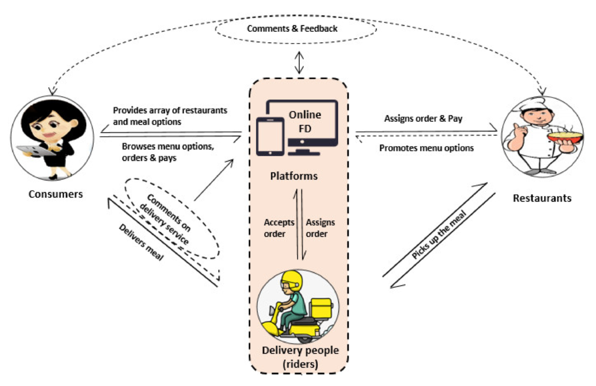

## Table of Contents

## What is alternative data in the context of restaurants and food delivery?

Alternative data in the context of restaurants and food delivery refers to information that is not usually found in traditional sources like financial reports or market research. This can include things like social media posts, customer reviews, and even satellite images of parking lots to see how busy a restaurant is. Companies use this data to understand trends, predict customer behavior, and make better business decisions.

For example, a restaurant might use alternative data to see what dishes are popular on social media or to track how many people are talking about their food delivery service. This helps them decide what to keep on the menu or how to improve their service. By looking at this kind of data, restaurants can get a clearer picture of what customers really want and how they can meet those needs better.

## How can alternative data be used to gain insights into consumer behavior in the food industry?

Alternative data can help food industry businesses understand what customers like and don't like. For example, by looking at social media posts and online reviews, restaurants can see which dishes are popular and which ones people complain about. They can also see what times of day people are talking about food, which can help them decide when to offer special deals or promotions. This kind of information can help restaurants make their menus better and attract more customers.

Another way alternative data helps is by tracking how many people are visiting a restaurant. Using satellite images or mobile phone data, businesses can see how busy their restaurant is at different times. This can tell them if they need more staff during busy times or if they should change their hours. By understanding these patterns, restaurants can make their operations smoother and give customers a better experience.

Overall, alternative data gives food industry businesses a lot of useful information that they can't get from traditional sources. It helps them see what customers really want and how they can improve their service. By using this data, restaurants can make smarter decisions and stay ahead of their competition.

## What are the common sources of alternative data for restaurants and food delivery services?

Common sources of alternative data for restaurants and food delivery services include social media platforms like Instagram, X (formerly Twitter), and TikTok. These platforms are full of customer posts, photos, and comments about food. By looking at what people are saying and sharing, restaurants can see which dishes are popular and what customers think about their service. This helps them understand what people like and don't like, so they can make their menus and services better.

Another source is online review sites like Yelp and Google Reviews. These sites have lots of customer feedback that can tell restaurants a lot about their strengths and weaknesses. For example, if many people complain about slow service, the restaurant might need to hire more staff. Also, mobile apps and websites that track food delivery orders can show which items are ordered the most and at what times, helping restaurants plan their inventory and staffing.

Lastly, satellite imagery and mobile phone data can be used to see how busy a restaurant is at different times. By looking at parking lot fullness or the number of phones in an area, businesses can understand their peak times and adjust their operations accordingly. This kind of data helps restaurants make smart decisions about when to open, when to offer specials, and how to manage their resources effectively.

## How can social media data be utilized to understand trends in restaurant preferences?

Social media data can help restaurants see what people like to eat and what's popular right now. By looking at posts, photos, and comments on platforms like Instagram, X, and TikTok, restaurants can find out which dishes people are talking about the most. For example, if lots of people are posting about a new type of burger, the restaurant might decide to add it to their menu. They can also see if people are interested in certain types of food, like vegan or gluten-free options, and adjust their offerings to meet these trends.

Another way social media helps is by showing what people think about a restaurant's service and atmosphere. If many people are posting positive comments about a restaurant's friendly staff or cool decor, it can attract more customers. On the other hand, if there are a lot of complaints about slow service or bad food, the restaurant can work on fixing these issues. By keeping an eye on what people are saying on social media, restaurants can stay up-to-date with what customers want and make changes to keep them happy.

## What role does location data play in analyzing the performance of food delivery services?

Location data helps food delivery services understand where their customers are and how busy they are in different areas. By looking at where orders come from, companies can see which neighborhoods have a lot of customers and which ones don't. This information can help them decide where to focus their marketing efforts or where to open new restaurants. For example, if a lot of orders come from a certain part of the city, the company might decide to put more delivery drivers in that area to make sure orders get to customers faster.

Another way location data helps is by showing how long it takes to deliver food to different places. If it takes too long to deliver to some areas, the company can work on making their delivery routes better or hiring more drivers. This can make customers happier because they get their food quicker. By using location data, food delivery services can make their business run smoother and give better service to their customers.

## How can satellite imagery help in assessing the popularity of restaurants?

Satellite imagery can help restaurants see how busy they are at different times. By looking at pictures from above, restaurants can see how full their parking lots are. If the parking lot is full, it means a lot of people are coming to eat there, which shows the restaurant is popular. This can help the restaurant know when to hire more staff or when to offer special deals to attract more customers during slow times.

Restaurants can also use satellite imagery to compare how busy they are compared to other restaurants nearby. If one restaurant's parking lot is always full while another one's is empty, it might mean people like the first restaurant more. This information can help restaurants understand what they're doing well and what they need to improve to attract more customers. By using satellite imagery, restaurants can make smart decisions about how to run their business better.

## What are the ethical considerations when using alternative data in the food industry?

When using alternative data in the food industry, it's important to think about privacy. People might not know that their social media posts or location data are being used to make business decisions. It's not fair to use this information without telling them. Companies should be clear about what data they are collecting and how they are using it. They should also make sure they are following the rules about data privacy, like the laws that protect personal information.

Another thing to consider is fairness. If a restaurant uses alternative data to target certain groups of people with special deals or ads, it might leave out other groups. This can make some people feel left out or treated unfairly. Companies need to make sure they are not using data in a way that hurts some people while helping others. By thinking about these ethical issues, businesses in the food industry can use alternative data in a way that is good for everyone.

## How can alternative data be integrated with traditional data to enhance business strategies in the restaurant sector?

Alternative data can be combined with traditional data to help restaurants make better business decisions. Traditional data, like sales numbers and customer surveys, gives a good picture of how the restaurant is doing. But alternative data, like social media posts and satellite images, can add more details. For example, if sales numbers show that a certain dish is popular, social media posts can show why people like it and what they say about it. This can help the restaurant decide if they should keep the dish on the menu or make it even better.

By using both types of data together, restaurants can understand their customers better and make smarter choices. For instance, if traditional data shows that the restaurant is busy on weekends, satellite images can show how full the parking lot is at different times. This can help the restaurant plan when to have more staff working. Also, if customer surveys show that people want healthier options, social media can help find out which healthy dishes are trending. By looking at all this information, restaurants can create better menus, improve their service, and attract more customers.

## What are the challenges in collecting and analyzing alternative data for food delivery and restaurants?

Collecting and analyzing alternative data for food delivery and restaurants can be tricky. One big challenge is making sure the data is correct and useful. Social media posts and online reviews can be hard to understand because people might not always say exactly what they mean. Also, not everyone uses social media or writes reviews, so the data might not show what all customers think. It's important to check the data carefully to make sure it's giving a true picture of what's happening.

Another challenge is keeping the data private and safe. People might not know their information is being used, and that can be a problem. Companies need to follow rules about data privacy and make sure they are not using information in a way that hurts people. It can be hard to balance using the data to help the business while also respecting people's privacy. 

Lastly, putting all the different kinds of data together can be tough. Traditional data like sales numbers and customer surveys need to be mixed with alternative data like social media posts and satellite images. This means using special tools and skills to make sense of it all. It takes time and money to do this right, but it can help restaurants make better decisions and improve their business.

## How can predictive analytics using alternative data help in forecasting demand for food delivery services?

Predictive analytics using alternative data can help food delivery services guess how many orders they will get in the future. By looking at things like social media posts and weather forecasts, they can see what people might want to eat. For example, if a lot of people are talking about a new type of food on social media, the service might expect more orders for that food. Also, if the weather is bad, people might order more food to stay home, so the service can get ready for more orders on those days.

Using this information, food delivery services can plan better. They can make sure they have enough food and drivers ready for busy times. This helps them deliver food faster and make customers happier. By understanding what people might want before they even order, the service can be more prepared and run more smoothly.

## What advanced techniques are available for processing large volumes of alternative data in the food industry?

To handle large amounts of alternative data in the food industry, businesses can use something called machine learning. This is a type of computer program that can learn from the data it sees. For example, it can look at thousands of social media posts and figure out which foods people are talking about the most. It can also see if people are happy or unhappy with the food they get. This helps restaurants know what to put on their menus and how to make their customers happier.

Another technique is called natural language processing (NLP). This helps computers understand what people are saying in their social media posts or online reviews. It can tell if someone is excited about a new dish or if they are complaining about the service. By using NLP, food businesses can quickly go through a lot of information and find out what people really think. This makes it easier for them to make changes and improve their service based on what customers want.

## How can machine learning models be applied to alternative data to optimize restaurant operations and menu offerings?

Machine learning models can help restaurants use alternative data to make their operations better. For example, by looking at social media posts and online reviews, machine learning can figure out which dishes are popular and why. It can also see when people are most likely to visit the restaurant or order food. This information helps the restaurant know when to have more staff working and what times to offer special deals. By using machine learning, restaurants can make sure they have the right amount of food and workers ready, so they can serve customers quickly and keep them happy.

Machine learning can also help restaurants decide what to put on their menus. By analyzing what people are saying on social media and in reviews, the models can find out which foods are trending and what customers want more of. For instance, if a lot of people are talking about wanting more vegan options, the restaurant might add some new vegan dishes to the menu. This way, the restaurant can keep up with what people like and make sure their menu stays interesting and attractive to customers. By using machine learning with alternative data, restaurants can make smarter choices about their menus and operations.

## References & Further Reading

[1]: Gans, J. S., Goldfarb, A., & Scott, M. (2017). ["Digital Economics."](https://www.nber.org/books-and-chapters/economics-artificial-intelligence-agenda) National Bureau of Economic Research.

[2]: Clements, M. T. (2019). ["Geo-Location Data in Real Estate: Implications for Assessing Residential Property Markets."](https://www.researchgate.net/publication/258932007_Geometry_and_spatial_reasoning) Lincoln Institute of Land Policy.

[3]: Einav, L., & Levin, J. (2014). ["The Data Revolution and Economic Analysis."](https://www.nber.org/papers/w19035) Journal of Economic Perspectives, 28(2), 3-28.

[4]: Fuster, A., Goldsmith-Pinkham, P., Ramadorai, T., & Walther, A. (2021). ["Predictably Unequal? The Effects of Machine Learning on Credit Markets."](https://onlinelibrary.wiley.com/doi/abs/10.1111/jofi.13090) National Bureau of Economic Research Working Paper No. 26325.

[5]: Verbeek, M. (2008). ["A Guide to Modern Econometrics."](https://www.researchgate.net/publication/227488993_A_Guide_to_Modern_Econometrics) Wiley.

[6]: Westergaard, M. J. (2012). ["Social Media Data: Opportunities and Challenges."](https://www.sciencedirect.com/science/article/pii/S0198971518302333) Health Affairs, 31(4), 819-827.