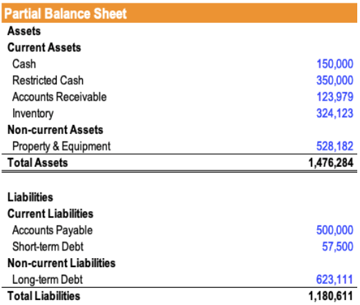

In this rapidly evolving financial landscape, understanding the nuances of accounting principles is essential for businesses and investors alike. Among the myriad of financial topics, two stand out for their significance in contemporary finance: restricted cash and algorithmic trading. Restricted cash refers to funds designated for a specific purpose and not available for general business operations, affecting how businesses report liquidity on their balance sheets. Meanwhile, algorithmic trading utilizes computer algorithms to automate trading strategies, relying on precise financial data to optimize trades.

This article aims to elucidate the concept of restricted cash in balance sheet accounting, illustrated through practical examples, while also exploring its relevance in algorithmic trading. By bridging these two concepts, we will gain insights into how restricted cash influences both financial statements and the operations of algorithmic trading strategies. As restricted cash can modify liquidity assessments and risk profiles, its recognition and management are crucial for informed decision-making. Ultimately, the integration of restricted cash principles within algorithmic trading demonstrates the complex interplay between accounting practices and modern financial technologies.



## Table of Contents

## Understanding Restricted Cash

Restricted cash refers to funds that are earmarked for a specific purpose and are not available for immediate or general business use. These funds are typically held separately from regular cash reserves and are clearly disclosed on the balance sheet to enhance transparency regarding a company's liquidity position. This demarcation allows stakeholders to better assess the financial health and obligations of the company.

Common reasons for cash restrictions include:

1. **Debt Repayment Collateral**: Companies often use restricted cash as collateral to secure loans. This serves as a financial safeguard for lenders, ensuring that the borrower has adequate funds set aside to service debt obligations. For example, if a company takes out a loan, part of the agreement might require a portion of cash to be set aside and restricted until the debt is fully repaid.

2. **Reserve Requirements by Lenders**: Financial institutions may impose reserve requirements, which necessitate businesses to maintain a minimum cash balance in a restricted account. This acts as a buffer to meet unforeseen financial challenges or specific covenants laid out in lending agreements.

3. **Funds Set Aside for Capital Expenditures**: Companies may restrict cash for planned capital expenditures, such as upgrading equipment or facilities. By setting aside funds in advance, companies ensure they have the necessary resources to complete these significant investments without disrupting their operational cash flow.

Proper classification of restricted cash as current or non-current assets is crucial for maintaining accurate financial records. Restricted cash is recorded as a current asset if it is expected to be used within one year. Conversely, if the restrictions extend beyond a year, it is categorized as a non-current asset. This classification directly impacts the balance sheet and provides a clearer picture of the company's [liquidity](/wiki/liquidity-risk-premium) and financial planning. By accurately reporting restricted cash, businesses offer improved clarity and transparency in their financial statements, aiding investors and analysts in making informed decisions.

## Examples of Restricted Cash in Accounting

Restricted cash is commonly used in accounting as a form of financial safeguard, providing security and fulfilling specific obligations. A prominent example of restricted cash application is when companies use these funds as collateral for loans. In such arrangements, a borrower allocates a portion of their cash reserves to secure loan repayments, reducing the lender's risk. This setup ensures that lenders can recover their capital even if the borrower encounters financial difficulties.

Manufacturers often create restricted cash reserves for capital expenditures, such as equipment upgrades or facility expansions. By setting aside these funds, they ensure sufficient resources are available to undertake essential projects without impacting their regular operations. For instance, a manufacturer planning to modernize its production line might earmark funds for this purpose, thus classifying them as restricted cash within financial statements.

Another typical application of restricted cash can be observed in the banking sector. Banks frequently maintain mandatory deposits at central banks or other regulatory institutions to comply with reserve requirements. These deposits are crucial for fulfilling regulatory standards aimed at ensuring the stability and liquidity of financial systems. Restricted cash, in this context, represents the funds that banks cannot use for general banking activities due to these mandatory requirements.

These examples highlight the strategic use of restricted cash by businesses across various industries. Whether it's securing loans, planning for capital investments, or fulfilling regulatory obligations, restricted cash plays a vital role in meeting these objectives. Understanding these applications is essential for accurately assessing a company's financial health and strategic priorities.

## Balance Sheet Accounting for Restricted Cash

On a balance sheet, restricted cash is distinctly reported from cash and cash equivalents, often categorized under "other restricted cash." This separation is crucial to provide stakeholders with a clear picture of a company's liquidity and financial health. Restricted cash typically arises due to contractual obligations or regulatory requirements, prompting the need for explicit disclosure in financial statement footnotes. This detailed explanation ensures transparency about why certain funds are not accessible for general use, thus enabling more accurate analysis and interpretation of a company’s financial position.

The accounting treatment of restricted cash involves classifying it as either a current or non-current asset based on the duration of the restriction. If the cash is expected to be used or released within a year, it is considered a current asset. Conversely, if the restriction extends beyond a year, it should be classified as a non-current asset. This classification affects how liquidity ratios and other financial metrics are calculated, influencing perceptions of financial stability and operational efficiency.

In scenarios where restricted cash is reclassified as unrestricted, companies are required to follow the prevailing accounting standards, such as U.S. Generally Accepted Accounting Principles (GAAP) or International Financial Reporting Standards (IFRS). These standards dictate the procedures for adjusting financial statements to reflect changes in cash restrictions. Such adjustments ensure that the financial records accurately represent the company's operational realities and obligations, maintaining the integrity of financial reporting.

The impact of restricted cash on balance sheets underscores the need for precise accounting practices. Companies must diligently track and report these funds to comply with financial regulations and inform stakeholders effectively. Misclassification or inadequate disclosure can lead to misinterpretations of a company's liquidity and potential risks, thereby affecting investment decisions and financial strategy formulation.

## Impact of Restricted Cash on Algorithmic Trading

In the dynamic landscape of [algorithmic trading](/wiki/algorithmic-trading), precise balance sheet data is crucial for developing effective trading strategies. The presence of restricted cash on a company's balance sheet can significantly affect performance metrics if not accurately interpreted. For algorithmic traders, understanding how restricted cash impacts liquidity is essential to evaluating a company's financial health and potential for investment.

Restricted cash is particularly important in the financial sector, where companies are required to set aside these funds to comply with specific trading regulations. This can impact the availability of capital for algorithmic trading operations, as the liquidity constrained by restricted cash must be considered when evaluating a company's balance sheet. Misinterpretation of this data can lead to skewed performance analyses. 

For instance, if a financial institution has a substantial portion of its assets in restricted cash, it may have less immediate liquidity available for trading purposes. This restriction impacts the risk assessment and the decision-making processes of algorithmic trading systems. Therefore, algorithms must be programmed to adjust strategies based on available liquid assets, taking into account the impact of restricted cash on overall liquidity.

In practical terms, strategizing around restricted cash involves accurately accounting for such funds when developing automated trading strategies. Python, often used for developing algorithmic trading systems, can be employed to adjust strategy parameters based on liquidity assessments. Consider the following simple Python snippet that adjusts trading [volume](/wiki/volume-trading-strategy) based on available liquidity:

```python
def adjust_trading_volume(total_cash, restricted_cash, max_volume):
    available_cash = total_cash - restricted_cash
    liquidity_ratio = available_cash / total_cash
    adjusted_volume = max_volume * liquidity_ratio
    return adjusted_volume

total_cash = 1000000  # Example total cash
restricted_cash = 200000  # Example restricted cash
max_volume = 100  # Max trade volume

print(adjust_trading_volume(total_cash, restricted_cash, max_volume))
```

In this example, the trading volume is adjusted based on the liquidity ratio, which accounts for the restricted cash in the company's balance sheet. Such strategies underscore the importance of incorporating detailed financial data into algorithmic trading processes, ensuring that investment decisions are based on the most accurate representation of a company's financial position. 

Ultimately, understanding and strategizing around restricted cash enhances the reliability of financial analyses and informs investment decisions within automated trading systems, making it an indispensable element for traders leveraging algorithmic strategies.

## Conclusion

Restricted cash plays a pivotal role in financial accounting and reporting, offering insight into a company's financial commitments and liquidity position. It is essential for businesses and investors, particularly those involved in algorithmic trading, to understand the intricacies of restricted cash. This understanding aids in making informed decisions by accurately reflecting a company's operational liquidity and strategic financial commitments on financial statements.

Accurate accounting of restricted cash ensures transparency in financial reporting. This transparency allows companies to navigate complex financial and regulatory environments more effectively. For instance, algorithmic trading strategies rely heavily on precise financial data to optimize investment decisions. Misinterpretations or omissions regarding restricted cash can lead to skewed performance metrics, possibly resulting in suboptimal trading strategies.

By recognizing the implications of restricted cash in trading strategies, companies can enhance the predictability and reliability of financial analyses. This awareness supports strategic decision-making processes, especially in systems that automate trading operations. Algorithmic trading models need to incorporate restricted cash considerations to evaluate liquidity constraints accurately.

Ultimately, a thorough grasp of restricted cash concepts is fundamental for enhancing the reliability of financial analyses. It allows businesses to craft strategies that reflect true financial capabilities. For traders, particularly those developing automated systems, this understanding is crucial for adjusting investment algorithms that respond to nuanced liquidity profiles. In this way, companies can strategically plan their operations to optimize both compliance and financial performance within an ever-evolving market landscape.

## References & Further Reading

[1]: ["Advances in Financial Machine Learning"](https://www.amazon.com/Advances-Financial-Machine-Learning-Marcos/dp/1119482089) by Marcos Lopez de Prado

[2]: ["Quantitative Trading: How to Build Your Own Algorithmic Trading Business"](https://www.amazon.com/Quantitative-Trading-Build-Algorithmic-Business/dp/1119800064) by Ernest P. Chan

[3]: ["Machine Learning for Algorithmic Trading"](https://github.com/stefan-jansen/machine-learning-for-trading) by Stefan Jansen

[4]: ["Financial Statement Analysis and Security Valuation"](https://cie-advances.asme.org/files-library-Documents/financial-statement-analysis-and-security-valuation.pdf) by Stephen H. Penman

[5]: ["Corporate Finance: A Focused Approach"](https://www.amazon.com/Corporate-Finance-Approach-Michael-Ehrhardt/dp/0357714636) by Michael C. Ehrhardt and Eugene F. Brigham