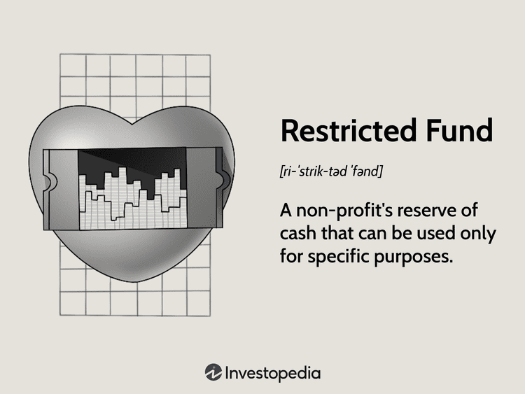

The financial markets are complex systems heavily influenced by regulations and legal mandates, particularly regarding fund management and algorithmic trading. Amidst this landscape, restricted funds serve as an essential financial instrument, guaranteeing that donor contributions are dedicated solely to defined objectives. These funds are pivotal in environments such as nonprofit organizations, educational institutions, and insurance companies, where donor intent is paramount.

Conversely, algorithmic trading represents a modern frontier in the financial world, where sophisticated computer programs execute trades at supersonic speeds with minimal human intervention. This innovation offers undeniable advantages, such as enhanced efficiency and liquidity in markets. However, it also introduces unique regulatory challenges. The speed and complexity of these trades require a regulatory framework that ensures market integrity and prevents potential misuse.

This article examines the intricate legal requirements associated with different fund types, focusing specifically on restricted funds, while assessing their interplay with algorithmic trading practices. As financial markets evolve, understanding these aspects is crucial for managing risks and safeguarding the interests of all stakeholders involved.

## Table of Contents

## Understanding Restricted Funds

A restricted fund is a financial reserve designated for a specific purpose, commonly used by nonprofit organizations, universities, and insurance companies to ensure that funds are allocated strictly according to donors' intentions. These funds are categorized into three main types: unrestricted, temporarily restricted, and permanently restricted. Unrestricted funds provide the organization with flexibility, allowing them to be used at the organization's discretion for any purpose. Temporarily restricted funds, on the other hand, are earmarked for specific uses and must be utilized within a predetermined timeframe, often dictated by the donor's stipulations or grant agreements. Permanently restricted funds, usually in the form of endowments, must be maintained intact indefinitely. The principal amount is kept untouched, and only the income generated from it is used according to the donor's instructions.

The management of restricted funds is governed by strict compliance and reporting requirements to prevent misuse or mismanagement. Nonprofits, in particular, must adhere closely to the restrictions imposed by donors to maintain trust and fulfill their legal obligations. Mismanagement or unauthorized use of these funds can lead to significant legal consequences, including potential action by regulatory bodies or legal entities, such as complaints to the Attorney General's office. Therefore, organizations managing restricted funds need to implement precise accounting and reporting systems to ensure transparency and accountability in fund usage.

Effective management of restricted funds not only fulfills legal and ethical requirements but also reinforces the organization's credibility and reliability in the eyes of donors and stakeholders. Compliance involves regular auditing of fund allocation and ensuring that all funds are being used as specified. This level of scrutiny helps safeguard against potential legal repercussions and supports the organization's mission by aligning financial practices with donor expectations.

## Types of Nonprofit Restricted Funds

Nonprofit organizations manage various types of restricted funds, each with specific rules and conditions for usage. These funds facilitate targeted financial planning and ensure that donor contributions are allocated according to their intended purpose. The primary categories of nonprofit restricted funds include unrestricted, temporarily restricted, and permanently restricted funds.

Unrestricted funds provide the highest level of flexibility for nonprofit organizations. These funds can be utilized without specific limitations, allowing organizations to allocate resources as needed to support their general operational expenses or other initiatives. This flexibility is crucial for nonprofits to adapt to immediate financial requirements or unexpected situations.

In contrast, temporarily restricted funds are earmarked for particular purposes and must be expended within a specific timeframe. Donors often specify these restrictions when making a contribution, and the organization is required to comply with these terms. Temporarily restricted funds are released from restrictions and become available for general use once the specified purpose has been achieved or the timeframe has expired, depending on the donor's stipulations. Compliance with the restrictions is necessary to maintain donor trust and legal adherence.

Permanently restricted funds, often associated with endowments, are designated to be kept intact indefinitely. Organizations are not permitted to spend the principal amount; instead, only the income generated from these funds can be used. This income must be applied in accordance with the donor's instructions or the terms governing the endowment. Permanently restricted funds are vital for ensuring long-term financial sustainability and are often used to support specific ongoing programs or scholarships. For example, if an endowment fund yields 5% annually, that income can be allocated per donor specifications, while the principal remains untouched to generate future income.

Each type of restricted fund serves unique purposes within nonprofit financial management, allowing for strategic allocation and compliance with donor intentions. To maintain financial integrity and align with legal obligations, nonprofits must meticulously document and report the usage of these restricted funds, ensuring transparency and accountability in their operations.

## Legal Requirements for Restricted Fund Management

Donors significantly influence the management of restricted funds through the imposition of specific conditions outlined in gift instruments, which are legally binding agreements detailing how their contributions should be utilized. These restrictions are critical in directing the use of funds toward the donor's intended purposes and are a cornerstone of responsible fund management. Nonprofit organizations are legally bound to respect and adhere to the terms set forth in these gift instruments as part of their operational and ethical obligations.

Compliance with donor restrictions is a fundamental requirement for nonprofit organizations. They must meticulously track and report on the allocation and use of restricted funds to ensure that these resources are deployed according to the specified conditions. This process involves detailed financial and programmatic reporting to demonstrate accountability and transparency to donors and regulatory bodies.

Noncompliance with the stipulations set by donors can result in significant legal consequences for nonprofits. Failure to adhere to these legal requirements can trigger complaints from donors or other stakeholders to regulatory authorities, such as the Office of the U.S. Attorney General. Such complaints can lead to investigations, legal actions, and potential penalties, which can damage the reputation and operational effectiveness of the nonprofit involved. To mitigate these risks, organizations often establish stringent internal controls and audit mechanisms to oversee the correct application of restricted funds and to ensure full compliance with all applicable legal and financial frameworks.

## Algorithmic Trading: An Overview

Algorithmic trading involves the utilization of computer algorithms to automatically execute trading orders at speeds and frequencies significantly higher than could be achieved by human traders. This trading method leverages real-time market data and sophisticated mathematical models to determine trading strategies. The efficiency of [algorithmic trading](/wiki/algorithmic-trading) lies in its ability to exploit minute price differences and implement complex strategies that generate profits from small market movements.

The primary advantage of algorithmic trading is its ability to enhance market efficiency and [liquidity](/wiki/liquidity-risk-premium). By executing trades rapidly, algorithmic trading platforms can narrow bid-ask spreads and improve market depth. This, in turn, can lead to more competitive pricing and increased trading volumes. Moreover, algorithmic trading reduces the potential for human error and emotional decision-making, providing a more disciplined approach to market engagement.

Despite these benefits, algorithmic trading also introduces significant risks, necessitating robust regulatory oversight. The high speed and [volume](/wiki/volume-trading-strategy) of trading can exacerbate market [volatility](/wiki/volatility-trading-strategies) and lead to phenomena such as flash crashes, where rapid selling triggers a sharp decline in market prices. Additionally, the complexity of algorithmic trading strategies can create systemic unknowns, where intertwined algorithms inadvertently destabilize markets.

Ensuring the integrity of financial markets requires that algorithmic trading be subject to stringent regulatory frameworks. These frameworks are designed to monitor the use of algorithms, manage risks, and protect against unfair trading practices. For instance, the implementation of circuit breakers and trading halts can mitigate extreme price movements and afford regulators time to assess market conditions during turbulent periods.

In summary, while algorithmic trading enhances market function by increasing liquidity and reducing transaction costs, it simultaneously imposes significant regulatory challenges. Regulators must continually adapt their measures to oversee algorithmic activities, ensuring that they contribute to, rather than detract from, overall market stability.

## Regulatory Framework for Algorithmic Trading

Algorithmic trading, the use of systematized algorithms to execute trades at speed and with efficiency, necessitates a stringent regulatory framework to maintain market integrity and fairness. Three primary agencies oversee different aspects of algorithmic trading in the United States: the Commodity Futures Trading Commission (CFTC), the Securities and Exchange Commission (SEC), and the Office of the Comptroller of the Currency (OCC).

The Commodity Futures Trading Commission (CFTC) plays a significant role in regulating algorithmic trading, especially within futures markets. To improve the transparency and integrity of trading practices, the CFTC has proposed Regulation Automated Trading (Reg AT). This regulation aims to mandate risk controls for trading firms, require testing of algorithms before deployment, and enforce registration of proprietary traders to oversee their market practices better. By introducing such measures, Reg AT seeks to mitigate the risks associated with automated trading, ensuring a stable and fair trading environment.

Similarly, the SEC has implemented the Market Access Rule, which specifically addresses the risks related to electronic trading platforms. This rule mandates that broker-dealers establish risk management controls and supervisory procedures before granting access to trade securities on an exchange or alternative trading system. The Market Access Rule requires firms to enforce both pre-trade and post-trade risk controls, effectively managing potential fraudulent activities and trading errors. These controls could include measures like setting positional limits and automatic cessation of trading upon breaching specified parameters.

Moreover, the Office of the Comptroller of the Currency (OCC) provides oversight over banks operating trading desks, ensuring that their trading activities do not compromise their safety and soundness. Compliance with OCC regulations ensures that banks adhere to robust risk management practices and remain resilient against possible market disturbances caused by algorithmic trading.

The interaction of these regulatory frameworks involves multiple layers of oversight, encouraging a cooperative approach among different financial regulatory bodies. Through these frameworks, the agencies aim to foster a transparent, safe, and resilient financial marketplace.

## Compliance Requirements in Algorithmic Trading

Algorithmic trading, characterized by its use of computer programs to execute trades, falls under stringent compliance requirements to maintain market stability and integrity. Traders using algorithms must first register with relevant regulatory authorities such as the Commodity Futures Trading Commission (CFTC), the Securities and Exchange Commission (SEC), or other applicable financial oversight bodies. This registration process ensures transparency and accountability.

A critical component of compliance is the implementation of robust risk management practices. These include pre-trade and post-trade controls designed to manage potential risks associated with algorithmic trading. Pre-trade controls are proactive measures aimed at assessing the risk of trades before they are executed. These may involve setting limits on order size or price to prevent large trades from impacting the market excessively. For example, algorithms can be programmed to halt trading if the market exhibits irregular volatility, thus safeguarding against unexpected financial losses.

Post-trade controls focus on the assessment and analysis of trade outcomes, serving as a feedback mechanism to enhance future trading strategies. This can involve comparing executed trades against expected performance to identify discrepancies, thus allowing for the adjustment of algorithms accordingly.

Regulatory bodies mandate rigorous testing, monitoring, and validation of trading algorithms. Algorithms should undergo extensive [backtesting](/wiki/backtesting) using historical market data, allowing traders to evaluate how their strategies would have performed under past market conditions. Once in operation, continuous monitoring is essential to ensure algorithms behave as expected and do not adversely impact market conditions. This includes real-time monitoring of live trading activities and adjustments to algorithms in response to dynamic market changes.

Validation processes ensure that algorithms comply with all regulatory requirements and industry standards. This involves auditing algorithms for adherence to legal and ethical standards, as well as evaluating their overall effectiveness. By requiring these comprehensive compliance measures, regulatory bodies aim to mitigate the risks posed by algorithmic trading, thereby protecting the stability of financial markets and ensuring fair trading practices.

## Risk Controls and Governance in Algorithmic Trading

Algorithmic trading involves complex systems that necessitate robust risk controls and governance frameworks to maintain market stability and ensure compliance with regulatory standards. One of the primary strategies in managing these risks includes incorporating safeguards such as stress testing and disaster recovery plans.

Stress testing in algorithmic trading involves assessing how trading algorithms respond under various market scenarios and conditions. This process helps identify vulnerabilities in algorithm strategies that could lead to market disruptions or financial losses. Models are subjected to extreme market conditions to ensure they can withstand unforeseen volatility without adverse outcomes. By simulating scenarios such as market crashes or liquidity shortages, developers can fine-tune algorithms to mitigate potential risks.

Disaster recovery plans are integral to maintaining operational continuity in the event of a system failure or cyber incident. These plans encompass a comprehensive strategy to restore trading operations and data integrity with minimal disruption. It often includes redundant systems, regular data backups, and predefined protocols for crisis management.

Model risk management is critical to ensure the accuracy and reliability of algorithms. This involves rigorous and continuous testing, validation, and adjustment of trading models to align with evolving market conditions and regulatory requirements. An effective model risk management process includes backtesting algorithms against historical data, real-time performance monitoring, and periodic reviews to validate assumptions and outcomes. This dynamic approach helps in identifying and correcting model errors promptly.

Corporate governance is pivotal in monitoring algorithmic trading activities and ensuring adherence to regulatory compliance. It involves setting a framework where roles, responsibilities, and accountability are clearly defined within the organization. A robust governance structure includes establishing a dedicated risk management team, compliance officers, and regular audits to oversee algorithmic trading operations.

High-level oversight by boards or committees is necessary to enforce policy adherence and ethical conduct in algorithmic trading. These bodies are responsible for ensuring that the trading strategies align with the overarching goals and risk appetites of the organization, as well as with regulatory and market conduct standards.

Furthermore, corporate governance frameworks often mandate training for personnel involved in algorithmic trading to remain updated with the latest regulatory changes and technology advancements. Training ensures that staff can effectively manage and oversee algorithmic systems, thereby enhancing the integrity and efficiency of trading operations.

## Conclusion

Balancing the advantages and risks associated with restricted funds and algorithmic trading requires the establishment of comprehensive legal frameworks. These frameworks are paramount in ensuring that the benefits of both financial mechanisms are realized while minimizing their potential risks. For restricted funds, adherence to donor-imposed restrictions and compliance with legal requirements safeguard the integrity of the intended purpose. Such diligence in fund management not only maintains the trust of the donors but also prevents potential legal repercussions that could arise from mismanagement.

Algorithmic trading, while offering increased market efficiency and liquidity, introduces unique risks that necessitate rigorous regulatory oversight. It is crucial to implement robust compliance measures to mitigate these risks. This includes registering with relevant authorities, maintaining risk management practices, and conducting thorough testing and validation of trading algorithms. The various regulatory bodies, such as the Commodity Futures Trading Commission (CFTC) and the U.S. Securities and Exchange Commission (SEC), play critical roles in overseeing algorithmic trading activities to protect market integrity.

Stakeholders, including fund managers and algorithmic traders, must remain informed and proactive in managing their legal obligations related to fund types and trading practices. Continuous education and awareness of evolving regulations are essential to navigate the complex financial landscape effectively. Ultimately, a commitment to robust compliance measures not only safeguards financial interests but also enhances the overall stability and transparency of the financial markets.

## References & Further Reading

[1]: ["A Guide to Restricted Funds for Nonprofit Organizations"](https://accountinginsights.org/managing-restricted-funds-in-nonprofits-types-and-best-practices/) by the National Council of Nonprofits.

[2]: Mendelsohn, M. (2003). ["The Nonprofit Sector: A Research Handbook"](https://www.jstor.org/stable/j.ctt5vktdq) (Third Edition). Stanford University Press.

[3]: Lopez de Prado, M. (2018). ["Advances in Financial Machine Learning"](https://www.amazon.com/Advances-Financial-Machine-Learning-Marcos/dp/1119482089). Wiley.

[4]: Aronson, D. (2007). ["Evidence-Based Technical Analysis: Applying the Scientific Method and Statistical Inference to Trading Signals"](https://www.amazon.com/Evidence-Based-Technical-Analysis-Scientific-Statistical/dp/0470008741). Wiley.

[5]: Securities and Exchange Commission. ["The Market Access Rule"](https://www.sec.gov/files/rules/final/2010/34-63241.pdf).

[6]: Commodity Futures Trading Commission. ["Regulation Automated Trading"](https://www.cftc.gov/PressRoom/PressReleases/7283-15).

[7]: ["Algorithmic Trading and DMA: An Introduction to Direct Access Trading Strategies"](https://www.semanticscholar.org/paper/Algorithmic-trading-%26-DMA-%3A-an-introduction-to-Johnson/aa5de1ab883d5e23b6651faa7c1807586d688e4b) by Barry Johnson.

[8]: Jansen, S. (2020). ["Machine Learning for Algorithmic Trading"](https://github.com/stefan-jansen/machine-learning-for-trading). Packt Publishing.

[9]: Chan, E. P. (2009). ["Quantitative Trading: How to Build Your Own Algorithmic Trading Business"](https://github.com/ftvision/quant_trading_echan_book). Wiley.

[10]: Securities and Exchange Commission and Commodity Futures Trading Commission's Joint Advisory Committee on Emerging Regulatory Issues. ["Recommendations Regarding Regulatory Responses to the Market Events of May 6, 2010"](https://www.sec.gov/spotlight/sec-cftcjointcommittee/021811-report.pdf).