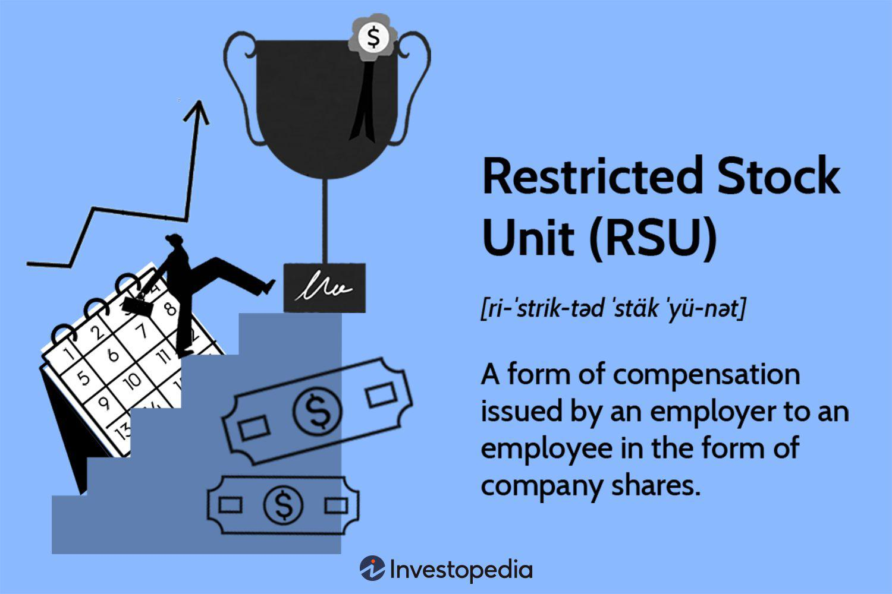

The dynamic interplay of economic regulation, market mechanisms, and restricted markets has significantly shaped the financial landscape, influencing how modern markets operate today. In particular, algorithmic trading, commonly referred to as algo trading, represents a significant component of these markets. This sophisticated form of trading utilizes pre-programmed algorithms to execute trades at exceptionally high speeds and frequencies, thus transforming conventional trading practices.

However, the emergence and proliferation of algorithmic trading have raised concerns regarding its impact on market regulation and integrity. The potential for accelerated and large-volume trading to destabilize markets poses substantial challenges to policymakers and market participants. The intricate relationship between economic regulation, market mechanisms, restricted markets, and algorithmic trading demands careful examination and understanding.

This article seeks to unpack these complex interactions, offering insights into how these elements collectively shape the mechanisms and regulations that govern financial markets. It underscores the importance of effective oversight to maintain market fairness and efficiency. As trading technologies continue to evolve, ensuring these elements work synergistically is pivotal for maintaining the stability and integrity of modern financial markets. Understanding and addressing these interactions are crucial for shaping regulatory approaches that can adeptly respond to technological advances while safeguarding market stability.

## Table of Contents

## Understanding Economic Regulation

Economic regulation involves government-imposed restrictions intended to manage and stabilize market operations, ensuring fairness and equity across financial environments. This regulatory framework includes a spectrum of policies that curb, control, or guide economic behavior within various market sectors. Its primary objectives are to facilitate competition, avert market abuse, maintain transparency, and protect investors from potential market pitfalls.

Regulatory bodies enforce certain rules and criteria that businesses and market participants must adhere to, with the ultimate goal of creating a competitive, fair, and transparent marketplace. Such regulations are crucial for preventing monopolistic practices, safeguarding consumer interests, and ensuring the integrity of financial transactions. For instance, antitrust laws are a form of regulation designed to prohibit unfair business practices and maintain competition within the market.

The evolution of digital and algorithmic trading technologies has presented regulators with new challenges. These advancements have significantly accelerated the speed of transactions and increased the complexity of financial products. Regulation in this modern context has become intricate, requiring more sophisticated oversight mechanisms and tools. Algorithmic trading, for example, can execute thousands of trades in milliseconds, a capacity beyond human reach and comprehension, potentially leading to market manipulations that are difficult to detect and mitigate.

In response, regulators have been compelled to develop more advanced technological solutions to monitor and manage these rapid and automated trades. This involves deploying real-time data analytics, implementing robust compliance checks, and fostering collaboration with technology experts to enhance regulatory frameworks. Such measures aim to detect any anomalies or manipulations promptly, preserving market stability and investor confidence.

Furthermore, international cooperation among regulatory bodies has become necessary due to the global nature of financial markets. Standardized regulatory practices across borders are vital to managing the interconnectedness of modern markets, where an event in one region can have repercussions worldwide.

In summary, economic regulation plays a crucial role in maintaining the fairness and stability of markets, especially as new technologies continually reshape the trading landscape. As markets evolve, so must regulatory approaches, ensuring they can effectively tackle the challenges posed by digital and algorithmic advancements in trading.

## Market Mechanisms and Their Function

Market mechanisms are essential components of the economic infrastructure that facilitate the interaction between buyers and sellers. These systems or processes allow for the exchange of goods, services, and financial assets, contributing to the overall efficiency and competitiveness of markets.

One of the primary functions of market mechanisms is price discovery. This process involves determining the price of an asset in the marketplace through the interactions of supply and demand. Price discovery is vital as it helps to ensure that resources are allocated optimally. When buyers and sellers engage in a market, they provide information on their valuations, which allows prices to reflect the collective information available. As a result, market prices generally settle at an equilibrium where the quantity supplied equals the quantity demanded.

In financial markets, several mechanisms are specifically employed to facilitate trading, each playing a unique role in ensuring market efficiency. Auctions are one such mechanism, prominently used in stock exchanges and government bond markets. For instance, in a typical auction, buyers submit bids, sellers submit asks, and a clearing price is determined where supply meets demand.

Pricing models are another critical component, involving mathematical frameworks that help determine asset prices based on factors like risk, return, and market conditions. Commonly used models like the Black-Scholes model for options pricing or the Capital Asset Pricing Model (CAPM) for assessing expected stock returns integrate numerous variables to evaluate fair market value.

Settlement systems also play a vital role in markets by ensuring that transactions are completed accurately and promptly. These systems ensure that when trades are executed, the respective parties receive their cash or securities without unnecessary delays, thereby maintaining [liquidity](/wiki/liquidity-risk-premium) and trust in the financial system. A well-functioning settlement system reduces counterparty risk and promotes confidence among market participants.

Moreover, it is crucial that market mechanisms reflect all available information efficiently. The Efficient Market Hypothesis (EMH) suggests that in an efficient market, asset prices fully incorporate all available information, implying that no participant can consistently achieve higher returns without assuming additional risk. This concept underscores the importance of transparency and access to information, which are essential for accurate pricing and efficient resource allocation.

The effectiveness of market mechanisms in achieving accurate price discovery and efficient resource allocation is influenced by factors such as market liquidity, transaction costs, and the competitive environment. Highly liquid markets with low transaction costs and a large number of participants tend to function more efficiently, as they allow for smoother and more frequent trading.

In summary, market mechanisms are fundamental to the operation and efficiency of financial markets. By enabling price discovery and ensuring efficient resource allocation, these mechanisms help maintain market stability and drive economic growth.

## The Concept of Restricted Markets

Restricted markets are characterized by governmental or regulatory constraints on trading activities. These constraints impact currency exchange and trading freedoms, often resulting in non-convertible currencies where exchanges are regulated through state-determined exchange rates.

A primary feature of restricted markets is the limitation on freely floating exchange rates. Unlike open markets where currency values fluctuate based on supply and demand dynamics, restricted markets impose fixed or controlled exchange rates. This setting often limits currency convertibility, constraining financial operations within and across national borders.

Economic and political motives frequently drive these restrictions. Economically, maintaining currency stability can be a reason for implementing such constraints. Countries may aim to prevent market [volatility](/wiki/volatility-trading-strategies) by guarding against rapid currency fluctuations that could disrupt the domestic economy. Politically, restrictions might serve as instruments of trade policy, potentially targeting other nations with sanctions or promoting local industry by inhibiting foreign competition.

One well-documented instance of restricted market mechanisms is evident in countries with non-convertible currencies. In these circumstances, a country's currency does not have a recognized floating market exchange rate. Instead, the government enforces a set rate for all trading purposes. This mechanism can be employed to control the inflow and outflow of capital, mitigating external economic pressures.

Overall, restricted markets manifest primarily through currency control measures, driven by a mix of stability objectives and political strategies. Understanding these motivations is crucial for comprehending how limited market freedoms can impact both domestic economies and international trade relations.

## Algorithmic Trading: A Market Revolution

Algorithmic trading, a pivotal advancement in financial markets, employs sophisticated software to execute trades based on predefined criteria. These criteria can range from simple to intricate strategies, incorporating market conditions, technical indicators, or even complex mathematical models. A key advantage of [algorithmic trading](/wiki/algorithmic-trading) is its ability to enhance market liquidity and efficiency. By executing trades at speeds unachievable by human traders, algorithms can contribute to tighter bid-ask spreads and more stable market conditions.

However, the rapid execution inherent to algorithmic trading also introduces potential concerns. The capacity of algorithms to process vast amounts of data and react to market signals with astounding speed can lead to market anomalies and disruptions. For example, "flash crashes," where assets experience significant price swings in short time frames, have been linked to algorithmic trading strategies reacting to market information in unexpected ways.

Market fairness and potential manipulation are central issues in the context of algorithmic trading. Given that algorithms can execute trades based on signals undetectable by humans, there is a risk of creating an uneven playing field. High-frequency trading ([HFT](/wiki/high-frequency-trading-strategies)), a subset of algorithmic trading, exemplifies this concern. HFT firms, leveraging advanced infrastructure and minimal latency, can exploit micro-market movements to their advantage, sometimes at the expense of slower, less technologically advanced market participants.

Furthermore, the regulatory landscape must evolve to address these challenges. Traditional regulatory frameworks are often inadequate for monitoring and controlling the complexities introduced by algorithmic trading. Regulators are tasked with ensuring market integrity through enhanced monitoring systems capable of detecting and analyzing high-speed trading patterns. This necessitates novel methodologies—such as leveraging [artificial intelligence](/wiki/ai-artificial-intelligence) for real-time surveillance and anomaly detection.

In conclusion, while algorithmic trading significantly benefits financial markets by enhancing liquidity and operational efficiency, it requires robust regulatory oversight to prevent market disruptions and ensure fairness. Adapting the regulatory structure to the nuances of algorithmic trading is crucial in maintaining the integrity and stability of modern financial markets.

## Impact of Algorithmic Trading on Market Regulation

Algorithmic trading, characterized by the use of automated, pre-programmed trading instructions, is reshaping the landscape of financial markets. This shift challenges traditional market regulation frameworks, mandating the development of new strategies to ensure market integrity and prevent manipulation. The rapid execution speeds and complexities of these algorithms have made it challenging for regulators to enforce existing legal frameworks, which were primarily designed with human traders in mind.

The primary concern with algorithmic trading lies in its potential to manipulate markets. Traditional forms of market manipulation, such as spoofing and layering, can be executed at speeds that make detection and prosecution exceedingly difficult. For instance, spoofing involves placing large orders with no intention of executing them, misleading other traders about supply and demand. Algorithmic systems can execute these strategies on a millisecond basis, causing significant disruption before detection measures can respond. This capability demands that regulators not only enhance their technological infrastructure but also rethink their approaches to proving manipulative intent.

The inherent opacity of AI-driven trading strategies further complicates regulatory enforcement. Algorithmic systems often function as black boxes, where their decision-making processes are not easily interpretable. As a result, regulators face the arduous task of proving manipulative intent without clear insights into the algorithmic decision-making paths. This challenge has led to calls for the development of mechanisms that enhance transparency. One proposal advocates for implementing audit trails that track algorithmic decision-making processes, providing a clearer view of trading patterns.

To address these challenges, regulators must innovate with technology-driven solutions. Real-time monitoring systems that can analyze market data rapidly and flag suspicious activities are vital. Machine learning algorithms, capable of discerning patterns indicative of manipulation, offer a promising avenue. These tools can be employed to detect anomalies in trading behaviors that deviate from established norms, thus providing a proactive approach to market surveillance.

Furthermore, the adaptive nature of algorithms necessitates a dynamic regulatory framework. Regulators should consider collaborating with technology firms and financial institutions to co-develop tools and systems that can keep pace with technological advancements. Establishing international benchmarks and best practices can also play a critical role in standardizing responses to cross-border trading activities, as algorithmic trading transcends national boundaries.

In conclusion, the rise of algorithmic trading challenges traditional regulatory paradigms, demanding novel approaches to safeguard market integrity. While the rapid evolution of trading technologies presents significant hurdles, leveraging advanced analytical tools alongside collaborative industry efforts offers a path forward to detecting and mitigating algorithm-driven manipulation. This evolving landscape requires vigilant adaptation from regulators to ensure fair and resilient financial markets.

## Regulatory Challenges and Innovations

Regulating algorithmic trading presents significant challenges due to the complexity and rapid evolution of technology-driven trading systems. One of the main issues is the establishment of rigorous audit trails and real-time monitoring systems. These mechanisms are essential to enhance transparency and accountability in trading activities. By keeping precise records of transactions and system interactions, regulators can more easily investigate and identify potential manipulative behaviors within algo trading. The implementation of real-time monitoring can further help in promptly detecting anomalous patterns that could indicate market manipulation or other rule violations.

To address the global nature of financial markets and the widespread use of algorithmic trading, international regulatory bodies are developing benchmarks and best practices. These guidelines aim to mitigate risks associated with algorithmic manipulation by setting standards for trading system operations, risk management, and compliance protocols. Effective benchmarks help ensure that trading algorithms operate within defined parameters that promote market integrity.

A critical [factor](/wiki/factor-investing) in adaptive regulatory frameworks is the collaboration among technology developers, financial institutions, and regulators. This collaboration can take various forms, such as joint task forces or working groups that focus on specific regulatory challenges. By combining expertise from multiple sectors, stakeholders can develop comprehensive solutions that address the technological and regulatory intricacies of algorithmic trading.

Technological advancements also play a pivotal role in regulatory innovations. Machine learning and artificial intelligence analytics are increasingly being considered to enhance surveillance capabilities. These technologies can analyze vast amounts of trading data to identify patterns indicative of manipulative behavior. For instance, anomaly detection algorithms can be employed to flag unusual trading activities that may warrant further investigation.

Furthermore, deploying blockchain technology can improve transparency and security in trading systems. Blockchain's distributed ledger provides an immutable record of trading activities, which can simplify the audit process and ensure data integrity. The use of smart contracts on blockchain platforms can automate compliance checks, ensuring that trades meet regulatory requirements before execution.

In conclusion, regulating algorithmic trading demands a multi-faceted approach that combines technological innovation with strategic oversight. Through rigorous audit trails, international benchmarks, collaborative partnerships, and advanced technologies, regulators can better address the challenges posed by sophisticated trading systems. This proactive strategy is essential to safeguard market integrity and foster fair and efficient markets in the digital trading era.

## Conclusion

Navigating the complexities of economic regulation, market mechanisms, restricted markets, and algorithmic trading is essential for maintaining the stability and integrity of modern financial markets. The interplay between these components forms the foundation upon which market dynamics operate, necessitating a thorough understanding by policymakers and market participants alike.

Effective regulation in contemporary financial markets depends on recognizing and adapting to the evolving landscape driven by technology advancements like algorithmic trading. As trading becomes increasingly automated, the overarching regulatory framework must evolve to address new challenges, ensure market fairness, and prevent abuses such as market manipulation. This requires constant re-evaluation of regulatory policies and their alignment with current technological capabilities and market practices.

Looking ahead, efforts to develop future regulatory measures should prioritize the promotion of transparency, fairness, and resilience within financial markets. Regulators must harness advanced analytical tools and real-time data monitoring systems to better understand market behavior and preemptively identify potential sources of instability. The implementation of robust audit trails and consistent performance benchmarks can aid in enforcing accountability and maintaining investor confidence.

Establishing ongoing dialogue among stakeholders—regulators, financial institutions, technology developers, and investors—is crucial for addressing emerging challenges and fostering collaborative solutions. This collaborative approach will help create adaptive and effective regulatory frameworks capable of responding to the rapid pace of technological change and global market integration. Through such concerted efforts, the goal of preserving stable, transparent, and equitable financial markets can be achieved, benefiting all participants in the broader economic system.

## References & Further Reading

[1]: Bergstra, J., Bardenet, R., Bengio, Y., & Kégl, B. (2011). ["Algorithms for Hyper-Parameter Optimization."](https://papers.nips.cc/paper/4443-algorithms-for-hyper-parameter-optimization) Advances in Neural Information Processing Systems 24.

[2]: ["Advances in Financial Machine Learning"](https://www.amazon.com/Advances-Financial-Machine-Learning-Marcos/dp/1119482089) by Marcos Lopez de Prado

[3]: ["Evidence-Based Technical Analysis: Applying the Scientific Method and Statistical Inference to Trading Signals"](https://www.amazon.com/Evidence-Based-Technical-Analysis-Scientific-Statistical/dp/0470008741) by David Aronson

[4]: ["Machine Learning for Algorithmic Trading"](https://github.com/stefan-jansen/machine-learning-for-trading) by Stefan Jansen

[5]: ["Quantitative Trading: How to Build Your Own Algorithmic Trading Business"](https://www.amazon.com/Quantitative-Trading-Build-Algorithmic-Business/dp/1119800064) by Ernest P. Chan