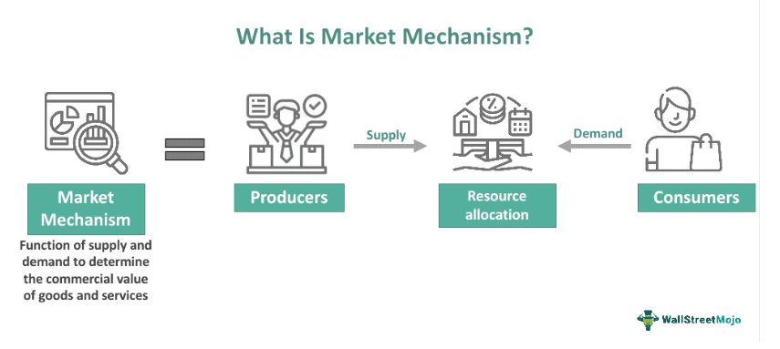

## Table of Contents

## What is a restricted market?

A restricted market is a type of market where there are limits on who can buy or sell things. These limits can come from rules made by the government or other groups. For example, some countries might not let people from other countries buy certain things. This can be to protect local businesses or for other reasons.

These markets can make it harder for people to trade freely. For example, if you want to buy a special kind of medicine, but your country has rules against it, you might not be able to get it. Restricted markets can affect many things, like stocks, real estate, and even everyday items. They are often used to control the economy or protect certain groups of people.

## What are the common reasons for a market to be restricted?

One common reason for a market to be restricted is to protect local businesses and industries. Governments might put rules in place to stop foreign companies from selling too many things in their country. This helps keep jobs and money within the country. For example, a country might limit how much foreign cars can be sold to help their own car makers.

Another reason is to keep certain goods safe or to control them better. Some things, like medicines or weapons, can be dangerous if not handled properly. So, governments might limit who can buy or sell these items. This helps make sure they are used safely and only by people who should have them.

Lastly, markets can be restricted for political or economic reasons. A country might limit trade with another country because they don't get along politically. Or, they might do it to try to control prices or the amount of certain goods available. These restrictions can affect how much people can buy and sell, and sometimes make things more expensive or harder to get.

## Who typically enforces restrictions in a market?

Governments usually enforce restrictions in a market. They make the rules and use different groups like customs and trade offices to make sure people follow them. If someone breaks the rules, the government can punish them with fines or other penalties.

Sometimes, other groups can also help enforce market restrictions. For example, industry groups or trade associations might set their own rules that members have to follow. But, the government is still the main one that makes sure the big rules are followed and can step in if needed.

## What are the different types of market restrictions?

There are different types of market restrictions that can affect how people buy and sell things. One type is called tariffs. Tariffs are extra taxes that a country puts on things that come from other countries. This makes them more expensive and can make people buy more things made in their own country. Another type is called quotas. Quotas limit the number of certain things that can come into a country. This helps control how much of something is available and can protect local businesses.

Another kind of restriction is called licensing. Licensing means that you need a special permission to buy or sell certain things. This is often used for things like medicines or weapons to make sure they are used safely. Embargoes are another type of restriction. Embargoes are when a country stops all trade with another country. This can be used for political reasons or to punish a country for doing something bad.

The last type of restriction is called subsidies. Subsidies are when the government gives money or help to certain businesses or industries. This can make their products cheaper and help them compete better against foreign companies. All these different types of restrictions can change how markets work and affect what people can buy and sell.

## How do restricted markets affect consumers?

Restricted markets can make things more expensive or harder for consumers to get. When a country puts extra taxes on things from other countries, it makes those things cost more. This can mean consumers have to pay more money for the same products. Also, if there are limits on how much of something can come into a country, it might be hard to find what you need. Sometimes, you might not be able to buy certain things at all because they are not allowed in your country.

On the other hand, some restrictions can help consumers by making local products cheaper or better. When the government helps local businesses with money or other support, it can make their products cost less. This can be good for consumers because they can buy things for less money. But, it can also mean fewer choices because there might be fewer foreign products available. So, restricted markets can have both good and bad effects on consumers, depending on the rules and how they are used.

## What are the economic implications of operating in a restricted market?

Operating in a restricted market can make things harder for businesses. When a country puts limits on what can be bought or sold, it can be tough to make money. For example, if there are high taxes on things coming into the country, it might cost more to bring in the materials needed to make products. This can make the products more expensive to sell, and fewer people might want to buy them. Also, if there are limits on how much of something can be sold, a business might not be able to sell as much as they want. This can lead to less money coming in and can make it hard for the business to grow.

On the other hand, some restrictions can help businesses, especially local ones. If the government gives money or help to local businesses, it can make their products cheaper to make and sell. This can help them compete better against big foreign companies. But, it can also mean fewer choices for consumers and might make things more expensive overall. So, while some businesses might do better in a restricted market, it can also make things harder for others and affect the whole economy in different ways.

## Can you provide examples of restricted markets around the world?

One example of a restricted market is in Cuba. The United States has had an embargo on Cuba for many years. This means that American companies can't sell things to Cuba, and it's hard for people in Cuba to buy things from the U.S. This makes it tough for businesses in Cuba to get the things they need and can make life harder for people there.

Another example is in China. The Chinese government has rules that limit what foreign companies can do in their country. For example, they might need to have a Chinese partner to do business there. This can make it hard for foreign companies to sell their products in China. It helps protect Chinese businesses but can make things more expensive for people in China.

In India, there are restrictions on buying and selling land. People from other countries can't always buy land there easily. The government does this to make sure that land stays in the hands of Indian people. This can make it hard for foreign companies to build factories or stores in India, which can affect how they do business there.

## How do governments justify the implementation of market restrictions?

Governments often say that market restrictions help protect local businesses and jobs. They think that if they limit what comes into the country from other places, it will be easier for their own businesses to sell things. This can help keep money and jobs in the country. For example, if a government puts high taxes on foreign cars, it might make people buy more cars made in their own country. This helps car factories and workers in that country stay busy and earn money.

Another reason governments use is to keep certain things safe or to control them better. Some products, like medicines or weapons, can be dangerous if not used the right way. By limiting who can buy or sell these items, governments can make sure they are used safely. They might also use restrictions to control prices or the amount of certain goods available. This can help make sure everyone can get what they need, even if it means some things might be harder to find or more expensive.

## What are the mechanisms used to enforce market restrictions?

Governments use different ways to make sure people follow market restrictions. One way is through customs offices. These offices check things that come into the country and make sure they follow the rules. If someone tries to bring in too much of something or something that's not allowed, the customs office can stop it and might even fine the person. Another way is through trade offices, which keep an eye on what businesses are doing and make sure they follow the rules about what they can buy and sell.

Sometimes, governments also use the police or other law enforcement to make sure restrictions are followed. If someone breaks the rules, they might get fined or even go to jail. Also, governments can use laws and regulations to set up systems where businesses need special licenses or permissions to do certain things. If a business doesn't have the right license, they can't sell or buy certain products. This helps control what goes on in the market and makes sure everyone follows the rules.

## How do restricted markets impact international trade?

Restricted markets can make international trade harder. When countries put limits on what can be bought or sold, it can stop businesses from other countries from selling their products. For example, if a country has high taxes on things coming in, it makes those things more expensive. This can mean fewer people will buy them, and businesses might not want to sell to that country anymore. Also, if a country has rules about how much of something can come in, it can limit how much businesses can sell. This can make it tough for companies to make money and can lead to less trade between countries.

On the other hand, some restrictions can help certain countries or businesses. If a government helps its own businesses with money or other support, it can make their products cheaper and easier to sell. This can help them compete better against big foreign companies. But, this can also make international trade more complicated. Other countries might not like these restrictions and could put their own limits in place. This can lead to less trade overall and can make things more expensive for everyone. So, while restricted markets can protect some businesses, they can also make international trade harder and affect the global economy.

## What are the challenges businesses face in restricted markets?

Businesses in restricted markets often find it hard to make money. When a country puts high taxes on things coming in, it can make the products a business needs to make their own goods more expensive. This can lead to higher prices for customers, and fewer people might want to buy the products. Also, if there are limits on how much of something can be sold, a business might not be able to sell as much as they want. This can make it tough for the business to grow and can lead to less money coming in.

On the other hand, some restrictions can help local businesses. If the government gives money or other help to businesses in their own country, it can make their products cheaper to make and sell. This can help them compete better against big companies from other countries. But, it can also make it hard for businesses from other countries to sell their products in that market. So, while some businesses might do better in a restricted market, it can also make things harder for others and can affect how much they can trade with other countries.

## How can businesses navigate or adapt to restricted market conditions?

Businesses can navigate restricted market conditions by finding new ways to sell their products. One way is to work with local businesses in the restricted market. By partnering with a company that knows the rules and can help them sell their products, businesses can still make money even if there are limits on what they can do. Another way is to change their products to fit the rules of the market. For example, if a country has high taxes on certain materials, a business might use different materials that are cheaper or not taxed as much. This can help them keep their prices down and still sell their products.

Another way businesses can adapt is by looking for new markets where there are fewer restrictions. If one country has a lot of rules that make it hard to sell things, a business might try to sell in another country where the rules are easier. This can help them keep making money and grow their business even if one market is tough. Also, businesses can talk to the government in the restricted market. Sometimes, if they explain how their business can help the local economy, the government might change the rules or give them special permission to do things that are usually not allowed.

## References & Further Reading

[1]: Bergstra, J., Bardenet, R., Bengio, Y., & Kégl, B. (2011). ["Algorithms for Hyper-Parameter Optimization."](https://papers.nips.cc/paper/4443-algorithms-for-hyper-parameter-optimization) Advances in Neural Information Processing Systems 24.

[2]: ["Advances in Financial Machine Learning"](https://www.amazon.com/Advances-Financial-Machine-Learning-Marcos/dp/1119482089) by Marcos Lopez de Prado

[3]: ["Evidence-Based Technical Analysis: Applying the Scientific Method and Statistical Inference to Trading Signals"](https://www.amazon.com/Evidence-Based-Technical-Analysis-Scientific-Statistical/dp/0470008741) by David Aronson

[4]: ["Machine Learning for Algorithmic Trading"](https://github.com/stefan-jansen/machine-learning-for-trading) by Stefan Jansen

[5]: ["Quantitative Trading: How to Build Your Own Algorithmic Trading Business"](https://www.amazon.com/Quantitative-Trading-Build-Algorithmic-Business/dp/1119800064) by Ernest P. Chan