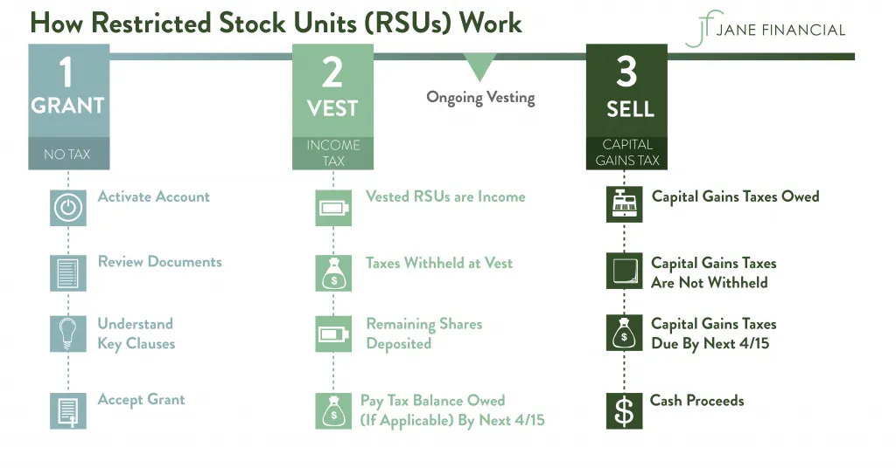

## Table of Contents

## What is restricted stock?

Restricted stock refers to company shares given to employees as part of their compensation, but with certain conditions attached. These conditions, often called vesting requirements, mean that the employee cannot fully own or sell the stock until they meet specific goals or stay with the company for a certain period of time. This is a way for companies to reward and retain their employees by giving them a stake in the company's future success.

Once the vesting period is over and the conditions are met, the restricted stock becomes unrestricted, meaning the employee can then sell or transfer the shares as they wish. This type of stock is commonly used by startups and growing companies to attract and keep talented workers without having to pay them more cash upfront. It aligns the interests of the employees with those of the company, as both stand to benefit from the company doing well.

## How does one typically receive restricted stock?

When a company wants to give you restricted stock, they usually do it as part of your job offer or as a reward for your work. They might say, "We're giving you 1,000 shares of our stock, but you can't sell them right away." This means you get the stock, but you have to wait before you can do anything with it. The company will tell you exactly what you need to do to be able to use the stock, like staying with the company for a certain amount of time or meeting performance goals.

Once you meet the conditions set by the company, the stock becomes yours to keep or sell. This process is called vesting. For example, if the company says you need to work there for three years before the stock is yours, after those three years, you can decide what to do with the stock. It's a way for companies to make sure employees stick around and work hard, because if the company does well, the value of the stock could go up, which is good for you too.

## What are the common vesting schedules for restricted stock?

Vesting schedules for restricted stock can be different depending on the company, but there are a few common ones. One popular type is called "cliff vesting." With cliff vesting, you have to work at the company for a certain amount of time before you get any of the stock. For example, if you have a one-year cliff, you don't get any stock until you've been there for a full year. After that, you might get all the stock at once or start getting it bit by bit.

Another common type is "graded vesting." This means you get a little bit of the stock every so often, like every month or every year. For example, if you get 1,000 shares with a four-year graded vesting schedule, you might get 250 shares each year. This way, you slowly earn more of the stock the longer you stay with the company. Both types of vesting are used to keep employees motivated and committed to the company's success.

## What are the key differences between restricted stock and stock options?

Restricted stock and stock options are both ways companies can give their employees a piece of the company, but they work differently. Restricted stock is when a company gives you actual shares of the company, but you can't do anything with them right away. You have to wait until you meet certain conditions, like working at the company for a set time. Once you meet those conditions, the stock is yours to keep or sell. It's like getting a gift that you can't open until later.

Stock options, on the other hand, give you the right to buy company stock at a certain price in the future. You don't get the stock right away; instead, you get the chance to buy it at a set price, called the exercise price. If the company's stock price goes up above that exercise price, you can buy the stock at the lower price and then sell it for a profit. But if the stock price doesn't go up, the options might not be worth anything to you. So, restricted stock gives you actual shares, while stock options give you the chance to buy shares later if you want to.

## How can an employee sell their restricted stock once it vests?

Once your restricted stock vests, you can sell it just like any other stock. You'll need to find a place to sell it, like a stock exchange if your company's stock is publicly traded. If it's not, you might need to find a private buyer. You can usually do this through a broker or an online trading platform. Just make sure you follow any rules your company might have about selling the stock.

Before you sell, it's a good idea to think about what you want to do with the money. You might want to pay off debts, save for the future, or invest in something else. It's also smart to talk to a financial advisor to make sure selling the stock is the best choice for you. Remember, once you sell, you'll have to pay taxes on any profit you make, so keep that in mind when planning what to do with your money.

## What are the tax implications of receiving restricted stock?

When you get restricted stock, you have to think about taxes. There are two main times when you might have to pay taxes: when the stock vests and when you sell it. When the stock vests, it becomes yours, and you have to pay taxes on its value at that time. This is called ordinary income tax. The amount you pay depends on how much the stock is worth when it vests.

Later, if you sell the stock, you might have to pay more taxes. If you sell the stock for more than it was worth when it vested, you'll pay capital gains tax on the difference. How much you pay depends on how long you held the stock after it vested. If you sell it within a year, it's a short-term capital gain, and you'll pay a higher tax rate. If you wait more than a year, it's a long-term capital gain, and the tax rate is usually lower. It's a good idea to talk to a tax advisor to make sure you understand all the taxes you might have to pay.

## How is the fair market value of restricted stock determined for tax purposes?

When your restricted stock vests, you need to figure out its fair market value to know how much tax you owe. The fair market value is what the stock would sell for on the open market. If your company's stock is publicly traded, it's easy to find the value because you can just look at the stock price on the day it vests. If the stock isn't publicly traded, things get a bit trickier. The company might use a recent valuation done by professionals or look at what similar companies are worth to guess the value of your stock.

Once you know the fair market value, you report it as ordinary income on your taxes. This means you'll pay taxes on the value of the stock at the time it vests, just like you would with your regular paycheck. It's important to get this right because it affects how much tax you'll owe. If you're not sure about the value or how to report it, it's a good idea to talk to a tax professional who can help you figure it all out.

## What is Section 83(b) election and how does it affect taxation of restricted stock?

A Section 83(b) election is a special choice you can make when you get restricted stock. It lets you pay taxes on the stock's value right away, even before it vests. Normally, you would pay taxes when the stock vests, but with this election, you pay taxes on what the stock is worth when you get it. This can be a good idea if you think the stock's value will go up a lot before it vests, because you'll pay taxes on a lower amount now and might save money in the long run.

However, there's a risk with making a Section 83(b) election. If you leave the company before the stock vests, you won't get to keep the stock, but you'll still have paid taxes on it. Also, if the stock's value goes down after you make the election, you'll have paid more taxes than you needed to. It's important to think carefully about whether this election makes sense for you, and talking to a tax advisor can help you make the best decision.

## What are the potential risks and benefits of holding onto restricted stock after vesting?

Holding onto your restricted stock after it vests can be a good thing if the company does well. If the stock price goes up, the value of your shares will go up too, and you could make a lot of money when you sell them later. It's like betting on the company's future success. If you believe in the company and think it will grow, keeping the stock might be a smart move. Plus, holding onto the stock can show that you are committed to the company, which might be good for your career.

But there are also risks to think about. If the company doesn't do well and the stock price goes down, the value of your shares could drop, and you might lose money. Also, if you hold onto the stock for too long, you might miss out on other investment opportunities that could be better for you. Another thing to remember is that you'll have to pay taxes on any profit you make when you sell the stock, so that could affect how much money you actually get to keep. It's important to weigh these risks and benefits and maybe talk to a financial advisor before deciding what to do with your vested stock.

## How do insider trading laws affect the sale of restricted stock?

Insider trading laws can make it tricky for employees to sell their restricted stock. These laws are there to stop people who know secret company information from using it to make money. If you work at the company and know things that the public doesn't, you can't sell your stock based on that information. This means you have to be careful about when and how you sell your stock. You might have to wait until certain company news is made public before you can sell, or follow rules set by the company about when it's okay to trade.

Breaking insider trading laws can get you into big trouble, like fines or even jail time. Companies often have rules to help employees avoid breaking these laws, like setting up special times when everyone can trade their stock, called trading windows. If you're not sure about the rules, it's a good idea to talk to someone in your company's legal or HR department. They can help make sure you're following the law and not risking your job or freedom.

## What are the accounting treatments for restricted stock from a company's perspective?

When a company gives out restricted stock, it has to keep track of it in its accounting records. The company sees the restricted stock as an expense because it's a way of paying employees. The expense is spread out over the time it takes for the stock to vest. This is called the vesting period. The company figures out how much the stock is worth when it's given out and then divides that value by the number of years or months until it vests. Each period, the company adds a bit of that expense to its [books](/wiki/algo-trading-books) until the stock fully vests.

Once the restricted stock vests, the company doesn't have to keep recording it as an expense anymore. But, it still needs to keep track of the stock in its records as part of its total number of shares. If the employee decides to sell the stock later, that doesn't change the company's accounting, but it might affect the stock's market value. The main thing for the company is to make sure it's following the rules about how to record the expense of giving out the stock and keeping its books straight.

## How do international regulations impact the granting and taxation of restricted stock for multinational companies?

When a multinational company gives out restricted stock to employees in different countries, it has to deal with different rules in each place. Every country has its own laws about how companies can give out stock and how employees have to pay taxes on it. This means the company needs to know the rules in each country where its employees work. For example, some countries might have special taxes or rules about when and how employees can sell their stock. The company has to make sure it follows all these different rules to avoid getting into trouble.

Taxes can be especially tricky for multinational companies. When restricted stock vests, employees might have to pay taxes in the country where they live, and the company might have to handle those taxes too. Sometimes, the tax rules can be different depending on whether the stock is from a company in the same country or a different one. This can make things complicated, especially if an employee moves to a new country while they're waiting for their stock to vest. Companies often need to work with tax experts to make sure they're doing everything right and that their employees understand how to handle their taxes on the restricted stock.

## References & Further Reading

[1]: Mankiw, N. G. (2011). ["Principles of Economics."](https://faculty.cengage.com/titles/9780357038314) Cengage Learning.

[2]: Blocher, E. J., & Hicks, M. D. (1994). ["Restricted Stock: A Study in Valuation Issues."](https://www.semanticscholar.org/paper/Cost-Management%3A-A-Strategic-Emphasis-Blocher-Stout/f992db79a44977a182b076e74740b5759cf8552d) Journal of Finance.

[3]: Abarbanell, J., & Bushee, B. (1997). ["Fundamental Analysis, Future Earnings, and Stock Prices."](https://www.jstor.org/stable/2491464) Journal of Accounting Research.

[4]: Barker, K. D. (2009). ["High-Frequency Trading: A Primer."](https://www.bankofcanada.ca/wp-content/uploads/2011/12/fsr-0611-barker.pdf) Securities Industry and Financial Markets Association.

[5]: French, K. R. (1980). ["Stock Returns and the Weekend Effect."](https://www.sciencedirect.com/science/article/pii/0304405X80900215) Journal of Financial Economics.

[6]: De Bondt, W. F. M., & Thaler, R. (1985). ["Does the Stock Market Overreact?"](https://onlinelibrary.wiley.com/doi/full/10.1111/j.1540-6261.1985.tb05004.x) The Journal of Finance.