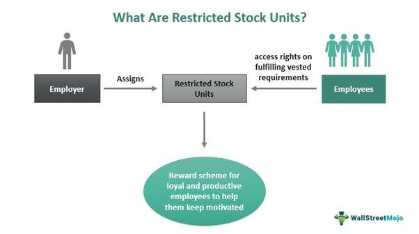

Investors and companies face an increasingly complex landscape when it comes to stock transactions and asset management. Central to understanding this environment are the key topics of stock sales, stock taxation, restricted stocks, and algorithmic trading. These elements form the backbone of modern investment strategies and corporate compensation frameworks.

Stock sales play a fundamental role within the investment ecosystem as they represent the primary means through which investors realize gains and optimize their financial portfolios. The timing and execution of stock sales can greatly influence an investor’s returns. Meanwhile, taxation policies in different jurisdictions can dramatically affect the profitability of these sales, necessitating a strategic approach to minimize tax liabilities and maximize after-tax returns.



Restricted stocks are another crucial aspect, frequently employed in corporate compensation packages to align the interests of employees with those of shareholders. Understanding the features and benefits of these instruments can help organizations incentivize and retain key talent while also managing their equity share distribution effectively.

Algorithmic trading, which utilizes computerized systems to execute trades at speeds and frequencies that human traders cannot match, has transformed the stock market. As a major force in modern finance, algo trading introduces both opportunities and risks through its sophisticated strategies that influence market dynamics.

This article will examine these topics comprehensively, offering insights into how they interact and the implications for investors and companies seeking to refine their strategies. By grasping the nuances of stock transactions, the interplay of taxation policies, and the shifting landscapes of both equity compensation and automated trading, stakeholders can better navigate the complexities of today’s financial markets.

## Table of Contents

## Understanding Stock Sales

Stock sales are a fundamental aspect of the investment landscape, serving as a mechanism for both individuals and entities to transfer ownership of securities for cash or other considerations. These transactions are crucial for efficient market functioning, providing liquidity, enabling price discovery, and facilitating capital allocation across the economy. 

There are several types of stock sales and transactions that investors may engage in. The most common are market orders and limit orders. Market orders involve buying or selling stocks at the prevailing market price. They provide immediacy but come with the risk of price fluctuation, especially in volatile markets. Limit orders, on the other hand, allow investors to specify a price at which they are willing to buy or sell, providing more control over price execution but with no guarantee that the order will be filled.

Another important transaction type is the short sale. Short selling involves selling stocks that the investor does not currently own, betting on a price decline. Short sellers borrow shares to sell them with the obligation to repurchase them later at a lower price. This strategy carries high risk due to the potential for unlimited losses if stock prices rise contrary to expectations.

Key considerations for investors when selling stocks include timing and market conditions. The timing of a stock sale can significantly affect the realized return. Investors often aim to sell stocks when prices are high, a strategy known as "buy low, sell high." However, predicting market peaks is notoriously tricky. Market conditions, such as [liquidity](/wiki/liquidity-risk-premium) and [volatility](/wiki/volatility-trading-strategies), also play a critical role. High liquidity ensures that stocks can be sold quickly without significantly affecting the market price. Conversely, in thinly traded markets, the act of selling can itself depress prices, eroding potential gains.

Investors must also consider external factors, such as economic indicators, interest rates, and geopolitical events, which can influence market conditions and stock prices. Additionally, an understanding of company-specific factors, including earnings reports, management changes, and industry trends, can offer insights into potential future price movements.

Effective stock sales require a strategic approach, balancing analysis and timing to optimize financial outcomes. Investors must stay informed about market dynamics and continuously adapt their strategies to navigate the ever-changing financial landscape effectively.

## Taxation of Stocks

Stocks are taxed differently across jurisdictions, impacting investors' overall returns. In general, stock taxation is largely determined by the nature of the gain—whether short-term or long-term—and the specific tax regulations in place within a given jurisdiction. Understanding these distinctions is crucial for investors seeking to optimize their tax liabilities and enhance after-tax returns.

### Overview of Stock Taxation

Stock taxation typically encompasses gains realized from selling stocks, which are categorized as capital gains. Capital gains represent the profit made from selling an asset for more than its purchase price. Jurisdictions impose taxes on these gains, though the rates can vary significantly. Additionally, different rules apply to dividend income, which is also a key component of stock taxation.

### Short-term vs. Long-term Capital Gains Tax

Stock gains are generally classified into short-term and long-term categories, based on the holding period of the investment. Short-term gains arise from stocks held for one year or less, while long-term gains apply to those held for more than one year. This distinction is essential as it often dictates the applicable tax rates:

- **Short-term capital gains** typically incur higher tax rates, akin to ordinary income tax rates. For example, in the United States, short-term capital gains are taxed at the same rate as the individual's regular taxable income, which can be as high as 37% as of 2023.

- **Long-term capital gains** usually benefit from lower tax rates as a means to encourage longer investment horizons. In the United States, for instance, the long-term capital gains tax rates are generally 0%, 15%, or 20%, depending on the taxpayer's income bracket.

### Strategies for Minimizing Tax Liability

Investors can employ various strategies to minimize tax liabilities on stock sales. These strategies are designed to align with the optimal tax treatment and timing to enhance after-tax returns:

1. **Holding Period Management**: By extending the holding period beyond one year, investors can qualify for the favorable long-term capital gains tax rates. This requires careful planning and aligns with investment strategies focused on sustained growth.

2. **Tax-Loss Harvesting**: This strategy involves selling securities at a loss to offset capital gains realized from other investments, thereby reducing the overall tax burden. Investors can utilize Python or Excel tools to automate the identification of optimal loss-harvesting opportunities.

   ```python
   import pandas as pd

   # Example portfolio with stock purchase and current prices
   portfolio = pd.DataFrame({
       'Stock': ['AAPL', 'GOOGL', 'AMZN'],
       'Purchase_Price': [150, 2200, 3100],
       'Current_Price': [145, 2150, 3200]
   })

   # Calculate losses
   portfolio['Loss'] = portfolio['Purchase_Price'] - portfolio['Current_Price']
   loss_stocks = portfolio[portfolio['Loss'] > 0]

   print("Stocks with potential tax-loss harvesting opportunities:")
   print(loss_stocks)
   ```

3. **Dividends and Qualified Dividends**: Investors should aim to earn qualified dividends, which are taxed at the lower long-term capital gains rates, as opposed to non-qualified dividends taxed at ordinary income rates. This involves selecting stocks likely to pay qualified dividends.

4. **Investing in Tax-Advantaged Accounts**: Making use of tax-advantaged accounts such as IRAs or 401(k)s allows investors to defer taxes on capital gains or even avoid them altogether, depending on the account type and withdrawal rules.

By understanding the taxation of stocks across various jurisdictions and employing strategic methods, investors can significantly improve their after-tax investment returns. Effective tax management, combined with an aligned investment strategy, can enhance overall financial success in the stock market.

## Restricted Stocks: Key Features and Benefits

Restricted stocks, often referred to as restricted stock awards (RSAs) or restricted stock units (RSUs), represent an essential component of corporate compensation strategies. These are shares of a company that are granted to employees as part of their remuneration package. However, they come with certain restrictions that typically involve a vesting period. Unlike stock options that give employees the right to purchase shares at a set price, restricted stocks are awarded outright, although they cannot be sold or transferred before they fully vest.

**Definition and Role in Compensation Packages**

Restricted stocks serve a dual purpose: they act as a strategic tool for companies to retain talent and align employee interests with corporate performance. By granting restricted stocks, companies provide employees with a stake in the company, thus incentivizing long-term commitment and promoting alignment with shareholder interests. When employees own a part of the company, they are more likely to work toward enhancing its value, which benefits both the company and its shareholders.

**The Vesting Period**

The vesting period is a crucial aspect of restricted stocks, defining the time frame over which the stocks become fully owned by the employee. Vesting schedules can vary but usually extend over several years, with a common structure being the "four-year vesting with a one-year cliff." This means that employees must work for the company for a full year before any shares are vested, after which they begin to vest incrementally, typically on a monthly or annual basis.

For example, if an employee is granted 1,200 RSUs with a four-year vesting schedule:

- Year 1: 300 RSUs vest
- Year 2: Additional 300 RSUs vest
- Year 3: Additional 300 RSUs vest
- Year 4: Remaining 300 RSUs vest

This gradual vesting offers both a retention tool for employers and a guaranteed incentive for employees to remain with the company until the full vesting period is completed.

**Benefits to Companies and Employees**

For companies, restricted stocks are advantageous because they help attract and retain top talent while conserving cash. By offering equity rather than high salaries, companies can reduce immediate cash outflows. Furthermore, restricted stocks align employee objectives with company performance, fostering an ownership mentality that can translate into increased productivity and innovation.

Employees benefit from receiving equity that can appreciate significantly if the company performs well. Restricted stocks, if held for a period longer than one year from vesting, also benefit from the preferential tax treatment of long-term capital gains. Additionally, the psychological effect of having a personal investment in the company's success can enhance job satisfaction and commitment.

In conclusion, restricted stocks are a powerful tool in corporate compensation schemes, providing mutual benefits to both employees and their employers. Through their vesting schedules, they incentivize long-term employment and performance, contributing to the overall health and growth of the company.

## Comparing Restricted Stock Units (RSUs) and Restricted Stock Awards (RSAs)

Restricted Stock Units (RSUs) and Restricted Stock Awards (RSAs) are two primary forms of equity compensation used by companies to incentivize employees. Understanding their differences is crucial for both employees and employers when crafting compensation strategies.

RSUs are a form of compensation whereby an employee receives shares after meeting certain conditions, such as a vesting period. RSUs do not grant any voting rights until the shares have vested and been converted into actual stock. This lack of voting rights before vesting might reduce an employee’s immediate influence on corporate decisions, potentially impacting their motivation to align closely with long-term company goals during the initial vesting period.

In contrast, RSAs provide actual stock to employees at the time of the grant but impose restrictions on when and how shares can be sold. This means employees often benefit from voting rights immediately, fostering a sense of ownership and possibly enhancing their commitment to the company’s success from the outset.

Tax implications differ notably between the two. RSUs are taxed as ordinary income when the shares vest, based on the fair market value at the time of vesting. This amount is included in the employee's W-2 form in the United States and could be significant if the stock price appreciates. Upon selling, any further appreciation is subject to capital gains tax.

For RSAs, taxation occurs when the shares are no longer under a substantial risk of forfeiture. Employees can choose to file a Section 83(b) election within 30 days of the award, allowing them to pay taxes on the market value at the grant date rather than at vesting. If the stock value appreciates, this decision can reduce the eventual tax burden, as future gains are taxed at the capital gains rate, which is typically lower than the ordinary income rate.

Strategically, RSUs are generally perceived as less risky for employees since no action is required until vesting. However, they might result in a higher tax burden if the stock appreciates significantly. RSAs, through the 83(b) election, offer potential tax advantages although they [carry](/wiki/carry-trading) risks — if an employee leaves the company before the shares vest, they could forfeit the shares without recouping taxes paid.

Both RSUs and RSAs present unique benefits and considerations. Companies must weigh these factors relative to their objectives and the motivations of their employees to select the most advantageous equity compensation structure.

## Algorithmic Trading: Revolutionizing the Stock Market

Algorithmic trading, commonly known as algo trading, refers to the use of computer algorithms to automate trading decisions and execute trades in the stock market. This method utilizes mathematical models and sophisticated software to make high-speed decisions based on a set of predetermined criteria like timing, price, and quantity. The rise of algo trading has significantly transformed financial markets by increasing both the speed and efficiency of trades, allowing them to be executed in milliseconds.

In modern finance, the adoption of algo trading has been fueled by its ability to process vast amounts of data and recognize trading opportunities that are imperceptible to human traders. Among the primary strategies used in algo trading are [market making](/wiki/market-making), [trend following](/wiki/trend-following), statistical [arbitrage](/wiki/arbitrage), and algorithmic execution strategies. These techniques aim to exploit small price disparities between stocks or predict price movements based on historical data. For example, a popular strategy known as "mean reversion" bases trading decisions on the assumption that asset prices will eventually return to their long-term average.

The advantages of automated trading systems are manifold. They enable traders to execute orders at optimal prices and diversify trading, as algorithms can place multiple trades across different markets and securities at the same time. Additionally, algo trading eliminates human emotion from the trading process, reducing errors driven by emotional reactions to market volatility. The use of algorithms can also improve the market's liquidity, enhance price discovery, and lower transaction costs due to the high [volume](/wiki/volume-trading-strategy) they can handle efficiently.

However, the widespread use of [algorithmic trading](/wiki/algorithmic-trading) introduces certain risks. Market disruptions can occur due to malfunctioning trading algorithms or during periods of extreme volatility, as witnessed in the "Flash Crash" of 2010 when U.S. stock markets rapidly plunged and recovered within minutes. Moreover, high-frequency trading ([HFT](/wiki/high-frequency-trading-strategies)), a subset of algo trading, has been criticized for potentially exacerbating market volatility and providing advantages only to those with superior technology. These systems also require rigorous [backtesting](/wiki/backtesting) on historical data to ensure reliability and to minimize the risk of unforeseen market impact.

The integration of algorithmic trading within financial institutions not only transforms trading desk operations but also necessitates the development of robust risk management frameworks and regulatory oversight to mitigate systemic risks. As technology evolves, the role of algo trading will likely continue to expand, influencing how markets operate and shaping the future of trading strategies.

## The Interplay Between Algo Trading and Restricted Stocks

Algorithmic trading (algo trading) has become a transformative force in the financial markets, characterized by the use of computer algorithms to execute trades with speed and precision. Its application in managing restricted stocks offers unique perspectives for investors and organizations. Restricted stocks, typically part of employee compensation packages, come with certain conditions, such as vesting periods, which can limit their immediate saleability. Integrating algo trading into the management of restricted stocks can enhance liquidity and streamline the complexities associated with these financial instruments.

Algo trading strategies can specifically address the constraints and opportunities presented by restricted stocks. One potential strategy involves developing algorithms that predict the optimal timing to sell restricted stocks upon their vesting. These algorithms can assess a multitude of market conditions, such as price trends and trading volumes, to suggest opportune moments, thereby maximizing potential returns and minimizing market impact. Additionally, [machine learning](/wiki/machine-learning) models can be utilized to forecast stock price movements and adjust trading strategies dynamically.

The challenges in algo trading and restricted stocks stem from regulatory and liquidity concerns. Restricted stocks often come with detailed compliance requirements, and algorithms need to be designed to adhere to these regulations. Furthermore, the limited tradability of these stocks until vesting could impact liquidity, requiring algorithms to integrate sophisticated risk management techniques. This could involve simulating various market scenarios and employing statistical methods to project potential outcomes and tailor strategies accordingly.

Opportunities arise when leveraging algorithmic strategies to enhance stock liquidity. Algo trading can facilitate the gradual liquidation of vested restricted stocks, avoiding adverse market effects typically associated with large trades. Algorithms can slice trades into smaller, discreet transactions spread across different trading periods, thus optimizing execution and liquidity.

In terms of employee compensation, the interplay between algo trading and restricted stocks can impact the perceived and actual value of compensation packages. Efficient algo trading strategies can potentially increase the net value of restricted stocks for employees by ensuring favorable market conditions at the time of sale. Additionally, employees might value the flexibility and efficiency that algo trading brings to the process of accessing liquidity from their restricted stock awards.

Overall, while the integration of algo trading with restricted stocks introduces certain complexities, it also offers the potential for enhanced liquidity management, strategic compliance with regulations, and optimized employee compensation outcomes. Through advanced algorithmic approaches, stakeholders can navigate the intricacies of restricted stocks more effectively, aligning financial outcomes with organizational goals and market conditions.

## Conclusion

Navigating the intricacies of stock sales, taxation, restricted stocks, and algorithmic trading is fundamental for both investors and corporations aiming to optimize their financial outcomes. Stock sales are pivotal in the investment framework as they present opportunities for capital growth and portfolio diversification. Understanding when and how to sell stocks, as well as being mindful of market conditions, is essential for achieving desirable returns.

Taxation directly impacts the profitability of stock transactions. Differentiating between short-term and long-term capital gains can significantly affect tax liabilities. Investors should employ strategic planning to minimize tax burdens and thereby enhance after-tax profitability. Utilizing strategies such as tax-loss harvesting can be a vital tool in managing taxable income.

Restricted stocks serve as an important component in corporate compensation strategies, offering both motivational incentives for employees and aligning their interests with those of the company. Understanding the nuances of vesting periods and the distinction between Restricted Stock Units (RSUs) and Restricted Stock Awards (RSAs) is crucial. These instruments, with their unique benefits and limitations, provide flexibility and long-term engagement in human capital development.

In recent years, algorithmic trading has revolutionized stock markets by enhancing trading efficiency through automated strategies. By incorporating complex algorithms, investors can capitalize on market opportunities with precision and speed. However, the rise of algorithmic trading also introduces risks, such as market volatility and technological failures, which require vigilance and robust risk management practices.

The interplay between algorithmic strategies and restricted stocks opens new avenues for managing and leveraging these assets. Automated systems can address challenges in stock liquidity and offer novel solutions for employee compensation schemes, thereby fostering a synergistic approach in the contemporary financial landscape.

In conclusion, effectively navigating the interconnected domains of stock transactions, taxation, restricted stocks, and algorithmic trading necessitates a deep understanding of their individual and collective impacts on financial strategies. Continuous learning and adaptation are imperative in an ever-evolving financial ecosystem. By staying informed and agile, investors and companies alike can maximize opportunities and sustain competitive advantage in the dynamic world of finance.

## References & Further Reading

[1]: Mankiw, N. G. (2011). ["Principles of Economics."](https://faculty.cengage.com/titles/9780357038314) Cengage Learning.

[2]: Blocher, E. J., & Hicks, M. D. (1994). ["Restricted Stock: A Study in Valuation Issues."](https://www.semanticscholar.org/paper/Cost-Management%3A-A-Strategic-Emphasis-Blocher-Stout/f992db79a44977a182b076e74740b5759cf8552d) Journal of Finance.

[3]: Abarbanell, J., & Bushee, B. (1997). ["Fundamental Analysis, Future Earnings, and Stock Prices."](https://www.jstor.org/stable/2491464) Journal of Accounting Research.

[4]: Barker, K. D. (2009). ["High-Frequency Trading: A Primer."](https://www.bankofcanada.ca/wp-content/uploads/2011/12/fsr-0611-barker.pdf) Securities Industry and Financial Markets Association.

[5]: French, K. R. (1980). ["Stock Returns and the Weekend Effect."](https://www.sciencedirect.com/science/article/pii/0304405X80900215) Journal of Financial Economics.

[6]: De Bondt, W. F. M., & Thaler, R. (1985). ["Does the Stock Market Overreact?"](https://onlinelibrary.wiley.com/doi/full/10.1111/j.1540-6261.1985.tb05004.x) The Journal of Finance.