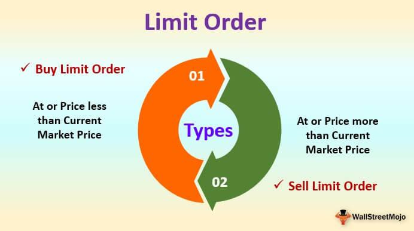

## Table of Contents

## What is a sell order in stock trading?

A sell order in stock trading is when someone decides to sell their stocks or shares. It's like saying, "I want to get rid of these stocks and get my money back." When a person places a sell order, they tell their broker or use an online platform to sell a certain number of stocks at a specific price or the current market price.

The process starts when the sell order is sent to the stock exchange. There, it matches with someone who wants to buy those stocks. If the prices match, the trade happens, and the seller gets the money. If the prices don't match, the sell order might stay open until someone agrees to buy at the seller's price, or the seller might change the price to make a quicker sale.

## Why might someone place multiple sell orders for the same stock?

Someone might place multiple sell orders for the same stock to manage their investments better. They might want to sell some of their stocks at different prices to make sure they get the best possible return. For example, they could set one order to sell at a high price if they think the stock might go up, and another at a lower price to make sure they can still sell if the stock goes down.

Another reason could be to spread out the risk. By placing multiple sell orders, they are not putting all their eggs in one basket. If the stock price moves around a lot, having different sell orders at various prices can help them sell some of their stocks no matter what the market does. This way, they can protect themselves from big losses and still make some profit.

## What are the basic restrictions on placing multiple sell orders?

There are some rules you need to know when you want to place more than one sell order for the same stock. One big rule is that you can't sell more stocks than you own. This means if you have 100 shares of a stock, you can't place sell orders for 150 shares. Also, different trading platforms might have their own limits on how many orders you can place at the same time. They do this to keep things fair and to make sure their systems can handle all the orders.

Another thing to think about is the type of orders you are placing. Some types of orders, like stop-loss orders, might not work well if you have too many of them for the same stock. This can make it hard for the system to know which order to use first. Also, if you place a lot of orders at the same time, it might look like you are trying to control the price of the stock, which is not allowed and can get you in trouble. So, it's important to understand the rules and limits before you start placing multiple sell orders.

## How do different types of sell orders (e.g., market, limit, stop) affect restrictions?

Different types of sell orders can change the way restrictions work. A market order means you want to sell your stocks right away at the current price. There are usually no special restrictions on market orders, but you still can't sell more stocks than you have. A limit order lets you set a specific price to sell your stocks. You can have many limit orders, but if you set them too close together, it might confuse the system about which one to use first. Also, some trading platforms might limit how many limit orders you can have at the same time.

A stop order, or stop-loss order, is a bit different. It tells the system to sell your stocks if the price drops to a certain level. You can have several stop orders, but they need to be set at different prices. If you set them too close together, it might not work right and could lead to problems. Also, if you have too many stop orders, it might look like you're trying to control the stock price, which is against the rules. So, while you can use different types of sell orders, you need to be careful and follow the rules to avoid any issues.

## What are the regulatory rules concerning multiple sell orders?

When you place multiple sell orders for the same stock, you need to follow some rules set by regulators. One big rule is that you can't sell more stocks than you own. This means if you have 100 shares, you can't place orders to sell 150 shares. Also, regulators want to make sure you're not trying to control the stock's price by placing a lot of orders at the same time. This is called market manipulation, and it's against the rules. They keep an eye on how many orders you place to make sure everything stays fair.

Another thing to know is that different trading platforms might have their own limits on how many orders you can place. They do this to keep their systems running smoothly and to stop anyone from taking advantage of the system. So, it's a good idea to check with your trading platform to see what their rules are. Following these rules helps make sure you can trade without any problems and keeps the market fair for everyone.

## How do brokerages implement their own policies on multiple sell orders?

Brokerages have their own rules about how many sell orders you can place for the same stock. They do this to make sure their systems can handle all the orders without getting too busy. For example, a brokerage might say you can only have five sell orders open at the same time for one stock. This helps keep things running smoothly and stops people from trying to control the stock's price by placing a lot of orders.

Some brokerages also check how you place your orders. If you try to place a lot of orders all at once, they might stop you or ask you to explain what you're doing. They want to make sure you're not trying to do something sneaky, like market manipulation. So, it's a good idea to know the rules of your brokerage before you start placing a bunch of sell orders.

## What are the potential risks of placing multiple sell orders for the same stock?

Placing multiple sell orders for the same stock can be risky. One big risk is that you might accidentally sell more stocks than you own. This can happen if you place too many orders and forget how many stocks you have. If you try to sell more than you own, you could end up in trouble with your brokerage or even face legal issues.

Another risk is that the stock market might think you're trying to control the price of the stock. If you place a lot of orders at different prices, it might look like you're trying to make the stock's price go up or down on purpose. This is called market manipulation, and it's against the rules. If the regulators think you're doing this, you could get in big trouble.

Also, having too many sell orders can confuse the trading system. If you have a bunch of orders at similar prices, the system might not know which one to use first. This can lead to mistakes and could make you lose money. So, it's important to be careful and follow the rules when you place multiple sell orders.

## How can one manage and monitor multiple sell orders effectively?

To manage and monitor multiple sell orders effectively, it's important to keep track of how many orders you have and at what prices. You can use the tools on your trading platform to see all your orders in one place. This helps you know exactly what's going on with your stocks. Also, setting up alerts can be really helpful. If you set alerts, your trading platform will let you know when your orders are filled or if the stock price gets close to your sell prices. This way, you don't have to watch the market all the time.

Another good idea is to keep a record of all your orders. You can write them down in a notebook or use a spreadsheet to keep everything organized. This way, you won't forget how many orders you have or mix up the prices. It's also smart to check your orders regularly to make sure they are still what you want. If the market changes, you might need to change your orders too. By staying organized and using the tools available, you can manage multiple sell orders without getting too confused or making mistakes.

## What are the differences in restrictions between retail and institutional investors?

Retail investors and institutional investors face different restrictions when it comes to placing multiple sell orders. Retail investors, who are usually individual traders, have to follow rules set by their brokerages. These rules can include limits on how many orders they can place at the same time. Retail investors also have to be careful not to sell more stocks than they own, or they might get in trouble. They need to keep an eye on their orders to make sure they don't accidentally break any rules.

Institutional investors, like big banks or investment funds, have more freedom but also more rules to follow. They can place a lot more orders because they have bigger accounts and more resources. However, they have to be very careful not to do anything that looks like market manipulation. Regulators watch institutional investors closely to make sure they're not trying to control stock prices. So, while they can place more orders, they have to follow strict rules to keep everything fair and legal.

## How do algorithmic trading systems handle multiple sell orders?

Algorithmic trading systems can handle multiple sell orders really well because they use computers to make decisions quickly. These systems can place a lot of orders at the same time, but they still have to follow the rules. They make sure not to sell more stocks than they have and avoid doing anything that might look like they're trying to control the stock's price. The computer program looks at the market and decides when to sell based on the prices you set, making sure everything stays fair and follows the rules.

These systems also help keep track of all the orders easily. They can show you all your orders in one place and send you alerts if something important happens, like if one of your orders gets filled or if the stock price hits a certain level. This way, you don't have to watch the market all the time. By using [algorithmic trading](/wiki/algorithmic-trading), you can manage multiple sell orders without getting confused or making mistakes, and it helps you follow the rules set by brokerages and regulators.

## What advanced strategies can be used with multiple sell orders to optimize trading?

One advanced strategy with multiple sell orders is called "bracket orders." This means you place a main sell order at a certain price, and then you add two more orders: one to sell at a higher price if the stock goes up, and another to sell at a lower price if the stock goes down. This way, you can make sure you sell some of your stocks no matter what the market does. It helps you lock in profits if the stock goes up and protects you from big losses if the stock goes down. 

Another strategy is called "scaling out." This means you sell your stocks in smaller amounts at different prices instead of all at once. For example, if you have 100 shares, you might sell 20 at a high price, 30 at a medium price, and the rest at a lower price. This can help you make more money because you're selling some of your stocks at different times and prices. It's like taking small profits along the way instead of waiting for one big sale.

## How do international markets differ in their approach to restrictions on multiple sell orders?

Different countries have different rules about how many sell orders you can place for the same stock. In the United States, the rules are strict to stop people from trying to control stock prices. You can't sell more stocks than you own, and there are limits on how many orders you can place at the same time. In Europe, the rules are also strict, but they might let you place more orders if you're a big investor. They watch closely to make sure no one is doing anything unfair.

In Asia, like in Japan and Hong Kong, the rules can be a bit different. They might let you place more orders, but they still want to make sure you're not trying to trick the market. They have systems to check for anything that looks like cheating. In other places, like some countries in Africa or Latin America, the rules might not be as strict, but they still want to keep the market fair. So, it's important to know the rules of the country you're trading in to avoid any problems.

## What are Stock Trading Order Restrictions?

Order restrictions in stock trading are mechanisms that dictate how and when certain trades can be executed. These restrictions are implemented to enhance market stability, protect investor interests, and ensure orderly transactions. By setting boundaries on trading activities, they help prevent excessive market [volatility](/wiki/volatility-trading-strategies) and financial anomalies that can occur through unrestricted trading.

One primary purpose of order restrictions is to prevent overselling, which is the act of selling more shares than are available. This can be inadvertently caused by simultaneous order submissions or errors in trade execution. Restrictions also help manage market volatility by ensuring that large, sudden changes in price do not destabilize the market, thus facilitating a fair price discovery process.

Understanding the different types of order restrictions is crucial for effective trading. Stop orders and limit orders are two commonly used mechanisms that can influence how trades are carried out. 

1. **Stop Orders:** These orders are designed to execute a trade once the price of a stock hits a predetermined point, known as the stop price. A stop order essentially turns into a market order to buy or sell at the best available price, once the stop price is reached. This type of order is instrumental in protecting against significant losses or protecting profits in fluctuating markets.
$$
   \text{Stop Price} = P_o \pm \Delta P

$$

   where $P_o$ is the original price and $\Delta P$ is the price change at which the order activates.

2. **Limit Orders:** This type of order sets a ceiling or a floor on the price at which an investor is willing to buy or sell a stock. A sell limit order ensures a minimum price the seller is willing to accept, while a buy limit order caps the maximum price a buyer is willing to pay. If the stock does not reach the specified limit price, the order will not execute.

   ```python
   def determine_limit_order_execution(current_price, limit_price, order_type='sell'):
       if order_type == 'sell' and current_price >= limit_price:
           return "Execute Order"
       elif order_type == 'buy' and current_price <= limit_price:
           return "Execute Order"
       else:
           return "Do Not Execute"
   ```

Employing these orders helps traders maintain control over their transactions by setting predefined levels for entering and exiting markets. Understanding their application within trading strategies allows for more precise risk management, aligning trading activities with market conditions and personal financial goals.

In conclusion, by utilizing order restrictions effectively, investors can mitigate potential risks and contribute to a more stable market environment. They enable traders to execute strategies that align with market conditions and personal financial goals, optimizing the trading experience.

## What are the challenges with multiple sell orders?

Placing multiple sell orders on the same stock simultaneously presents a notable challenge because of the restrictions imposed by brokerage firms. Most brokers disallow concurrent sell orders that exceed the shares available in an account. This policy is primarily intended to prevent unintentional short selling, which occurs when an investor sells more shares than they own.

For instance, consider an investor who holds 100 shares of a stock and places two sell orders, each for 60 shares. If both orders were to execute, the investor would sell 120 shares, leading to a short position for 20 shares, potentially without intending to establish such a position. To mitigate this risk, brokerage platforms typically enforce an "availability check". The platform cross-references the investor's current holdings before executing additional sell orders, ensuring the total does not exceed the available shares. The main calculation performed by brokerage systems can be represented as:

$$
\text{Available Shares} \geq \Sigma (\text{Outstanding Sell Orders})
$$

Algorithmic traders, who often design and deploy automated trading systems, must consider these limitations carefully. Algorithms programmed to optimize trading decisions based on market conditions must be designed to take share availability into account. This involves incorporating checks within the algorithm to prevent over-ordering shares. In Python, such a check might resemble:

```python
def can_place_order(current_holdings, pending_orders, new_order):
    return current_holdings >= sum(pending_orders) + new_order

# Example
current_holdings = 100
pending_orders = [40, 30]  # Shares in pending sell orders
new_order = 40  # Shares in a new sell order

if can_place_order(current_holdings, pending_orders, new_order):
    print("Order can be placed.")
else:
    print("Order exceeds available shares.")
```

This code ensures that before placing a new order, the algorithm confirms that the aggregate of pending sell orders and the new order does not surpass the number of shares currently held. Without such timely evaluations, algorithms could inadvertently initiate short sales, which might expose traders to significant financial and regulatory risks. Thus, understanding and integrating brokerage restrictions regarding simultaneous sell orders into trading algorithms is an essential task for algorithmic traders.

## References & Further Reading

[1]: Aldridge, I. (2013). ["High-Frequency Trading: A Practical Guide to Algorithmic Strategies and Trading Systems."](https://www.amazon.com/High-Frequency-Trading-Practical-Algorithmic-Strategies/dp/1118343506) Wiley.

[2]: Kissell, R. (2013). ["The Science of Algorithmic Trading and Portfolio Management."](https://www.sciencedirect.com/book/9780124016897/the-science-of-algorithmic-trading-and-portfolio-management) Academic Press.

[3]: Narang, R. K. (2009). ["Inside the Black Box: The Simple Truth About Quantitative Trading."](https://onlinelibrary.wiley.com/doi/book/10.1002/9781118267738) Wiley.

[4]: Michael, J. (2011). ["Algorithmic Trading & DMA: An Introduction to Direct Access Trading Strategies."](https://archive.org/details/algorithmictradi0000john) 4Myeloma Press.

[5]: Hasbrouck, J. (2007). ["Empirical Market Microstructure: The Institutions, Economics, and Econometrics of Securities Trading."](https://academic.oup.com/book/52241) Oxford University Press.