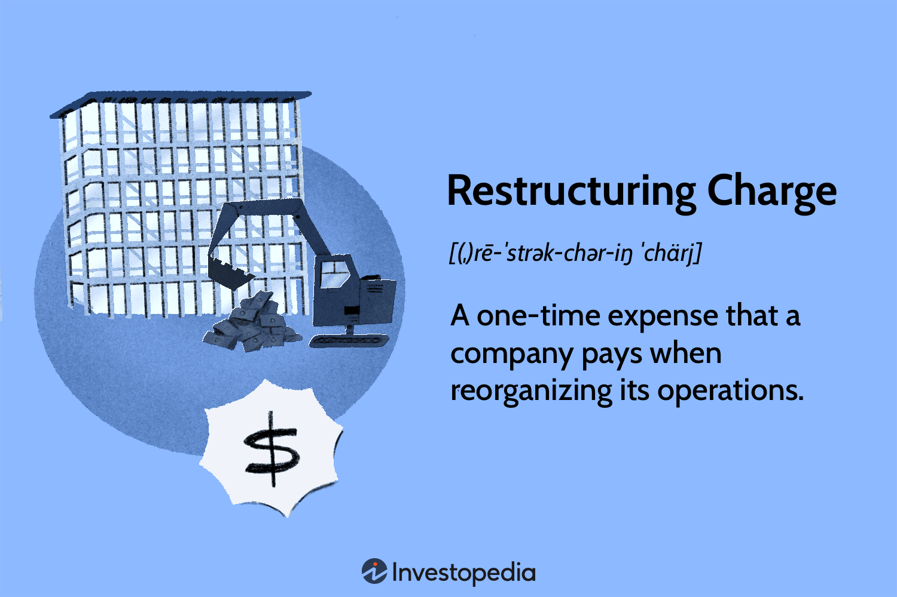

In today's fast-paced business environment, companies face constant pressure to adapt and evolve to maintain their competitive edge. Business restructuring has emerged as a strategic initiative aimed at enhancing a company's operational efficiency, financial health, and market adaptability. This strategic maneuver can involve a wide range of activities, including reorganizing a company's operations, altering its structural framework, or realigning its financial resources. 

Restructuring is not merely about trimming excess or optimizing resources; it is also about positioning the company to seize new opportunities in an ever-changing market landscape. As businesses navigate economic fluctuations, technological advancements, and global competition, restructuring becomes a tool to recalibrate and refocus their efforts toward sustainable growth and innovation.



This article explores the fundamental aspects of business restructuring, focusing on pivotal elements such as restructuring charges. These are costs incurred during the restructuring process, which may include expenses related to workforce reduction, facility closures, or operational realignments. Understanding how these charges influence a company's financial statements is vital for a comprehensive evaluation of financial health. 

Additionally, the article examines how restructuring charges can affect financial markets, providing insights into how investors and analysts interpret these events. The implications for algorithmic trading are also considered, highlighting how trading strategies might leverage restructuring signals to make more informed decisions. 

For investors, stakeholders, and financial analysts, a solid understanding of business restructuring processes and their financial implications is crucial. This knowledge enables stakeholders to assess the future potential of companies undergoing such changes and to make informed investment decisions.

## Table of Contents

## Understanding Business Restructuring

Business restructuring involves reorganizing a company's operations, structure, or finances to enhance its overall performance. Depending on the challenges faced by an organization, restructuring can take several forms, such as financial, operational, organizational, or legal restructuring.

### Financial Restructuring
Financial restructuring is often pursued when a company faces financial distress. This form of restructuring aims to improve the financial stability of a company by altering its capital structure. Common strategies include renegotiating debt terms, converting debt to equity, or issuing new equity to reduce debt loads. For instance, during financial restructuring, businesses might opt for strategies like debt refinancing or equity swaps to stabilize their financial standing.

### Operational Restructuring
Operational restructuring focuses on enhancing a company’s internal processes and operational efficiency. This might involve changing manufacturing processes, streamlining supply chains, or overhauling sales and marketing strategies. Operational changes are usually aimed at reducing costs, improving productivity, and enhancing service delivery. An example could involve adopting new technologies or methodologies to increase production efficiency.

### Organizational Restructuring
Organizational restructuring addresses the corporate hierarchy and management practices. This may include changes in leadership, altering the management structure, or merging departments to improve decision-making and communication within the company. It is often employed to overcome bureaucratic hurdles and to foster a more dynamic and responsive organizational culture.

### Legal Restructuring
Legal restructuring involves modifying the legal framework within which a company operates. This can include actions such as registering a business in different jurisdictions, changing corporate governance structures, or even legal mergers and acquisitions. Legal restructuring is sometimes necessary to comply with regulatory requirements or to leverage tax benefits in different regions.

The overarching goal of business restructuring is to improve a company’s efficiency and profitability while addressing any financial difficulties it may be facing. Each type of restructuring has specific objectives and impacts on the company, and understanding these nuances is essential for effective implementation and for maximizing the strategic benefits of the restructuring process.

## What Are Restructuring Charges?

Restructuring charges are financial expenses that companies incur when undergoing significant changes in their organizational structure, operations, or financial arrangements. These charges are typically one-time expenses, reflecting the costs associated with the restructuring activities. Common examples include expenses related to laying off employees, shutting down production facilities, or moving business operations to different locations. 

The purpose of restructuring charges is to achieve long-term improvements in efficiency and profitability, even though they may cause short-term financial setbacks. These expenses are strategically incurred to streamline operations, reduce costs, and align the company's resources with its revised business objectives.

It's crucial to differentiate restructuring charges from ongoing operational expenses. While operational expenses are recurring costs related to the day-to-day functioning of the business, restructuring charges are nonrecurring and specifically related to the efforts aimed at restructuring. This distinction is significant for financial analysis as it affects how these costs are interpreted when evaluating the overall financial health and performance of a company. 

By recognizing restructuring charges as distinct financial line items, stakeholders can better understand the temporary impact on the company's earnings and appreciate the potential for future financial benefits that these restructuring efforts are designed to deliver.

## Accounting for Restructuring Charges

In financial statements, restructuring charges are reported as nonrecurring operating expenses. This categorization separates these charges from regular operating expenses, reflecting their one-time nature. When reported on the income statement, restructuring charges directly impact net income, reducing reported profits. For example, the basic formula affected by restructuring charges is:

$$
\text{Net Income} = \text{Total Revenue} - (\text{Operating Expenses} + \text{Restructuring Charges}) - \text{Taxes}
$$

The recognition of restructuring charges involves adhering to specific accounting standards, such as the Generally Accepted Accounting Principles (GAAP) or International Financial Reporting Standards (IFRS). Both frameworks require that these charges be recognized only when a company has a formal plan for restructuring and is committed to its execution. This ensures that the charges are not manipulated to smooth income or deceive stakeholders about a company’s financial performance.

Analyzing restructuring charges offers insights into a company's financial health. High restructuring charges may indicate underlying issues, such as operational inefficiencies or strategic misalignments, prompting the need for significant organizational changes. However, when used sensibly, restructuring can lead to long-term benefits by eliminating redundancies and optimizing the business model.

Creative accounting practices related to restructuring charges can obscure the true financial picture of a company. These practices may involve timing the recognition of charges or shifting them to different periods to artificially enhance financial results. Investors and analysts should remain vigilant of such methods by examining changes in accounting policies or significant deviations in financial statement trends over time.

Understanding the accounting treatment and implications of restructuring charges aids in forming a comprehensive view of a company's financial health. Stakeholders benefit from discerning the motivations behind restructuring, discerning whether they stem from necessary adaptations or more concerning strategic failures.

## Restructuring Charges and Financial Market Implications

Investors and analysts frequently evaluate restructuring charges to gauge a company's future prospects. These one-time expenses, arising from activities like layoffs or facility closures, often reflect a strategic investment in future growth rather than just an immediate cost burden. Although they typically result in short-term financial drawbacks by reducing net income, the overarching objective of restructuring is to enhance long-term profitability and operational efficiency.

The market closely observes these charges due to their potential impact on stock prices. A restructuring announcement may initially create uncertainty and lead to stock [volatility](/wiki/volatility-trading-strategies). However, if stakeholders perceive the restructuring as a strategic move to overcome financial obstacles and position the company for future success, the market may eventually react positively. This reaction is often observed when companies effectively communicate the long-term benefits of restructuring, leading to an eventual uptick in stock valuations.

Moreover, restructuring initiatives signal a company's proactive approach to adapting to market dynamics, which can play a critical role in investment decisions. For financial analysts, understanding the nuances and implications of restructuring charges helps them provide more accurate assessments of a company's future performance. Investors must discern between necessary restructuring for growth and situations where such actions may not yield significant future returns.

In conclusion, restructuring charges are pivotal in shaping market perceptions and investor confidence. While they may pose short-term financial challenges, the ultimate purpose is to achieve sustainable growth and increased shareholder value. These implications underscore the importance for market participants to interpret restructuring activities beyond their immediate financial impact, considering the long-term strategic vision they represent.

## Algorithmic Trading and Restructuring

Algorithmic trading is a sophisticated method of executing trades using computer algorithms to follow predetermined rules. This approach benefits significantly from restructuring events, as these events often lead to changes in stock volatility, which can be exploited for profit. Stock volatility typically rises during restructuring as investors react to announcements, potential layoffs, asset write-downs, or strategic redirection. For algorithmic traders, the ability to rapidly process and react to such market conditions is crucial to capitalizing on these opportunities. 

To leverage restructuring events effectively, traders need an algorithm that can interpret restructuring signals and make informed trading decisions. For instance, algorithms might take into account historical data on similar restructuring events, analyzing patterns such as initial stock depreciation followed by gradual recovery. This allows the creation of trading strategies that anticipate movements in stock prices based on restructuring announcements. 

Understanding restructuring dynamics requires analyzing various indicators, such as changes in a company’s fundamentals, management commentary, or shifts in market sentiment. Algorithms can utilize these indicators by incorporating [machine learning](/wiki/machine-learning) techniques to adapt and refine trading strategies over time. By continuously learning from new data, these algorithms can improve their predictive capabilities, identifying profitable trading signals amid the noise of market fluctuations. 

Python, often used for developing trading algorithms due to its simplicity and rich ecosystem of libraries, allows traders to build and test strategies using sophisticated modeling techniques. Below is a simple Python code snippet illustrating how traders might use a machine learning model to predict stock price movements based on historical restructuring event data:

```python
import pandas as pd
from sklearn.model_selection import train_test_split
from sklearn.ensemble import RandomForestClassifier
from sklearn.metrics import accuracy_score

# Load historical data on restructuring events and stock price movements
data = pd.read_csv('restructuring_data.csv')

# Features might include event type, market sentiment, and stock volatility
features = data[['event_type', 'sentiment_score', 'volatility']]
target = data['price_movement']

# Split data into training and testing sets
X_train, X_test, y_train, y_test = train_test_split(features, target, test_size=0.3)

# Initialize and train a Random Forest classifier
model = RandomForestClassifier(n_estimators=100)
model.fit(X_train, y_train)

# Predict stock price movements for the test set
predictions = model.predict(X_test)

# Evaluate the model's accuracy
accuracy = accuracy_score(y_test, predictions)
print(f'Model Accuracy: {accuracy * 100:.2f}%')

```

This code demonstrates using a Random Forest classifier to model stock movements influenced by restructuring. By training on historical event data, the model can predict future price actions, offering a competitive edge in strategic trading. Ultimately, integrating restructuring insights with [algorithmic trading](/wiki/algorithmic-trading) has the potential to yield advantageous trading decisions, enhancing profitability and market responsiveness.

## Case Studies of Successful Restructuring

Several renowned companies have effectively leveraged restructuring to revitalize their operations and maintain competitive edges. Examining these cases provides valuable insights into successful approaches and strategies. Notable examples include General Motors, IBM, and AT&T, each of which navigated restructuring to address distinct challenges and capitalize on market opportunities.

**General Motors (GM)**

General Motors faced significant hurdles during the 2008-2009 financial crisis, leading to a government-managed bankruptcy and restructuring process. GM's restructuring strategy involved a considerable reduction in operational costs, closing unprofitable brands like Pontiac, Saturn, and Hummer, and streamlining its operations. The restructuring allowed the company to renegotiate labor contracts and reduce debt, ultimately emerging as a leaner organization. GM's focus turned toward developing more energy-efficient vehicles, aligning with shifting consumer preferences and regulatory requirements. This restructuring was pivotal in GM regaining profitability and market share post-crisis [https://www.mlive.com](https://www.mlive.com/business/2008/12/the_general_motors_young.html).

**IBM**

IBM's restructuring journey shifted the company from hardware-centric operations to a focus on software, consulting, and cloud computing. In the early 1990s, IBM faced declining revenues due to a changing technology landscape. Under CEO Louis Gerstner, IBM restructured by downsizing its workforce and selling off certain hardware divisions. The company invested heavily in high-margin businesses, resulting in a strategic shift that set the stage for its transformation. This restructuring allowed IBM to diversify its revenue streams and better withstand market fluctuations. The company's strategic emphasis on services and software paved the way for sustained growth [https://archive.fortune.com](https://archive.fortune.com/magazines/fortune/fortune_archive/1999/02/01/255508/index.htm).

**AT&T**

AT&T has restructured multiple times to remain relevant in the rapidly evolving telecommunications sector. One notable example is the acquisition and subsequent spin-off of Time Warner. In 2015, AT&T acquired Time Warner to diversify its offerings and compete with digital streaming giants. However, recognizing the shift towards direct-to-consumer models, AT&T decided to spin off WarnerMedia in 2021 and merge it with Discovery, Inc. This strategic move aimed to refocus AT&T on its core telecommunications operations, reduce debt, and create a stand-alone media entity positioned for growth in streaming. The restructuring allowed AT&T to streamline operations and adapt to transforming industry dynamics [https://www.wsj.com](https://www.wsj.com/articles/at-t-tv-pullback-speed-up-wireless-push-restructuring-11621128081).

These case studies highlight the importance of strategic restructuring in responding to market challenges and opportunities. Each company's unique approach underscores the necessity of alignment with market needs and consumer trends, demonstrating effective restructuring as a catalyst for long-term success.

## Conclusion

Business restructuring, although often rigorous, is a critical strategy for establishing enduring organizational success. A firm grasp of the financial implications tied to restructuring activities and their accounting is essential for stakeholders, including investors, management, and financial analysts. Restructuring charges, while initially detrimental to financial statements, are primarily envisioned to facilitate long-term gains and improved fiscal health. Correctly interpreting and recording these charges helps stakeholders gauge a company's genuine financial standing, beyond the immediate one-time expenses.

The intersection of restructuring strategies and algorithmic trading offers significant opportunities for optimization in trading models. Algorithmic traders can leverage insights from restructuring events to anticipate market behaviors and adjust their algorithms accordingly. Given that restructuring often results in fluctuations in asset prices and increased volatility, it presents a profitable landscape for those with adept algorithmic frameworks. Traders may, for instance, develop algorithms capable of detecting restructuring signals from financial disclosures and news to inform market entry or [exit](/wiki/exit-strategy) decisions.

Ultimately, when executed successfully, restructuring can empower organizations to surmount complex market challenges and evolve with changing industry landscapes. This adaptability not only safeguards a company’s viability but also positions it for competitive advantage and growth. Companies like General Motors, IBM, and AT&T exemplify how strategic restructuring can lead to revitalization and enhanced market performance. Such transformations underline the potential benefits of constantly reconfiguring operational and financial frameworks to align with prevailing and anticipated market conditions.

## References & Further Reading

[1]: Donaldson, G., & Lorsch, J. W. (1983). ["Decision Making at the Top: The Shaping of Strategic Direction."](https://archive.org/details/decisionmakingat00dona) Basic Books.

[2]: Gaughan, P. A. (2015). ["Mergers, Acquisitions, and Corporate Restructurings."](https://onlinelibrary.wiley.com/doi/book/10.1002/9781119380771) Wiley.

[3]: ["General Motors restructuring: What it means for GM -- and taxpayers."](https://en.wikipedia.org/wiki/Saint-Denis,_Seine-Saint-Denis) MLive.com.

[4]: ["How Louis Gerstner Rescued IBM in The 1990s."](https://www.britannica.com/money/Lou-Gerstner) Fortune.com.

[5]: ["AT&T’s TV Pullback to Speed Up Wireless Push in Overhaul."](https://www.wsj.com/articles/at-t-tv-pullback-speed-up-wireless-push-restructuring-11621128081) The Wall Street Journal.

[6]: Lopez de Prado, M. (2018). ["Advances in Financial Machine Learning."](https://www.amazon.com/Advances-Financial-Machine-Learning-Marcos/dp/1119482089) Wiley.

[7]: Aronson, D. (2006). ["Evidence-Based Technical Analysis: Applying the Scientific Method and Statistical Inference to Trading Signals."](https://www.amazon.com/Evidence-Based-Technical-Analysis-Scientific-Statistical/dp/0470008741) Wiley.

[8]: Chan, E. (2009). ["Quantitative Trading: How to Build Your Own Algorithmic Trading Business."](https://github.com/ftvision/quant_trading_echan_book) Wiley.

[9]: Jansen, S. (2020). ["Machine Learning for Algorithmic Trading: Predictive models to extract signals from market and alternative data for systematic trading strategies in Python."](https://www.amazon.com/Machine-Learning-Algorithmic-Trading-alternative/dp/1839217715) Packt Publishing.