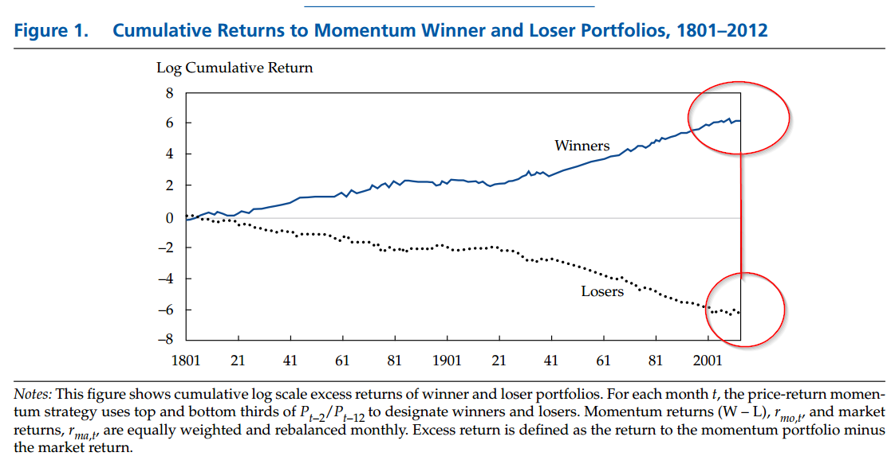

## Table of Contents

## What is momentum investing?

Momentum investing is a strategy where you buy stocks or other investments that have been going up in price and sell those that have been going down. The idea is that if a stock has been doing well, it will likely keep doing well for a while, and if it's been doing poorly, it will likely keep doing poorly. This approach is based on the belief that trends in the market can persist over time.

People who use momentum investing look at how prices have changed over the last few months to a year to decide what to buy or sell. They often use technical analysis, which means looking at charts and patterns, rather than focusing on the company's fundamentals like earnings or growth potential. While momentum investing can lead to big gains if you catch the right trend, it can also be risky because trends can change quickly, and you might end up buying high and selling low if you're not careful.

## How does momentum investing differ from other investment strategies?

Momentum investing is different from other investment strategies because it focuses on the recent price trends of stocks or other investments. Instead of looking at a company's financial health or future growth, momentum investors only care about whether the stock's price has been going up or down lately. They believe that if a stock has been going up, it will keep going up for a while, so they buy it. If it's been going down, they think it will keep going down, so they sell it or avoid it. This is different from strategies like value investing, where investors look for stocks that seem cheap compared to what the company is worth.

Other strategies, like growth investing, focus on companies expected to grow a lot in the future, even if their stock price is already high. Growth investors look at things like earnings growth and new products to decide what to buy. In contrast, [momentum](/wiki/momentum) investors don't care about these details; they just follow the price trend. Another strategy is income investing, where people buy stocks or bonds that pay high dividends or interest. Momentum investing doesn't care about dividends or income; it's all about the price movement. Each strategy has its own risks and rewards, and what works best can depend on the market conditions and the investor's goals.

## What are the basic principles behind momentum investing?

Momentum investing is all about following the trend. The basic idea is that if a stock's price has been going up, it will probably keep going up for a while. So, momentum investors buy stocks that have been doing well recently. They think that other investors will keep buying these stocks, which will push the price even higher. On the flip side, if a stock's price has been going down, momentum investors believe it will keep going down. They sell these stocks or avoid buying them, expecting the price to keep dropping.

The key to momentum investing is to look at how prices have changed over the last few months to a year. Momentum investors use charts and other tools to spot trends. They don't care about a company's profits or how much it might grow in the future. All that matters is the price movement. This strategy can make money if you catch the right trend, but it's risky because trends can change quickly. If you buy a stock just before its trend reverses, you could lose money.

## Can you explain the concept of momentum in financial markets?

Momentum in financial markets means that if the price of a stock or another investment has been going up, it is likely to keep going up for a while. It's like when you push a ball down a hill, and it keeps rolling because it has momentum. In the same way, if lots of people are buying a stock, its price goes up, and more people might want to buy it because they see the price going up. This can create a trend where the price keeps moving in the same direction for some time.

On the other hand, if a stock's price has been going down, it might keep going down. People see the price dropping and might sell their shares or avoid buying, which makes the price drop even more. This is the opposite kind of momentum. Momentum investors try to make money by buying stocks that are going up and selling or avoiding stocks that are going down, hoping to ride the trend as long as it lasts. But it's risky because trends can change suddenly, and if you're not careful, you might buy high and sell low.

## What historical evidence supports the effectiveness of momentum investing?

There is a lot of historical evidence that shows momentum investing can work well. One famous study by Jegadeesh and Titman in the 1990s looked at stock returns in the U.S. from 1965 to 1989. They found that stocks that had done well over the last 3 to 12 months tended to keep doing well over the next few months. This means that if you bought stocks that were going up, you could make more money than if you just picked stocks randomly. This study, and others like it, helped show that momentum is a real thing in the stock market.

Even though momentum investing can be good, it's not perfect and can be risky. For example, during big market crashes, like in 2008, momentum strategies can lose a lot of money quickly. But over long periods, many studies have shown that momentum investing can beat the market. A study by Asness, Moskowitz, and Pedersen in 2013 looked at momentum in many different countries and asset classes, not just stocks, and found that it worked pretty much everywhere. This suggests that momentum is a strong force in financial markets, even if it's not always easy to use.

## How do investors identify stocks with momentum?

Investors identify stocks with momentum by looking at how the stock's price has changed over the last few months to a year. They use charts and other tools to see if the stock has been going up or down. If a stock's price has been going up, that's a sign of positive momentum, and they might want to buy it. If the price has been going down, that's negative momentum, and they might want to sell it or avoid it. They don't care about the company's earnings or other details; they just focus on the price trend.

To find stocks with momentum, investors often use something called a "momentum score." This score is calculated by looking at how much the stock's price has changed over a certain period, like the last 6 or 12 months. Stocks with the highest positive momentum scores are the ones that have gone up the most, and these are the ones momentum investors might want to buy. It's a simple way to spot trends and decide which stocks to invest in, but it can be risky because trends can change quickly.

## What are the common metrics used to measure momentum in stocks?

The most common way to measure momentum in stocks is by looking at the price change over a certain period of time, like the last 6 or 12 months. Investors use something called a "momentum score" to figure this out. The momentum score is calculated by seeing how much the stock's price has gone up or down during that time. Stocks with the highest positive momentum scores are the ones that have gone up the most, and these are the ones momentum investors might want to buy.

Another common metric is the rate of change (ROC), which shows how fast the stock's price is moving. If the ROC is high and positive, it means the stock's price is going up quickly, which is a good sign for momentum investors. On the other hand, if the ROC is high and negative, it means the price is dropping fast, and momentum investors might want to sell or avoid that stock. Both of these metrics help investors spot trends and decide which stocks to invest in based on their recent performance.

## What are the potential risks associated with momentum investing?

Momentum investing can be risky because trends can change quickly. If you buy a stock just before its trend reverses, you could lose money. For example, if everyone is buying a stock and pushing its price up, but then suddenly they all start selling, the price can drop fast. This means you might buy high and then have to sell low, which is the opposite of what you want to do when investing. Another risk is that momentum investing can lead to big swings in your portfolio. If you're always chasing the latest trend, your investments can go up and down a lot, which can be stressful and risky.

Another problem with momentum investing is that it can be hard to know when to sell. If you're riding a trend, it's tough to decide when it's time to get off. You might hold onto a stock too long, hoping it will keep going up, but then it could suddenly drop. Also, momentum investing doesn't look at a company's financial health or future growth. This means you might be investing in a stock that's doing well right now but has problems that could hurt it later. So, while momentum investing can work, it's important to be careful and understand the risks.

## How can momentum investing be integrated into a diversified investment portfolio?

Momentum investing can be a part of a bigger investment plan by adding it to a mix of different types of investments. This way, you don't put all your money into just one kind of strategy. For example, you might have some money in stocks that are doing well right now (momentum investing), but also some in stocks that seem like a good deal (value investing), and some in safe investments like bonds. By spreading your money around, you can lower the risk that comes with chasing trends. If the momentum strategy doesn't work out, the other parts of your portfolio can help balance things out.

When you're adding momentum investing to your portfolio, it's important to keep an eye on how much of your money is in this strategy. You might decide to put, say, 20% of your portfolio into momentum stocks, and the rest in other types of investments. This way, if the market changes suddenly and your momentum stocks drop, the rest of your investments can help protect your money. It's also a good idea to check your portfolio regularly and make changes if needed, to make sure it still fits with your goals and how much risk you're okay with taking.

## What advanced techniques can be used to enhance momentum investing strategies?

One advanced technique to make momentum investing better is to use something called "relative strength." This means you compare how a stock is doing to how the whole market or other stocks in the same group are doing. If a stock is going up faster than the market, it might be a good one to buy. This can help you find the best momentum stocks and avoid ones that might not keep going up. Another way to improve momentum investing is to use "sector rotation." This means you look at which parts of the market, like technology or health care, are doing well and focus on buying stocks in those areas. By doing this, you can catch bigger trends and maybe make more money.

Another advanced technique is to use "stop-loss orders." These are like safety nets that automatically sell your stock if it drops to a certain price. This can help you avoid big losses if a trend suddenly changes. You can also use "trailing stop orders," which move up as the stock's price goes up, so you can lock in some of your gains while still letting the stock keep going up. Lastly, combining momentum investing with other strategies, like value investing, can make your overall plan stronger. For example, you might buy stocks that have good momentum and also seem like a good deal based on their price compared to what the company is worth. This can help you find stocks that are likely to keep going up and also have solid reasons to do well in the long run.

## How has the performance of momentum investing varied across different market cycles?

Momentum investing can work well in some market cycles but not so well in others. When the market is going up and there are lots of trends, momentum investing can make a lot of money. People see stocks going up and want to buy them too, which can make the prices go even higher. This happened a lot in the late 1990s during the tech boom, where stocks kept going up and up. But momentum investing can be risky when the market changes suddenly. If everyone starts selling at the same time, like during a big market crash, momentum stocks can drop a lot, and you might lose money quickly.

In times when the market is going sideways or not moving much, momentum investing can be harder. There might not be clear trends to follow, so it's harder to pick the right stocks. But even in these times, some parts of the market might still be moving, and good momentum investors can find those trends and make money. Over the long run, studies have shown that momentum investing can beat the market, but it's not always easy. It's important to be ready for the ups and downs and to use other strategies along with momentum investing to keep your money safe.

## What are the current trends and future outlook for momentum investing?

Momentum investing is still popular today, and many investors use it to try to make money by following the latest trends in the stock market. One big trend right now is the use of technology and data to make momentum investing better. People are using computers and special software to find stocks with the best momentum quickly. They look at lots of data to see which stocks are going up and might keep going up. Another trend is that more investors are combining momentum investing with other strategies, like value investing, to make their overall plan stronger. This way, they can catch the trends but also have a backup plan if things change.

Looking to the future, momentum investing is likely to keep being important, but it might change a bit. As more data and better technology become available, momentum investors might be able to spot trends even faster and make better choices. But the market can be tricky, and trends can change quickly, so it's important to stay careful. The future might also bring new ways to mix momentum investing with other strategies, making it easier for investors to balance the risks and rewards. Overall, momentum investing will probably keep being a part of many investors' plans, but it will need to adapt to the changing market and new technology.

## What are the Principles of Algorithmic Trading?

Algorithmic trading, often referred to as algo trading, involves the use of computer programs and algorithms to execute trading decisions and transactions in financial markets. These algorithms are designed to follow a set of predetermined criteria that can include timing, price, or quantity, often bypassing human intervention. The automation of trading through algorithms enhances trade efficiency by executing orders at speeds and frequencies that a human trader cannot achieve. This capacity inherently reduces the impact of human biases and emotions on trading decisions, underpinning its compatibility with momentum investing strategies.

Fundamentally, [algorithmic trading](/wiki/algorithmic-trading) leverages a variety of technical indicators and market parameters to identify profitable trading opportunities. These indicators often include moving averages, momentum indicators like the Relative Strength Index (RSI), and [volume](/wiki/volume-trading-strategy) metrics. Algorithms can process historical data rapidly, allowing for real-time decision-making. For example, the Exponential Moving Average (EMA), computed as:

$$
\text{EMA}_{\text{current}} = \left( \frac{2}{n+1} \right) \times \left( \text{Price}_{\text{current}} - \text{EMA}_{\text{previous}} \right) + \text{EMA}_{\text{previous}}
$$

where $n$ is the number of days in the average, helps in smoothing price data to identify trends more clearly.

Furthermore, sophisticated algorithms integrate complex mathematical models and statistical analyses to predict market movements and execute trades with precision. The widespread adoption of Python, with libraries such as NumPy for numerical computing and Pandas for data manipulation, facilitates the development of these algorithms. Here is a basic Python example of calculating a moving average, a staple in algorithmic trading:

```python
import pandas as pd

# Assume df is a DataFrame containing stock prices with a 'Close' column
def calculate_moving_average(df, window_size):
    return df['Close'].rolling(window=window_size).mean()

# Example usage with a window size of 14 days
moving_average = calculate_moving_average(df, 14)
```

In momentum investing, these algorithms exploit the principle that securities which have performed well in the past will continue performing well in the near term, and vice versa for poorly performing securities. By automating the trading process, algorithms can quickly capitalize on these trends before they reverse. The ability to process vast amounts of data almost instantaneously allows algorithmic traders to identify and react to patterns and opportunities that may not be visible to the naked eye, thus optimizing trade execution.

However, the complexity and rapid pace of algo trading mean that constant monitoring and modifications to the strategies are necessary to maintain optimal performance and adapt to volatile market conditions. As such, algorithmic trading not only amplifies the potential efficiency gains in momentum investing but also requires sophisticated risk management techniques to safeguard against market anomalies and potential algorithmic errors.

## References & Further Reading

[1]: Jegadeesh, N., & Titman, S. (1993). ["Returns to Buying Winners and Selling Losers: Implications for Stock Market Efficiency."](https://www.jstor.org/stable/2328882) *The Journal of Finance*, 48(1), 65-91.

[2]: Hendershott, T., & Riordan, R. (2013). ["Algorithmic Trading and the Market for Liquidity."](https://www.jstor.org/stable/43303831) *Journal of Financial and Quantitative Analysis*, 48(4), 1001-1024.

[3]: ["Advances in Financial Machine Learning"](https://www.amazon.com/Advances-Financial-Machine-Learning-Marcos/dp/1119482089) by Marcos Lopez de Prado

[4]: ["Evidence-Based Technical Analysis: Applying the Scientific Method and Statistical Inference to Trading Signals"](https://www.amazon.com/Evidence-Based-Technical-Analysis-Scientific-Statistical/dp/0470008741) by David Aronson

[5]: ["Machine Learning for Algorithmic Trading"](https://github.com/stefan-jansen/machine-learning-for-trading) by Stefan Jansen

[6]: ["Quantitative Trading: How to Build Your Own Algorithmic Trading Business"](https://github.com/LucindaYa/quant-resources/blob/master/Quantitative%20Trading%20How%20to%20Build%20Your%20Own%20Algorithmic%20Trading%20Business.pdf) by Ernest P. Chan