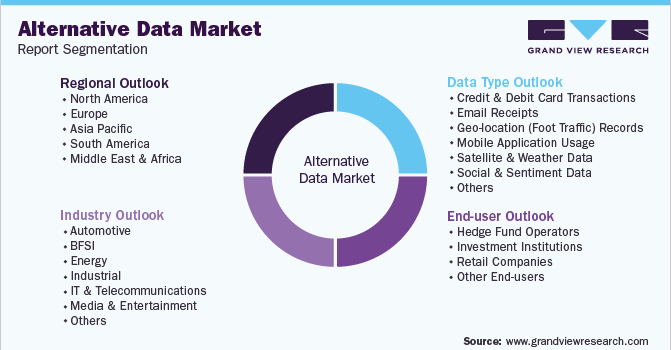

## Table of Contents

## What is retail alternative data?

Retail alternative data refers to information that businesses collect from sources outside of traditional financial statements and reports. This data can include things like credit card transactions, store foot traffic, online search trends, and social media activity. Companies use this data to get a better understanding of consumer behavior and market trends, which helps them make smarter decisions.

For example, a retailer might use alternative data to see how many people are visiting their stores compared to their competitors. They can also look at what people are searching for online to predict what products will be popular in the future. This kind of information helps businesses stay ahead of the competition and better meet the needs of their customers.

## How does retail alternative data differ from traditional data?

Retail alternative data is different from traditional data because it comes from new and unusual places. Traditional data usually includes things like sales numbers, financial reports, and customer surveys. This kind of data is important, but it only tells part of the story. Alternative data, on the other hand, can include information from credit card transactions, how many people visit a store, what people are searching for online, and what they are saying on social media. This gives businesses a more complete picture of what is happening in the market.

The main difference is that alternative data can help businesses see trends and changes more quickly than traditional data. For example, if a lot of people start searching for a certain type of product online, a company can use that information to stock up on that product before it becomes popular. Traditional data might not show this trend until after the product is already popular, which could mean missing out on sales. By using alternative data, companies can make faster and smarter decisions to stay ahead of the competition.

## What are the common sources of retail alternative data?

Retail alternative data comes from many different places. One common source is credit card transaction data. This data shows what people are buying, where they are buying it, and how much they are spending. Another source is store foot traffic data, which tracks how many people visit a store and how long they stay. This can help businesses understand how popular their stores are compared to their competitors.

Another important source of alternative data is online search trends. By looking at what people are searching for on the internet, companies can predict what products will be popular in the future. Social media is also a big source of data. People often share what they like and don't like on social media, which can give businesses a lot of information about what their customers want. 

These different sources of data help businesses see the big picture. They can use this information to make better decisions about what products to sell, how to market them, and how to improve their stores. By using alternative data, companies can stay ahead of the competition and meet the needs of their customers more effectively.

## How can retail alternative data be used to improve business decisions?

Retail alternative data helps businesses make better decisions by giving them a clearer picture of what customers want and what is happening in the market. For example, by looking at credit card transaction data, a company can see what products are selling well and where people are buying them. This helps them decide which products to stock more of and where to open new stores. Store foot traffic data can also show how popular a store is compared to competitors, helping businesses figure out where to focus their efforts to attract more customers.

Another way alternative data improves business decisions is by helping companies predict future trends. By looking at what people are searching for online, businesses can see what products might become popular before they actually do. This gives them a head start in stocking up on those products and marketing them to customers. Social media data also plays a big role, as it shows what customers like and don't like in real time. This immediate feedback allows businesses to quickly adjust their strategies to meet customer needs and stay ahead of the competition.

## What are the ethical considerations when using retail alternative data?

When businesses use retail alternative data, they need to think about privacy. This data often comes from people's credit card transactions, where they go, and what they do online. It's important for companies to make sure they are not using this information in a way that could hurt or upset people. They should follow rules about data privacy and be clear with customers about what data they are collecting and why.

Another big ethical issue is fairness. Sometimes, alternative data can show things about people that they might not want others to know, like how much money they make or where they live. Businesses need to be careful not to use this data in a way that could treat people unfairly. They should use the data to help everyone, not just to make more money for themselves. By being honest and fair, companies can use alternative data in a way that is good for both them and their customers.

## How can businesses access retail alternative data?

Businesses can access retail alternative data by working with data providers. These are companies that collect and sell information from places like credit card companies, mobile apps, and social media platforms. For example, a business might buy data from a company that tracks how many people visit different stores. This helps them see how popular their stores are compared to others. They can also get data from online search engines to see what products people are looking for.

Another way to access alternative data is by using technology to collect it themselves. For example, a store might use cameras or sensors to count how many people come in and how long they stay. They can also use software to look at what people are saying about their products on social media. This kind of data can be very useful, but it takes time and money to set up the right systems. By using both outside data providers and their own technology, businesses can get a full picture of what is happening in the market.

## What are the challenges in collecting and analyzing retail alternative data?

Collecting and analyzing retail alternative data can be hard because there is so much of it. This data comes from many different places like credit card transactions, online searches, and social media posts. It can be a lot of work to gather all this information and make sure it is correct. Sometimes the data might have mistakes or be missing important details. Businesses need to spend time and money to set up good systems to handle all this data.

Another challenge is figuring out what the data means. Once businesses have all this information, they need to analyze it to find useful patterns and trends. This can be tricky because the data is often messy and comes in different forms. Companies might need special software and experts to help them make sense of it all. They also need to be careful to use the data in a way that is fair and respects people's privacy.

## Can you provide examples of successful uses of retail alternative data in retail?

One example of using retail alternative data well is when a big store looked at credit card data to see what people were buying. They saw that a lot of people were buying a new type of snack in certain areas. So, the store decided to put more of that snack in those stores, and their sales went up. This shows how looking at what people are already buying can help a store decide what to sell more of.

Another good example is when a clothing company used social media data to see what people liked. They saw that a lot of people were talking about bright colors and fun patterns. So, they made more clothes with those styles, and people bought them a lot. This helped the company stay popular and make more money by listening to what customers were saying online.

## How does retail alternative data integration affect existing data systems?

Adding retail alternative data to existing data systems can make them better but also more complicated. When a business starts using new kinds of data like credit card transactions or social media posts, they need to change their computer systems to handle this new information. This means they might need to buy new software or hire people who know how to work with this data. It can take time and money to make these changes, but it helps the business get a fuller picture of what is happening in the market.

Once the new data is added, the business can use it to make better decisions. For example, they might see that a lot of people are visiting a certain store or searching for a specific product online. This can help them decide where to open new stores or what products to sell more of. But it's important to make sure the new data works well with the old data. If the systems don't fit together right, it can be hard to understand what the data is saying. So, businesses need to plan carefully to make sure everything works together smoothly.

## What advanced analytical techniques are used to process retail alternative data?

When businesses want to understand retail alternative data, they often use a technique called machine learning. This is a way of teaching computers to find patterns in big piles of data. For example, a store might use machine learning to look at credit card data and see what products people are buying together. This can help them decide which products to put next to each other in the store. Machine learning can also help businesses predict what people will want to buy in the future by looking at what they are searching for online or talking about on social media.

Another important technique is data visualization. This means turning data into pictures or graphs so it's easier to understand. For example, a company might use a map to show where people are visiting their stores the most. Or they might use a chart to show how many people are searching for different products online. By looking at these pictures, businesses can see trends and make decisions more quickly. Both machine learning and data visualization help businesses make the most of the information they get from retail alternative data.

## How can retail alternative data be used for predictive analytics in retail?

Retail alternative data can help stores predict what will happen next by looking at what people are doing right now. For example, a store might use data from credit cards to see what people are buying. If they see that a lot of people are buying a certain type of snack, they can guess that more people will want to buy it in the future. They can then order more of that snack to have it ready for customers. This helps the store make sure they have the right products at the right time.

Another way to use retail alternative data for predicting the future is by looking at what people are searching for online. If a lot of people start searching for a new type of shoe, a store can predict that these shoes will be popular soon. They can then start selling these shoes before other stores do. By using data from the internet and social media, stores can stay ahead of trends and make sure they are meeting their customers' needs before their competitors do.

## What future trends are expected in the use of retail alternative data?

In the future, more and more stores will use retail alternative data to make smart decisions. They will use new technology like artificial intelligence to look at big piles of data from places like credit cards, online searches, and social media. This will help them see what people want to buy before other stores do. They can then order the right products and put them in the right places to make more money. Using this data will become a big part of how stores stay ahead of the competition.

Another trend is that stores will pay more attention to what people are doing on their phones and computers. They will use this information to make shopping easier and more fun for customers. For example, if a lot of people are looking at a certain product on their phones, the store might send them a special offer to buy it. This kind of personalized shopping will help stores make customers happy and keep them coming back. As technology gets better, stores will find even more ways to use retail alternative data to improve their business.

## What is the role of alternative data in algorithmic trading?

Algorithmic trading represents a sophisticated approach to executing trades, relying on computers to perform transactions based on pre-established criteria. The rise of big data analytics has led to the integration of diverse datasets within these trading systems. Among these, alternative data has emerged as a prominent component, offering new dimensions to traditional trading models. 

Alternative data provides supplementary information that enhances the overall predictive power of trading algorithms. These datasets can capture nuances in consumer behavior and market dynamics that are not necessarily reflected in conventional financial data. For example, in the retail sector, alternative data such as credit card transactions, social media sentiment, and foot traffic can reveal underlying patterns of consumer spending and preferences. This detailed information allows algorithmic models to refine their predictions and more accurately anticipate market movements.

Incorporating retail data into [algorithmic trading](/wiki/algorithmic-trading) frameworks facilitates more informed decision-making processes. By analyzing consumer trends in real-time, traders can adjust their strategies to reflect current market conditions, thus enhancing their ability to manage risks effectively. Furthermore, the combination of alternative data with algorithmic trading can lead to the identification of emerging market trends. This results from the data's capability to provide early signals of shifts in consumer behavior, which, when coupled with predictive models, can position traders advantageously in the market.

Algorithmically, the inclusion of alternative data can be modeled through enhanced [machine learning](/wiki/machine-learning) techniques. For example, when employing a linear regression model to predict stock prices, the equation can be modified to include alternative data variables:

$$
P = \beta_0 + \beta_1 X_1 + \beta_2 X_2 + \ldots + \beta_n X_n + \epsilon
$$

Here, $P$ represents the predicted stock price, $\beta_0$ is the intercept, $X_1, X_2, \ldots, X_n$ are the traditional and alternative data variables, $\beta_1, \beta_2, \ldots, \beta_n$ are the coefficients representing the impact of each variable, and $\epsilon$ is the error term. By integrating variables derived from retail alternative data, the model's capacity to anticipate fluctuations in the stock market can be significantly improved.

Python libraries such as pandas and scikit-learn facilitate the integration and analysis of these large datasets:

```python
import pandas as pd
from sklearn.linear_model import LinearRegression

# Load datasets
traditional_data = pd.read_csv('traditional_data.csv')
alternative_data = pd.read_csv('alternative_data.csv')

# Combine datasets
combined_data = pd.concat([traditional_data, alternative_data], axis=1)

# Define predictor variables and target
X = combined_data.drop('stock_price', axis=1)
y = combined_data['stock_price']

# Train linear regression model
model = LinearRegression()
model.fit(X, y)

# Predict stock prices
predictions = model.predict(X)
```

The strategic utilization of alternative data, particularly from the retail sector, empowers algorithmic trading by enhancing models' predictive accuracy, fostering informed decision-making, and enabling clearer risk management pathways. As technology and data analytics continue to advance, the integration of alternative data into algorithmic trading systems presents a valuable opportunity to gain a competitive advantage in the financial markets.

## References & Further Reading

[1]: Lopez de Prado, M. (2018). ["Advances in Financial Machine Learning."](https://www.amazon.com/Advances-Financial-Machine-Learning-Marcos/dp/1119482089) Wiley.

[2]: Chen, M. S., Han, J., & Yu, P. S. (1996). ["Data Mining: An Overview from a Database Perspective."](https://ieeexplore.ieee.org/abstract/document/553155) IEEE Transactions on Knowledge and Data Engineering, 8(6), 866-883.

[3]: Jansen, S. (2020). ["Machine Learning for Algorithmic Trading."](https://github.com/stefan-jansen/machine-learning-for-trading) Packt Publishing.

[4]: Cao, L. J., & Tay, F. E. H. (2003). ["Support vector machine with adaptive parameters in financial time series forecasting."](https://pubmed.ncbi.nlm.nih.gov/18244595/) IEEE Transactions on Neural Networks, 14(6), 1506-1518.

[5]: Derman, E. (2004). ["My Life as a Quant: Reflections on Physics and Finance."](https://emanuelderman.com/wp-content/uploads/2005/03/my-life.qf_.pdf) Wiley.