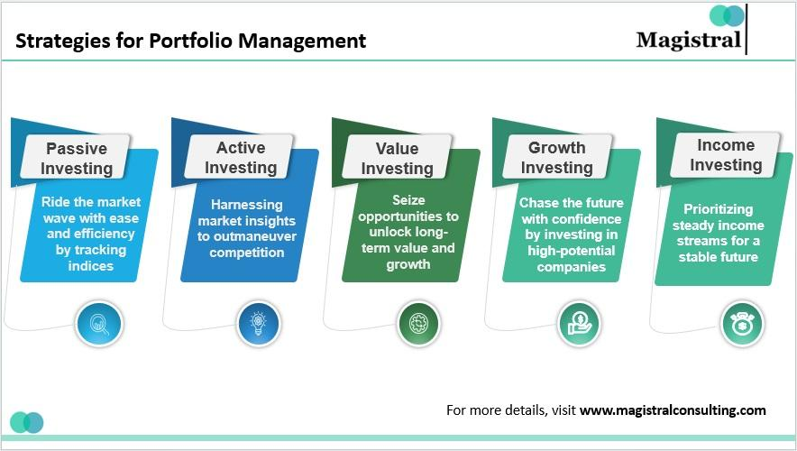

## Table of Contents

## What is a retail fund?

A retail fund is a type of investment fund that is available to the general public, not just big investors. These funds are designed for everyday people who want to invest their money but might not have a lot of it to start with. Retail funds often have lower minimum investment requirements, making it easier for regular folks to get started with investing.

These funds are managed by professionals who make decisions about where to invest the money. This can include stocks, bonds, or other types of investments. By pooling money from many investors, retail funds can offer a way to diversify investments, which means spreading out the risk. This can be a good option for people who want to grow their money over time but don't want to pick individual investments themselves.

## What are the main objectives of a retail fund?

The main goal of a retail fund is to help regular people grow their money. These funds are made for everyday investors who might not have a lot of money to start with. By pooling money from many people, retail funds can invest in a variety of things like stocks, bonds, and other assets. This helps to spread out the risk, which is good for people who want to invest but don't want to put all their money into just one thing.

Another important objective of retail funds is to make investing easy and accessible. They usually have lower minimum investment amounts, so more people can join in. Professional managers run these funds, so investors don't need to know a lot about investing themselves. The managers make the decisions about where to put the money, which can help investors feel more confident about their investments.

## Who typically invests in retail funds?

Retail funds are popular with everyday people who want to invest their money but might not have a lot to start with. These are regular folks who are looking for a way to grow their savings over time. They might be working people saving for retirement, young adults starting to invest, or anyone who wants to put their money into something that could earn more than a regular savings account.

These funds are also attractive to people who don't want to spend a lot of time learning about investing. Since retail funds are managed by professionals, investors can feel more comfortable knowing that experts are making the decisions. This makes retail funds a good choice for those who want to invest but don't want to pick individual stocks or bonds themselves.

## How do retail funds differ from other types of investment funds?

Retail funds are different from other types of investment funds mainly because they are made for everyday people. These funds have lower minimum investment amounts, so regular folks can start investing without needing a lot of money. They are also managed by professionals, which means people who invest in them don't need to know a lot about [picking](/wiki/asset-class-picking) stocks or bonds themselves. This makes retail funds a good choice for people who want to grow their money but don't want to spend a lot of time learning about investing.

On the other hand, other types of investment funds, like institutional funds or hedge funds, are often aimed at big investors like companies or very wealthy people. These funds usually have higher minimum investments and might use more complex strategies to try to make more money. They might also have different rules about who can invest in them, sometimes requiring investors to be accredited, which means they have to meet certain income or net worth standards. So, while retail funds are all about making investing easy and accessible for the average person, other funds are more focused on big investors and might use more advanced investment techniques.

## What are common investment strategies used by retail funds?

Retail funds often use a strategy called diversification. This means they spread the money they manage across different types of investments like stocks, bonds, and sometimes even real estate or commodities. By doing this, they try to reduce the risk for investors. If one investment does badly, the other investments might do well and balance things out. This approach is popular because it's less risky than putting all the money into just one thing.

Another common strategy is to focus on growth. Some retail funds aim to invest in companies that are expected to grow a lot in the future. These might be smaller companies or ones in industries that are doing really well. The idea is to buy these investments when they are cheaper and sell them later when they are worth more. This can be riskier than diversification but can also lead to bigger gains if the right companies are chosen.

Many retail funds also use a strategy called income investing. This means they look for investments that pay regular income, like dividends from stocks or interest from bonds. This can be a good choice for people who want a steady stream of money from their investments. It's often used by people who are retired or close to retirement and need their investments to help support them.

## How does risk management play a role in retail fund strategies?

Risk management is a big part of how retail funds work. These funds try to protect the money that people invest by spreading it out over different kinds of investments. This is called diversification. By not putting all the money into one thing, like just one company's stock, the fund can lower the chance that investors will lose a lot of money if one investment does badly. If one stock goes down, other investments might go up and help balance things out. This makes the overall risk smaller and can give investors more peace of mind.

Retail funds also use other ways to manage risk. For example, some funds might focus on investing in big, stable companies that have been around for a long time. These companies are less likely to have big ups and downs in their stock prices. Another way is to invest in bonds, which can be safer than stocks but still give some income. The fund managers keep an eye on the market and might change what the fund is invested in if they think it's too risky. This helps keep the fund safer and more likely to grow over time, even if it might not grow as fast as riskier investments.

## What are the fees associated with investing in retail funds?

When you invest in retail funds, you usually have to pay some fees. One common fee is called the management fee. This is what you pay the people who run the fund for their work in picking and managing the investments. Management fees are often a small percentage of the money you have in the fund, like 1% or less each year. Another fee you might see is the expense ratio, which includes the management fee and other costs of running the fund, like paying for office space or marketing. The expense ratio is also a percentage of your investment and can range from very low to a bit higher, depending on the fund.

There can also be other fees to watch out for. For example, some funds charge a sales load, which is a fee you pay when you buy or sell shares of the fund. This can be a one-time fee or a fee every time you make a transaction. Another fee to be aware of is the redemption fee, which you might have to pay if you take your money out of the fund within a certain time after investing. It's important to understand all these fees because they can add up and affect how much money you make from your investment over time.

## How can one evaluate the performance of a retail fund?

Evaluating the performance of a retail fund is important to see if it's a good investment. One way to do this is by looking at the fund's returns over time. You can compare these returns to a benchmark, which is like a standard that shows how well the market is doing. If the fund's returns are higher than the benchmark, it's doing well. You should also check the fund's performance over different time periods, like one year, three years, or five years, to get a full picture of how it's been doing.

Another thing to consider is the risk the fund takes to get those returns. A fund might have high returns, but if it's taking a lot of risks, it might not be the best choice for everyone. You can look at something called the standard deviation to see how much the fund's returns go up and down. A lower standard deviation means the fund is less risky. Also, check the fund's expense ratio, which is the cost of running the fund. Lower fees can mean more money in your pocket over time, so it's important to see if the fund's performance is worth the fees you're paying.

## What are the regulatory considerations for retail funds?

Retail funds have to follow rules set by government agencies to make sure they are safe for people to invest in. In the United States, the main agency that watches over these funds is the Securities and Exchange Commission (SEC). The SEC makes rules that retail funds must follow, like how they need to tell investors what they are investing in and how much they charge in fees. This helps keep things fair and transparent so investors know what they are getting into.

Another important rule for retail funds is that they need to register with the SEC. This means they have to give a lot of information about their investments, their managers, and their fees. The SEC checks this information to make sure the fund is doing things right. If a fund doesn't follow the rules, the SEC can take action, like fining the fund or stopping it from operating. This helps protect investors and keeps the investment world honest.

## How do retail funds adapt to market changes and economic cycles?

Retail funds have to change their strategies as the market and economy go through different cycles. When the economy is doing well and growing, fund managers might put more money into stocks, especially those of companies that are expected to grow a lot. This is because stocks usually do better when the economy is strong. But if the economy starts to slow down or go into a recession, fund managers might shift more money into safer investments like bonds. Bonds are less likely to lose value during tough economic times, so they can help protect the fund's money.

Fund managers also keep a close eye on what's happening in the market and make changes to the fund's investments as needed. For example, if a certain industry is doing really well, they might invest more in that area. If they see that a particular stock or bond is getting too risky, they might sell it and buy something safer. This way, they try to keep the fund's performance steady, no matter what's happening in the economy. By being flexible and adjusting their strategies, retail funds can try to do well in good times and protect investors' money in bad times.

## What advanced strategies might expert-managed retail funds employ?

Expert-managed retail funds might use something called tactical asset allocation. This means they change where they put the money based on what's happening in the market right now. For example, if they think stocks are going to do well soon, they might move more money into stocks. If they think the market is going to go down, they might move money into safer things like bonds. This can help the fund do better than just sticking to one plan all the time. It's like trying to guess what's going to happen next and making moves to take advantage of it.

Another strategy these funds might use is called sector rotation. This means they move money into different parts of the economy that are doing well at different times. For example, if technology companies are doing great, they might put more money into tech stocks. If healthcare is the next big thing, they might shift money there. By moving money around like this, the fund can try to be in the right place at the right time. It's all about trying to find the best spots to grow the fund's money, even when the economy is changing.

## How do global economic trends influence retail fund investment decisions?

Global economic trends can really change how retail funds decide to invest their money. When the world economy is doing well, like when countries are growing and people are spending more, retail funds might put more money into stocks, especially in places where the economy is booming. For example, if a lot of countries are doing well, the fund might invest in international stocks to take advantage of that growth. But if there's a big problem, like a global recession or a crisis in a big country, the fund might move money into safer things like bonds or cash to protect the investors' money. So, what's happening around the world can make a big difference in where the fund decides to invest.

Fund managers also pay attention to things like interest rates, inflation, and currency changes in different countries. If interest rates are going up in one country, that might make its bonds more attractive, so the fund might invest more there. If inflation is high somewhere, that could make the fund think twice about investing in that country's stocks or bonds because high inflation can hurt the value of money. And if one country's currency is getting stronger, that might make investments in that country more appealing. By keeping an eye on these global trends, fund managers try to make smart choices that help the fund grow and stay safe no matter what's happening in the world.

## References & Further Reading

[1]: Bergstra, J., Bardenet, R., Bengio, Y., & Kégl, B. (2011). ["Algorithms for Hyper-Parameter Optimization."](https://dl.acm.org/doi/10.5555/2986459.2986743) Advances in Neural Information Processing Systems 24.

[2]: ["Advances in Financial Machine Learning"](https://www.amazon.com/Advances-Financial-Machine-Learning-Marcos/dp/1119482089) by Marcos Lopez de Prado

[3]: ["Evidence-Based Technical Analysis: Applying the Scientific Method and Statistical Inference to Trading Signals"](https://www.amazon.com/Evidence-Based-Technical-Analysis-Scientific-Statistical/dp/0470008741) by David Aronson

[4]: ["Machine Learning for Algorithmic Trading"](https://github.com/stefan-jansen/machine-learning-for-trading) by Stefan Jansen

[5]: ["Quantitative Trading: How to Build Your Own Algorithmic Trading Business"](https://github.com/LucindaYa/quant-resources/blob/master/Quantitative%20Trading%20How%20to%20Build%20Your%20Own%20Algorithmic%20Trading%20Business.pdf) by Ernest P. Chan