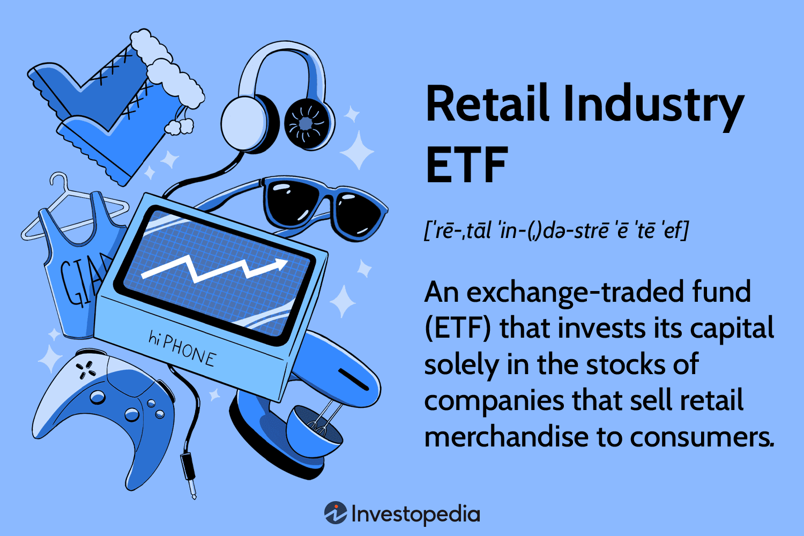

The retail industry is a fundamental component of the global economy, serving as a bridge between producers and consumers. It encompasses a wide array of businesses, from small local shops to large multinational corporations, that sell goods and services directly to consumers. Retail not only drives consumer spending, which is a significant contributor to Gross Domestic Product (GDP) in many countries, but it also fosters employment, innovation, and economic growth. The evolving landscape of retail, driven by factors such as digital transformation and changing consumer preferences, continues to shape economic trends worldwide.

Exchange-Traded Funds (ETFs) have emerged as a popular investment vehicle for both individual and institutional investors. ETFs are investment funds traded on stock exchanges, much like stocks, and they hold assets such as stocks, commodities, or bonds. The appeal of ETFs lies in their flexibility, liquidity, and ability to provide diversification at a relatively low cost. As they replicate the performance of indices or sectors, including the retail industry, ETFs allow investors to gain exposure to broad market segments without the need to buy individual securities.



Algorithmic trading, which involves using computer algorithms to automatically execute trading decisions, has increasingly influenced investment strategies. This form of trading leverages technology to manage portfolios by executing orders at optimal times, based on predefined criteria. Algorithms can process vast amounts of data rapidly, incorporating real-time market conditions and historical trends to enhance decision-making processes. With benefits such as increased speed, accuracy, and cost-effectiveness, algorithmic trading is transforming how investors interact with markets.

The purpose of this article is to explore the intersection of the retail industry, ETFs, and algorithmic trading. By examining how these three dynamic areas converge, we aim to provide insights into innovative investment strategies that leverage the strengths of each sector. As technology continues to evolve, understanding these intersections will be crucial for investors looking to capitalize on emerging opportunities within the global economy.

## Table of Contents

## Understanding the Retail Industry

The retail industry, a vital component of the global economy, encompasses businesses that sell goods and services directly to consumers. Key components of this sector include traditional brick-and-mortar stores, online retailers, and hybrid models that incorporate both physical and digital shopping experiences. The retail landscape is diverse, with sub-segments such as apparel, electronics, groceries, and luxury goods, each catering to different consumer needs and preferences.

One of the most significant trends affecting the retail industry is e-commerce's rapid growth. Online shopping platforms have transformed consumer behavior, shifting the focus from physical store visits to digital purchasing. According to eMarketer, global e-commerce sales accounted for approximately 21.3% of total retail sales in 2023, a figure forecasted to rise in the coming years. Factors driving this shift include the convenience of online shopping, wide product availability, and competitive pricing.

Changes in consumer behavior, influenced by technological advancements and socio-economic factors, also play a critical role. Consumers are increasingly seeking personalized experiences, expecting retailers to provide tailored recommendations and services. Moreover, sustainability considerations are becoming more prominent, prompting retailers to adopt environmentally friendly practices and transparent supply chains. The use of data analytics and [artificial intelligence](/wiki/ai-artificial-intelligence) enables retailers to gain insights into consumer preferences and improve customer engagement.

Despite these advancements, the retail industry faces several challenges. The omnipresence of e-commerce giants presents intense competition for smaller retailers, who may struggle to match the scale and pricing of larger entities. Additionally, the rising costs of logistics and supply chain disruptions, exacerbated by global events such as the COVID-19 pandemic, continue to pose hurdles. 

However, these challenges also present opportunities for innovation and growth. Retailers can leverage technology to enhance customer experiences, optimize operations, and create new business models such as subscription services. Collaborations and partnerships, such as integrating with social media platforms, offer alternative channels for reaching consumers.

In summary, the retail industry is undergoing a transformation, driven by digital advancements and changing consumer expectations. While challenges persist, the sector's adaptability and innovation capacity offer significant opportunities for those willing to embrace change.

## What are ETFs?

Exchange-Traded Funds (ETFs) represent a form of investment vehicle that has gained increased popularity since their inception in the early 1990s. ETFs are designed to track the performance of a particular index, commodity, currency, or a combination of investment types. They are traded on major stock exchanges, similar to stocks, which allows for ease of buying and selling.

### Definition and Basic Characteristics

An [ETF](/wiki/etf-trading-strategies) is a pooled investment fund that holds a collection of assets and divides ownership of those assets into shares. These shares can be bought and sold by investors throughout the trading day at market prices. The primary characteristics of ETFs include:

1. **Diversification**: ETFs often include a wide variety of stocks, bonds, or other investments, offering diversification within a single purchase. For instance, a single ETF might track a specific index like the S&P 500, encompassing all the companies within that index.

2. **Trading Flexibility**: Unlike mutual funds that are priced at the end of the trading day, ETF shares trade like stocks on exchanges at market-driven prices, offering investors the flexibility to buy and sell throughout the trading day.

3. **Transparency**: ETFs typically disclose their holdings daily, a feature that enhances their transparency compared to mutual funds, which are only required to disclose holdings quarterly.

4. **Cost Efficiency**: ETFs generally have lower expense ratios than mutual funds, partly because they are passively managed, tracking a specific index rather than being actively managed by portfolio managers.

### Comparison Between ETFs, Mutual Funds, and Individual Stocks

- **Mutual Funds vs. ETFs**: Mutual funds are investment funds pooled from multiple investors managed by professional managers who allocate the fund’s assets to produce capital gains. Unlike ETFs, mutual funds are bought and sold at the net asset value (NAV) once trading closes each day. ETFs provide more trading flexibility and typically lower expenses due to their passive management style compared to the often higher costs of actively managed mutual funds.

- **ETFs vs. Individual Stocks**: While both stocks and ETFs offer the ability to trade on exchanges, owning an ETF provides inherent diversification through its basket of different securities, reducing risk compared to investing in an individual company's stock. However, individual stocks can provide higher potential returns due to the focused investment in a particular company’s equity.

### Advantages of Investing in ETFs

Investing in ETFs offers several key benefits:

- **Diversification**: By holding a mix of assets, ETFs provide investors with the benefits of diversification, reducing the risk associated with a single stock or bond investment.

- **Liquidity**: Shares of ETFs can be bought and sold on the stock exchange throughout the trading day at market prices, providing high liquidity.

- **Tax Efficiency**: ETFs may offer tax advantages over mutual funds due to their structure, which often results in fewer taxable events, like capital gains distributions.

### Specific Types of Retail Industry ETFs

The ETF market offers numerous options tailored to specific sectors, including the retail industry. Retail industry ETFs focus on companies in the retail sector, encompassing areas such as:

- **Consumer Discretionary ETFs**: These funds invest in companies providing non-essential goods and services, often including retail giants such as Amazon and Walmart.

- **E-commerce ETFs**: With the boom in online retail, these ETFs focus on companies operating primarily in the digital market space.

- **Retail ‘Brick-and-Mortar’ ETFs**: These funds concentrate on physical store operations, featuring traditional retail chains.

Retail industry ETFs allow investors to target their portfolios towards specific retail segments, participating in broader sector trends while maintaining the diversification and [liquidity](/wiki/liquidity-risk-premium) typical of ETFs.

## Algorithmic Trading: An Overview

Algorithmic trading, often referred to as algo trading, is the process of using computer algorithms to automate trading decisions. These algorithms execute pre-programmed instructions for trading, encompassing factors such as timing, price, or quantity. This automation allows traders to buy or sell financial instruments at a speed and frequency that is exceedingly difficult for human traders to achieve.

Historically, [algorithmic trading](/wiki/algorithmic-trading) emerged as financial markets sought to leverage technology to optimize trading processes. It involves setting complex rules based on data, mathematical models, and algorithms. One of the key features of algorithmic trading is its reliance on quantitative models to anticipate market movements and execute trades automatically when certain criteria are met.

### Role of Technology and Advanced Algorithms

The integration of technology into trading has revolutionized markets. Advanced algorithms that analyze a plethora of data points, such as historical prices, trading volumes, and even sentiment from news sources, are at the core of this transformation. Machine learning and artificial intelligence are increasingly employed to refine these algorithms, allowing them to adapt to new data and market conditions without human intervention. High-frequency trading, a subset of algorithmic trading, leverages these technologies to execute thousands of orders in fractions of a second, capturing tiny profits from minor price discrepancies with remarkable efficiency.

### Benefits of Algorithmic Trading

The primary advantage of algorithmic trading is speed. Computers can react to changing market conditions in milliseconds, far quicker than the human mind and hand can operate. This speed can translate into taking advantage of pricing inefficiencies and executing trades before they vanish. Additionally, algorithmic trading facilitates vast scalability, enabling the execution of complex strategies across multiple markets simultaneously without human errors.

Efficiency is another benefit. Algorithms can continuously monitor market data, adjusting strategies in real-time, and executing trades around the clock without fatigue. This continuous operation helps in managing risks and optimizing returns more effectively than traditional methods.

### Risks and Ethical Considerations

Despite its advantages, algorithmic trading comes with inherent risks and ethical considerations. The most significant risk is technical failures, which can lead to substantial financial losses. A single glitch in the algorithm or an unforeseen market event can result in a cascade of automated trades that exacerbate market [volatility](/wiki/volatility-trading-strategies), as seen in the 2010 Flash Crash.

Additionally, algorithmic trading raises ethical questions concerning market fairness. High-frequency trading firms, for instance, can afford the infrastructure to gain milliseconds of advantage over regular investors, potentially creating an uneven playing field. Furthermore, the opacity of algorithmic processes can lead to challenges in regulatory compliance and oversight, as it can be difficult to predict or monitor algorithmic decisions in real-time.

In conclusion, while algorithmic trading offers substantial benefits in terms of speed and efficiency, it necessitates robust risk management frameworks and ethical guidelines to safeguard the fairness and stability of financial markets. As technology evolves, so will the capabilities and complexities of algorithmic trading, making ongoing evaluation and adaptation essential.

## Investing in Retail Industry ETFs Using Algorithmic Trading

Investing in retail industry Exchange-Traded Funds (ETFs) using algorithmic trading leverages sophisticated technology and quantitative methods to enhance investment decisions and execution. Strategies in this arena typically revolve around market timing, execution efficiency, and maximizing returns while managing risks effectively.

### Strategies for Using Algorithmic Trading in Retail Industry ETFs

1. **Quantitative Analysis**: This strategy involves developing models based on statistical and mathematical theories to predict market movements. It includes analyzing historical price and volume data of retail ETFs to identify potential profitable trades. Machine learning algorithms can be applied to process large datasets and find patterns that might not be evident through traditional analysis.

2. **Momentum Trading**: Algorithms can be programmed to identify and capitalize on trends in the pricing of retail ETFs. By analyzing the velocity of price changes, these algorithms can execute trades when they detect significant upward or downward trends, thus attempting to buy low and sell high.

3. **Arbitrage Opportunities**: This involves exploiting price differences between different markets or instruments. For retail ETFs, algorithms can identify discrepancies in pricing that occur due to market inefficiencies and execute trades to earn profits from these differences.

4. **Mean Reversion**: This strategy is based on the theory that prices will eventually revert to their historical average. Algorithms can detect temporarily overbought or oversold conditions in retail ETFs and execute trades to profit from the anticipated return to the mean.

### Examples of Algorithms Specific to Retail ETF Investment

- **Pairs Trading Algorithms**: This involves identifying pairs of correlated retail ETFs and exploiting temporary divergences in their relative pricing. An algorithm for pairs trading might look like the following in Python:

  ```python
  import numpy as np
  import pandas as pd

  def pairs_trading_strategy(prices):
      correlations = prices.corr()
      pairs = [(i, j) for i in correlations.index for j in correlations.index if i != j and correlations[i][j] > 0.8]

      signals = {}
      for p1, p2 in pairs:
          spread = prices[p1] - prices[p2]
          mean = np.mean(spread)
          std_dev = np.std(spread)

          # Buy when spread is below mean - std_dev
          # Sell when spread is above mean + std_dev
          signals[(p1, p2)] = (spread < mean - std_dev, spread > mean + std_dev)

      return signals

  # This would be used on price data frame where each column represents an ETF

  ```

- **Execution Algorithms**: These are designed to improve the execution of large orders with minimal market impact, such as Volume Weighted Average Price (VWAP) algorithms that execute trades close to the average trading price over a set time.

### Case Studies of Successful Algo-Driven Retail ETF Investments

Historical analyses have shown that algorithmic trading has been beneficial in markets with high liquidity and volatility, typical of retail ETFs due to diverse holdings. For instance, a case study might examine the use of algo trading during a holiday sales period when retail stocks historically exhibit higher trading volumes and volatility. By employing algorithms, investors could execute numerous trades within microseconds, capitalizing on short-lived price movements that manual trading would likely miss.

### Potential Pitfalls and Considerations

Investors should be aware of several potential pitfalls when using algorithmic trading for retail ETFs:

- **Market Volatility**: Algorithms can exacerbate market volatility. Rapid buying or selling of ETFs based on algorithmic signals may lead to increased price fluctuations.
- **Overfitting Models**: Algorithms trained on past data might become too tailored to that specific set of data, leading to poor performance in the face of new market conditions.
- **Technological Failures**: Technical glitches or errors in the trading algorithms can lead to significant financial losses.
- **Regulatory Concerns**: As algorithmic trading affects market dynamics, investors must comply with changing regulatory requirements. 

In conclusion, algorithmic trading offers a powerful toolkit for investing in retail industry ETFs, enabling strategies that leverage vast amounts of data and execute trades with speed and precision. However, success requires careful model design, robust risk management processes, and an awareness of the broader market and regulatory environment.

## The Future of Retail Industry ETFs and Algorithmic Trading

As the retail industry navigates a rapidly evolving landscape marked by technological advancements, changing consumer preferences, and economic fluctuations, the future of retail industry Exchange-Traded Funds (ETFs) and algorithmic trading is poised for significant transformation.

### Predictions for Future Trends in the Retail Industry and ETF Evolution

The retail industry is at the forefront of innovation, with e-commerce and digital technologies reshaping consumer interaction. E-commerce growth is expected to continue as technology becomes integral to retail operations. Retail ETFs are likely to evolve, incorporating broader, tech-driven retail segments such as e-commerce platforms and digital payment systems. This evolution will provide investors exposure to emerging retail models that prioritize digital engagement and convenience.

### The Ongoing Impact of Technology on Algorithmic Trading Strategies

Algorithmic trading is increasingly leveraging advanced technologies, such as artificial intelligence (AI) and [machine learning](/wiki/machine-learning) (ML), to enhance decision-making processes. These technologies enable real-time data analysis and predictive modeling, optimizing trading strategies for retail ETFs. Future algorithmic trading systems will likely incorporate sentiment analysis, using data from social media and news platforms to gauge consumer sentiment and predict retail sector movements.

#### Example Python Code for Sentiment Analysis

```python
from textblob import TextBlob
import requests

def analyze_sentiment(article_url):
    response = requests.get(article_url)
    text = response.text
    analysis = TextBlob(text)
    sentiment_score = analysis.sentiment.polarity
    return sentiment_score

# Example usage
url = "https://example.com/retail-news-article"
print(f"Sentiment Score: {analyze_sentiment(url)}")
```

### Emerging Opportunities and Threats in the Retail ETF Algo Trading Space

The convergence of retail sector evolution and algorithmic trading presents numerous opportunities. As ETFs diversify their portfolios to include innovative retail companies, there is potential for substantial financial gains. However, the increasing complexity of trading algorithms introduces risks related to system failures and market manipulation. Regulatory scrutiny over algorithmic trading practices is expected to intensify to ensure market fairness and stability.

### Conclusion: The Potential for Growth and Innovation

The intersection of the retail industry, ETFs, and algorithmic trading promises considerable growth and innovation. As retail ETFs expand to reflect new consumer trends and algorithmic trading evolves with technological progress, investors stand to benefit from enhanced strategies and opportunities. Robust frameworks to manage risks and ethical considerations will be crucial to fostering a sustainable and dynamic investment landscape. As these areas continue to integrate, stakeholders must remain adaptable, embracing change to capitalize on future possibilities.

## Conclusion

The intersection of the retail industry, Exchange-Traded Funds (ETFs), and algorithmic trading marks a significant development in modern investment strategies. Throughout this article, we explored how these components interact to shape investment opportunities and challenges in today's financial landscape.

The retail industry remains a vital component of the global economy, continually evolving due to technological advancements and shifts in consumer behavior. As the retail landscape transforms, so too does the investment potential within the sector. ETFs offer a versatile investment vehicle that allows for diversification and liquidity while minimizing the risks associated with individual stock investments. Retail industry ETFs provide a specific avenue for investors to capitalize on the growth and dynamics of retail markets.

Algorithmic trading adds a layer of sophistication to the investment process by employing advanced algorithms to execute high-speed trades, thus increasing efficiency and effectiveness. This technological advancement allows investors to optimize their strategies by analyzing vast amounts of data and making informed decisions in real-time. While the benefits of algorithmic trading are significant, it is essential to remain aware of the risks, including potential ethical concerns and market volatility.

The integration of ETFs, the retail industry, and algorithmic trading offers exciting opportunities for investors willing to embrace technology-driven investment strategies. By utilizing algorithmic trading to invest in retail ETFs, investors can harness the power of data and technology to make strategic decisions that align with market trends and consumer behaviors. However, it remains crucial for investors to exercise diligence and consider potential pitfalls, ensuring they are well-prepared to navigate the complexities of this dynamic environment.

In conclusion, as the retail industry, ETFs, and algorithmic trading continue to evolve, there is considerable potential for growth and innovation. Investors are encouraged to explore these trends, leveraging ETFs and algorithmic trading to enhance their portfolios. By doing so, they can position themselves to not only benefit from the current landscape but also adapt to future developments in the financial markets.

## References & Further Reading

[1]: Bergstra, J., Bardenet, R., Bengio, Y., & Kégl, B. (2011). ["Algorithms for Hyper-Parameter Optimization."](https://dl.acm.org/doi/10.5555/2986459.2986743) Advances in Neural Information Processing Systems 24.

[2]: ["Advances in Financial Machine Learning"](https://www.amazon.com/Advances-Financial-Machine-Learning-Marcos/dp/1119482089) by Marcos Lopez de Prado

[3]: ["Evidence-Based Technical Analysis: Applying the Scientific Method and Statistical Inference to Trading Signals"](https://www.amazon.com/Evidence-Based-Technical-Analysis-Scientific-Statistical/dp/0470008741) by David Aronson

[4]: ["Machine Learning for Algorithmic Trading"](https://github.com/stefan-jansen/machine-learning-for-trading) by Stefan Jansen

[5]: ["Quantitative Trading: How to Build Your Own Algorithmic Trading Business"](https://www.amazon.com/Quantitative-Trading-Build-Algorithmic-Business/dp/1119800064) by Ernest P. Chan

[6]: ["Exchange-Traded Funds and the New Dynamics of Investing"](https://academic.oup.com/book/3366) by Ananth N. Madhavan

[7]: Alexender, C. (2008). ["Market Risk Analysis, Volume IV: Value at Risk Models."](https://pdfs.semanticscholar.org/afba/364297b19e15f646f9964a7f319225984fe9.pdf) John Wiley & Sons.

[8]: Poterba, J. M., & Shoven, J. B. (2002). ["Exchange-Traded Funds: A New Investment Option for Taxable Investors."](https://www.nber.org/papers/w8781) American Economic Review, 92(2), 422-427.

[9]: Narang, R. (2009). ["Inside the Black Box: A Simple Guide to Quantitative and High Frequency Trading."](https://onlinelibrary.wiley.com/doi/book/10.1002/9781118267738) John Wiley & Sons.