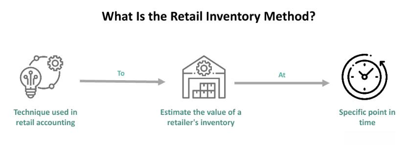

In today's dynamic business environment, effective inventory management is crucial for maintaining customer satisfaction and optimizing costs. As markets become increasingly competitive and consumer expectations rise, businesses must develop strategies to balance the availability of products without incurring the costs associated with overstocking. This article explores the intersection of retail inventory management and algorithmic trading, highlighting best practices and innovative techniques.

Retail inventory management plays a foundational role in helping businesses ensure that products are available when and where customers demand them while minimizing unnecessary stock holdings. This balance is vital to avoid lost sales opportunities due to stockouts and the financial drawbacks of excessive inventory, such as increased storage costs and potential obsolescence.



On the other hand, algorithmic trading leverages automated systems to optimize trading strategies, often relying heavily on precise inventory data. This facet of modern trading involves executing a large number of trades at high speed and can greatly benefit from accurate inventory management to ensure appropriate liquidity and capital utilization. When integrated, these two areas can complement each other, leading to improved operational efficiency and enhanced profitability.

By understanding how retail inventory management principles can be applied to algorithmic trading strategies, businesses are presented with opportunities for innovation and growth. This convergence creates a robust framework for enhancing decision-making processes, optimizing inventory levels, and developing advanced trading methodologies. Consequently, companies that master these domains are better positioned to achieve profitability and sustain competitive advantages in a constantly evolving marketplace.

## Table of Contents

## Understanding Retail Inventory Management

The Retail Inventory Method (RIM) serves as a pivotal accounting tool for estimating the cost of ending inventory in retail settings. Its primary objective is to enable businesses to determine the cost of goods sold and the value of remaining stock without necessitating a complete physical inventory count. This method provides a streamlined approach to inventory management, which is crucial for maintaining operational efficiency and precise financial reporting.

### Key Concepts in RIM

Several fundamental concepts underpin RIM, including Beginning Inventory, Cost-to-Retail Ratio, and Ending Inventory. Beginning Inventory refers to the value of goods available for sale at the start of an accounting period. The Cost-to-Retail Ratio is a critical metric calculated by dividing the cost of goods available for sale by their retail value, expressing the proportionate relationship between cost and retail price. Finally, Ending Inventory is the estimated value of unsold goods at the end of a particular period, derived using the RIM formula.

### Approaches to RIM

There are different approaches to applying RIM, each meeting various retail needs. The Conventional Method, for instance, requires an addition for net markups but an exclusion of markdowns when calculating the cost-to-retail ratio. This approach is often more conservative, yielding a higher value for ending inventory. Conversely, the Average Cost Method includes both markups and markdowns in the calculation, providing a balance that reflects actual retail operations more accurately. The Last In, First Out (LIFO) method, while not commonly aligned with RIM, can nevertheless be adapted for specific inventory valuation scenarios where the newest inventory is prioritized.

```python
# Example of RIM calculation using Python
def calculate_ending_inventory(beginning_inventory, purchases, sales, cost_to_retail_ratio):
    # Calculate goods available for sale
    goods_available_for_sale = beginning_inventory + purchases
    # Calculate ending inventory
    ending_inventory = goods_available_for_sale - sales
    # Estimate the cost of ending inventory using the cost-to-retail ratio
    ending_inventory_cost = ending_inventory * cost_to_retail_ratio
    return ending_inventory_cost

# Example Parameters
beginning_inventory = 1000000  # $1,000,000
purchases = 500000  # $500,000
sales = 1080000  # $1,080,000
cost_to_retail_ratio = 0.7  # Example Ratio

# Calculate the ending inventory cost
ending_inventory_cost = calculate_ending_inventory(beginning_inventory, purchases, sales, cost_to_retail_ratio)
print(f"Estimated Ending Inventory Cost: ${ending_inventory_cost}")
```

### Financial Reporting and Inventory Shortages

Retail inventory management aids significantly in financial reporting by ensuring that inventory is valued accurately, leading to precise income statements and balance sheets. Additionally, this method helps identify inventory shortages, allowing businesses to react promptly to potential discrepancies between recorded and actual stock levels. The ability to swiftly address inventory inconsistencies is crucial for minimizing financial losses and maintaining customer satisfaction through reliable stock availability.

## Algorithmic Trading and Inventory Management

Algorithmic trading utilizes automated systems to perform trades based on predefined criteria, optimizing execution speed and accuracy. Efficient inventory management is crucial within this framework to minimize risks and optimize capital utilization. By maintaining optimal inventory levels, traders can enhance their strategy execution and reduce exposure to adverse market movements.

Inventory models, such as Mean-Variance Optimization and Dynamic Programming, are pivotal in determining optimal inventory levels in [algorithmic trading](/wiki/algorithmic-trading). Mean-Variance Optimization helps traders balance expected return against variance (risk), as expressed in:

$$
\min_{\mathbf{w}} \left( \mathbf{w}^T \Sigma \mathbf{w} - \lambda \mathbf{w}^T \mathbf{\mu} \right)
$$

where $\mathbf{w}$ is the weight vector of assets, $\Sigma$ is the covariance matrix of asset returns, $\lambda$ is the risk aversion factor, and $\mathbf{\mu}$ is the expected return vector. Dynamic Programming, on the other hand, provides a systematic framework for breaking down complex inventory decisions across time to align with evolving market conditions.

Managing risks such as market risk, [liquidity](/wiki/liquidity-risk-premium) risk, and regulatory risk is imperative. Market risk involves the potential for an investment's value to decrease due to market fluctuations. Liquidity risk arises when assets cannot be sold quickly without a price concession. Regulatory risk entails the costs or uncertainties brought by regulatory changes.

Advanced data analytics and trading platforms are indispensable tools for algorithmic traders. These technologies enable precise tracking and analysis of inventory positions, offering insights that align inventory strategies with market dynamics. They support real-time decision-making, ensuring traders are agile in their response to opportunities and risks.

For example, Python libraries like NumPy and pandas can be instrumental in streamlining inventory analysis. A basic implementation could look like this:

```python
import numpy as np
import pandas as pd

# Simulate expected returns and covariance matrix
expected_returns = np.array([0.05, 0.07, 0.1])
cov_matrix = np.array([[0.1, 0.01, 0.02], [0.01, 0.1, 0.03], [0.02, 0.03, 0.2]])

# Set risk aversion factor
risk_aversion = 0.5

# Calculate optimal weights using Mean-Variance Optimization
def mean_variance_optimization(returns, cov_matrix, risk_aversion):
    num_assets = len(returns)
    inv_cov_matrix = np.linalg.inv(cov_matrix)
    weights = np.dot(inv_cov_matrix, returns) / (risk_aversion * np.dot(returns.T, np.dot(inv_cov_matrix, returns)))
    return weights

optimal_weights = mean_variance_optimization(expected_returns, cov_matrix, risk_aversion)
print("Optimal Weights for Inventory Allocation:", optimal_weights)
```

In summary, algorithmic trading heavily relies on robust inventory management and advanced analytical tools to optimize trading strategies and manage risks efficiently.

## Calculating Inventory: Practical Example

Calculating ending inventory accurately is a fundamental aspect of retail inventory management. The Retail Inventory Method (RIM) provides a practical approach to achieve this without conducting exhaustive physical counts. This method involves calculating the value of goods still available for sale by using known sales data and the cost-to-retail ratio.

In a practical example, consider a business with a beginning inventory valued at $1,000,000. Over the year, the business makes new purchases totaling $500,000. The sales revenue during this period amounts to $1,080,000. To calculate the ending inventory using the RIM, the cost-to-retail ratio, which helps in determining the proportionate cost of the remaining inventory, becomes essential.

Initially, the dollar value of the available inventory is calculated by adding the beginning inventory and the new purchases:

$$
\text{Goods Available for Sale} = \text{Beginning Inventory} + \text{New Purchases} = \$1,000,000 + \$500,000 = \$1,500,000
$$

Next, the cost-to-retail ratio is used to estimate the inventory's ending value. This ratio is derived from dividing the cost of goods (beginning inventory plus purchases) by the retail value (goods available for sale plus sales):

$$
\text{Cost-to-Retail Ratio} = \frac{\text{Cost of Goods Available for Sale}}{\text{Retail Value of Goods Available for Sale}} = \frac{\$1,500,000}{\$2,580,000}
$$

After determining the cost-to-retail ratio, the next step is to calculate the ending inventory by applying this ratio to the difference between goods available for sale and sales:

$$
\text{Ending Inventory (by Retail)} = \text{Goods Available for Sale} - \text{Sales} = \$1,500,000 - \$1,080,000 = \$420,000
$$

Finally, the ending inventory at cost is calculated by multiplying the ending inventory in retail terms by the cost-to-retail ratio. However, in the example calculation, using the RIM highlights how the components interplay, without requiring actual physical verification.

Understanding such calculations through RIM significantly aids businesses in maintaining precise financial records, ensuring that inventory estimates align closely with the actual financial circumstances. This accuracy supports both operational efficiency and strategic decision-making.

## Application of Inventory Management in Trading

Algorithmic trading firms employ advanced inventory management systems to successfully execute high-frequency trades. Effective inventory management is paramount in sectors such as hedge funds, broker-dealers, and exchange-traded funds (ETFs). These sectors depend on well-managed inventory for both regulatory compliance and operational success.

Inventory management in trading involves tracking positions, ensuring liquidity, and managing risk exposures. By utilizing inventory metrics, traders can refine their strategies, leading to enhanced profitability. Metrics such as inventory turnover rate and days sales of inventory (DSI) offer insights into how efficiently trading assets are used and managed.

Advanced technologies and algorithms are crucial for managing inventory effectively in trading environments. High-frequency trading requires rapid analysis and decision-making, facilitated by algorithmic systems that optimize inventory levels and transactional decisions. For example, algorithms may use dynamic pricing models that adjust to real-time market fluctuations, maintaining optimal inventory stakes while minimizing potential losses.

Modern inventory management software integrates with trading platforms, providing real-time data analytics and automated reporting. These tools enable traders to maintain accurate records of their inventory positions and adjust their strategies as market conditions evolve. Machine learning algorithms, in particular, assist in predicting market trends, allowing automated systems to preemptively adjust inventory levels and reduce exposure to adverse movements.

In Python, libraries such as `pandas` and `numpy` can be used to analyze and manage inventory data efficiently. Here's a basic example of how to calculate the inventory turnover ratio using these libraries:

```python
import pandas as pd
import numpy as np

# Sample data for inventory and sales
data = {
    'beginning_inventory': [1500000],
    'ending_inventory': [1800000],
    'cost_of_goods_sold': [3000000],
}

df = pd.DataFrame(data)

# Calculate average inventory
df['average_inventory'] = (df['beginning_inventory'] + df['ending_inventory']) / 2

# Calculate inventory turnover ratio
df['inventory_turnover_ratio'] = df['cost_of_goods_sold'] / df['average_inventory']

print(df[['average_inventory', 'inventory_turnover_ratio']])
```

This script calculates the inventory turnover ratio, a key metric indicating how many times the inventory is sold and replenished over a period. Such analyses support strategic decisions in trading activities, ensuring efficient capital utilization.

In conclusion, leveraging sophisticated inventory management techniques is critical for firms operating in algorithmic trading domains. Advanced algorithms and real-time analytics are indispensable in maintaining competitive advantages and ensuring compliance with regulatory frameworks. By harnessing these tools, trading entities can achieve greater profitability and operational efficiency.

## The Role of Inventory Management in Business Success

Inventory management plays a critical role in ensuring both retail and trading business success. In retail, maintaining optimal inventory levels is vital to avoid the twin pitfalls of overstocking and stockouts. Overstocking ties up capital and increases storage costs, while stockouts result in missed sales opportunities and diminished customer satisfaction. Retailers must frequently monitor inventory levels, using replenishment algorithms and just-in-time inventory systems to align stock with demand. Implementing effective inventory management strategies ensures that companies can respond swiftly to market changes, thus maintaining customer trust and loyalty. 

In the context of trading, inventory management extends beyond physical goods to include financial assets such as stocks, bonds, or currencies. Precise inventory data are indispensable for executing robust trading strategies and managing risk. For algorithmic trading firms, accurate data regarding asset holdings allows for the optimization of buy and sell decisions, reducing exposure to market [volatility](/wiki/volatility-trading-strategies). Advanced inventory management techniques, such as real-time data analytics and predictive algorithms, provide traders with valuable insights that enhance decision-making and performance outcomes.

Businesses leveraging modern inventory techniques can witness significant improvements in financial health and market positioning. The implementation of technology-driven inventory management solutions leads to cost savings, improved cash flow, and higher profit margins. Efficient inventory practices also enhance a firm's adaptability, enabling swift responses to supply chain disruptions or shifts in consumer preferences. By embracing inventory management innovations, companies can maintain a competitive edge in today's fast-paced market environment.

The integration of retail inventory methods with algorithmic trading principles offers promising opportunities for enhancing business performance. The cross-pollination of these domains can yield sophisticated strategies for managing both physical and financial inventories. For instance, retailers employing algorithmic trading models may better predict demand fluctuations and optimize stock replenishment cycles. Similarly, trading firms utilizing retail inventory management techniques can refine their asset allocation processes for improved risk-adjusted returns. By synthesizing these approaches, businesses can achieve greater operational efficiencies and unlock new avenues for growth.

## Conclusion

Effective inventory management serves as a linchpin for achieving success in both retail and algorithmic trading sectors. By comprehensively understanding and applying sophisticated inventory calculation techniques, businesses can realize cost savings and bolster profitability. These techniques allow companies to precisely estimate and manage inventory levels, ensuring resource optimization without the need for extensive physical counts. Such accuracy in inventory assessment helps in reducing carrying costs and minimizing lost sales opportunities due to stockouts or overstocking.

The synergy of retail and algorithmic trading methodologies presents a pathway to enhanced operational efficiencies. In retail, methods like the Retail Inventory Method (RIM) facilitate the prompt determination of stock levels, freeing capital for other investments. Meanwhile, algorithmic trading benefits from seamless inventory management through automated systems that execute transactions based on real-time data, optimizing portfolio rebalancing and risk management. This integration supports a dynamic and responsive supply chain, crucial for maintaining competitiveness in fast-paced markets.

To maintain and elevate their market position, businesses must persistently refine their inventory management strategies. Modern companies are encouraged to adopt a flexible approach, continuing to assess and upgrade their inventory processes in response to technological advancements and shifting market demands. By staying informed and leveraging cutting-edge methodologies, such as data analytics and [machine learning](/wiki/machine-learning), organizations can tailor their inventory management systems, ensuring they are not only prepared for current challenges but also poised for future growth. The strategic optimization of inventory techniques will remain a critical driver of business success, propelling profitability and ensuring long-term sustainability.

## References & Further Reading

[1]: ["Retail Inventory Method," AccountingTools.](https://www.accountingtools.com/articles/retail-inventory-method)

[2]: ["Advances in Financial Machine Learning"](https://books.google.com/books/about/Advances_in_Financial_Machine_Learning.html?id=oU9KDwAAQBAJ) by Marcos Lopez de Prado

[3]: ["Quantitative Trading: How to Build Your Own Algorithmic Trading Business"](https://www.amazon.com/Quantitative-Trading-Build-Algorithmic-Business/dp/1119800064) by Ernest P. Chan

[4]: ["Inventory Management and Optimization in SAP ERP"](https://www.sap-press.com/inventory-management-and-optimization-in-sap-erp_3977/) by Elke Roettig and Martin Murray

[5]: ["Mean-Variance Optimization in Portfolio Management," CFA Institute.](https://analystprep.com/study-notes/cfa-level-iii/mean-variance-optimization-an-overview/)