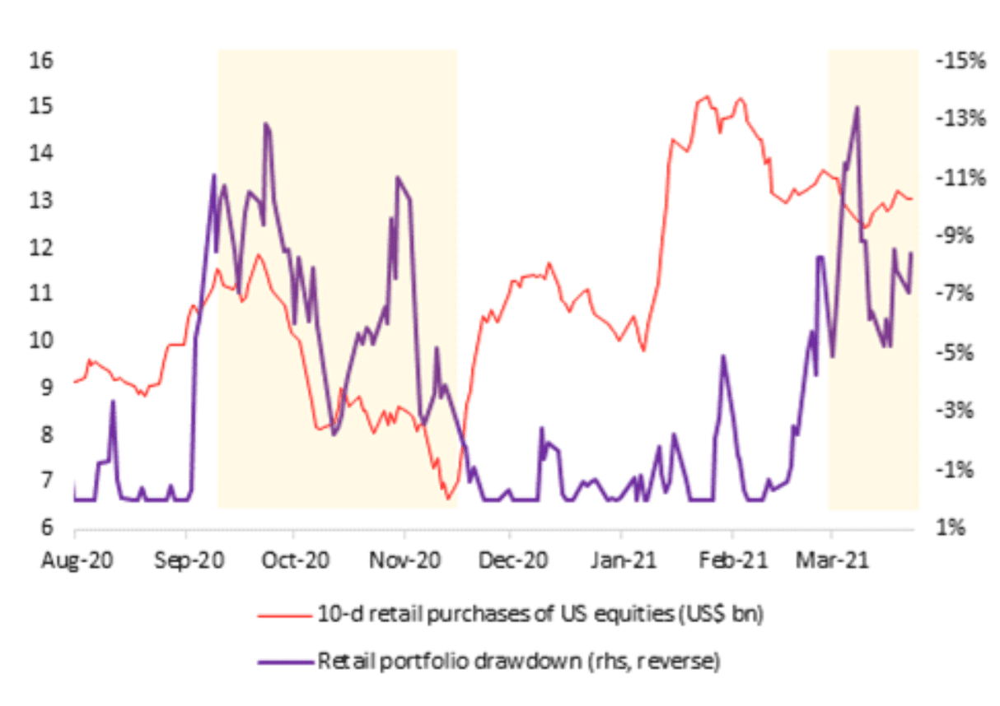

## Table of Contents

## What is a retail investor?

A retail investor is an individual who buys and sells stocks, bonds, or other investments for their own personal account. They are different from institutional investors, like big banks or mutual funds, because they invest smaller amounts of money and usually do it on their own or with the help of a financial advisor.

Retail investors often use online platforms or apps to manage their investments. They might not have as much money to invest as big institutions, but they play an important role in the market. Their decisions can influence stock prices and help make the market more active and fair.

## How do retail investors differ from institutional investors?

Retail investors and institutional investors are different in a few big ways. Retail investors are everyday people who invest their own money. They might use apps or websites to buy and sell stocks, and they usually don't have a lot of money to invest compared to big organizations. Institutional investors, on the other hand, are big groups like banks, insurance companies, and mutual funds. They manage huge amounts of money for lots of people or businesses, and they have teams of experts to help them make decisions.

Another difference is how they affect the market. Retail investors can make the market more lively because there are so many of them, and their choices can move stock prices a bit. But institutional investors have a bigger impact because they deal with so much money. When they buy or sell a lot of stocks, it can really change the market. Also, institutional investors often have access to more information and tools, which can give them an advantage over retail investors.

## What are the common investment vehicles used by retail investors?

Retail investors often use stocks as one of their main investment vehicles. Stocks are shares in a company, and when you buy them, you own a little piece of that company. Many retail investors like stocks because they can pick which companies they want to invest in, and they can buy and sell them easily using online platforms or apps. Another popular choice is mutual funds. These are like big baskets of stocks or bonds that a professional manages for you. By investing in a mutual fund, you get a piece of many different investments, which can help spread out the risk.

Another common investment vehicle for retail investors is exchange-traded funds (ETFs). ETFs are similar to mutual funds but can be bought and sold throughout the day like stocks. They often track an index, like the S&P 500, which means they try to match the performance of that index. ETFs are popular because they offer a way to invest in a broad market or sector without having to pick individual stocks. Lastly, some retail investors also use bonds, which are loans you give to a company or government. Bonds usually pay you back with interest over time, and they are seen as safer than stocks because they are less likely to lose value quickly.

## How do retail investors influence stock prices?

Retail investors can influence stock prices through their buying and selling decisions. When a lot of retail investors buy a stock, the demand for that stock goes up. This can push the price of the stock higher because more people want to own it. On the other hand, if many retail investors decide to sell a stock, the supply of that stock increases, which can make the price go down because there are more sellers than buyers.

Their influence might not be as big as that of institutional investors, who manage huge amounts of money, but retail investors can still make a difference, especially when they act together. For example, if a lot of retail investors get excited about a company and start buying its stock at the same time, this can create a lot of buzz and drive the stock price up quickly. Social media and online forums have made it easier for retail investors to share ideas and coordinate their actions, which can sometimes lead to big moves in stock prices.

## What role do retail investors play in market volatility?

Retail investors can add to market [volatility](/wiki/volatility-trading-strategies) because they often make quick decisions based on news or trends they see online. When a lot of retail investors buy or sell stocks at the same time, it can cause big swings in stock prices. This is especially true when they get excited about a certain stock and start talking about it on social media. Their actions can lead to sudden jumps or drops in stock prices, which makes the market more unpredictable.

However, retail investors are not the only ones causing market volatility. Big investors like banks and mutual funds also play a big role. But because there are so many retail investors, and they can move quickly, their combined actions can sometimes create a lot of noise in the market. Even though each retail investor might not have a lot of money, together they can still make a big impact on how stable or volatile the market is.

## How has technology impacted retail investor participation in the market?

Technology has made it a lot easier for retail investors to get involved in the stock market. In the past, if you wanted to buy or sell stocks, you had to call a broker and pay them a lot of money to do it for you. Now, thanks to the internet and smartphone apps, anyone can buy and sell stocks with just a few taps on their phone. These apps and websites often have low or no fees, which means more people can start investing without spending a lot of money. This has opened up the market to a lot more people who might not have been able to invest before.

Another big change is how much information and tools are available to retail investors. With the internet, you can find out about a company, read news, and see what other investors are saying, all in one place. This helps people make better decisions about which stocks to buy or sell. Also, technology has made it easier for retail investors to talk to each other. They can join online groups and forums to share ideas and learn from each other. This can make them feel more confident about investing and can even lead to big groups of retail investors working together to move stock prices.

## What are some notable examples of retail investor impact on specific stocks or markets?

One big example of retail investors making a big impact is what happened with GameStop in early 2021. A lot of people on a website called Reddit started talking about GameStop and how they thought the stock was worth more than people thought. They started buying the stock together, and this made the price go up a lot, really fast. It went from around $20 to over $400 in just a few weeks. This showed that when a lot of retail investors work together, they can really shake things up in the market.

Another example is the rise of meme stocks. These are stocks that get popular because of social media and online forums. One such stock is AMC Entertainment. Like with GameStop, a lot of retail investors on Reddit and other places started buying AMC stock because they thought it was undervalued. The price of AMC went up a lot because of this, and it showed how social media can help retail investors band together and affect stock prices. These examples show that retail investors can have a big impact, even if they don't have as much money as big investors.

## How do retail investors affect market liquidity?

Retail investors help make the market more liquid. Liquidity means how easy it is to buy or sell something without changing its price too much. When there are a lot of retail investors buying and selling stocks, there are more people in the market. This means there are always buyers and sellers, so it's easier to trade stocks quickly. More retail investors make the market more active, which is good for everyone because it helps keep prices stable and makes it easier to get in and out of investments.

However, sometimes retail investors can also make the market less liquid. If a lot of them decide to buy or sell the same stock at the same time, it can cause big price swings. This can make other investors nervous and less likely to trade that stock. When people are scared to trade, it can make the market less liquid because there are fewer people willing to buy or sell. So, while retail investors usually help with [liquidity](/wiki/liquidity-risk-premium), their actions can also sometimes make it harder to trade smoothly.

## What are the psychological factors driving retail investor behavior?

Retail investors often make decisions based on how they feel. They might get excited about a stock because they hear about it a lot on social media or see it in the news. This can make them want to buy it quickly, even if they don't know much about the company. They might also feel scared if they see the stock market going down and decide to sell their stocks to avoid losing money. These feelings, like excitement and fear, can make retail investors act without thinking too much about the long-term effects.

Another big thing that affects retail investors is something called FOMO, which stands for "Fear Of Missing Out." If they see other people making money on a stock, they might want to buy it too, so they don't miss out on the gains. This can lead to a lot of people buying the same stock at the same time, which can push the price up really fast. Also, retail investors might hold onto a stock for too long because they hope it will go back up, even if it's clear that it's not going to. This is called being too hopeful or overly optimistic, and it can make them lose more money than they should.

## How do regulatory changes affect retail investors and their market impact?

Regulatory changes can have a big effect on retail investors. When rules change, it can make it easier or harder for them to invest. For example, if the government makes rules that lower the cost of trading, more retail investors might start buying and selling stocks because it's cheaper. On the other hand, if new rules make it harder to trade or increase the costs, fewer people might want to invest. These changes can also change how much retail investors can affect the market. If more people start investing because of easier rules, they might have a bigger impact on stock prices and market trends.

Another way regulatory changes affect retail investors is by changing what information they can see. If the government makes rules that make companies share more information, retail investors can make better choices about which stocks to buy or sell. But if rules make it harder to get information, it can be tougher for them to decide. Also, new rules might be made to stop retail investors from working together to move stock prices in big ways, like what happened with GameStop. These rules can change how retail investors behave and how much they can influence the market.

## What are the strategies retail investors use to maximize their market impact?

Retail investors often use social media and online forums to talk about stocks and share their ideas. By working together, they can buy or sell the same stock at the same time. This can make the stock price go up or down a lot, even if each person doesn't have a lot of money. They might focus on stocks that they think are undervalued or that a lot of people are talking about, like meme stocks. This can create a lot of excitement and get more people to join in, making their impact even bigger.

Another strategy is to use tools and information that are easy to find online. Retail investors can learn about a company, read news, and see what other investors are doing. This helps them make better choices about which stocks to buy or sell. They might also use trading apps that let them buy and sell stocks quickly and without paying a lot of fees. By being active and using these tools, retail investors can have a bigger say in the market and affect stock prices more than they could before.

## How can the market impact of retail investors be measured and analyzed?

The market impact of retail investors can be measured by looking at how much they trade and how their trades affect stock prices. Researchers and analysts often use data from trading platforms and stock exchanges to see how many retail investors are buying and selling certain stocks. They can also look at the [volume](/wiki/volume-trading-strategy) of trades, which is how many shares are being traded, to see if there's a big increase when retail investors get involved. If a lot of retail investors start trading a stock and the price goes up or down a lot, it's a sign that they're having an impact.

Another way to analyze the impact of retail investors is by looking at social media and online forums. By tracking what people are saying about certain stocks, analysts can see if there's a lot of buzz and excitement. If a stock gets a lot of attention online and then its price moves a lot, it's likely that retail investors are driving the change. This kind of analysis helps show how retail investors can work together and affect the market, even if they don't have as much money as big investors.

## References & Further Reading

[1]: Bergstra, J., Bardenet, R., Bengio, Y., & Kégl, B. (2011). ["Algorithms for Hyper-Parameter Optimization."](https://papers.nips.cc/paper/4443-algorithms-for-hyper-parameter-optimization) Advances in Neural Information Processing Systems 24.

[2]: ["Advances in Financial Machine Learning"](https://www.amazon.com/Advances-Financial-Machine-Learning-Marcos/dp/1119482089) by Marcos Lopez de Prado

[3]: ["Evidence-Based Technical Analysis: Applying the Scientific Method and Statistical Inference to Trading Signals"](https://www.amazon.com/Evidence-Based-Technical-Analysis-Scientific-Statistical/dp/0470008741) by David Aronson

[4]: ["Machine Learning for Algorithmic Trading"](https://github.com/stefan-jansen/machine-learning-for-trading) by Stefan Jansen

[5]: ["Quantitative Trading: How to Build Your Own Algorithmic Trading Business"](https://www.amazon.com/Quantitative-Trading-Build-Algorithmic-Business/dp/1119800064) by Ernest P. Chan