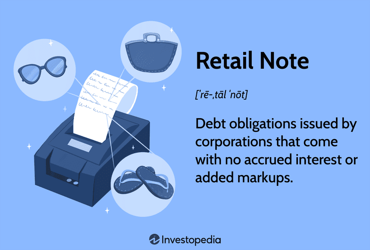

This article explores a facet of the financial ecosystem primarily through the lens of retail financial instruments, with a specific focus on retail notes. Financial instruments represent a broad category encompassing various assets, such as stocks, bonds, and derivatives, which facilitate the allocation of capital in the market. Retail versions of these instruments cater to individual investors, offering them opportunities to engage in the financial markets with instruments traditionally limited to institutional investors.

Retail notes, as a subcategory of these instruments, are debt obligations issued by corporations to raise capital from individual investors. They play a significant role in demystifying fixed income investments for the retail sector by providing a straightforward avenue for earning fixed interest returns. These notes offer advantages such as yield premiums and additional features over traditional bonds, enhancing their appeal among individual investors seeking income-generating assets.



In parallel, the rise of algorithmic trading has emerged as a transformative trend in the retail investment landscape. Algorithmic trading employs computer algorithms to execute trading strategies with enhanced precision and speed. Its proliferation in retail markets is attributed to its ability to efficiently manage complex trading operations, which were once exclusive to seasoned traders and financial institutions. The integration of algorithmic trading strategies into retail investments has the potential to revolutionize how individual investors approach and execute their financial strategies.

The convergence of retail notes with algorithmic trading strategies opens new possibilities for optimizing investment outcomes. By harnessing computational algorithms to analyze market trends and execute trades, retail investors can potentially improve the management and performance of their investment portfolios involving retail notes. This connection underscores the strategic advantage of employing algorithmic trading to uncover opportunities and manage risks in retail note investments effectively.

Throughout this article, we will delve into the nature and function of financial instruments, particularly focusing on retail notes and algorithmic trading. The discussion will include an exploration of the benefits and challenges associated with this integration, insights into regulatory considerations, and future trends that could shape the dynamics of retail investments in financial instruments. Ultimately, our goal is to provide a comprehensive understanding of retail notes, their interaction with algorithmic trading, and how informed investors can leverage these tools to enhance their investment strategies.

## Table of Contents

## Understanding Financial Instruments

Financial instruments are assets that can be traded in financial markets, serving as channels for the allocation of capital and risk. They encompass a wide array of products, including stocks, bonds, and derivatives, each facilitating different investment needs and strategies.

**Types of Financial Instruments**

1. **Stocks**: Stocks, or equities, represent ownership in a corporation. Stockholders are entitled to a portion of the company's profits, usually distributed as dividends, and have voting rights in corporate decisions. The value of stocks fluctuates based on the company's performance and market conditions.

2. **Bonds**: Bonds are debt securities issued by companies or governments to raise capital. They obligate the issuer to pay the bondholder a specified interest (coupon) at regular intervals and return the principal amount at maturity. Bonds are considered less risky than stocks and provide fixed income.

3. **Derivatives**: Derivatives derive their value from an underlying asset, such as stocks, bonds, commodities, or currencies. Common derivatives include futures, options, and swaps. They are used for hedging risks or speculating on price movements.

Financial instruments like retail notes play a pivotal role in the broader financial ecosystem. Retail notes are debt obligations issued by corporations targeting individual investors, providing a simpler, more accessible option for fixed-income investments than traditional institutional products.

**Role of Retail Notes**

Retail notes function similarly to bonds, in that they offer fixed periodic interest payments, and the principal investment is returned at maturity. However, retail notes often come with features tailored for individual investors. For example, they may offer yield premiums compared to traditional bonds, reflecting a higher return as compensation for potentially higher risk.

**Similarities and Differences Between Retail Notes and Traditional Bonds**

Both retail notes and traditional bonds serve as forms of debt financing for issuers and fixed-income investments for buyers. They involve periodic interest payments and return the principal upon maturity. However, retail notes typically offer more flexibility and accessibility for individual investors. Unlike many institutional bonds, retail notes can have features like callable options, allowing issuers to redeem the notes before maturity, often due to decreased interest rates or improved credit ratings.

Retail notes also often provide survivor benefits, allowing heirs to redeem the notes before maturity in the event of the investor's death. This feature is attractive to individuals desiring security for their beneficiaries.

**Fixed Income Potential for Individual Investors**

Retail notes, by offering fixed interest payments, provide a reliable income stream, which is highly valued by conservative investors looking for predictability in returns. This fixed income potential makes retail notes particularly appealing to investors who prioritize income stability over high-risk, high-return strategies.

In conclusion, financial instruments are critical in enabling both companies and individuals to manage risk and invest capital. Retail notes represent a valuable tool in the financial arsenal of individual investors, providing a straightforward way to access the benefits of fixed income securities while gaining some of the flexibility typically reserved for more sophisticated financial products.

## What Are Retail Notes?

Retail notes are a category of debt obligations that corporations issue primarily to retail investors. These instruments serve as a means for companies to raise capital by selling debt directly to individuals, who in turn receive periodic interest payments.

The defining characteristic of retail notes is their structure to cater explicitly to individual investors rather than institutional investors. Like traditional bonds, retail notes deliver fixed interest payments to the noteholders. However, one key feature often included in retail notes is the callable option. This option permits the issuing corporation to call, or redeem, the notes before their maturity date under specified conditions. This could occur in a declining [interest rate](/wiki/interest-rate-trading-strategies) environment where refinancing the debt at lower rates becomes advantageous for the company.

Advantages of retail notes over traditional bonds include yield premiums and survivor benefits. Retail notes typically provide yield premiums, offering higher returns when compared with similar traditional bonds due to the perceived higher risk associated with the individual investor market. Additionally, some retail notes come with survivor benefits, allowing heirs to redeem the notes without facing penalties. This feature ensures that the investment aligns better with estate planning efforts.

Retail notes simplify fixed income investment options for individual investors. With lower denominations compared to typical corporate bonds, they offer accessibility and affordability, enabling investors to partake in fixed income investments without the substantial capital often required for traditional bonds. This simplicity aligns with the financial strategies of individuals seeking steady income streams through fixed interest payments, thus making retail notes a viable and attractive option in the retail investment space.

## Algorithmic Trading and Its Relevance

Algorithmic trading, also known as algo-trading, is a method of executing orders using pre-programmed trading instructions that account for variables such as timing, price, and [volume](/wiki/volume-trading-strategy). This high-speed, data-driven approach is gaining traction, not only in institutional circles but also among retail investors. The technology's integration into retail investment platforms reflects a democratization of sophisticated trading techniques.

Algorithms are capable of executing complex trading strategies with remarkable efficiency. They use mathematical models and statistical analysis to capitalize on market conditions, ensuring trades occur at optimal moments. For instance, an algorithm might be programmed to execute a trade only when a specific set of criteria are met, such as a stock hitting a particular price or moving average. This precision is critical in volatile markets, where human traders may struggle to react swiftly enough to maximize profit potential.

Retail investors benefit significantly from the precision and speed offered by [algorithmic trading](/wiki/algorithmic-trading). Algorithms can monitor multiple markets and securities simultaneously, facilitating a level of rapid response that is beyond human capability. This capability allows retail investors to engage in high-frequency trading and capitalize on [arbitrage](/wiki/arbitrage) opportunities across different markets, which was traditionally the preserve of large institutional traders.

However, the adoption of algorithmic trading poses challenges for retail traders, primarily in terms of technical knowledge and resources. The development and maintenance of effective trading algorithms require a solid foundation in both finance and programming. Moreover, retail traders must invest in reliable technology infrastructure to ensure their algorithms can execute as intended without interruption. This can present a barrier to entry for individual investors lacking the required skill set or capital.

Retail traders also must confront the inherent risks of algorithmic trading, such as potential software glitches or miscalculations in the underlying algorithm. A slight programming error can lead to substantial financial losses, making it crucial for traders to conduct thorough testing and validation of their algorithms. Furthermore, market conditions can change rapidly, necessitating regular updates to algorithmic strategies.

In conclusion, while algorithmic trading provides valuable tools and advantages for retail investors, it also requires a commitment to technical competence and resources. The ability to harness these tools effectively can offer retail investors access to trading strategies that enhance their market responsiveness and precision, thus leveling the playing field with institutional investors.

## Benefits of Integrating Retail Notes with Algorithmic Trading

Algorithmic trading has revolutionized the investment landscape by introducing precise, efficient methods for trading a wide array of financial instruments, including retail notes. By leveraging algorithms, investors can optimize their retail note investments, enhancing returns while mitigating risks. 

**Optimization through Algorithmic Trading**

Algorithmic trading allows investors to automate and refine their investment strategies, especially with fixed-income instruments like retail notes. Algorithms can analyze vast datasets, capturing market trends and predicting price movements with high accuracy. For retail note investors, this capability translates into optimized timing for buying and selling, ensuring transactions occur at the most advantageous moments. 

For instance, algorithms can utilize historical data and statistical techniques to predict future pricing trends for retail notes. Consider a simplified algorithm that assesses interest rate changes over time to forecast retail note yields:

```python
import numpy as np

def predict_note_yield(past_rates, time_horizon):
    # Simple linear regression for prediction
    coef = np.polyfit(range(len(past_rates)), past_rates, 1)
    future_yield = coef[0] * time_horizon + coef[1]
    return future_yield

# Example usage:
past_rates = [2.5, 2.55, 2.6, 2.65, 2.7]  # historical interest rates
future_prediction = predict_note_yield(past_rates, 6)  # predict yield for 6 months ahead
print(f"Predicted future yield: {future_prediction:.2f}%")
```

**Strategic Analysis of Market Trends**

Algorithms can execute complex analyses far beyond simple regression models, incorporating [machine learning](/wiki/machine-learning) to predict trends. By monitoring market indicators such as interest rate fluctuations, credit ratings, and economic news, algorithms provide investors with a strategic edge in the retail notes market. Sophisticated algorithms can even adapt to changing market conditions, dynamically adjusting trading strategies to align with the current financial climate.

**Successful Integration Examples**

Several financial institutions have successfully integrated algorithmic trading with retail note investments, generating significant returns. Strategies such as [statistical arbitrage](/wiki/statistical-arbitrage) and algorithm-assisted diversification allow these institutions to exploit inefficiencies in the retail notes market, capturing additional yield premiums. Moreover, incorporating algorithms facilitates better [liquidity](/wiki/liquidity-risk-premium) management and minimizes transaction costs.

**Risk Management and Algorithms**

Algorithms not only aid in optimizing returns but also play a critical role in risk management. Through real-time data analysis and predictive modeling, algorithms can identify potential market risks associated with retail notes, such as default risk or interest rate [volatility](/wiki/volatility-trading-strategies). Automated alerts and risk-adjusted strategies enable investors to react promptly to unfavorable conditions, thereby safeguarding their investments. 

Risk management algorithms can model various scenarios to assess potential losses, using techniques such as Monte Carlo simulations to simulate different market environments and their impacts on retail notes.

In conclusion, the integration of algorithmic trading with retail note investments offers numerous benefits, from enhanced returns and strategic market analysis to effective risk management. For investors, these advancements herald a more informed and profitable approach to trading retail notes.

## Risks and Considerations

Investing in retail notes through algorithmic trading offers distinct advantages, yet it also presents several risks that investors must consider carefully. Understanding these risks is crucial for making informed investment decisions.

### Risks in Investing in Retail Notes through Algorithmic Trading

#### Market Volatility and Liquidity Risks
Algorithmic trading in retail notes subject investors to the fluctuations of market volatility. Rapid price changes can lead to significant variations in the expected returns of retail notes. Liquidity risk is also prominent; in moments of low market activity, selling retail notes at desired prices might become challenging, impacting the investor's ability to [exit](/wiki/exit-strategy) positions without incurring losses.

#### Risk of Over-Optimization
Algorithmic strategies may be over-optimized for past data, resulting in biased or flawed algorithms that do not perform well under future conditions. This risk is often referred to as "curve fitting," where the algorithm's parameters are fine-tuned to replicate historical success, potentially failing when applied to live markets.

### Regulatory Considerations for Algorithmic Trading
Regulatory frameworks play a pivotal role in shaping the environment for algorithmic trading in retail markets. Regulators focus on ensuring fair and transparent trading practices, minimizing systemic risk, and safeguarding against market manipulation. Key regulatory considerations include compliance with standards set by financial authorities and the necessity of maintaining audit trails for algorithmic strategies, ensuring that trades are conducted within legal bounds.

1. **Compliance Requirements**: Regulatory bodies enforce strict compliance on algorithmic trading systems to prevent fraud and maintain market integrity. Algorithms must be tested and validated, and trading firms are required to have risk management protocols in place.

2. **Market Surveillance and Reporting**: Regulators demand comprehensive reporting and monitoring of trades executed through algorithms. This consists of keeping detailed logs of trading activities and ensuring real-time monitoring to detect unusual patterns indicative of manipulative behaviors.

### Pitfalls for Uninformed Investors
Uninformed investors entering the high-speed domain of algorithmic trading may face several pitfalls.

1. **Complexity of Algorithms**: With intricate algorithms determining trades, investors without adequate technical understanding may not fully grasp the underlying decision-making process.

2. **Lack of Transparency**: Many algorithmic systems are black-box models, offering limited transparency into how investment decisions are reached. This opacity can leave investors uncertain about the strategy’s logic and its responsiveness to changing market conditions.

3. **Execution Risks**: Algorithmic trades, if improperly executed, can result in adverse outcomes due to the high-speed nature of these transactions. Timing errors, such as lag in execution, can erode potential profits.

### Strategies for Mitigating Risks
Investors can mitigate the risks associated with algorithmic trading in retail notes by adopting several strategies:

1. **Education and Skill Development**: Investors should equip themselves with knowledge of financial markets, trading algorithms, and the specific attributes of retail notes. Educational resources, workshops, and online courses can enhance investors' understanding of the complexities involved.

2. **Collaboration with Experts**: Partnering with financial advisors or algorithmic traders who possess in-depth industry experience can provide additional layers of insight and risk management.

3. **Continuous Monitoring and Review**: Implement robust monitoring systems to constantly assess algorithmic performance and adjust strategies in response to market developments. Regular reviews of algorithmic outcomes against benchmarks can aid in optimizing trading strategies.

4. **Diversification**: To hedge against potential losses associated with algorithmic trading, diversifying the investment portfolio across different asset classes and trading strategies can reduce exposure to specific risks.

By acknowledging these risks and establishing effective mitigation strategies, investors can more safely engage in algorithmic trading of retail notes, aligning their investment goals with the dynamic nature of financial markets.

## Future Trends in Retail Note Investments

Future developments in retail note investments and algorithmic trading are poised to transform the landscape of retail financial instruments significantly. As the industry evolves, several innovations and technological advancements are expected to redefine the dynamics of retail note investments.

One of the primary innovations influencing retail investments is the advancement in blockchain technology. By enabling secure and transparent transactions, blockchain can potentially revolutionize the issuance and trading of retail notes. With these advancements, verification processes can be streamlined, and transactional costs may be reduced, enhancing the overall efficiency and attractiveness of retail notes to individual investors. Moreover, blockchain's decentralized nature can facilitate the creation of novel financial products that appeal to a broader range of retail investors, thus expanding market participation.

Technological advancements in retail trading platforms are also expected to impact retail note investments. Modern trading platforms increasingly integrate sophisticated analytical tools that leverage big data, allowing for improved market analysis and decision-making. These platforms are likely to incorporate more user-friendly interfaces tailored to retail investors, providing them with greater autonomy and access to real-time market data. The widespread adoption of mobile trading apps further supports this trend, making it easier for investors to manage their portfolios and execute trades on the go.

The influence of [artificial intelligence](/wiki/ai-artificial-intelligence) (AI) and machine learning in shaping future trade strategies cannot be overstated. AI-powered algorithms can analyze vast amounts of financial data faster and with greater accuracy than traditional methods, identifying patterns and trends that may be overlooked by human investors. Machine learning models can continuously adapt and refine trading strategies based on historical data and market conditions, offering retail investors a competitive edge. For example, algorithms can automate the execution of buy and sell orders based on pre-defined criteria, optimizing portfolios to maximize returns and minimize risks.

As machine learning technology advances, the use of predictive analytics is expected to become more prevalent among retail investors. By forecasting market movements and asset price changes, investors can make well-informed decisions regarding the allocation of retail notes within their portfolios. Predictive analytics could enable the development of personalized investment strategies, aligning with investors' risk profiles and financial goals.

Additionally, the impact of AI-driven portfolio management tools is likely to become more pronounced. These tools can assist retail investors in balancing their portfolios, managing risk, and ensuring diversification in a more efficient manner. By utilizing AI, investors can gain insights into market volatility and potential investment outcomes, thus making more informed decisions with regards to retail note investments.

In summary, the evolving landscape of retail note investments and algorithmic trading is characterized by innovations such as blockchain technology, enhanced trading platforms, and AI-driven strategies. These advancements have the potential to increase efficiency, enhance market accessibility, and optimize investment outcomes for retail investors. As technology continues to progress, retail note investments are likely to become a more integral component of the financial ecosystem, offering sophisticated tools and strategies that cater to individual investors' needs.

## Conclusion

In this article, we explored the multifaceted nature of retail notes and their intersection with algorithmic trading. Retail notes, as debt obligations issued by corporations, offer a unique fixed-income opportunity with distinct advantages over traditional bonds, such as higher yield premiums and specific survivor benefits. Meanwhile, the rise of algorithmic trading has transformed the investment landscape by providing speed, efficiency, and the ability to execute complex trading strategies, benefiting both institutional and retail investors.

The continuous evolution of retail notes and algorithmic trading strategies is noteworthy. As financial markets become more sophisticated, the integration of retail notes with algo-trading presents both opportunities and challenges. Algorithmic trading can optimize investments, analyze market trends, and effectively manage risk. However, it requires a deep understanding and adaptation to rapidly changing market conditions and regulatory frameworks.

Staying informed is crucial. Investors must keep abreast of technological and regulatory developments to leverage the potential advantages while mitigating associated risks. The dynamic nature of financial markets means that education and continuous monitoring are vital. Investors are encouraged to weigh both the risks and benefits of engaging with retail notes and algorithmic trading. A thoughtful approach will ensure well-informed decisions in navigating this evolving landscape.

## References & Further Reading

[1]: Bergstra, J., Bardenet, R., Bengio, Y., & Kégl, B. (2011). ["Algorithms for Hyper-Parameter Optimization."](https://dl.acm.org/doi/10.5555/2986459.2986743) Advances in Neural Information Processing Systems 24.

[2]: ["Advances in Financial Machine Learning"](https://www.amazon.com/Advances-Financial-Machine-Learning-Marcos/dp/1119482089) by Marcos Lopez de Prado

[3]: ["Evidence-Based Technical Analysis: Applying the Scientific Method and Statistical Inference to Trading Signals"](https://www.amazon.com/Evidence-Based-Technical-Analysis-Scientific-Statistical/dp/0470008741) by David Aronson

[4]: ["Machine Learning for Algorithmic Trading"](https://github.com/stefan-jansen/machine-learning-for-trading) by Stefan Jansen

[5]: ["Quantitative Trading: How to Build Your Own Algorithmic Trading Business"](https://www.amazon.com/Quantitative-Trading-Build-Algorithmic-Business/dp/1119800064) by Ernest P. Chan