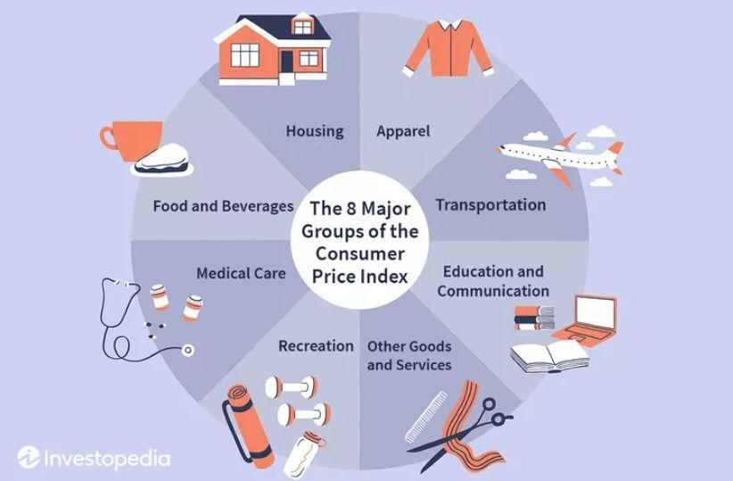

The Retail Price Index (RPI) is an essential economic measure worldwide, utilized predominantly to assess inflation levels by tracking the cost variation of a fixed basket of goods and services over time. As economies fluctuate, understanding the RPI can significantly benefit traders, investors, and policymakers who seek to navigate the ever-evolving financial markets effectively. This article examines the RPI from various perspectives, including its historical development, calculation processes, and applications in the financial sector, particularly in algorithmic trading.

RPI's origins date back to its inception in the United Kingdom in 1947, where it initially served as the primary measure of inflation before the Consumer Price Index (CPI) ultimately supplanted it. Unlike the CPI, the RPI encompasses housing costs, providing a more comprehensive view of consumer spending patterns. Analyzing the differences between RPI and CPI is crucial as it reveals the distinct methodologies and implications for economic policy and strategy formulation.



In the context of trading, RPI is invaluable for algorithmic processes that rely on thorough economic indicators to make calculated investment decisions. By analyzing RPI, traders can predict inflationary trends and potential market shifts, allowing them to optimize their portfolios. Furthermore, technological advancements have played a pivotal role in enhancing the accuracy and relevance of RPI, allowing it to adapt and remain a significant tool for future economic analysis.

Overall, the RPI holds a pivotal position in interpreting inflation and guiding economic and monetary decisions. Despite certain limitations, its detailed inclusion of living costs offers indispensable insights into the broader economic landscape. As technology continues to evolve, the RPI is poised to maintain its relevance, assisting both traders and policymakers in making informed strategic financial decisions amid the complexities of modern economics.

## Table of Contents

## What is the Retail Price Index (RPI)?

The Retail Price Index (RPI) is a significant economic measure developed to represent the fluctuations in the cost of a specified basket of goods and services, thereby indicating inflation rates. Originating in the United Kingdom, RPI has played a crucial role in shaping economic decisions, even though it is not the country's official inflation statistic today. Introduced in 1947, RPI served as the main measure of inflation until it was eventually supplanted by the Consumer Price Index (CPI) in official statistics.

Despite its secondary status, the RPI is still widely used due to its unique inclusions and historical importance. One of the key differentiators of RPI compared to CPI is its incorporation of housing costs, such as mortgage interest payments. This inclusion allows the RPI to provide a more comprehensive depiction of household expenditure patterns and inflation impacts on living costs, significantly affecting aspects like wage negotiations and pension adjustments.

Here's a simplified example of how RPI might be calculated, assuming a simplified basket of goods:

1. Choose a base year where RPI is set to 100.
2. Calculate the cost of the basket of goods in the current year and the base year.
3. Use the formula:
$$
   \text{RPI} = \left( \frac{\text{Cost of Basket (Current Year)}}{\text{Cost of Basket (Base Year)}} \right) \times 100

$$

While RPI is no longer the official measure, its broader inclusion of costs gives a valuable perspective on economic conditions and consumer spending trends. This attribute is particularly useful for specific economic decisions and contract adjustments tied to inflation.

## RPI and its Role in Inflation Measurement

The Retail Price Index (RPI) is instrumental in measuring inflation by monitoring price alterations for a designated basket of consumer goods and services. This process involves collecting over 180,000 price quotes, a testament to the index's comprehensiveness in reflecting varied economic activities. The breadth of data considered in RPI calculations provides a more granular view of price dynamics compared to other indices.

Despite facing criticism for its methodological rigidity and limitations, RPI continues to hold significance due to its inclusion of particular cost factors not accounted for in the Consumer Price Index (CPI). For instance, RPI incorporates housing costs such as mortgage interest payments and council tax, which are omitted from CPI calculations. This inclusion makes RPI particularly valuable for sectors sensitive to housing market fluctuations and for economic analyses that require a broader perspective on cost-of-living changes.

Policymakers and traders frequently utilize RPI to evaluate the economic environment and inform their financial strategies. RPI data serves as an indicator of inflationary pressures and is critical for making informed decisions related to [interest rate](/wiki/interest-rate-trading-strategies) adjustments and fiscal policies. For traders, the insights obtained from RPI are vital for anticipating market trends and honing investment decisions to align with inflation forecasts.

RPI's role in guiding decisions is augmented by its historical application in wage negotiations and index-linked financial instruments, such as pensions and savings bonds, which remain tethered to RPI despite the growing prominence of CPI in official [statistics](/wiki/bayesian-statistics). This ongoing use underscores RPI's enduring relevance in economic assessments and financial planning.

## Using RPI in Algorithmic Trading

Algorithmic trading employs automated strategies to make rapid and data-driven investment decisions. By integrating financial indices like the Retail Price Index (RPI), traders can enhance their capability to predict inflationary trends that significantly impact trading strategies. 

The RPI serves as a comprehensive economic measure that reflects variations in the cost of a selected basket of goods and services over time. For algorithmic traders, this index provides essential insights into potential inflationary pressures that may affect market conditions. By analyzing historical RPI data, traders can identify patterns and forecast future inflation trends. This enables traders to anticipate corresponding shifts in interest rates, which often affect asset prices and can lead to adjustments in trading algorithms.

Inflation prediction itself influences a variety of market dynamics. For instance, a rising RPI could signal increasing inflation, suggesting that central banks might contemplate interest rate hikes to stabilize the economy. Such changes would alter the cost of borrowing and could have cascading effects on stock and bond markets. By incorporating RPI trends into their algorithms, traders can adjust their portfolios to hedge against the risks posed by inflation. For example, they might favor securities that are more resilient to inflationary pressures or explore opportunities in commodities, which often benefit during inflationary periods.

To exploit RPI effectively within [algorithmic trading](/wiki/algorithmic-trading) strategies, traders may employ statistical models and [machine learning](/wiki/machine-learning) algorithms. For instance, they can use time series analysis to detect trends in RPI data. Python's `statsmodels` library provides tools for conducting such analyses:

```python
import pandas as pd
from statsmodels.tsa.arima.model import ARIMA

# Assume rpi_data is a pandas DataFrame containing RPI historical data
rpi_data = pd.read_csv('rpi_data.csv', parse_dates=True, index_col='Date')

# Fit ARIMA model on RPI data
model = ARIMA(rpi_data['RPI'], order=(5,1,0))  # Adjust order as needed
model_fit = model.fit()

# Forecast future values
forecast = model_fit.forecast(steps=5)
print(forecast)
```

Through such predictive modeling, traders derive actionable insights, adjusting algorithmic parameters to balance between inflation risks and growth opportunities. As the global financial landscape evolves, integrating real-time data and smart analytics reinforces RPI’s value, enabling traders to harness this index to optimize investment strategies effectively.

## Comparing RPI and CPI

The Retail Price Index (RPI) and the Consumer Price Index (CPI) are both fundamental measures of inflation, but they have notable differences in how they are calculated and the items they include. Understanding these distinctions is essential for accurate economic analysis and developing effective trading strategies.

RPI reflects changes in the cost of a predetermined basket of goods and services, incorporating housing costs such as mortgage interest payments and council tax. This inclusion provides a more comprehensive picture of real-world expenditures. In contrast, CPI excludes these housing-related costs and primarily focuses on a broader spectrum of goods and services aimed at capturing consumer spending patterns. This exclusion leads to CPI often reporting lower inflation rates than RPI, particularly at times when housing costs are experiencing significant changes.

The methodological differences between RPI and CPI have policy implications. CPI is typically preferred for international comparisons because of its adherence to international standards and its exclusion of housing costs that vary significantly across countries. This makes CPI a more suitable index for global economic assessments and comparisons. On the other hand, RPI is entrenched in the UK for specific domestic applications, notably in wage negotiations and pension indexation. Historically, it has been used to adjust wages and pensions to reflect the cost of living, although ongoing debates about its accuracy and reliability persist.

When considering the implications for financial markets and algorithmic trading, understanding the differences between RPI and CPI is crucial. Traders often use these indices to predict central bank actions related to interest rates, which are influenced by inflation assessments. The choice between RPI and CPI can affect the perceived inflation rate, altering economic forecasts and trading strategies. For instance, anticipated rises in housing costs might prompt traders to favor RPI-based strategies to hedge against potential inflation-driven policy changes.

In summary, while RPI and CPI both serve as key indicators of inflation, their divergent approaches to calculating and including various costs have significant impacts on economic policy and trading decisions. Recognizing these differences allows investors, traders, and policymakers to make more informed choices that align with their specific economic contexts and objectives.

## Technological Advancements and the Future of RPI

Technological advancements are significantly transforming the ways in which price data is collected and analyzed, thereby enhancing the accuracy and applicability of the Retail Price Index (RPI). The advent of digital technology and data analytics is pivotal in refining economic indicators like the RPI, as these tools allow for more precise and timely data collection. This integration of technology is crucial for economic forecasting, as it can produce more reliable indicators of inflationary trends and consumer behavior.

The increasing availability of digital resources, including big data and machine learning algorithms, provides new opportunities for improving the reliability of the RPI. By leveraging these technologies, it is possible to analyze vast datasets that can identify trends and patterns not easily discernible through traditional methods. This enables a nuanced understanding of inflationary dynamics and aids in formulating predictive models that are crucial for both policymakers and traders.

Emerging markets and shifting consumption patterns present additional challenges and opportunities for the RPI. As consumer behavior evolves, the methodology used to calculate the RPI must be updated to reflect new consumption patterns accurately. Digital platforms and e-commerce trends are reshaping how goods and services are consumed, necessitating a reevaluation of the basket of goods and services traditionally used in RPI calculations to ensure its continued relevance in the global marketplace.

As technology continues to progress, the RPI must also evolve to align with these new economic realities. This could involve integrating real-time data from digital transactions, employing machine learning algorithms for predictive analysis, and using [artificial intelligence](/wiki/ai-artificial-intelligence) to refine the selection and weighting of index components. Such innovations could lead to a more dynamic and responsive RPI, better equipped to reflect the complexities of modern economies and the diverse range of consumer behaviors.

In conclusion, the ongoing technological transformation presents a significant opportunity for enhancing the RPI. By embracing these advancements, the RPI can maintain its significance as a key economic indicator, providing vital insights for investors, policymakers, and analysts in an ever-changing economic landscape. This evolution will enable more effective strategic planning and responsiveness to economic changes, ultimately contributing to a more accurate understanding of inflation and its impacts.

## Conclusion

The Retail Price Index (RPI) remains an essential tool for comprehensively understanding inflation and directing economic and monetary decisions. While it faces criticism for its methodology and has been largely superseded by other indices like the Consumer Price Index (CPI) in official statistics, RPI offers a broad perspective by including costs such as mortgage interest payments. This comprehensive cost inclusion is critical in offering insights into various economic dimensions that other indices might overlook.

The adaptability of RPI, supported by technological advancements and evolving market practices, promises to sustain its relevance in future economic analysis. Technology's role in refining data collection and analysis methods is vital in enhancing RPI's accuracy and applicability, assuring its usefulness in predicting inflationary trends and assisting in economic policymaking.

For traders and policymakers, proficient understanding and application of RPI can significantly enhance strategic financial planning. By incorporating RPI in their analyses, stakeholders can better respond to economic changes, hedge against inflation risks, and identify growth opportunities. As such, maintaining a comprehensive understanding of RPI and its adjustments to ongoing economic shifts will be indispensable for informed decision-making and economic resilience.

## References & Further Reading

[1]: Johnson, P. (2015). ["Retail Price Index: A Brief History and Overview."](https://content.e-bookshelf.de/media/reading/L-13832314-f081b4a4db.pdf) Office for National Statistics.

[2]: ["The Consumer Price Index and the Retail Price Index: How They Differ"](https://www.thetimes.com/money-mentor/income-budgeting/rpi-versus-cpi) Bank of England Quarterly Bulletin.

[3]: Martinez, J., & Ramirez, S. (2020). ["Algorithmic Trading and Market Dynamics: Insights from RPI and CPI Data."](https://www.researchgate.net/publication/342010555_Garcia-Martinez_et_al_2020) Journal of Economic Perspectives.

[4]: Allen, R. C. (2011). ["The British Industrial Revolution in Global Perspective"](https://www.cambridge.org/core/books/british-industrial-revolution-in-global-perspective/29A277672CCD093D152846CE7ED82BD9) Cambridge University Press.

[5]: ["Handbook of Financial Trading"](https://www.amazon.com/Handbook-Trading-Strategies-Navigating-McGraw-Hill/dp/0071743537) edited by Greg N. Gregoriou.

[6]: Thomas, R. (2013). ["The Evolution of Retail Price Indices and Their Relevance for Inflation Measures."](https://www.semanticscholar.org/paper/The-Evolution-of-Retailing-Mcarthur-Weaven/06d89ec2d5fb8e138d8153c4287dc00bffcc864b) National Bureau of Economic Research.