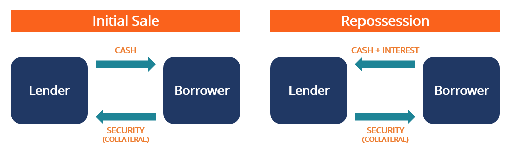

## Table of Contents

## What is a retail repurchase agreement?

A retail repurchase agreement, often called a repo, is a type of short-term borrowing where one party sells securities to another party with the agreement to buy them back later at a higher price. The difference between the selling price and the buying price is essentially the interest on the loan. This type of agreement is commonly used by businesses and individuals who need quick cash but want to use their securities as collateral.

In simple terms, imagine you own some valuable items, like stocks or bonds. You need money quickly, so you sell these items to someone else with a promise to buy them back in a few days or weeks. When you buy them back, you pay a bit more than what you sold them for. This extra amount is like the fee for borrowing the money. Retail repurchase agreements work the same way, but with securities instead of other items.

## How does a retail repurchase agreement differ from a traditional repurchase agreement?

A retail repurchase agreement and a traditional repurchase agreement are similar in that they both involve selling securities with a promise to buy them back later. The main difference lies in who uses them. A traditional repurchase agreement, often just called a repo, is usually used by big financial institutions like banks and investment firms. They use these agreements to borrow money from each other, often overnight, to manage their cash flow or to meet regulatory requirements.

On the other hand, a retail repurchase agreement is designed for individual investors or smaller businesses. These agreements allow them to use their securities, like stocks or bonds, to get quick cash. While the mechanics are the same as a traditional repo, retail repos are tailored to meet the needs of smaller players in the market who might not have access to the same financial networks as larger institutions.

## What are the key components of a retail repurchase agreement?

A retail repurchase agreement has a few main parts that make it work. First, there are the securities. These are things like stocks or bonds that the person selling wants to use as a way to get money. The seller gives these securities to the buyer, who is lending the money. The agreement says that the seller will buy back these securities later. The price the seller pays to buy them back is higher than what they sold them for, and this difference is like the interest on the loan.

The second important part is the time period. The agreement will say when the seller has to buy back the securities. This could be a few days or a few weeks. The time period is important because it affects how much extra the seller has to pay to get the securities back. The last part is the agreement itself. This is a written contract that spells out all the details, like what securities are being sold, how much money is being loaned, the date the securities have to be bought back, and the price for buying them back. This contract makes sure both the seller and the buyer know exactly what they are agreeing to.

## Who are the typical parties involved in a retail repurchase agreement?

The typical parties in a retail repurchase agreement are the seller and the buyer. The seller is usually an individual investor or a small business that owns securities like stocks or bonds. They need quick cash, so they sell these securities to the buyer with a promise to buy them back later. The seller uses this agreement as a way to borrow money without having to sell their securities permanently.

The buyer in a retail repurchase agreement is often a financial institution, like a bank or a brokerage firm, that is willing to lend money. The buyer gets the securities as collateral, which means they have something valuable to hold onto while the seller borrows the money. The buyer makes money from the difference between the price they paid for the securities and the higher price the seller pays to buy them back. This difference is like the interest on the loan.

## What are the benefits of engaging in a retail repurchase agreement for retailers?

Retailers can use retail repurchase agreements to get quick cash without selling their securities for good. If a retailer owns stocks or bonds and needs money fast, they can sell these securities to a bank or a brokerage firm. The agreement says they will buy back the securities later, so they don't lose them forever. This is helpful if the retailer thinks the value of their securities will go up and they want to keep them for the long term.

Another benefit is that retail repurchase agreements can be less expensive than other types of borrowing. The interest on the loan, which is the difference between the selling price and the buying-back price, might be lower than what a retailer would pay for a bank loan or a credit card. This can save the retailer money, especially if they only need the cash for a short time. It also helps them manage their cash flow better, making sure they have enough money to keep their business running smoothly.

## What risks should retailers be aware of when entering into a retail repurchase agreement?

Retailers should be careful about the risks of a retail repurchase agreement. One big risk is that the value of the securities they use might drop a lot while they are borrowed. If this happens, the retailer might have to give more securities or money to the lender to keep the loan safe. This can be a problem if the retailer doesn't have extra securities or cash to give.

Another risk is that the retailer might not be able to buy back the securities when the time comes. If they can't pay the higher price to get their securities back, the lender could keep them. This means the retailer loses the securities for good, which can hurt their business if those securities were important for their long-term plans. It's important for retailers to make sure they can handle these risks before they enter into a retail repurchase agreement.

## How is the pricing determined in a retail repurchase agreement?

In a retail repurchase agreement, the pricing is based on the value of the securities and how long the agreement lasts. When the retailer sells the securities to the lender, they agree on a price. This price is usually a bit less than what the securities are worth right now, to give the lender some protection if the value goes down. The time the agreement lasts also matters. If it's for a longer time, the price to buy back the securities will be higher because the lender is taking a bigger risk by lending the money for longer.

When it's time to buy back the securities, the retailer pays a higher price than what they sold them for. This difference is like the interest on the loan. The longer the agreement lasts, the more interest the retailer has to pay. The lender might also look at other things like how safe the securities are and what's happening in the market to decide on the buyback price. This way, the pricing makes sure the lender gets paid for the risk they are taking and the retailer knows exactly how much they need to pay to get their securities back.

## What are the common terms and conditions found in retail repurchase agreements?

Retail repurchase agreements usually have a few key terms and conditions that both the seller and the buyer agree on. The first important part is the securities being used. These could be stocks, bonds, or other valuable items that the seller gives to the buyer as a way to get money. The agreement will say exactly what securities are being used and how much they are worth at the time of the deal. Another key term is the time period of the agreement. This is how long the seller has to buy back the securities. It could be a few days or a few weeks, and it affects how much the seller has to pay when they buy the securities back.

The price to buy back the securities is also a big part of the agreement. The seller pays more to get the securities back than what they sold them for, and this difference is like the interest on the loan. The agreement will clearly state the selling price and the buyback price, so everyone knows what to expect. Lastly, there are usually conditions about what happens if the value of the securities goes down while the agreement is in place. The seller might need to give more securities or money to keep the loan safe. This part makes sure the buyer is protected if the market changes.

## How does the process of initiating and settling a retail repurchase agreement work?

When someone wants to start a retail repurchase agreement, they first find a lender, like a bank or a brokerage firm, who is willing to do the deal. The person, let's call them the seller, then picks the securities they want to use, like stocks or bonds. They agree with the lender on how much these securities are worth and how long the agreement will last. The seller sells these securities to the lender and gets the money they need right away. The agreement says that the seller has to buy the securities back later, and it tells them exactly how much they have to pay to get them back.

When it's time to settle the agreement, the seller gives the lender the money they agreed on to buy back the securities. This amount is more than what the lender paid for the securities, and the difference is like the interest on the loan. If everything goes as planned, the lender gives the securities back to the seller, and the deal is done. But if the value of the securities went down a lot while the agreement was going on, the seller might have to give more securities or money to the lender to keep the deal safe. This makes sure the lender doesn't lose money if the market changes.

## What regulatory considerations must be taken into account with retail repurchase agreements?

When doing a retail repurchase agreement, there are some rules and laws that need to be followed. These rules come from places like the Securities and Exchange Commission (SEC) in the United States. They make sure that everyone is playing fair and that the agreements are safe for both the seller and the buyer. For example, the SEC might have rules about how much money a lender can give out in these agreements and what kind of securities can be used. These rules help keep the financial system stable and protect people from big risks.

Another important thing to think about is the tax rules. Depending on where you live, the money you get from a retail repurchase agreement might be taxed. You need to know if the interest you pay or get is something you have to report on your taxes. Also, different countries might have their own rules about how these agreements can be used and what needs to be reported. It's a good idea to check with a lawyer or a financial advisor to make sure you are following all the right rules and not getting into trouble.

## How do retail repurchase agreements impact liquidity and cash flow management for retailers?

Retail repurchase agreements can help retailers manage their cash flow better. If a retailer needs quick money to keep their business running, they can use their securities, like stocks or bonds, to get a loan through a retail repurchase agreement. This way, they don't have to sell their securities for good and can still use them later. The money they get from the agreement can help them pay bills, buy inventory, or cover other costs they need to keep their business going.

Using a retail repurchase agreement can also affect how much cash a retailer has on hand, which is called [liquidity](/wiki/liquidity-risk-premium). By getting money quickly without selling their securities, retailers can keep more cash ready to use. This can be important if they need to respond to changes in their business or take advantage of new opportunities. But they have to be careful because if the value of their securities goes down, they might need to give more money or securities to the lender, which could hurt their cash flow if they're not ready for it.

## What advanced strategies can retailers employ to optimize their use of retail repurchase agreements?

Retailers can use retail repurchase agreements in smart ways to make their money work better. One way is to time their agreements carefully. If they know they will need extra cash at certain times of the year, like before a big holiday sale, they can set up the agreement to end right after they get the money they need. This way, they don't have to pay interest for longer than they need to. Another smart move is to use securities that they think will go up in value. If the securities are worth more when it's time to buy them back, the retailer can sell them at a higher price and make some extra money.

Another strategy is to use different types of securities in their agreements. By mixing stocks, bonds, and other investments, retailers can spread out their risk. If one type of security goes down in value, the others might stay the same or go up, which helps keep the agreement safe. Retailers can also work with more than one lender. This way, they can shop around for the best deals and maybe get better terms or lower interest rates. By using these smart strategies, retailers can make the most out of retail repurchase agreements and keep their business running smoothly.

## References & Further Reading

[1]: Gorton, G., & Metrick, A. (2012). ["Securitized Banking and the Run on Repo."](https://www.sciencedirect.com/science/article/pii/S0304405X1100081X) Journal of Financial Economics, 104(3), 425-451.

[2]: Adrian, T., Begalle, B., Copeland, A., & Martin, A. (2013). ["Repo and Securities Lending."](https://papers.ssrn.com/sol3/papers.cfm?abstract_id=2178328) Staff Reports, Federal Reserve Bank of New York.

[3]: Capponi, A., & Cheng, W. A. (2020). ["The Anatomy of the Repo Rate."](https://onlinelibrary.wiley.com/doi/epdf/10.1111/mafi.12236) The Review of Financial Studies, 34(3), 1302-1342.

[4]: Lopez de Prado, M. (2018). ["Advances in Financial Machine Learning."](https://www.amazon.com/Advances-Financial-Machine-Learning-Marcos/dp/1119482089) Wiley.

[5]: Hull, J. C. (2018). ["Risk Management and Financial Institutions."](https://books.google.com/books/about/Risk_Management_and_Financial_Institutio.html?id=1J1QDwAAQBAJ) Wiley.