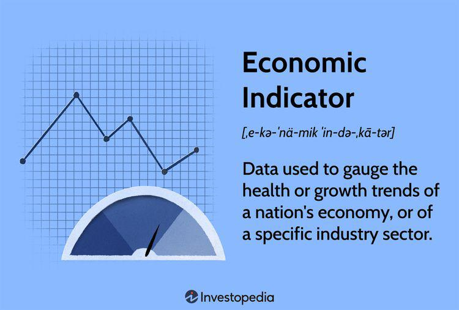

Retail sales are a critical economic indicator that plays a significant role in understanding consumer demand and economic health. As a metric, retail sales encompass the purchase of finished goods by consumers, offering insights into overall economic activity and consumer behavior. Retail sales data is meticulously tracked and reported, often influencing investment decisions and economic forecasting. By examining retail sales figures, economists and investors can decipher trends in consumer spending, which ultimately reflect economic momentum or stagnation.

Retail sales data holds considerable weight in financial markets. Positive retail sales figures typically signal robust consumer confidence and economic growth, potentially resulting in increased equity valuations and stronger currency performance in forex markets. Conversely, weak retail sales can indicate economic downturns, leading to bearish market sentiments. The impact on bond markets is significant as well—strong consumer spending can lead to expectations of higher inflation and interest rates, affecting bond yields.



Algorithmic trading strategies increasingly rely on retail sales data. Algorithms are designed to process vast amounts of economic data, including retail sales numbers, to predict market movements and execute trades at high frequencies. The integration of retail sales data into these strategies aids in refining models of market behavior, optimizing trading decisions, and managing risks. By using sophisticated algorithms, traders and fund managers can adjust their strategies in response to fluctuations in retail sales data, enhancing their competitive edge in the market.

The importance of retail sales as a powerful economic indicator reflects its multifaceted influence on economic forecasting, investment strategies, and algorithmic trading. This integration underscores the need for ongoing analysis and interpretation of retail sales data to achieve success in financial markets and economic planning.

## Table of Contents

## What Are Retail Sales?

Retail sales are an economic metric that gauges consumer demand for finished goods and services, serving as a crucial indicator of economic activity. Defined fundamentally as the total receipts at stores and related venues, retail sales capture the level of consumer spending, which is a significant component of a nation's gross domestic product (GDP).

Retail sales encompass a wide array of goods categorized into durable and non-durable goods. Durable goods are items expected to last at least three years, such as vehicles, furniture, and appliances. These goods generally see fluctuations based on economic conditions, as consumers can defer their purchase during economic downturns. Non-durable goods, in contrast, include consumables like food, clothing, and gasoline, which typically have a short lifespan. These items are indispensable to daily life, hence, their sales remain relatively stable even during economic slowdowns.

The U.S. Census Bureau plays a pivotal role in disseminating retail sales data through its Monthly Retail Trade Report. Released approximately two weeks following the month's end, this report offers a preliminary snapshot of retail sales, providing insights into consumer behavior. The data, gathered via surveys across various retail establishments, is crucial for policymakers, investors, and market analysts seeking to comprehend the prevailing economic climate.

From a macroeconomic perspective, retail sales data provide an early indication of economic health and business cycles. Strong retail sales figures imply increased consumer spending, potentially leading to higher GDP growth and stronger economic conditions. Conversely, weak sales can herald economic stagnation or contraction, prompting adjustments in economic forecasts and influencing central bank policy decisions. Thus, the retail sales data serve as a vital economic barometer, guiding decision-making across various sectors.

## Retail Sales as an Economic Indicator

Retail sales serve as a crucial leading macroeconomic indicator, offering insights into the health and direction of the economy. As a measure of consumer demand for finished goods, retail sales data provide early signals of economic trends, revealing shifts in consumer spending behavior that can presage broader economic developments.

The impact of retail sales on financial markets is multifaceted. A rise in retail sales often correlates with positive movements in equity markets. This is because increased consumer spending typically signals higher business revenues and potential profit growth, fostering investor confidence and elevating stock prices. Conversely, declining retail sales can trigger concerns about economic slowdown, leading to bearish trends in equity markets.

Retail sales data also influence bond markets. Strong retail sales figures may prompt fears of inflation, leading to expectations of [interest rate](/wiki/interest-rate-trading-strategies) hikes by central banks. As a result, bond prices typically fall in anticipation of these rate increases, as higher interest rates reduce the present value of future bond payments. In this way, fluctuations in retail sales can drive significant shifts in bond yields and pricing.

In investment strategies, retail sales figures are pivotal in risk assessment. Investors monitor these figures to gauge the economic environment, adjusting their portfolios accordingly. For instance, robust retail sales may encourage increased investment in growth-oriented stocks, while weaker figures might drive a shift toward defensive sectors or safer bonds.

Retail sales data are integral in crafting predictive models for market trends. Quantitative analysts and traders often utilize algorithms that incorporate retail sales [statistics](/wiki/bayesian-statistics) to forecast market movements. By analyzing historical retail sales patterns and their correlations with asset prices, these models can offer probabilistic insights into future market behavior, aiding in the optimization of trading strategies and risk management.

Thus, retail sales not only reflect current consumer behavior but also offer a window into future economic conditions. Their role as a leading macroeconomic indicator underscores their significance in economic forecasting and investment decision-making.

## Measurement and Analysis of Retail Sales Data

The measurement and analysis of retail sales data involve a systematic approach that encompasses data sampling, classification by industry, and statistical adjustments to ensure accuracy and relevance. An essential aspect of retail sales data measurement is its compilation through monthly surveys conducted by institutions like the U.S. Census Bureau. These surveys gather data from various retail establishments, covering diverse types of goods such as durable and non-durable items. Durable goods include long-lasting items like appliances and vehicles, while non-durable goods are more perishable or frequently purchased, such as clothing and food.

To enhance the precision of retail sales data, the concept of 'Core Retail Sales' is introduced. Core Retail Sales exclude certain volatile categories, specifically automobiles and gasoline, as they can cause significant fluctuations in the overall retail sales figures due to their price sensitivity and external market factors. By excluding these categories, Core Retail Sales provide a clearer picture of underlying consumer spending trends and economic health, devoid of temporary price shifts or supply chain disruptions.

Seasonality plays a vital role in interpreting retail sales data. Retail sales often exhibit seasonal patterns influenced by various factors such as holidays, weather changes, and school schedules. For instance, retail sales typically increase during the fourth quarter due to holiday shopping in November and December. To accurately reflect true spending patterns, seasonal adjustments are applied to the raw data. These adjustments involve statistical techniques that remove seasonal effects, allowing analysts to identify underlying trends and make more reliable comparisons over time.

Python code can be used to demonstrate the application of seasonal adjustments in retail sales data. Utilizing libraries such as `pandas` and `statsmodels`, one can easily remove seasonal components from time series data:

```python
import pandas as pd
from statsmodels.tsa.seasonal import seasonal_decompose

# Sample monthly retail sales data
data = pd.read_csv('retail_sales.csv', parse_dates=['Month'], index_col='Month')
sales = data['Sales']

# Decompose the time series into trend, seasonal, and residual components
decomposition = seasonal_decompose(sales, model='additive')

# Get seasonally adjusted sales data by removing the seasonal component
seasonally_adjusted = sales - decomposition.seasonal
```

This code snippet illustrates how seasonal effects are accounted for, yielding a more precise analysis of retail sales data. Through these methodologies, retail sales measurements become robust tools for economic analysis, guiding policy-making, and investment strategies.

## Algorithmic Trading and Retail Sales

Algorithmic trading involves the use of computer programs to execute trades at high speeds and volumes, leveraging various economic indicators—including retail sales data—to guide decision-making. Economic indicators provide insights into the market environment, which is crucial for formulating trading strategies that are both effective and timely.

Retail sales data, a key economic indicator, captures the total receipts at stores that sell goods to consumers. It reflects consumer spending patterns, which are pivotal in assessing overall economic activity. In [algorithmic trading](/wiki/algorithmic-trading), algorithms process this data to identify patterns and make trades that align with anticipated market trends. High-frequency trading ([HFT](/wiki/high-frequency-trading-strategies)) is one aspect where algorithms execute a large number of orders in fractions of a second, exploiting minute market price discrepancies.

Retail sales data's impact on stock prices is a [factor](/wiki/factor-investing) that algorithms consider when making trading decisions. For example, a significant month-over-month increase in retail sales may signal economic growth, prompting algorithms to take long positions in equities associated with consumer goods. Conversely, a downturn might trigger short positions.

In terms of risk management, retail sales data helps algorithms in adjusting stop-loss orders and refining hedging strategies. By analyzing changes in retail sales, algorithms can predict potential market shifts and adjust their risk exposure accordingly. Such strategies are enhanced by [machine learning](/wiki/machine-learning) techniques, where algorithms learn from historical data to improve their predictions and trading decisions.

An example of algorithmic trading strategy using retail sales data could be programmed in Python as follows:

```python
import pandas as pd
import numpy as np

# Assume retail_sales_data is a DataFrame with a 'sales' column showing monthly retail sales figures
retail_sales_data = pd.read_csv('retail_sales.csv')
retail_sales_data['pct_change'] = retail_sales_data['sales'].pct_change()

# Defining a basic trading signal based on percentage change in retail sales
def trading_strategy(data):
    signals = np.where(data['pct_change'] > 0.02, 'buy', 
                       np.where(data['pct_change'] < -0.02, 'sell', 'hold'))
    return signals

retail_sales_data['signals'] = trading_strategy(retail_sales_data)

# Output the trading signals
print(retail_sales_data[['sales', 'pct_change', 'signals']])
```

This code tracks monthly retail sales data percentage changes to generate simple buy, sell, or hold signals, highlighting the reliance on retail sales as a primary decision-making factor.

In summary, the integration of retail sales data within algorithmic trading frameworks is pivotal for predicting market movements and managing trading risks. It enables traders to develop robust, data-backed strategies designed to optimize returns and enhance market prediction accuracies. As algorithms evolve, they increasingly rely on such data to minimize risk and improve trading outcomes, reflecting the critical nature of retail sales data in modern finance.

## Impact of Retail Sales on Financial Markets

Retail sales data is a crucial indicator when assessing economic vitality and its subsequent effects on financial markets. A rise in retail sales typically suggests increased consumer confidence and spending, which can translate into positive sentiment across various market segments. This often leads to upward movements in equity markets as expanding retail sales indicate stronger earnings prospects for businesses, especially those directly tied to consumer goods.

### Retail Sales and Equity Markets

Healthy retail sales figures bolster equity markets as they signal robust consumer demand, a key driver of economic growth. When retail sales rise, they potentially lead to increased revenue and profit margins for companies, particularly those in sectors like consumer discretionary and consumer staples. Investors, responding to these positive projections, may drive up stock prices, anticipating higher future returns. Empirical data supports this, showing a correlation between periods of strong retail sales and bullish stock market trends.

### Retail Sales in Forex Markets

Retail sales data also affect the foreign exchange markets. A robust retail sales report can lead to an appreciation of the domestic currency, as it reflects a healthy economy and the potential for tighter monetary policy. When consumers spend more, it often leads to expectations of economic growth, drawing foreign investments. Consequently, the demand for the domestic currency increases, leading to its appreciation. Here is how you might model this relationship in Python:

```python
def currency_valuation_change(retail_sales_growth, interest_rate_diff):
    base_effect = 0.5  # Base impact of retail sales growth on currency value
    sensitivity = 1.2  # Sensitivity factor reflecting economic conditions
    return base_effect + sensitivity * (retail_sales_growth + interest_rate_diff)

# Example variables
retail_sales_growth = 0.03  # 3% growth in retail sales
interest_rate_diff = 0.01  # 1% interest rate difference
currency_change = currency_valuation_change(retail_sales_growth, interest_rate_diff)
print("Expected change in currency valuation:", currency_change)
```

### Influence on Monetary Policy

Central banks closely watch retail sales data when formulating monetary policy. Strong retail sales can indicate inflationary pressures, prompting central banks to consider tightening monetary policy by raising interest rates. Conversely, weak numbers might lead to looser policy and rate cuts to stimulate spending. This dynamic underscores the role of retail sales in shaping economic policy and, by extension, influencing financial markets. Consequently, unexpected changes in retail sales can lead to significant reevaluations of expected monetary policy, affecting bond yields and investor strategies across global markets.

In essence, retail sales data is pivotal in dictating market movements and economic policies. Its analysis provides invaluable insights for investors and policymakers alike, making it one of the most watched economic indicators.

## Challenges and Considerations

Retail sales figures, as essential as they are, present challenges rooted in their inherent [volatility](/wiki/volatility-trading-strategies) and susceptibility to external economic factors. Numerous elements like shifts in consumer behavior, seasonal influences, and unforeseen economic events can cause fluctuations, making it imperative to interpret retail sales data with caution. These fluctuations can stem from factors such as economic policy changes, natural disasters, or global events affecting consumer spending patterns. For example, during economic downturns, consumer confidence typically wanes, reducing retail sales irrespective of broader economic trends.

Given their variability, relying solely on retail sales data as an economic indicator could result in skewed analyses. Retail sales should be integrated with other macroeconomic indicators for a comprehensive economic assessment. While retail sales data can hint at future trends in consumer spending and economic growth, it is crucial to corroborate these findings with data on unemployment rates, inflation, and GDP growth.

Unexpected retail sales data can significantly impact market dynamics, prompting immediate reactions from investors. Positive surprises in retail sales figures may boost investor confidence, driving up equity markets. Conversely, disappointing retail sales can trigger market uncertainty, causing volatility as investors reassess valuations and potential economic outcomes. Such scenarios underscore the importance for market participants to maintain a diversified approach, integrating multiple data points to guide their strategies and mitigate risks associated with market unpredictability.

In conclusion, retail sales data, though valuable, requires careful contextualization within a broader economic framework. Avoiding over-reliance on this singular metric ensures more accurate, reliable insights and fosters robust financial decision-making.

## Conclusion

Retail sales serve as a fundamental economic indicator, providing essential insights into consumer demand, financial health, and economic trends. As a key component of economic forecasting, retail sales data informs important fiscal decisions and shapes the strategic direction of businesses and governments. The integration of this data into algorithmic trading strategies enhances the precision and effectiveness of market operations. Traders and investors leverage the granular details offered by retail sales figures to fine-tune their algorithms, allowing for high-frequency trades that adapt swiftly to market changes.

Algorithmic trading's reliance on retail sales data underscores the symbiotic relationship between economic indicators and technology-driven market strategies. By harnessing the predictive power of retail sales, algorithms can identify trends, evaluate market sentiments, and manage investment risks with increased accuracy. This integration not only facilitates better prediction of market movements but also optimizes trading strategies, ensuring that transactional decisions are both timely and informed.

Encouraging a deeper engagement with retail sales data allows for more nuanced market analysis and bolsters the robustness of trading strategies. With the continuous evolution of markets and economic conditions, a comprehensive understanding of retail sales data is indispensable for investors seeking to capitalize on emerging opportunities and mitigate potential threats. This engagement fosters an adaptive approach to trading, wherein strategies are continuously refined based on real-time data, ultimately enhancing the potential for trading success and economic insight.

## References & Further Reading

[1]: ["The Monthly Retail Trade Survey"](https://www.census.gov/retail/index.html) by the U.S. Census Bureau provides comprehensive data on retail sales, which is critical for economic analysis and forecasting.

[2]: ["Retail Sales as an Economic Indicator"](https://www.investopedia.com/terms/r/retail-sales.asp) on Investopedia offers a detailed explanation of how retail sales data influence economic trends and market decisions.

[3]: ["Algorithmic Trading: Winning Strategies and Their Rationale"](https://www.wiley.com/en-us/Algorithmic+Trading%3A+Winning+Strategies+and+Their+Rationale-p-9781118460146) by Ernie Chan offers insights into trading strategies utilizing economic indicators, including retail sales data.

[4]: ["Advances in Financial Machine Learning"](https://www.wiley.com/en-us/Advances+in+Financial+Machine+Learning-p-9781119482086) by Marcos Lopez de Prado discusses the integration of machine learning with economic data for improved trading strategies.

[5]: ["Quantitative Momentum: A Practitioner's Guide to Building a Momentum-Based Stock Selection System"](https://www.amazon.com/Quantitative-Momentum-Practitioners-Momentum-Based-Selection/dp/111923719X) by Wesley R. Gray and Jack R. Vogel explores strategies using retail data and other economic indicators to analyze market momentum.

[6]: ["Macroeconomic Announcements and the Impact on Financial Markets"](https://www.marketwatch.com/economy-politics/calendar) by Heiko Jacobs and Martin Weber examines how macroeconomic data, such as retail sales, affects various financial markets.