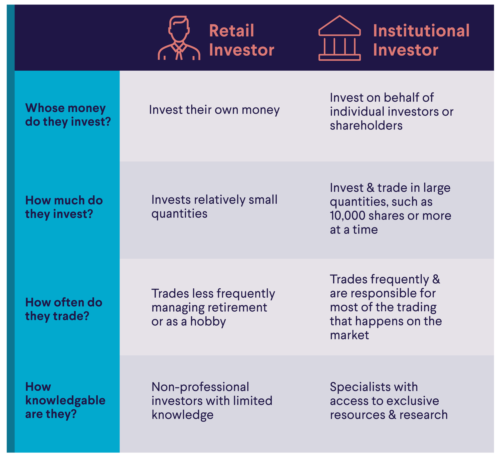

## Table of Contents

## What is a retail trader?

A retail trader is an individual who buys and sells financial products like stocks, currencies, or commodities for their personal account. They usually trade with their own money, not on behalf of someone else or a company. Retail traders often use online platforms provided by brokers to make their trades, and they might trade for short-term gains or long-term investments.

Retail traders are different from institutional traders, who work for big companies like banks or investment firms. Institutional traders handle much larger amounts of money and have access to more advanced tools and information. Retail traders, on the other hand, might not have as much money to invest or the same level of resources, but they can still make profits by being smart and using the tools available to them.

## What is an institutional trader?

An institutional trader is someone who works for a big company, like a bank, an investment firm, or a pension fund. They buy and sell things like stocks, bonds, and commodities, but they do it with a lot of money. These traders handle much larger amounts of money than regular people, so their trades can affect the prices of the things they are buying and selling. They also have access to special tools and information that help them make better decisions.

Institutional traders usually follow strict rules set by their companies. Their job is to make money for the company or the people they work for, like the investors in a mutual fund or the members of a pension fund. Because they deal with so much money, even small mistakes can cost a lot, so they need to be very careful and skilled at what they do.

## What are the main differences between retail and institutional traders?

The main difference between retail and institutional traders is the amount of money they use. Retail traders trade with their own money, which is usually much less than what institutional traders handle. Institutional traders work for big companies like banks or investment firms, and they manage huge amounts of money. This means that when an institutional trader makes a trade, it can affect the price of what they are buying or selling more than when a retail trader does.

Another big difference is the tools and information they have. Institutional traders have access to advanced tools and a lot of information that helps them make better trading decisions. Retail traders, on the other hand, use online platforms provided by brokers and might not have the same level of resources. Because of this, institutional traders can often make more informed trades, while retail traders need to rely more on their own research and strategies.

Lastly, the goals and rules they follow are different. Institutional traders have to follow strict rules set by their companies and their main goal is to make money for the company or its clients. Retail traders trade for their own benefit and can set their own goals, whether it's making quick profits or investing for the long term. This freedom can be good, but it also means retail traders need to be careful and disciplined on their own.

## How do retail traders typically access the market?

Retail traders usually access the market through online platforms that are provided by brokers. These brokers have websites or apps where people can sign up, put money into their accounts, and start trading. The platforms let traders buy and sell things like stocks, currencies, or commodities. Retail traders can do all of this from their computers or phones, which makes it easy and convenient.

There are many different brokers that retail traders can choose from. Some brokers charge a fee every time a trader makes a trade, while others might not charge anything at all. It's important for retail traders to pick a broker that fits their needs and to understand the fees they might have to pay. Once they have chosen a broker, retail traders can start learning about the market and making their own trading decisions.

## What types of tools and resources do institutional traders use?

Institutional traders use a lot of special tools and resources to help them make good trading decisions. They have access to advanced software that can show them lots of information about the market, like how prices are moving and what other big traders are doing. This software can also help them see patterns and predict what might happen next. They also get detailed research reports from experts that give them a deeper understanding of the companies and markets they are trading in. All of this helps them make smarter choices about when to buy and sell.

Another important tool for institutional traders is something called an order management system. This system helps them manage their trades and make sure they follow the rules set by their company and the law. It can handle big trades without messing up the market prices too much. Institutional traders also have direct connections to the stock exchanges, which means they can trade faster and more efficiently than retail traders. All these tools together give institutional traders a big advantage in the market.

## How does the scale of trading differ between retail and institutional traders?

The scale of trading between retail and institutional traders is very different. Retail traders trade with their own money, which is usually a smaller amount. They might buy or sell a few shares of a company or trade small amounts of currency. Because they use less money, their trades don't usually affect the market prices much. Retail traders are often just trying to make some extra money or invest for their future.

On the other hand, institutional traders work with huge amounts of money. They might be trading millions or even billions of dollars at once. When they make a trade, it can move the market prices because they are dealing with so much money. These traders work for big companies like banks or investment firms, and their job is to make money for those companies or their clients. Because of the large scale, even small mistakes can cost a lot, so institutional traders have to be very careful and skilled.

## What are the typical investment strategies used by retail traders?

Retail traders often use a strategy called [day trading](/wiki/day-trading-spy). This means they buy and sell things like stocks or currencies in the same day, trying to make quick profits from small price changes. They might spend a lot of time watching the market and use tools like charts and graphs to help them decide when to trade. Day trading can be exciting, but it's also risky because the market can be unpredictable.

Another common strategy is swing trading. This is when retail traders hold onto their investments for a few days or weeks, hoping to make money from bigger price swings. They look for patterns in the market and try to buy low and sell high. Swing trading takes a bit less time than day trading, but it still needs a lot of research and patience.

Some retail traders also like to invest for the long term. They might buy stocks or other investments and hold onto them for years, hoping the value will grow over time. This strategy is less about quick profits and more about building wealth slowly. Long-term investing can be less stressful than day or swing trading, but it still needs careful planning and a good understanding of the market.

## How do institutional traders approach investment strategies?

Institutional traders often use strategies that are more complex and long-term compared to retail traders. They might use a strategy called "[fundamental analysis](/wiki/fundamental-analysis)," where they look at a company's financial health, like its earnings and debts, to decide if it's a good investment. They also use "quantitative analysis," which involves using math and computer models to predict how investments will do. Because they handle so much money, institutional traders need to be very careful and make sure their strategies fit with the goals of the company or clients they work for.

Another common approach for institutional traders is "portfolio management." This means they spread their money across different types of investments to reduce risk. They might invest in stocks, bonds, and other things to make sure that if one investment does badly, the others can help balance it out. Institutional traders also have to follow strict rules set by their companies and the law, so they need to make sure their strategies are not only smart but also legal and ethical.

## What regulatory differences exist between retail and institutional trading?

Retail and institutional traders face different rules when they trade. Retail traders have fewer rules to follow. They need to follow the basic laws that stop them from doing bad things like insider trading, which is using secret information to make money. But they have more freedom to decide what they want to do with their own money. They just need to make sure they understand the rules of the platform they are using and any fees they might have to pay.

Institutional traders, on the other hand, have to follow a lot more rules. They work for big companies, so they need to follow the rules set by those companies and also the laws that control big financial businesses. These rules are there to make sure they don't take too many risks with the money they manage. They have to report what they are doing to make sure everything is fair and legal. This means institutional traders need to be very careful and know all the rules well.

## How does market impact vary between retail and institutional trades?

When retail traders make trades, they usually don't affect the market much. They trade with their own money, which is often a small amount. So, when they buy or sell something like a stock, it doesn't change the price a lot. Retail traders are like small fish in a big pond. They can trade without worrying too much about moving the market, but they also don't have the power to make big changes.

On the other hand, institutional traders can have a big impact on the market. They work with huge amounts of money, sometimes millions or billions of dollars. When they make a trade, it can move the price of what they are buying or selling. For example, if an institutional trader buys a lot of a certain stock, the price of that stock might go up because there is more demand. Institutional traders need to be careful because their trades can affect the market a lot.

## What are the advantages of being a retail trader over an institutional trader?

Retail traders have more freedom than institutional traders. They can make their own choices about what to buy and sell without having to follow strict rules from a big company. This means they can try out different strategies and take more risks if they want to. Retail traders can also start with a small amount of money and learn as they go, which is good for people who are new to trading.

Another advantage is that retail traders don't affect the market as much as institutional traders. When a retail trader makes a trade, it usually doesn't change the price of what they are buying or selling. This means they can trade without worrying too much about moving the market. It's less stressful and they can focus on their own goals without thinking about how their trades might affect everyone else.

## What advanced techniques do institutional traders use that retail traders might not have access to?

Institutional traders use a lot of fancy tools and techniques that retail traders might not have. One big thing they do is called [algorithmic trading](/wiki/algorithmic-trading). This means they use computers and math to make trades really fast, sometimes in just a few seconds. They can look at tons of information and make decisions based on that. Retail traders usually don't have the same kind of computers or the skills to do this, so they have to make their trades by hand, which can be slower and less exact.

Another thing institutional traders do is called high-frequency trading. This is when they make a lot of trades very quickly to make small profits that add up over time. They need special connections to the stock market to do this, which retail traders don't have. Institutional traders also use something called dark pools, which are private places to trade where other people can't see what they are doing. This helps them make big trades without moving the market too much. Retail traders don't have access to these dark pools, so they have to trade in the open market where everyone can see their moves.

## References & Further Reading

[1]: Kirilenko, A. A., Kyle, A. S., Samadi, M., & Tuzun, T. (2017). ["The Flash Crash: High-frequency trading in an electronic market."](https://onlinelibrary.wiley.com/doi/abs/10.1111/jofi.12498) Journal of Finance, 72(3), 967-998.

[2]: ["Advances in Financial Machine Learning"](https://www.amazon.com/Advances-Financial-Machine-Learning-Marcos/dp/1119482089) by Marcos Lopez de Prado

[3]: ["The Science of Algorithmic Trading and Portfolio Management"](https://www.sciencedirect.com/book/9780124016897/the-science-of-algorithmic-trading-and-portfolio-management) by Robert Kissell

[4]: ["High-Frequency Trading and Flash Crashes"](https://www.tandfonline.com/doi/full/10.1080/03085147.2016.1263034) in Economics Letters, Vol. 188, by Jonathan Brogaard, Terrence Hendershott, Andrei S. Kozhanov

[5]: ["Quantitative Trading: How to Build Your Own Algorithmic Trading Business"](https://books.google.com/books/about/Quantitative_Trading.html?id=j70yEAAAQBAJ) by Ernest P. Chan