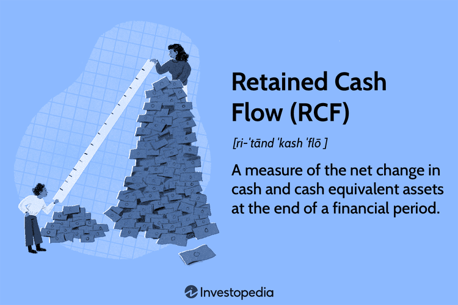

## Table of Contents

## What is retained cash flow?

Retained cash flow is the money a company keeps after paying for its operating expenses and other costs. It's what's left over from the cash the company made, which it can use to grow the business, pay down debts, or save for future use. Think of it like your personal savings after you've paid all your bills; it's the money you have left to do what you want with.

This cash is important because it shows how well a company is managing its money. If a company has a lot of retained cash flow, it means it's doing well and has money to invest in new projects or expand. On the other hand, if a company doesn't have much retained cash flow, it might need to borrow money or find other ways to get the cash it needs. So, retained cash flow is a key sign of a company's financial health.

## How is retained cash flow different from free cash flow?

Retained cash flow and free cash flow are two important measures of a company's financial health, but they focus on different things. Free cash flow is the money a company has left after it pays for its operating expenses and the money it needs to keep its business running, like buying new equipment or building new stores. It's like the money you have left after paying your bills and buying groceries - it's what you can use for fun things or to save.

Retained cash flow, on the other hand, is what's left after a company pays for everything, including any money it gives back to its owners or shareholders, like dividends. It's the money the company decides to keep inside the business. This money can be used to grow the business, pay down debts, or save for future use. So, while free cash flow tells you how much cash a company has to play with, retained cash flow tells you how much of that cash the company is choosing to keep for itself.

## Why is retained cash flow important for a business?

Retained cash flow is important for a business because it shows how much money the company is keeping after paying all its bills and giving money to its owners. This money is like a savings account for the business. It can use this money to grow bigger, maybe by opening new stores or making new products. It can also use this money to pay off loans or save for future needs. If a business has a lot of retained cash flow, it means it's doing well and has the money to do big things.

Having a good amount of retained cash flow also makes a business look strong to others. Banks might be more willing to lend money to a business that has a lot of retained cash flow because it shows the business can pay back the loan. Investors might want to buy part of the business because they see it's doing well and saving money. So, retained cash flow is not just about keeping money; it's about showing the world that the business is healthy and ready for the future.

## How can a company calculate its retained cash flow?

To calculate retained cash flow, a company starts with its net income, which is the money it made after paying all its costs. Then, it adds back any non-cash expenses, like depreciation, because these are costs that don't actually take cash out of the business. After that, the company subtracts any money it spent on new equipment or buildings, which is called capital expenditures. It also subtracts any money it paid to its owners or shareholders, like dividends. What's left over is the retained cash flow.

This number tells the company how much cash it's keeping inside the business. It's important because it shows if the company has enough money to grow, pay off debts, or save for the future. A high retained cash flow means the company is doing well and has money to do big things. A low retained cash flow might mean the company needs to borrow money or find other ways to get the cash it needs.

## What are the common uses of retained cash flow within a company?

Retained cash flow is like a company's savings account. It's the money the company decides to keep after paying all its bills and giving money to its owners. This money can be used in many ways to help the business grow and stay strong. One common use is to invest in new projects. This could mean opening new stores, making new products, or starting new services. By using retained cash flow for these things, the company can grow bigger and maybe make more money in the future.

Another important use of retained cash flow is to pay down debts. Just like people, companies sometimes need to borrow money to do big things. Using retained cash flow to pay off these loans can save the company money on interest and make it look healthier to others. It's also smart to use some of this money to save for future needs. This could be for unexpected costs or for big plans the company has down the road. By saving some of its retained cash flow, the company can be ready for whatever comes next.

## Can retained cash flow be negative, and what does that indicate?

Yes, retained cash flow can be negative. This happens when a company spends more money than it makes after paying all its bills and giving money to its owners. It's like if you spent more money than you earned in a month, even after paying all your bills. When a company's retained cash flow is negative, it means it's using up its savings or borrowing money to keep going.

A negative retained cash flow can be a warning sign. It might mean the company is not doing well and needs to find more money to keep running. It could be because the company is spending a lot on new projects or because it's not making enough money from its business. If a company has negative retained cash flow for a long time, it might need to make big changes to start saving money again.

## How does retained cash flow impact a company's financial strategy?

Retained cash flow is like a company's piggy bank. It's the money the company decides to keep after paying all its bills and giving money to its owners. This money is really important because it helps the company plan for the future. If a company has a lot of retained cash flow, it can use this money to grow bigger. It might open new stores, make new products, or start new services. This can help the company make more money down the road. The company can also use this money to pay off loans, which saves money on interest and makes the company look healthier to others.

On the other hand, if a company's retained cash flow is low or even negative, it changes how the company plans its future. A low retained cash flow means the company might not have enough money to grow or pay off debts. It might need to borrow more money or find other ways to get cash. A negative retained cash flow means the company is spending more than it's making, which can be a big problem. The company might need to cut costs, find new ways to make money, or make other big changes to start saving money again. So, retained cash flow is a big part of a company's financial strategy because it shows how much money the company has to work with.

## What are the tax implications of retained cash flow?

When a company keeps its retained cash flow, it's not usually taxed right away. That's because this money is still inside the company and hasn't been given to the owners yet. If the company uses this money to grow bigger or pay off loans, it won't have to pay taxes on it until it decides to give some of it to the owners. When the company does give money to its owners, like through dividends, then those owners have to pay taxes on that money. So, keeping money as retained cash flow can help a company save on taxes for a while.

But, there are some things to watch out for. If a company keeps too much money as retained cash flow and doesn't use it to grow or pay off debts, the government might say the company is just trying to avoid paying taxes. In some places, there are rules that say companies have to pay taxes on their profits even if they don't give the money to their owners. So, it's important for a company to use its retained cash flow in smart ways to avoid any tax problems.

## How do investors analyze retained cash flow to assess a company's health?

Investors look at a company's retained cash flow to see how healthy the business is. They want to know if the company is making enough money to keep some for itself after paying all its bills and giving money to its owners. If a company has a lot of retained cash flow, investors think it's doing well. It means the company has money to grow bigger, maybe by opening new stores or making new products. Investors like this because it shows the company is strong and has plans for the future.

On the other hand, if a company's retained cash flow is low or negative, investors might worry. A low retained cash flow means the company might not have enough money to do big things like grow or pay off loans. A negative retained cash flow means the company is spending more than it's making, which can be a big problem. Investors might think the company needs to make changes to start saving money again. So, by looking at retained cash flow, investors can get a good idea of how well a company is doing and what its future might look like.

## What strategies can a company employ to optimize its retained cash flow?

A company can optimize its retained cash flow by focusing on increasing its net income. This means finding ways to make more money from its business, like selling more products or services, or raising prices if it can. The company can also cut costs, which means spending less money on things like rent, supplies, or employee salaries. By making more money and spending less, the company will have more cash left over after paying all its bills, which means more retained cash flow.

Another strategy is to be smart about how the company uses its money. Instead of spending a lot on new projects or equipment, the company can choose to invest in things that will make more money in the future. It can also use some of its retained cash flow to pay off loans, which saves money on interest. By being careful with its spending and saving money where it can, the company can keep more cash inside the business.

Lastly, a company can look at how much money it gives back to its owners. If it's paying out a lot of dividends, it might want to lower these payments to keep more cash inside the business. This can help the company have more retained cash flow, which it can use to grow or save for future needs. By balancing what it pays to its owners with what it keeps for itself, the company can make sure it has enough money to stay strong and healthy.

## How does retained cash flow relate to dividend policy?

Retained cash flow is the money a company keeps after paying all its bills and giving money to its owners. This money can be used to grow the business, pay off debts, or save for future needs. The amount of retained cash flow a company has can affect its dividend policy, which is the plan for how much money it gives back to its owners. If a company has a lot of retained cash flow, it might decide to pay out more dividends because it has extra money to share. On the other hand, if the company has less retained cash flow, it might choose to pay out fewer dividends to keep more money inside the business.

A company's dividend policy can also impact its retained cash flow. If a company decides to pay out a lot of dividends, it will have less money left over as retained cash flow. This might be okay if the company is doing well and still has enough money to grow and pay off debts. But if the company is not making enough money, paying out big dividends can lead to low or negative retained cash flow, which can be a problem. So, a company needs to balance its dividend payments with its need to keep money inside the business to make sure it stays healthy and can grow in the future.

## What are the industry-specific considerations for retained cash flow management?

Different industries have different needs when it comes to managing retained cash flow. For example, in the tech industry, companies often need a lot of money to keep up with fast changes and new technology. They might use their retained cash flow to invest in research and development or to buy new equipment. This means they might keep more money inside the business instead of paying it out as dividends. On the other hand, in more stable industries like utilities, companies might not need to spend as much on new projects. They might have more retained cash flow to share with their owners through dividends.

Another thing to think about is how much money a company needs to keep on hand for unexpected costs. In industries like oil and gas, prices can go up and down a lot. Companies in these industries might want to keep more retained cash flow as a safety net, just in case prices drop and they need extra money. In contrast, industries like retail might have more predictable costs. They might not need to keep as much money in reserve and can use their retained cash flow for other things, like opening new stores or paying off debts. So, the best way to manage retained cash flow can be different for each industry, depending on what the company needs to stay strong and grow.

## What is Retained Cash Flow?

Retained Cash Flow (RCP) is a key financial metric representing the net change in a company's cash and cash equivalent assets at the conclusion of a financial period. It considers the residual funds remaining after the company fulfills its financial obligations, such as debt repayments and dividend distributions. This distinction highlights RCP as a precise measure of the available cash and cash equivalents, distinct from retained earnings, which typically denote profits preserved for reinvestment within the company.

The formula for calculating RCP is as follows:

$$
\text{RCP} = \text{Operating Cash Flow} - (\text{Dividends} + \text{Debt Repayments})
$$

RCP is strategically significant for reinvestment purposes. Companies often allocate RCP to projects with a positive net present value (NPV), ensuring that investments contribute positively to business growth. This reinvestment strategy not only fosters expansion but also enhances a company's long-term financial health.

For businesses, comprehending and accurately calculating retained cash flow enables effective budgeting and financial forecasting. By having a clear picture of the RCP, companies can align their financial strategies with their growth objectives, ensuring resources are optimally allocated toward projects that promise maximum returns. This practice underpins robust financial planning and empowers businesses to make informed investment decisions, thereby securing their competitive position in the market.

## References & Further Reading

[1]: Bergstra, J., Bardenet, R., Bengio, Y., & Kégl, B. (2011). ["Algorithms for Hyper-Parameter Optimization."](https://dl.acm.org/doi/10.5555/2986459.2986743) Advances in Neural Information Processing Systems 24.

[2]: ["Advances in Financial Machine Learning"](https://www.amazon.com/Advances-Financial-Machine-Learning-Marcos/dp/1119482089) by Marcos Lopez de Prado

[3]: ["Evidence-Based Technical Analysis: Applying the Scientific Method and Statistical Inference to Trading Signals"](https://www.amazon.com/Evidence-Based-Technical-Analysis-Scientific-Statistical/dp/0470008741) by David Aronson

[4]: ["Machine Learning for Algorithmic Trading"](https://github.com/stefan-jansen/machine-learning-for-trading) by Stefan Jansen

[5]: ["Quantitative Trading: How to Build Your Own Algorithmic Trading Business"](https://www.amazon.com/Quantitative-Trading-Build-Algorithmic-Business/dp/1119800064) by Ernest P. Chan