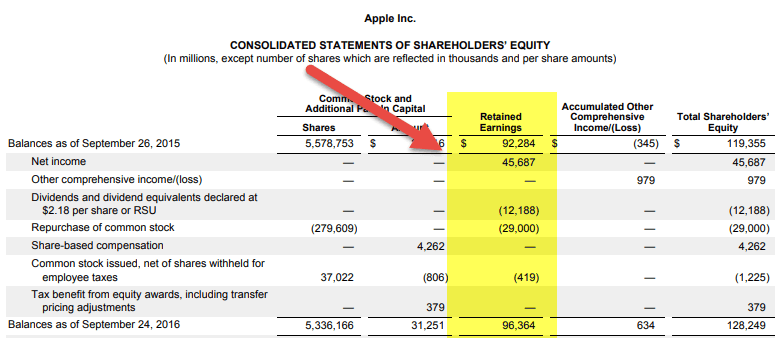

In today's fast-paced world of business and finance, understanding key financial terms and concepts is crucial. This article addresses retained earnings, a vital aspect of financial accounting that is essential in corporate finance and its association with algorithmic trading.

Retained earnings constitute the portion of a company's profit that is not distributed to shareholders as dividends. Instead, these earnings are reinvested back into the business. This reinvestment plays a significant role in a company’s financial health and strategic planning. Understanding retained earnings helps gauge a company’s management effectiveness in handling its profits, providing valuable insights into its potential for expansion and innovation. 



By bridging the gap between financial statements and future growth, retained earnings serve as an indicator of how well a company manages and allocates its profits. It reflects a company's capacity to fund new ventures, enhance existing operations, or pay down debt, thereby contributing to its strategic growth endeavors.

Furthermore, this article will highlight how retained earnings are integrated into broader corporate finance strategies. These strategies are becoming increasingly relevant in algorithmic trading, where financial metrics guide decision-making processes. Algorithmic trading relies on analyzing vast amounts of financial data rapidly, and understanding a company's retained earnings can offer critical insights into its stability and growth potential.

We will provide a comprehensive overview of retained earnings and explore their implications for investors, analysts, and corporate decision-makers. This understanding is pivotal in making informed decisions, optimizing investment portfolios, and crafting effective corporate strategies.

## Table of Contents

## Understanding Retained Earnings

Retained earnings represent the accumulated portion of net earnings that a company retains for reinvestment back into the business, rather than distributing it to shareholders as dividends. They are a key indicator of a company's ability to generate surplus profits and manage these profits effectively, making them a crucial measure of financial health. The fundamental formula for calculating retained earnings is:

$$
\text{Retained Earnings} = \text{Beginning Retained Earnings} + \text{Net Income/Loss} - \text{Dividends}
$$

This equation highlights the dynamic nature of retained earnings, emphasizing the interplay of initial retained earnings, net income or loss from the reporting period, and dividends paid to shareholders.

The decision to reinvest earnings or distribute them hinges on the company's growth strategy and market positioning. Companies in growth phases often prefer to reinvest earnings to fuel expansion and innovation, enhancing their competitive edge and future profitability. Conversely, well-established companies might choose to distribute larger dividends, providing returns to shareholders while signaling stability and consistent income generation.

Several factors influence retained earnings, including net income outcomes, strategic investments, and dividend policies. A company's strategic choices regarding projects and acquisitions, operational efficiency, and the board's approach to dividends plays a role in shaping retained earnings. Positive net income increases retained earnings, while losses or substantial dividend distributions decrease them.

In summary, retained earnings offer insights into how a company balances rewarding shareholders with preparing for future opportunities. Their analysis is pivotal for evaluating financial robustness and aligning with corporate strategies focused on sustained growth and market performance.

## The Role of Retained Earnings in Corporate Finance

Retained earnings play a significant role in corporate finance, serving as a key internal source of funding that enables companies to capitalize on future business opportunities without relying on external financing. By retaining a portion of their profits instead of distributing them entirely as dividends, companies can build a financial buffer that helps absorb financial shocks and reduce the dependency on borrowings. This financial cushion is critical when facing unexpected financial downturns or economic uncertainties, as it provides a level of self-financing that can mitigate risk.

In addition to providing a safety net, retained earnings are crucial for funding research and development (R&D) projects, which are essential for innovation and maintaining a competitive edge in fast-evolving industries. Companies committed to continuous improvement and technological advancement often reinvest their retained earnings to foster long-term growth and market leadership. Moreover, these earnings can be allocated to support mergers and acquisitions—a strategic maneuver that allows firms to expand their market share, diversify product lines, and achieve economies of scale.

Retained earnings also reflect a company's ability to generate surplus funds from operations, showcasing its historical financial performance. On the balance sheet, retained earnings are part of the shareholders' equity and provide an indicator of the accumulated amount of net income that has been reinvested in the business. This figure highlights management's strategic choices and efficiency in using resources to generate additional profits.

The presence of robust retained earnings underscores a company's potential for sustainable growth, emphasizing strategic foresight and management discipline. By effectively utilizing retained earnings, companies can strengthen their competitive positions, ensuring they remain resilient and adaptable in the face of evolving market demands and economic challenges.

## Algorithmic Trading and Retained Earnings

Algorithmic trading revolutionizes financial markets by utilizing complex algorithms and high-speed data analysis to make trading decisions at speeds far surpassing human capabilities. These algorithms can process a multitude of data points to identify trends, patterns, and opportunities that would be challenging for human traders to observe in real-time. The integration of retained earnings in these algorithms can serve as a vital input for assessing a company's financial stability and growth prospects.

Retained earnings are a reflection of a company’s profitability and strategic reinvestment in its own business. A strong retained earnings report is an indicator of a company's ability to generate surplus funds. Such financial stability can be an attractive feature for [algorithmic trading](/wiki/algorithmic-trading) strategies focused on long-term growth rather than volatile, short-term gains. Identifying companies with significant retained earnings can thus lead to selecting stocks with sustainable growth potential, enhancing the predictive power of trading algorithms.

Algorithmic systems can incorporate retained earnings through various computational techniques such as [fundamental analysis](/wiki/fundamental-analysis), where financial health indicators are analyzed to forecast market behavior. By embedding this data into algorithms, trading systems can evaluate stocks not only on market conditions but also on firm financials, leading to more holistic investment strategies.

For instance, a simplified Python example for integrating retained earnings might look like this:

```python
import pandas as pd

# Sample financial data including retained earnings
data = {'Company': ['A', 'B', 'C'],
        'Retained_Earnings': [500000, 1500000, 800000],
        'Stock_Price': [75, 150, 95]}

df = pd.DataFrame(data)

# Calculate a growth metric considering retained earnings
df['Growth_Potential'] = df['Retained_Earnings'] / df['Stock_Price']

# Select stocks with high growth potential
selected_stocks = df[df['Growth_Potential'] > 10000]

print(selected_stocks)
```

In this simplified model, the algorithm evaluates companies based on a calculated "Growth Potential" metric derived from retained earnings and stock price. This approach enables algorithmic systems to prioritize companies demonstrating consistent growth capabilities, potentially enhancing trading strategies' returns.

Moreover, advanced trading systems utilize [machine learning](/wiki/machine-learning) to enhance prediction accuracy. These systems can train models on historical financial data, including retained earnings, to predict future stock trends. Such a model might involve training a [neural network](/wiki/neural-network) with a diverse set of financial indicators to assess how changes in retained earnings affect stock performance and make real-time trading decisions based on these assessments.

Incorporating retained earnings into algorithmic trading strategies allows for a nuanced analysis of company fundamentals, supplementing technical market analyses with robust financial metrics. As the financial industry increasingly leans toward data-driven decision-making, understanding and utilizing retained earnings can offer a strategic advantage in executing successful algorithmic trades.

## Case Studies and Practical Examples

Examining real-world instances of retained earnings utilization provides valuable insight into how companies strategically manage their financial resources. A notable example is Apple Inc., which showcases the effective use of retained earnings for market expansion and innovation.

Apple has consistently used its retained earnings to fund research and development (R&D), leading to groundbreaking products such as the iPhone, iPad, and Apple Watch. By leveraging its retained earnings, Apple has been able to maintain a competitive edge in the technology industry. This strategy has also contributed to significant stock price appreciation, reflecting investor confidence in Apple's ability to innovate and grow.

The retained earnings strategy employed by Apple is evidenced in their financial statements. According to Apple's annual reports, the company regularly sets aside a significant portion of its net income, reinvesting it into R&D and capital projects rather than distributing it entirely as dividends. This allocation allows Apple to not only enhance its product offerings but also expand its market reach globally.

In contrast, other companies may exhibit different approaches to retained earnings. For instance, dividend-focused companies like Procter & Gamble prioritize returning capital to shareholders, offering higher dividend payouts. This strategy appeals to investors seeking consistent income, though it might limit the funds available for reinvestment.

These varied strategies underscore the strategic choices companies make based on their growth objectives and market environments. Analyzing case studies like Apple's highlights how retaining earnings can drive innovation and financial success. Furthermore, it illustrates how different industries might prioritize dividend payments versus reinvestment, influencing their long-term trajectories.

In summary, case studies and practical examples of retained earnings management reveal the diverse approaches companies adopt to balance investor returns and reinvestment for growth. These examples provide a framework for understanding the strategic implications of retained earnings in corporate finance.

## Conclusion

Retained earnings constitute a core component of financial accounting and play a vital role in driving corporate growth while influencing investment strategies. They represent the accumulated portion of net income that a company elects to keep rather than distribute to shareholders as dividends. This compound effect of retained earnings not only strengthens a company's financial foundation but also provides it with the means to pursue expansion and innovation opportunities internally.

For investors and analysts, a profound understanding of how companies manage and utilize their retained earnings is crucial. This insight provides a clearer picture of a company’s financial health, long-term sustainability, and strategic foresight. Furthermore, the retained earnings balance, often visible on a balance sheet, serves as a historical record of financial performance, offering cues about a company’s capability to generate and sustain growth via internal funds.

With the advent and growth of algorithmic trading, leveraging financial metrics such as retained earnings could significantly enhance trading efficiency and bolster investment portfolios. Algorithmic systems that integrate insights from retained earnings with their trading strategies could potentially optimize decision-making processes and improve outcomes. As these algorithms increasingly incorporate aspects of fundamental analysis, the focus on retained earnings becomes even more pivotal; robust retained earnings can be a signal of a fundamentally strong company poised for growth.

In essence, the strategic use of retained earnings remains interconnected with the future trajectory of corporate finance and trading. As companies continually navigate the complexities of the modern financial landscape, retained earnings emerge as a testament to their resilience and capacity for smart, sustainable growth.

## References & Further Reading

[1]: ["Retention of Earnings."](https://www.investopedia.com/terms/r/retainedearnings.asp) Investopedia.

[2]: ["Retained Earnings Explained."](https://www.investopedia.com/terms/r/retainedearnings.asp) The Balance.

[3]: ["Advances in Financial Machine Learning"](https://www.amazon.com/Advances-Financial-Machine-Learning-Marcos/dp/1119482089) by Marcos Lopez de Prado.

[4]: ["Machine Learning for Algorithmic Trading"](https://github.com/stefan-jansen/machine-learning-for-trading) by Stefan Jansen.

[5]: ["Quantitative Trading: How to Build Your Own Algorithmic Trading Business"](https://www.amazon.com/Quantitative-Trading-Build-Algorithmic-Business/dp/1119800064) by Ernest P. Chan.

[6]: ["Evidence-Based Technical Analysis: Applying the Scientific Method and Statistical Inference to Trading Signals"](https://www.amazon.com/Evidence-Based-Technical-Analysis-Scientific-Statistical/dp/0470008741) by David Aronson.

[7]: ["Understanding Financial Statements"](https://online.hbs.edu/blog/post/how-to-read-financial-statements) by Lyn M. Fraser and Aileen Ormiston.

[8]: ["Financial Accounting: An Introduction"](https://archive.org/details/financialaccount0000weet) by Pauline Weetman.