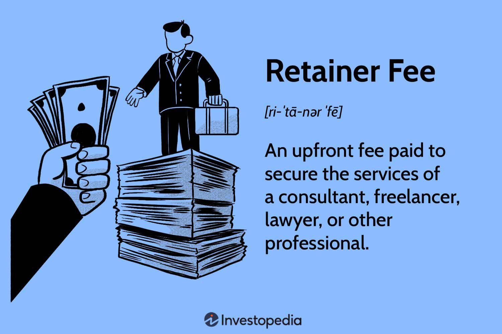

Algorithmic trading, commonly referred to as algo trading, involves using computer algorithms to make trading decisions at speeds and frequencies that are impossible for human traders. As this form of trading continues to dominate financial markets, the legal considerations surrounding it have become increasingly critical. Compliance with regulatory standards and the protection of stakeholders' interests are paramount in this technology-driven trading landscape.

Understanding the legal landscape is vital for both traders and firms engaged in algorithmic trading. Key components of this understanding include legal fees, retainer fees, and service agreements. Legal fees encompass the various charges associated with securing legal services, which can range from drafting contracts to ensuring regulatory compliance. The complexity of trading strategies and the depth of legal expertise required can cause significant variation in these costs.

Retainer fees are another essential aspect, representing upfront payments made to secure ongoing legal support. For algo traders, retainer fees offer a form of security, ensuring that expert legal advice is available whenever necessary. Service agreements, or contracts that outline the terms and conditions of services provided, are crucial in defining the scope of legal services and expectations of all parties involved.

In the fast-evolving context of algorithmic trading, having a robust legal framework is indispensable. As trading becomes increasingly automated and reliant on technology, legal considerations must be firmly in place to manage risks and ensure smooth operations. By examining how legal fees, retainer fees, and service agreements influence the structure of algo trading, traders and firms can better navigate this complex environment and maintain compliance with legal requirements.

## Table of Contents

## Understanding Legal Fees in Algo Trading

Legal fees represent the financial charges incurred for securing legal services, which are indispensable in the context of algorithmic trading. These fees are not standardized and can differ significantly based on several factors, primarily the complexity of the trading strategies involved and the expertise level of the legal advisor engaged.

Firstly, the complexity of trading strategies plays a pivotal role in determining legal fees. More intricate strategies often require extensive legal review to ensure compliance with applicable regulations and to mitigate potential risks. Additionally, these strategies may involve sophisticated financial instruments or novel technological applications, necessitating specialized legal assessments and advice.

Secondly, the expertise of the legal advisor is another critical determinant. High-profile legal advisors or firms with extensive experience in financial regulations and [algorithmic trading](/wiki/algorithmic-trading) laws usually command higher fees. Their expertise can provide valuable insights into navigating the complex legal landscape of trading, thereby offering a level of protection and assurance to traders and firms.

In the context of algo trading, legal fees typically encompass costs related to drafting and reviewing contracts. This process involves ensuring that trading contracts align with legal standards and clearly outline the roles and responsibilities of all parties involved. Compliance consultations also form a significant part of legal fees, where advisors help traders and firms understand and adhere to regulatory requirements. Finally, legal fees may include charges for litigation support, offering services that prepare for potential disputes or regulatory inquiries.

Budgeting for legal fees is crucial for traders and firms to maintain legal compliance and manage risks effectively. Without adequate provision for these expenses, traders risk non-compliance, which may lead to significant financial penalties or legal complications. Therefore, careful financial planning with respect to legal costs is necessary to sustain ongoing operations in algorithmic trading.

Lastly, the choice of legal representation is a strategic decision impacting both the cost and efficacy of legal services. Engaging a well-qualified legal advisor can lead to more effective navigation of legal complexities, potentially reducing the likelihood of costly disputes or compliance failures. Thus, while the initial fees might be higher, such an investment could yield long-term savings and operational security.

In summary, understanding the nuances of legal fees in algorithmic trading is essential. It enables traders and firms to budget appropriately, select suitable legal advisors, and maintain operations that are both compliant and efficient.

## Role of Retainer Fees in Algo Trading Legal Services

A retainer fee is a pre-payment made to secure the services of a legal professional or firm and is particularly advantageous in the domain of algorithmic trading. These fees are pivotal in ensuring that traders and firms have continuous access to necessary legal support and advice, which is crucial in an industry that is both highly regulated and susceptible to rapid change. By establishing a retainer relationship, traders can ensure that they receive timely legal guidance, thus allowing them to respond swiftly to any legal queries or issues that arise.

The primary advantage of utilizing a retainer fee structure within algo trading is the immediate availability of legal expertise. It allows traders and firms to consult their legal advisors without the burden of renegotiating fees or contracts for every individual service request. This setup guarantees that legal advisors are readily available to address routine compliance checks, updates on regulatory changes, or provide counsel during any unexpected legal challenges.

A well-drafted retainer agreement also clearly outlines the scope of services covered by the retainer fee, ensuring transparency and preventing any potential misunderstandings about the legal services provided. This clarity is critical in defining what services are included within the retainer fee and which ones may incur additional costs. The agreement typically specifies the hourly rates, services included, such as contract reviews or compliance monitoring, and the terms of renewal.

Moreover, retainer fees facilitate more efficient management of legal costs over time. By having a predictable legal expense, firms can allocate their budget more effectively, avoiding large, unexpected legal bills. The regular, structured payments inherent in retainer agreements help in financial planning and establish a steady cash flow for the legal firm, fostering a stable professional relationship.

In summary, retainer fees serve as both a practical financial mechanism and a strategic tool in securing ongoing legal support in the algorithmic trading sector. By maintaining a reliable source of legal guidance, traders and firms can more confidently navigate the complexities of regulatory compliance and risk management.

## Importance of Service Agreements in Algorithmic Trading

Service agreements in algorithmic trading are pivotal in defining the operational framework and ensuring the protection of interests across all involved parties. These agreements set clear expectations and responsibilities, crucial for the dynamic and complex environment of algo trading. They encompass various essential components such as confidentiality, intellectual property rights, and dispute resolution, which safeguard the interests of traders, developers, and firms alike.

Confidentiality clauses within service agreements ensure that sensitive information, including proprietary algorithms and trading strategies, remains protected from unauthorized disclosure. This protection is vital given the competitive advantage that unique algorithms can provide in the financial markets. Similarly, clauses pertaining to intellectual property rights delineate the ownership and use of developed technologies and algorithms, preventing potential conflicts and ensuring clear usage rights.

Dispute resolution mechanisms, another critical facet of service agreements, provide structured processes for resolving conflicts that may arise during trading operations. These processes reduce the likelihood of costly litigation and facilitate smoother communication between parties, thereby enhancing operational efficiency.

It is imperative for service agreements to be regularly reviewed and updated to remain compliant with evolving legal and regulatory standards. As algorithmic trading technologies advance and regulations develop, ensuring that agreements reflect these changes is essential for maintaining legal compliance and minimizing risks.

By establishing comprehensive service agreements, algo traders and firms can prevent misunderstandings and legal disputes, contributing to more seamless and effective trading operations. These agreements not only define the scope of services but also create a stable foundation that can adapt to the fast-paced and ever-changing landscape of algorithmic trading.

## Legal Considerations in Algo Trading: Key Challenges and Solutions

Algorithmic trading, commonly known as algo trading, presents unique legal challenges, primarily centered on data privacy and regulatory compliance. These issues require special attention due to the automated and high-frequency nature of trading activities, which can lead to complex legal and ethical concerns.

One significant challenge in algo trading is data privacy. With the growing use of big data analytics and [artificial intelligence](/wiki/ai-artificial-intelligence) in trading algorithms, firms often handle large volumes of sensitive information. This necessitates compliance with data protection regulations like the General Data Protection Regulation (GDPR) in the European Union and the California Consumer Privacy Act (CCPA) in the United States. Non-compliance with these regulations can result in severe penalties and damage to a firm's reputation. Thus, firms must put in place robust data governance frameworks to ensure that data is processed lawfully and securely.

Regulatory compliance is another crucial aspect. Algo trading firms must navigate a complex landscape of financial regulations, which vary across different jurisdictions. Key regulations include the Markets in Financial Instruments Directive II (MiFID II) in the EU and the Dodd-Frank Act in the US, which impose specific requirements on trading activities, such as transaction reporting and risk management measures. Maintaining compliance with these regulatory frameworks often requires sophisticated monitoring systems and frequent updates to keep pace with legal developments.

To manage these challenges effectively, firms should collaborate with experienced legal professionals who specialize in financial services and technology law. Legal advisors can offer valuable insights into the interpretation and application of relevant laws and help firms design compliance strategies tailored to the specific demands of algo trading. Such collaborations are essential for addressing legal ambiguities and ensuring that trading activities align with applicable regulations.

Implementing comprehensive compliance programs is a proactive approach to anticipating and mitigating potential legal issues. These programs involve regular audits, employee training, and the development of internal policies to ensure adherence to legal standards. Additionally, technology solutions such as automated compliance software can support regulatory reporting and monitoring efforts, reducing the burden on compliance teams.

Finally, tailoring legal strategies to the unique needs of algo trading can enhance a firm's operational efficiency and risk management capabilities. This entails understanding the specific legal risks associated with various trading algorithms and incorporating risk mitigation measures into their design and deployment. By prioritizing legal compliance and leveraging appropriate legal expertise, algo trading firms can navigate the complexities of the trading landscape more effectively, minimizing potential legal repercussions and optimizing trading performance.

## Conclusion

Understanding legal fees, retainer fees, and service agreements is crucial for ensuring legal compliance and successful operations in algorithmic trading. Traders and firms must prioritize these legal considerations to safeguard their interests and adhere to regulatory requirements. Proactive legal planning not only mitigates potential risks but also enhances the likelihood of achieving greater success in trading activities.

As the algorithmic trading industry continues to evolve, staying informed about emerging legal changes and new compliance mandates is vital. This vigilance helps in adapting to the dynamic legal environment and in implementing robust legal strategies. Traders benefit from investing in a comprehensive legal infrastructure that includes knowledgeable legal counsel, which assists in navigating the complexities of the trading landscape with confidence.

While the technical aspects of algorithmic trading often draw primary attention, the legal framework underpins the structural integrity of trading operations. Therefore, a balance between technological innovation and legal diligence ensures that traders can pursue their ambitions while minimizing legal exposure and compliance-related challenges.

## References & Further Reading

[1]: Lopez de Prado, M. (2018). ["Advances in Financial Machine Learning."](https://www.amazon.com/Advances-Financial-Machine-Learning-Marcos/dp/1119482089) John Wiley & Sons.

[2]: Aronson, D. R. (2006). ["Evidence-Based Technical Analysis: Applying the Scientific Method and Statistical Inference to Trading Signals."](https://www.amazon.com/Evidence-Based-Technical-Analysis-Scientific-Statistical/dp/0470008741) John Wiley & Sons.

[3]: Jansen, S. (2020). ["Machine Learning for Algorithmic Trading."](https://github.com/stefan-jansen/machine-learning-for-trading) Packt Publishing.

[4]: Chan, E. P. (2009). ["Quantitative Trading: How to Build Your Own Algorithmic Trading Business."](https://github.com/ftvision/quant_trading_echan_book) John Wiley & Sons.

[5]: Mizrach, B. (2010). ["The next generation of high-frequency trading: Pricing and regulatory challenges."](https://onlinelibrary.wiley.com/doi/full/10.1002/fut.22556) The Journal of Trading, 5(3), 21-39.