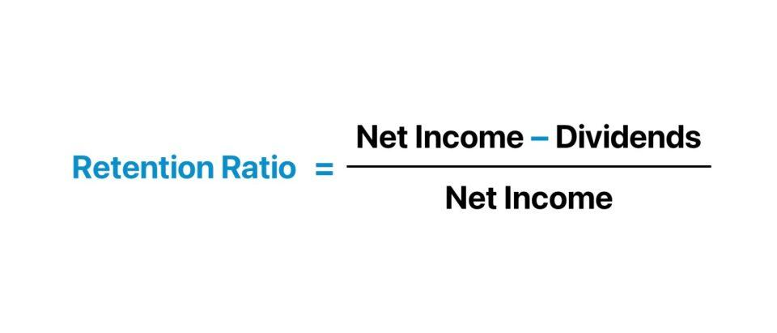

The financial world is filled with numerous metrics and ratios that help evaluate a company's health and growth prospects. One such metric that plays a pivotal role in this assessment is the retention ratio. It serves as a crucial indicator, offering insights into a company's ability to reinvest its earnings and its overall growth potential. By analyzing how much profit a company retains as opposed to distributing as dividends, the retention ratio helps investors and analysts gauge the strategic focus of a company. Whether a business is aiming for expansion or preferring to reward shareholders with dividends can be discerned from this ratio.

In this comprehensive guide, the focus is on understanding the intricate details of the retention ratio. We will explore how it's calculated, the implications it has for assessing financial health, and how it plays a role in algorithmic trading. The retention ratio not only reflects a company's potential to grow but also acts as a lens through which investors can understand a company's long-term strategic priorities and market positioning.



## Table of Contents

## Understanding Retention Ratio

The retention ratio is a financial metric that quantifies the proportion of net earnings a company retains for reinvestment rather than distributing to shareholders as dividends. It is fundamentally important in evaluating how a company allocates its profits, providing insights into the company's strategy and growth potential. A higher retention ratio suggests that a company is focused on reinvesting earnings into business activities, such as research and development, capital expenditures, or debt reduction, all of which are aimed at fostering long-term growth. Conversely, a lower retention ratio may imply that a company is concentrating on returning profits to shareholders through dividends, which is often seen in more mature industries.

Mathematically, the retention ratio can be computed using the following formula:

$$
\text{Retention Ratio} = \frac{\text{Net Income} - \text{Dividends Distributed}}{\text{Net Income}}
$$

Alternatively, it can be expressed as the complement of the payout ratio:

$$
\text{Retention Ratio} = 1 - \text{Payout Ratio}
$$

This calculation highlights the dual nature of earnings allocation, with retained earnings representing the funds available for reinvestment in growth opportunities. By analyzing the retention ratio, stakeholders can infer a company's reinvestment strategies and potential for future expansion.

## Retention Ratio Formula

The retention ratio is a key financial metric that defines the proportion of net earnings a company retains for reinvestment purposes. This ratio can be calculated using two main approaches. The first method involves using retained earnings and net income. Mathematically, it is represented as:

$$
\text{Retention Ratio} = \frac{\text{Net Income} - \text{Dividends Distributed}}{\text{Net Income}}
$$

This formula highlights the fraction of net income that remains in the company after dividends are paid out to shareholders, thereby signifying the earnings reserved for future reinvestment and growth opportunities. The second approach focuses on the inverse relationship between dividends and retained earnings by employing the payout ratio. The Retention Ratio can alternatively be calculated as:

$$
\text{Retention Ratio} = 1 - \text{Payout Ratio}
$$

In Python, the computation of the retention ratio using either method can be easily implemented. Below is a sample implementation:

```python
def calculate_retention_ratio(net_income, dividends_distributed=None, payout_ratio=None):
    if dividends_distributed is not None:
        return (net_income - dividends_distributed) / net_income
    elif payout_ratio is not None:
        return 1 - payout_ratio
    else:
        raise ValueError("Either dividends_distributed or payout_ratio must be provided.")

# Example usage:
net_income = 1000000  # Example net income
dividends_distributed = 200000  # Example dividends distributed

# Compute using dividends distributed
retention_ratio_dividends = calculate_retention_ratio(net_income, dividends_distributed=dividends_distributed)
print(f"Retention Ratio (using dividends): {retention_ratio_dividends:.2f}")

# Compute using payout ratio
payout_ratio = 0.20  # Example payout ratio
retention_ratio_payout = calculate_retention_ratio(net_income, payout_ratio=payout_ratio)
print(f"Retention Ratio (using payout ratio): {retention_ratio_payout:.2f}")
```

This flexibility in computation is beneficial for analysts and investors, allowing them to choose the method that best suits their financial analysis framework or data availability.

## Significance in Financial Analysis

For investors, the retention ratio serves as an insightful metric for assessing a company's future aspirations and strategy. A high retention ratio typically signifies that a company is channeling a significant portion of its earnings back into the business. This choice often reflects an ambition for growth and expansion, suggesting that the company is investing in new projects, expanding its operational capacity, or exploring innovative strategies. Such reinvestment is particularly common in industries characterized by rapid technological advancements or where a company aims to enhance its market position.

On the other hand, a lower retention ratio is often observed in mature industries with stable cash flows and limited growth opportunities. In these scenarios, companies might opt to return a larger share of profits to shareholders in the form of dividends, prioritizing shareholder returns over expansion initiatives. This approach can signal a commitment to providing consistent income to shareholders, an attractive attribute for investors seeking steady returns in well-established markets.

Understanding these dynamics is crucial for evaluating a company's strategic focus and market positioning. By analyzing the retention ratio alongside other financial metrics, investors can infer whether a company is in a phase of aggressive growth or stability. This insight aids in crafting investment strategies aligned with the investor's financial goals, risk tolerance, and the economic context of the industry in which the company operates.

## Limitations and Considerations

The retention ratio, while providing essential insights into a company's financial strategy, comes with its own set of limitations. Primarily, the retention ratio does not explicitly indicate how effectively a company utilizes its retained earnings. A company might have a high retention ratio, suggesting that it retains a significant portion of its earnings for growth purposes, but this metric alone does not illuminate how productively those funds are being reinvested. To better understand efficiency, investors should analyze supplementary metrics such as return on equity (ROE), return on invested capital (ROIC), and other performance indicators.

Comparative analysis is crucial when interpreting the retention ratio. Examining a company's retention ratio alongside industry peers provides a clearer picture of whether its retention strategy aligns with broader industry norms or signifies a strategic divergence. Discrepancies may highlight a unique strategic approach or potential inefficiencies. For instance, a company with a significantly higher retention ratio than its peers might be heavily investing in new initiatives or facing challenges returning value to shareholders efficiently.

Additionally, retention ratio [volatility](/wiki/volatility-trading-strategies) over time can be indicative of strategic shifts or changes in market conditions. A company with a previously stable retention ratio may experience year-on-year fluctuations due to changes in strategic priorities, such as entering new markets, launching new product lines, or altering dividend policies. Such volatility may also reflect broader economic factors affecting company earnings and distribution strategies.

Ultimately, while the retention ratio is a valuable indicator of how a company handles its profits, it is most informative when used in conjunction with a range of other financial metrics and contextual factors. This comprehensive approach enables investors to form a more accurate understanding of a company's financial health and strategic direction.

## Application in Algorithmic Trading

Automated trading systems have revolutionized the financial markets by embedding computational techniques that execute trades based on pre-defined criteria. Among these criteria, financial metrics such as the retention ratio play a significant role. The retention ratio quantifies the portion of net income a company retains for reinvestment rather than distributing as dividends, and it can be a key indicator of a company's growth potential. 

Algorithmic trading systems utilize the retention ratio primarily because it acts as a proxy for growth. Companies with high retention ratios are generally focused on reinvesting their earnings to foster expansion and development. This characteristic can signal growth opportunities, prompting algorithmic systems to prioritize these stocks for buying strategies. Conversely, a low retention ratio often indicates that a company is returning more profit to shareholders in the form of dividends, which might appeal to trading algorithms focused on value or income strategies.

In Python, an algorithmic system might integrate retention ratio analysis within its decision-making processes as follows:

```python
def evaluate_stock(net_income, dividends_distributed):
    retention_ratio = (net_income - dividends_distributed) / net_income
    # Define a threshold for what is considered a "high" retention ratio
    high_retention_threshold = 0.6 

    if retention_ratio >= high_retention_threshold:
        return "Buy"
    else:
        return "Hold or Sell"

# Example usage
company_data = {
    'net_income': 1000000,
    'dividends_distributed': 200000
}

decision = evaluate_stock(company_data['net_income'], company_data['dividends_distributed'])
print("Trading decision:", decision)
```

This code snippet demonstrates a simple decision-making process that assesses whether a stock should be bought based on its retention ratio. While actual trading algorithms would layer this analysis with other indicators and economic factors, the retention ratio serves as a fundamental component indicating potential growth. 

Furthermore, the dynamic nature of [algorithmic trading](/wiki/algorithmic-trading) allows these systems to adapt to changing market conditions, using historical and real-time data to adjust their strategies accordingly. As such, a sophisticated trading system might continually track not just individual retention ratios but also industry trends and broader market signals to refine its investment strategies.

## Real-World Example

Consider the example of a tech giant like Meta Platforms, Inc., formerly known as Facebook. Meta has long been recognized for its strategic focus on growth and innovation. This is evident in its historically high retention ratio, which reflects the company's preference for reinvesting earnings back into the business rather than distributing them as dividends. 

Meta's approach to retained earnings underscores a business strategy centered around continuous technological advancement and market expansion. A high retention ratio indicates that Meta prioritizes areas such as research and development, infrastructure expansion, and strategic acquisitions, all aimed at sustaining its competitive edge in the tech industry. This retention of earnings facilitates the development of new products and services, such as virtual and augmented reality technologies, aligning with Meta's long-term vision.

Unlike many companies that choose to return a significant portion of earnings to shareholders via dividends, Meta opts to reinvest the majority of its profits. This reinvestment strategy not only aids in fueling its growth initiatives but also reinforces investor confidence in Meta's potential to deliver enhanced value through capital gains. The retention ratio, therefore, serves as a proxy for the company's commitment to growth, making it an appealing metric for investors seeking long-term value. 

In sum, Meta's strategic choice to maintain a high retention ratio exemplifies how corporations can leverage internally generated funds to innovate and expand, thereby securing their position as leaders in the technology sector.

## Conclusion

The retention ratio is a critical component for both investors and financial analysts seeking to assess a company's growth potential by examining how much of its earnings are kept for future investments. This ratio provides insights into the company’s strategic decisions regarding the allocation of profits and highlights the emphasis on growth and reinvestment strategies. Despite its significance, reliance solely on the retention ratio can present a skewed perspective. Therefore, it is recommended to incorporate this metric within a comprehensive financial analysis framework. Other financial ratios and economic indicators should be considered to provide a well-rounded view of the company's performance, financial health, and strategic direction.

Moreover, the retention ratio finds considerable application in the realm of algorithmic trading. By serving as a proxy for growth potential, it helps in formulating more nuanced buy or sell strategies, integrating with automated systems to make real-time investment decisions. Consequently, the retention ratio, when used in conjunction with other metrics, enhances the decision-making capability of automated trading platforms, allowing for more informed assessments and responses to market dynamics. Overall, while the retention ratio is invaluable, its utility is maximized when employed as part of a broader analytical toolkit.

## References & Further Reading

[1]: ["The Intelligent Investor: The Definitive Book on Value Investing"](https://www.amazon.com/Intelligent-Investor-Definitive-Investing-Essentials/dp/0060555661) by Benjamin Graham

[2]: ["Financial Statement Analysis and Security Valuation"](https://www.mheducation.com/highered/product/financial-statement-analysis-security-valuation-penman/M9780078025310.html) by Stephen Penman

[3]: ["Common Stocks and Uncommon Profits and Other Writings"](https://www.amazon.com/Common-Stocks-Uncommon-Profits-Writings/dp/0471445509) by Philip A. Fisher

[4]: Brealey, R.A., Myers, S.C., & Allen, F. (2019). ["Principles of Corporate Finance."](https://www.mheducation.com/highered/product/principles-corporate-finance-brealey-myers/M9781264080946.html) McGraw-Hill Education.

[5]: Damodaran, A. (2012). ["Investment Valuation: Tools and Techniques for Determining the Value of Any Asset."](https://www.wiley.com/en-us/Investment+Valuation%3A+Tools+and+Techniques+for+Determining+the+Value+of+Any+Asset%2C+3rd+Edition-p-9781118130735) Wiley Finance.

[6]: ["Applied Corporate Finance"](https://www.amazon.com/Applied-Corporate-Finance-Aswath-Damodaran/dp/1118808932) by Aswath Damodaran

[7]: ["Valuation: Measuring and Managing the Value of Companies"](https://www.mckinsey.com/capabilities/strategy-and-corporate-finance/our-insights/valuation-measuring-and-managing-the-value-of-companies) by McKinsey & Company Inc.

[8]: ["Algorithmic Trading: Winning Strategies and Their Rationale"](https://github.com/prabakar2610/TradingBooks/blob/master/Algorithmic%20Trading%20-%20Winning%20Strategies%20and%20Their%20Rationale%202013.pdf) by Ernie Chan