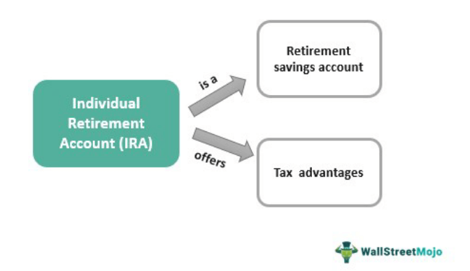

The world of finance is inherently diverse and multifaceted, presenting a plethora of opportunities for investment and wealth accumulation. This diversity manifests through various components such as financial instruments, retired securities, and algorithmic trading, each contributing significantly to contemporary investment strategies. Recognizing the pivotal roles these elements play is essential for investors seeking to navigate and capitalize on financial markets effectively.

Financial instruments form the bedrock of trade and investment, comprising a wide array of assets, including stocks, bonds, and derivatives. Each instrument carries unique characteristics, influenced by factors such as risk, return potential, and market dynamics, necessitating a strategic selection process tailored to individual investment goals.



Retired securities, while not as commonly spotlighted, provide potential, albeit often underexplored, opportunities within the market. These are securities that have ceased active trading but may still hold residual value or present investment potential under specific conditions. Understanding their lifecycle and strategic relevance can be beneficial for investors considering diverse portfolios.

Algorithmic trading has emerged as a transformative development in financial markets. By leveraging computer algorithms, traders can execute transactions with unprecedented speed and precision, potentially enhancing returns while minimizing costs. This method reflects the broader trend of technological integration in finance, reshaping market participant behavior and strategy formulation.

This article aims to dissect these complex financial components, examining their definitions, inherent benefits, and associated risks. By providing comprehensive insights, it seeks to inform both novice and experienced investors, equipping them with the necessary knowledge to make astute decisions in an ever-evolving financial landscape.

## Table of Contents

## Understanding Financial Instruments

Financial instruments are integral components of financial markets, providing a mechanism for allocating resources, managing risk, and tailoring investment strategies. These instruments are broadly classified into equity securities, debt securities, and derivatives, each with its unique characteristics and associated risk-return profiles.

Equity securities, commonly known as stocks, represent ownership in a corporation. They offer the potential for high returns through capital appreciation and dividends but come with higher [volatility](/wiki/volatility-trading-strategies) and risk. Investors in equity instruments need to conduct thorough analyses of company performance, sectoral trends, and economic indicators to make informed decisions.

Debt securities, including bonds and notes, are instruments for raising capital through borrowing. They provide regular income through interest payments, offering a more stable and predictable return compared to equities. However, the risk of default and [interest rate](/wiki/interest-rate-trading-strategies) fluctuations must be considered. The ability to predict interest rate trends and assess credit risk is crucial for debt investors.

Derivatives, such as options and futures, are financial contracts whose value is derived from an underlying asset. They are instrumental for hedging risks or speculative purposes due to their leverage characteristics. Derivatives can be complex and require a deep understanding of underlying asset behavior and market conditions.

An emerging trend in financial instruments is the growing focus on sustainable and green investments, driven by increasing awareness of environmental, social, and governance ([ESG](/wiki/esg-investing)) factors. Investors are integrating ESG criteria into their decision-making processes, leading to the development of green bonds and sustainability-linked loans. These instruments are designed to encourage projects with positive environmental and social impacts.

Technology has dramatically reshaped the trading and management of financial instruments. The advent of electronic trading platforms has improved market accessibility and transparency, while [algorithmic trading](/wiki/algorithmic-trading) has enhanced the speed and precision of transactions. Furthermore, the application of data analytics and [machine learning](/wiki/machine-learning) in asset management allows investors to uncover patterns and insights that drive more sophisticated investment strategies.

For example, a basic Python script using the Pandas library can help in analyzing historical price data for stocks, allowing investors to calculate moving averages and identify trends:

```python
import pandas as pd

# Sample DataFrame containing stock prices
data = {'Date': ['2023-01-01', '2023-01-02', '2023-01-03'],
        'Price': [100, 101, 102]}

df = pd.DataFrame(data)

# Calculate moving average
df['Moving Average'] = df['Price'].rolling(window=2).mean()

print(df)
```

In summary, financial instruments are varied and multifaceted, requiring investors to perform detailed assessments before making investment decisions. As markets evolve, the incorporation of technological advancements and sustainable investment practices continues to shape the landscape, offering both challenges and opportunities for investors seeking to optimize their portfolios.

## Exploring Retired Securities

Retired securities, though often overlooked by mainstream investors, represent a unique category within the financial markets that can offer significant opportunities. These securities have been phased out from active trading for various reasons but can still possess inherent value that savvy investors might exploit.

Securities are typically retired when they reach the end of their lifecycle, which can occur due to several factors. Common reasons include the maturity of debt instruments, corporate actions like buybacks, or regulatory changes that render certain securities obsolete. For instance, companies might retire bonds upon maturity, while equity shares could be phased out following a merger or acquisition. Understanding these triggers is crucial for investors as it impacts the supply dynamics and potential scarcity of these assets in the market.

The implications of dealing with retired securities are multifaceted. Retired securities sometimes [carry](/wiki/carry-trading) a lower risk profile, as they are removed from the volatility associated with active trading markets. However, they may also offer lower [liquidity](/wiki/liquidity-risk-premium), meaning that selling such assets when needed could be challenging. Investors seeking to acquire undervalued assets might find opportunities in retired securities that are temporarily mispriced due to reduced trading activity and market attention.

When considering investments in retired securities, due diligence becomes paramount. Investors must thoroughly assess the historical performance, existing demand, and potential for value appreciation. Additionally, understanding the regulatory environment and any legal constraints associated with retired securities is essential. Assessing such factors helps mitigate risks, such as potential legal complications or sudden devaluations.

Risks associated with retired securities are chiefly linked to liquidity constraints and the challenge of accurate valuation. The lower trading [volume](/wiki/volume-trading-strategy) can lead to larger bid-ask spreads, resulting in higher transactional costs. Moreover, the scarcity of market information might increase the difficulty of making informed valuation judgments, presenting a potential pitfall for unwary investors.

Despite these risks, retired securities can offer strategic opportunities. For example, investors may leverage their deep market knowledge to uncover hidden value in such securities, which may not be apparent to the broader market. A methodical approach and comprehensive analysis can thus result in advantageous acquisitions at favorable prices, ultimately adding diversity and depth to an investment portfolio.

In conclusion, while retired securities might not possess the immediate allure of actively traded counterparts, they offer distinct prospects for those willing to perform rigorous analysis and due diligence. These assets, when understood and managed correctly, can enhance investment strategies and contribute to diversification and potential value growth.

## The Rise of Algorithmic Trading

Algorithmic trading signifies a major evolution in the financial industry, augmented by technological advancements that allow for executing trades with speed and precision unattainable by traditional methods. The deployment of computer algorithms enables the processing of large volumes of orders, ensuring transactions are conducted at optimal prices while minimizing market impact.

The Efficiency and Precision of Algorithmic Trading

Algorithmic trading capitalizes on the systematic and unemotional nature of computer algorithms. Unlike human traders, algorithms can process vast amounts of data in real time, identifying opportunities that may not be immediately visible to the human eye. This capability translates to increased efficiency, as trades are executed at speeds impossible for manual traders. Moreover, the precision offered by algorithmic systems minimizes the risk of human error, directly contributing to better returns and reduced transaction costs.

Reshaping the Investment Landscape

High-frequency trading ([HFT](/wiki/high-frequency-trading-strategies)) and [market making](/wiki/market-making) have been profoundly influenced by algorithmic trading. HFT, characterized by its high order-to-trade ratios and the extremely low latency required for execution, has become synonymous with algorithmic trading. It exploits minute price discrepancies in the market, often holding positions for mere seconds or fractions thereof, to profit from marginal price differences. Meanwhile, algorithmic market making enhances liquidity provision by continuously quoting buy and sell prices, facilitating smoother market operations.

Developing and Implementing Trading Algorithms

The development of trading algorithms requires a robust understanding of market mechanics, quantitative analysis, and programming expertise. Python has emerged as a favored language for building algorithms due to its extensive libraries and community support. A basic algorithm structure might include modules for data acquisition, analysis, decision-making, and execution. Here's a simplified Python snippet demonstrating a conceptual framework:

```python
import pandas as pd
import numpy as np

# Load historical data
data = pd.read_csv('market_data.csv')

# Simple moving average strategy
def trading_signal(data):
    data['SMA'] = data['Close'].rolling(window=20).mean()
    data['Signal'] = np.where(data['Close'] > data['SMA'], 1, 0)
    return data

signals = trading_signal(data)

# Trade execution logic based on signals
for index, row in signals.iterrows():
    if row['Signal'] == 1:
        print(f"Buy signal on {row['Date']}")
    else:
        print(f"Sell signal on {row['Date']}")
```

Ethical Considerations and Potential Pitfalls

Despite the advantages, algorithmic trading poses several ethical and operational concerns. The rapid execution speeds can exacerbate market volatility, and in some instances, contribute to flash crashes. Additionally, the opacity of algorithms raises questions about fairness and market manipulation. There is a growing debate on the ethical implications of using algorithms that can disproportionately advantage those with superior technological resources.

Ensuring robust regulatory frameworks and ethical guidelines is essential to mitigate these risks. Transparency in algorithmic operations and the development of checks and balances can help maintain a fair and orderly market environment.

In summary, algorithmic trading represents a transformative force in finance, enhancing efficiency and reshaping trading strategies across markets. Its benefits, however, must be balanced with careful consideration of its broader impact on market integrity and stability.

## Integrating Financial Instruments, Retired Securities, and Algo Trading

Integrating financial instruments, retired securities, and algorithmic trading into a single investment strategy presents a significant opportunity for savvy investors. This approach necessitates a comprehensive understanding of market dynamics and the proficient use of technology to optimize returns. 

### Strategies for Integration 

Developing an integrated strategy begins with assessing the characteristics of different financial instruments. Stocks, bonds, and derivatives have varying risk-return profiles. Aligning these profiles with investment goals is crucial. For instance, an investor seeking steady income may prefer bonds, while one aiming for growth might prioritize stocks. Algorithmic trading, characterized by the use of computer programs to execute trades, can be applied to these instruments to enhance execution efficiency and timing precision.

Retired securities, often undervalued due to their inactive trading status, can add a unique dimension to a portfolio. Investors can use algorithms to perform historical data analysis to identify patterns or undervaluations, making these securities attractive for specific strategies aimed at capturing hidden value. Python, with libraries such as numpy and pandas, is particularly useful for this analysis:

```python
import numpy as np
import pandas as pd

# Example: Calculate moving averages to identify potential buy signals in retired securities
def moving_average(data, window_size):
    return data.rolling(window=window_size).mean()

# Historical price data
price_data = pd.Series([100, 102, 101, 105, 107, 110])

# Calculate a 3-day moving average
ma3 = moving_average(price_data, 3)
print(ma3)
```

### Case Studies and Examples

An illustrative case is the use of algorithmic models by hedge funds to manage portfolios comprising diverse financial instruments and retired securities. These funds deploy quantitative strategies, leveraging large data sets and sophisticated algorithms to identify market inefficiencies and trade opportunities. For example, the "Statistical Arbitrage" model uses price action analysis to identify short-term discrepancies in prices, offering buy and sell signals.

### Role of Data Analytics and Artificial Intelligence

Data analytics plays a pivotal role in this integration. With AI and machine learning algorithms, investors can process vast datasets comprising historical prices, economic indicators, and news sentiments. Techniques such as natural language processing (NLP) enable the real-time analysis of financial news, which can be incorporated into trading models to adapt strategies dynamically. Furthermore, machine learning models can predict future price movements, allowing for proactive decision-making.

The technology stack for this purpose typically includes Python libraries such as scikit-learn for modeling and keras for [deep learning](/wiki/deep-learning). These tools provide a framework for developing predictive models and [backtesting](/wiki/backtesting) them against historical data to evaluate performance before deploying them live.

In sum, integrating financial instruments, retired securities, and algorithmic trading can lead to superior investment strategies. Investors need to adopt an interdisciplinary approach combining finance and technology. By effectively applying data analytics and [artificial intelligence](/wiki/ai-artificial-intelligence), these strategies not only maximize returns but also adeptly manage risks, positioning investors for success in the ever-evolving financial markets.

## Conclusion

The investment landscape is continuously evolving, with advanced tools and strategies emerging as game-changers for investors. By understanding and utilizing financial instruments, retired securities, and algorithmic trading, investors can diversify and strengthen their portfolios. These components each contribute unique capabilities and perspectives, empowering investors to optimize returns and manage risks effectively.

Financial instruments, such as stocks, bonds, and derivatives, provide a broad spectrum of options to suit varying investment goals and risk tolerances. Retired securities, though less prominent, can offer unique value propositions for those who master their intricacies. Algorithmic trading, on the other hand, introduces speed, efficiency, and accuracy, crucial in today's fast-paced market environments.

However, these opportunities require thorough research and strategic planning. The complexity of financial instruments demands that investors stay informed about market conditions and economic indicators. Similarly, retired securities call for an understanding of their lifecycle and the nuances of acquiring potentially undervalued assets. Algorithmic trading requires technical proficiency and a deep grasp of data analytics and market dynamics.

Investors must remain informed and adaptable, leveraging advancements in technology to stay ahead. As market conditions fluctuate and new technologies emerge, being well-versed in a wide array of investment tools becomes imperative. This adaptability ensures competitiveness and maximizes potential returns.

With the right approach, the integration of financial instruments, retired securities, and algorithmic trading can offer a pathway to financial success and stability. By strategically combining these elements, investors can navigate the complexities of modern finance, capitalizing on advancements to build robust, resilient portfolios.

## References & Further Reading

[1]: Zochowski, T. S., & Stoia, L. M. (2021). ["The Lifecycle of Financial Instruments: Managing Maturities and Retirements"](https://papers.ssrn.com/sol3/papers.cfm?abstract_id=3565533). Journal of Finance.

[2]: Gomber, P., Arndt, B., Lutat, M., & Uhle, T. (2021). ["High-Frequency Trading"](https://papers.ssrn.com/sol3/papers.cfm?abstract_id=1858626) in Algorthmic Trading and Complexity of Financial Markets. Cambridge University Press.

[3]: Thomas, J. & Stålberg, P. (2018). ["Algorithmic and High-Frequency Trading: A Literature Review."](https://www.researchgate.net/publication/333783094_High-frequency_trading_a_literature_review) Finance Research Letters.

[4]: Fabozzi, F. J., Focardi, S. M., & Rachev, S. (2010). ["Algorithmic Trading and Portfolio Management"](https://onlinelibrary.wiley.com/doi/book/10.1002/9781118856406). Wiley.

[5]: Stein, J. C. (2012). ["The dynamics of market liquidity and the microstructure of financial markets"](https://scholar.harvard.edu/stein/publications/monetary-policy-financial-stability-regulation). The Quarterly Journal of Economics, 107(4), 1117-1157.