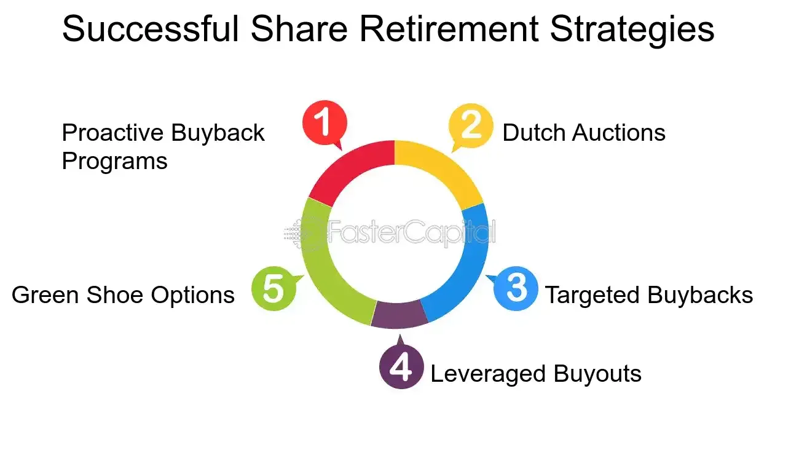

## Table of Contents

## What are retired securities?

Retired securities are financial instruments that a company has decided to stop issuing or trading. This means that they are no longer available for investors to buy or sell on the market. Companies might decide to retire securities for various reasons, such as restructuring their debt, simplifying their financial structure, or because the securities have reached their maturity date and need to be paid off.

When a security is retired, it is usually taken off the company's balance sheet. This process can affect the company's financial statements and how investors view the company's financial health. For example, retiring a bond means the company no longer has to pay interest on it, which can improve its cash flow. However, it also means the company has to find other ways to finance its operations if it was relying on that bond.

## Why do companies retire securities?

Companies retire securities for a few main reasons. One reason is to clean up their financial situation. When a company has too many different types of securities, it can be hard to keep track of them all. By retiring some, the company can make its finances simpler and easier to manage. Another reason is to get rid of old securities that have reached their end date. When a bond or another type of security matures, the company has to pay it back. Retiring it means the company no longer has to worry about that debt.

Another reason companies retire securities is to save money. For example, if a company has a bond that pays a high interest rate, it might retire that bond and issue a new one with a lower interest rate. This can help the company save money on interest payments. Sometimes, retiring securities can also make the company look better to investors. If a company can show that it is managing its debt well by retiring old securities, investors might feel more confident about investing in the company.

## How does the process of retiring securities work?

When a company decides to retire securities, it starts by announcing its plan. This announcement lets investors know that the securities will no longer be available to buy or sell. The company then takes the securities off its balance sheet. This means the securities are no longer part of the company's financial records. If the securities are bonds, the company might have to pay back the money it borrowed when the bonds were first issued. This is called redeeming the bonds.

After the securities are retired, the company no longer has to worry about them. For example, if the retired securities were bonds, the company doesn't have to pay interest on them anymore. This can help the company save money. Retiring securities can also make the company's finances simpler and easier to understand. Investors might see this as a good sign and feel more confident about investing in the company. Overall, retiring securities is a way for a company to manage its money better and improve its financial health.

## What is the difference between retiring and repurchasing securities?

Retiring securities means a company stops using a certain type of security and takes it off its financial records. This usually happens when a security, like a bond, reaches its end date or when a company wants to simplify its finances. When a security is retired, it's gone for good and the company doesn't have to worry about it anymore. For example, if a company retires a bond, it pays back the money it borrowed and no longer has to pay interest on that bond.

Repurchasing securities, on the other hand, means a company buys back its own securities from investors. This is often done with stocks, but can also be done with bonds. When a company repurchases its securities, it's not taking them off its financial records right away. Instead, it's holding onto them, and it might decide to sell them again later. Repurchasing can be a way for a company to show it believes its stock is a good investment or to reduce the number of shares available, which can increase the value of the remaining shares.

## What are the financial implications for a company when it retires securities?

When a company retires securities, it can improve its cash flow because it no longer has to make interest payments on retired debt like bonds. This can help the company save money and use it for other things, like growing the business or paying off other debts. Retiring securities also simplifies the company's finances. With fewer securities to keep track of, it's easier for the company to manage its money and for investors to understand the company's financial health.

On the other hand, retiring securities can also mean the company has to find new ways to finance its operations. If the company was relying on the money from those securities, it might need to issue new securities or borrow money from another source. This can be risky if the new financing costs more than the old securities did. Overall, retiring securities can be a good way for a company to clean up its finances, but it needs to be done carefully to make sure it doesn't create new problems.

## How do retired securities affect shareholders?

When a company retires securities, it can affect shareholders in different ways. If the company retires debt like bonds, it can save money on interest payments. This can make the company more profitable, which is good for shareholders because it might increase the value of their shares. Shareholders might also feel more confident about the company's future because retiring securities can make the company's finances simpler and easier to understand.

However, retiring securities can also have some downsides for shareholders. If the company was using the money from those securities to run its business, it might need to find new ways to get money. This could mean issuing new securities or borrowing money, which could be more expensive. If the new financing costs more, it could hurt the company's profits and lower the value of the shareholders' shares. So, while retiring securities can be good for shareholders in some ways, it can also create new risks.

## What are the tax consequences of retiring securities for both the company and the shareholders?

When a company retires securities, it might have to pay taxes on any gains it makes. If the company retires a bond at a price higher than what it originally sold for, that difference could be considered a gain and the company might have to pay taxes on it. On the other hand, if the company retires a bond at a loss, it might be able to use that loss to reduce its taxable income. The exact tax consequences depend on the type of security and the tax laws in the country where the company operates.

For shareholders, retiring securities can also lead to tax consequences. If a shareholder owns a bond that gets retired, they might have to pay taxes on any interest they earned before the bond was retired. If the bond is retired at a price higher than what the shareholder paid for it, they might also have to pay taxes on that gain. On the other hand, if the bond is retired at a loss, the shareholder might be able to use that loss to reduce their taxable income. Just like with the company, the exact tax consequences for shareholders depend on the type of security and the tax laws in their country.

## Can retired securities be reissued, and under what conditions?

Retired securities are usually taken off a company's financial records and are not supposed to come back. Once a security is retired, it's gone for good. This means the company doesn't have to worry about it anymore, like paying interest on a bond. Retiring securities helps a company clean up its finances and make them simpler.

But sometimes, a company might want to bring back a retired security. This can happen if the company needs money and thinks the old security would be a good way to get it. To reissue a retired security, the company has to go through the same steps it did when it first issued the security. This includes getting approval from the right people and telling investors about the new security. It's not common, but it can be done if the company really needs to.

## What role do regulatory bodies play in the retirement of securities?

Regulatory bodies, like the Securities and Exchange Commission (SEC) in the United States, have important rules about how companies can retire securities. These rules make sure that companies do things the right way and that investors know what's happening. When a company wants to retire securities, it has to follow these rules. This might mean filling out forms, telling investors about the plan, and getting the okay from the regulatory body before they can go ahead with retiring the securities.

These rules help keep the market fair and safe for everyone. If a company doesn't follow the rules, it could get in trouble and might have to pay fines. Regulatory bodies also watch to make sure that companies are telling the truth about why they are retiring securities. This helps investors trust the market and make smart choices about where to put their money.

## How do retired securities impact a company's capital structure?

When a company retires securities, it changes its capital structure by reducing the amount of debt or equity it has. If the company retires bonds, it means it's paying off debt, which can make the company's finances simpler and easier to manage. This can also help the company save money because it no longer has to pay interest on those bonds. By retiring securities, the company can show investors that it's managing its money well, which might make investors feel more confident about the company.

However, retiring securities can also mean the company needs to find new ways to get money. If the company was using the money from those securities to run its business, it might need to issue new securities or borrow money from another source. This can be risky if the new financing costs more than the old securities did. So, while retiring securities can help clean up a company's finances, it needs to be done carefully to make sure it doesn't create new problems.

## What are some strategic reasons a company might choose to retire securities?

A company might choose to retire securities to make its finances simpler and easier to manage. When a company has a lot of different securities, it can be hard to keep track of them all. By retiring some securities, the company can clean up its balance sheet and make it easier for investors to understand its financial health. This can also make the company look better to investors because it shows that the company is managing its money well.

Another strategic reason to retire securities is to save money. If a company has a bond that pays a high interest rate, it might retire that bond and issue a new one with a lower interest rate. This can help the company save money on interest payments. Retiring securities can also help the company improve its cash flow because it no longer has to make interest payments on the retired debt. This extra cash can be used for other things, like growing the business or paying off other debts.

## How can investors identify when a company is likely to retire securities?

Investors can look at a few things to guess if a company might retire securities soon. One thing to watch is the company's financial statements. If a company is paying a lot of interest on its debt, it might want to retire some of its bonds to save money. Also, if a company's securities are getting close to their maturity date, it's more likely that the company will retire them. Another clue is if the company is talking about simplifying its finances or cleaning up its balance sheet. This can be a sign that it's thinking about retiring some securities.

Another way investors can tell if a company might retire securities is by keeping an eye on what the company says in its news releases and during its earnings calls. If the company mentions that it's looking at ways to manage its debt better or if it's planning to issue new securities, it might be getting ready to retire some old ones. By paying attention to these signs, investors can get a better idea of what the company might do next with its securities.

## References & Further Reading

[1]: Zochowski, T. S., & Stoia, L. M. (2021). ["The Lifecycle of Financial Instruments: Managing Maturities and Retirements"](https://papers.ssrn.com/sol3/papers.cfm?abstract_id=3565533). Journal of Finance.

[2]: Gomber, P., Arndt, B., Lutat, M., & Uhle, T. (2021). ["High-Frequency Trading"](https://papers.ssrn.com/sol3/papers.cfm?abstract_id=1858626) in Algorthmic Trading and Complexity of Financial Markets. Cambridge University Press.

[3]: Thomas, J. & Stålberg, P. (2018). ["Algorithmic and High-Frequency Trading: A Literature Review."](https://www.researchgate.net/publication/333783094_High-frequency_trading_a_literature_review) Finance Research Letters.

[4]: Fabozzi, F. J., Focardi, S. M., & Rachev, S. (2010). ["Algorithmic Trading and Portfolio Management"](https://onlinelibrary.wiley.com/doi/book/10.1002/9781118856406). Wiley.

[5]: Stein, J. C. (2012). ["The dynamics of market liquidity and the microstructure of financial markets"](https://scholar.harvard.edu/stein/publications/monetary-policy-financial-stability-regulation). The Quarterly Journal of Economics, 107(4), 1117-1157.