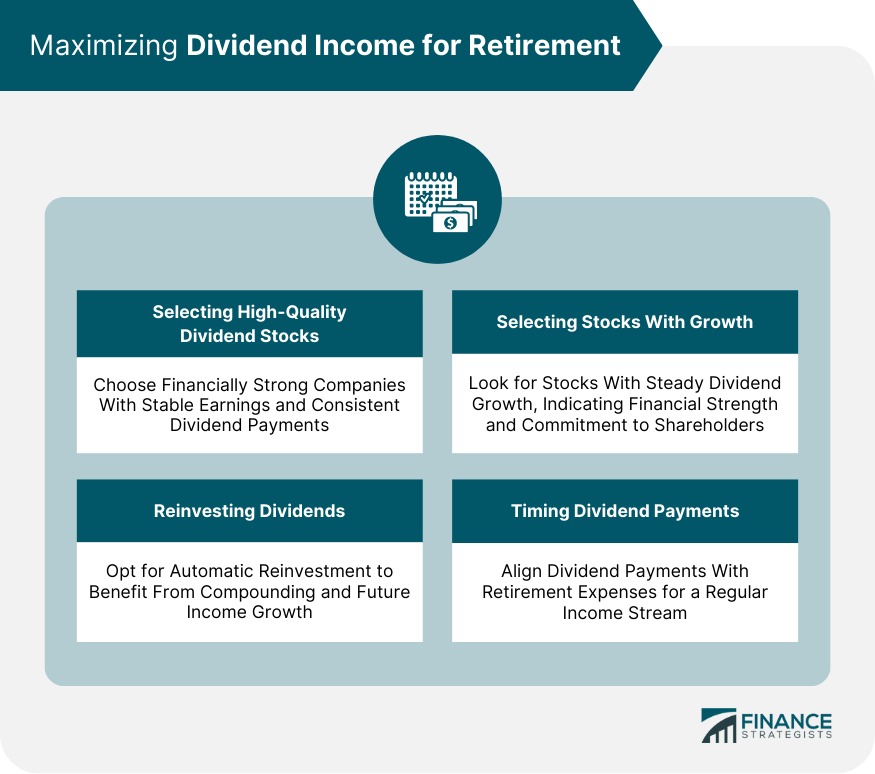

## Table of Contents

## What is dividend reinvestment and how does it work?

Dividend reinvestment is when you use the money you get from a company's dividends to buy more shares of that company instead of taking the cash. Dividends are payments that companies give to their shareholders, usually from their profits. When you reinvest your dividends, you are choosing to put that money back into the company by buying more of its stock.

Here's how it works: When a company pays out a dividend, instead of receiving the money in your bank account, you use it to automatically buy more shares of the company. This can happen through a Dividend Reinvestment Plan (DRIP), which many companies offer. Over time, as you keep reinvesting your dividends, you end up owning more and more shares. This can lead to bigger dividend payments in the future because you own more of the company, and it can also help your investment grow faster through the power of compounding.

## Why might retirees consider dividend reinvestment as part of their investment strategy?

Retirees might consider dividend reinvestment because it can help their savings grow over time. When they reinvest their dividends, they buy more shares of the company. This means they can get even more dividends in the future. This can be really helpful for retirees because it can help their money last longer. Instead of spending the dividends right away, they can let their money keep working for them.

Another reason is that dividend reinvestment can help protect against inflation. As prices go up over time, the value of money goes down. But if retirees keep reinvesting their dividends, the number of shares they own can grow. This can help their investment keep up with or even beat inflation. So, even though they are not working anymore, their money can still grow and help them live comfortably in retirement.

## What are the benefits of dividend reinvestment for retirees?

Dividend reinvestment can help retirees make their money last longer. When they get money from dividends, instead of spending it, they use it to buy more shares of the company. This means they own more of the company and can get even bigger dividends in the future. Over time, this can make their savings grow a lot, which is really important for retirees who need their money to last for many years.

Another good thing about dividend reinvestment for retirees is that it can help their money keep up with inflation. Inflation means that things get more expensive over time. If retirees just keep their money in the bank, it might not be worth as much in the future. But if they keep buying more shares with their dividends, the number of shares they own can grow. This can help their investment grow faster than inflation, so they can still afford the things they need as they get older.

## What are the potential risks or downsides of dividend reinvestment for retirees?

One risk of dividend reinvestment for retirees is that it might not be the best choice if they need money right away. When they reinvest their dividends, they are choosing to buy more shares instead of getting cash. If a retiree needs money to pay for things like food, medicine, or other bills, they might not have enough cash on hand if they keep reinvesting their dividends.

Another downside is that the value of the company's stock can go down. If retirees are putting all their money into one company's stock, and that company does not do well, the value of their investment could drop a lot. This could be a big problem for retirees because they might need to sell their shares at a lower price than they bought them, which means they lose money. It's important for retirees to think about how much risk they are comfortable with before they decide to reinvest their dividends.

## How can dividend reinvestment affect a retiree's tax situation?

Dividend reinvestment can make a retiree's taxes a bit more complicated. When a retiree reinvests their dividends, they are still getting money from the company, even if they use it to buy more shares. This means they have to pay taxes on the dividends they get, even if they don't see the money in their bank account. This can be tricky because they might need to keep track of how much they are getting in dividends each year to report it on their taxes.

Another thing to think about is that when retirees sell the shares they bought with their reinvested dividends, they might have to pay capital gains tax. Capital gains tax is what you pay when you sell something for more than you bought it for. If the value of the shares goes up over time, and then the retiree sells them, they will have to pay tax on the profit they made. So, dividend reinvestment can affect a retiree's taxes in two ways: they have to pay taxes on the dividends they get, and they might have to pay capital gains tax when they sell the shares they bought with those dividends.

## What types of investments are best suited for dividend reinvestment in retirement?

For retirees looking to use dividend reinvestment, it's best to focus on stable companies that have a history of paying steady dividends. These companies are often in industries like utilities, consumer goods, or healthcare. They are less likely to have big ups and downs in their stock prices, which can be good for retirees who want to keep their money safe. A good example would be a company that makes things people always need, like food or medicine. These companies usually have strong finances and can keep paying dividends even when the economy is not doing well.

Another type of investment that works well for dividend reinvestment is dividend-focused mutual funds or exchange-traded funds (ETFs). These funds collect money from many investors and use it to buy a bunch of different stocks that pay dividends. This can help retirees spread out their risk because they are not putting all their money into one company. Instead, they own a little bit of many companies. This can make their investment safer and still let them enjoy the benefits of dividend reinvestment.

## How does one set up a dividend reinvestment plan (DRIP)?

Setting up a dividend reinvestment plan, or DRIP, is pretty easy. First, you need to find out if the company you own stock in has a DRIP. Many big companies offer these plans, but you can check their website or call their investor relations department to be sure. Once you know the company has a DRIP, you can usually sign up for it through their website or by filling out a form and sending it to them. Some brokers also let you set up a DRIP through their platform if you own the stock in your account with them.

After you sign up, the process is automatic. Whenever the company pays out a dividend, instead of getting the money in your bank account, it will be used to buy more shares of the company. Sometimes, you can even buy these new shares at a discount, which is a nice bonus. Just remember, you'll still need to pay taxes on the dividends you get, even though you're using them to buy more stock. Once your DRIP is set up, you can sit back and let your investment grow over time.

## What should retirees consider when choosing stocks for dividend reinvestment?

Retirees should look for companies that have a good track record of paying dividends regularly. This means the company should have been paying dividends for a long time and not cutting them even during tough times. Companies in stable industries like utilities, consumer goods, or healthcare are often good choices because they tend to have steady profits. These companies are less likely to have big ups and downs in their stock prices, which can be good for retirees who want to keep their money safe. A good example would be a company that makes things people always need, like food or medicine. These companies usually have strong finances and can keep paying dividends even when the economy is not doing well.

Another thing retirees should think about is the company's dividend yield, which is how much the dividend pays compared to the stock's price. A higher yield might look good, but it could also be a sign that the stock price has gone down a lot, which could be risky. Retirees should also think about how much risk they are comfortable with. If they want to be safer, they might want to spread their money across different companies or even different types of investments, like dividend-focused mutual funds or ETFs. These funds can help retirees own a little bit of many companies, which can make their investment safer and still let them enjoy the benefits of dividend reinvestment.

## How does the frequency of dividend payments impact a retiree's reinvestment strategy?

The frequency of dividend payments can make a big difference for retirees who are using a dividend reinvestment strategy. If a company pays dividends every month, retirees can buy more shares more often. This can help their money grow faster because they are adding to their investment more regularly. On the other hand, if a company only pays dividends every three or six months, it might take longer for retirees to see their investment grow because they are not buying more shares as often.

Retirees should also think about their own needs when choosing how often they want to get dividends. If they need money coming in every month to help pay for things, a company that pays monthly dividends might be a better fit. But if they can wait longer between dividend payments, they might be okay with a company that pays less often. Either way, the key is to match the frequency of dividend payments with what works best for their financial situation and how quickly they want their investment to grow.

## What are the long-term effects of compound growth through dividend reinvestment for retirees?

Compound growth through dividend reinvestment can make a big difference for retirees over the long term. When retirees reinvest their dividends, they buy more shares of the company. Over time, these extra shares can lead to bigger dividend payments because they own more of the company. This cycle of reinvesting and getting more dividends keeps going, and it can help their money grow a lot faster than if they just kept the dividends as cash. This is called compounding, and it's like [earning](/wiki/earning-announcement) interest on interest. For retirees, this means their savings can last longer and grow bigger, which is really important because they need their money to support them for many years.

The long-term effects of this can be really powerful. Imagine a retiree starts with a certain amount of money and reinvests all their dividends. After a few years, they might have a lot more shares than they started with. This means they could be getting much bigger dividend payments than when they started. Over 10, 20, or even 30 years, this can add up to a lot more money than they would have had if they just took the dividends as cash. So, for retirees, using dividend reinvestment can help make sure their money keeps growing and can help them live comfortably in retirement.

## How can retirees balance dividend reinvestment with the need for income in retirement?

Retirees need to find a good balance between using dividend reinvestment to grow their money and getting the cash they need to live on. One way to do this is by splitting their investments. They can put some of their money into stocks or funds that pay dividends and reinvest those dividends to make their savings grow. At the same time, they can have other investments that give them regular cash payments. This way, they can enjoy the benefits of growing their money while still having enough cash to pay for things they need every month.

Another way to balance this is by choosing investments that pay dividends more often, like monthly instead of quarterly. This can give retirees a steady stream of income that they can use for their living expenses, while still reinvesting some of the dividends to keep their money growing. It's important for retirees to think about their own needs and how much risk they are comfortable with. By finding the right mix, they can make sure they have enough money to live on now and also see their savings grow over time.

## What advanced strategies can retirees use to optimize their dividend reinvestment plan?

Retirees can use something called a "dividend capture strategy" to make the most out of their dividend reinvestment plan. This means they buy a stock just before it pays a dividend and then sell it right after they get the dividend. By doing this, they can reinvest the money they get from the dividend into another stock that is about to pay a dividend. This way, they can keep getting dividends and buying more shares more often. But, this strategy can be risky because the stock price might go down after the dividend is paid, so retirees need to be careful and maybe talk to a financial advisor before trying it.

Another way retirees can optimize their dividend reinvestment is by using a "dollar-cost averaging" approach. This means they invest a fixed amount of money into their dividend-paying stocks at regular times, no matter what the stock price is. By doing this, they can buy more shares when the price is low and fewer shares when the price is high. Over time, this can help them get a better average price for their shares and make their money grow more steadily. This strategy can help retirees feel more secure because they are not trying to guess when the stock price will go up or down, but instead, they are investing a little bit at a time.

## References & Further Reading

[1]: Bergstra, J., Bardenet, R., Bengio, Y., & Kégl, B. (2011). ["Algorithms for Hyper-Parameter Optimization."](https://dl.acm.org/doi/10.5555/2986459.2986743) Advances in Neural Information Processing Systems 24.

[2]: ["Advances in Financial Machine Learning"](https://www.amazon.com/Advances-Financial-Machine-Learning-Marcos/dp/1119482089) by Marcos Lopez de Prado

[3]: ["Evidence-Based Technical Analysis: Applying the Scientific Method and Statistical Inference to Trading Signals"](https://www.amazon.com/Evidence-Based-Technical-Analysis-Scientific-Statistical/dp/0470008741) by David Aronson

[4]: ["Machine Learning for Algorithmic Trading"](https://github.com/stefan-jansen/machine-learning-for-trading) by Stefan Jansen

[5]: ["Quantitative Trading: How to Build Your Own Algorithmic Trading Business"](https://www.amazon.com/Quantitative-Trading-Build-Algorithmic-Business/dp/1119800064) by Ernest P. Chan