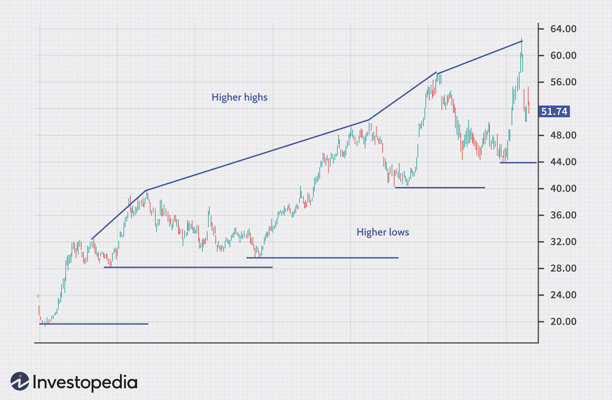

## Table of Contents

## What is retracement in the context of investing?

Retracement in investing is when the price of a stock or other asset goes down after it has been going up. It's like taking a little break or stepping back before continuing to move forward. Investors watch retracements closely because they can tell them if the overall trend of the stock is still going up or if it might be starting to go down.

Think of retracement like climbing a mountain. You might go up for a while, but then you need to rest or take a few steps back to catch your breath. After resting, you can continue climbing. In the same way, a stock might go up, then have a retracement, and then keep going up if the overall trend is strong. Retracements are normal and can help investors decide when to buy or sell.

## How does retracement differ from a reversal?

Retracement and reversal are two different things that can happen to a stock's price. A retracement happens when a stock's price goes down a bit after it has been going up. It's like a short break in the upward movement. The price might go down by a small amount, but then it usually starts going up again. This means the overall trend of the stock is still going up, even though it had a little dip.

On the other hand, a reversal is when the stock's price changes direction completely. If a stock has been going up and then starts going down and keeps going down, that's a reversal. It means the upward trend has ended, and a new downward trend has started. Reversals are bigger changes than retracements and can signal that it's time for investors to think about selling their stocks if they think the price will keep going down.

## What are common causes of retracement in the stock market?

Retracements in the stock market can happen for many reasons. One common reason is when investors take profits. If a stock has been going up for a while, some people might decide to sell their shares to make money. When a lot of people do this at the same time, it can cause the stock price to go down a bit. Another reason is when there's not as much interest in the stock anymore. If fewer people want to buy it, the price can drop until it finds a new level where people are happy to buy again.

Another cause of retracement is news or events that affect how people feel about the stock. For example, if a company announces that it's not doing as well as expected, the stock price might go down. But if the news isn't too bad, the price might only go down a little before starting to go up again. Also, overall market conditions can lead to retracements. If the whole market is feeling a bit shaky, even strong stocks might see their prices dip temporarily before continuing their upward trend.

## Can you explain the concept of support and resistance in relation to retracement?

Support and resistance are important ideas when we talk about retracements in the stock market. Support is like a floor for a stock's price. It's a level where the price tends to stop going down and might start going up again. Imagine you're bouncing a ball; the ground is like the support level. When the stock price hits this level during a retracement, it often bounces back up because a lot of people think it's a good time to buy the stock. 

Resistance, on the other hand, is like a ceiling for the stock's price. It's a level where the price tends to stop going up and might start going down again. Using the ball analogy, the ceiling would be like the height the ball can't go past. During a retracement, if the stock price tries to go up but hits the resistance level, it might fall back down because people think the stock is too expensive at that price. Understanding these levels can help investors know when a retracement might turn around and start going in the other direction again.

## What technical indicators are used to identify retracements?

Technical indicators help investors spot retracements in the stock market. One common indicator is the Fibonacci retracement levels. These levels are based on a special number sequence called the Fibonacci sequence. Investors use these levels to guess how far a stock's price might fall before it starts going up again. For example, if a stock goes up from $10 to $20, the Fibonacci levels might show that the price could fall back to $16.80 (a 38.2% retracement) or $15 (a 50% retracement) before going up again.

Another useful indicator is the moving average. A moving average smooths out the price data over time, making it easier to see the overall trend. If a stock's price dips below its moving average during a retracement, it might be a sign that the price will soon start going up again. For example, if the 50-day moving average is at $18 and the stock price drops to $17.50, it might bounce back up to the moving average. These indicators help investors decide if a retracement is just a temporary dip or the start of a bigger change in the stock's price.

## How can investors distinguish between a retracement and a potential reversal?

Investors can tell the difference between a retracement and a potential reversal by looking at how long the price change lasts and how big it is. A retracement usually doesn't last very long and the price doesn't go down by a lot. It's like a quick dip in the road while the stock is still going up. If the price goes down a little bit but then starts going up again pretty quickly, it's probably just a retracement. Investors can use tools like the Fibonacci retracement levels to guess how far the price might fall before it starts going up again.

On the other hand, a reversal is a bigger deal. It happens when the price changes direction and keeps going that way for a while. If the price goes down a lot and keeps going down, or if it breaks through important levels like support or resistance, it might be a reversal. Investors can look at things like moving averages to see if the price is staying below them for a long time, which could mean the stock's trend has changed. By watching these signs, investors can decide if they need to sell their stocks or if they can wait for the price to go back up.

## What role does market sentiment play in retracements?

Market sentiment is how people feel about the stock market. It can really affect retracements. When people feel good about the market, they might keep buying stocks even if the price goes down a little during a retracement. They think the price will go back up soon, so they aren't worried. But if people start to feel nervous or unsure, a small retracement might make them want to sell their stocks. This can make the retracement bigger because more people are selling.

On the other hand, if the market sentiment is bad, even a small retracement can turn into a big drop. People might think the stock's price will keep going down, so they sell quickly. But if the market sentiment is good, a retracement might not last long. People will see it as a chance to buy the stock at a lower price, and the price will go back up. So, how people feel about the market can make retracements bigger or smaller and affect how long they last.

## How do Fibonacci retracement levels help in predicting market movements?

Fibonacci retracement levels help investors guess where a stock's price might go during a retracement. These levels are based on a special number sequence called the Fibonacci sequence. When a stock's price goes up and then starts to go down a bit, investors use these levels to see how far the price might fall before it starts going up again. For example, if a stock goes from $10 to $20, the Fibonacci levels might show that the price could fall back to $16.80 or $15 before going up again. These levels help investors decide if it's a good time to buy the stock during a dip.

These levels are useful because they give investors a way to see if a retracement is normal or if it might be turning into a bigger drop. If the stock's price falls to one of these levels and then starts going up again, it's a sign that the retracement is probably over. But if the price keeps falling past these levels, it might mean the stock's price is going to keep going down. By watching these levels, investors can make better choices about when to buy or sell their stocks.

## What are the psychological factors that influence retracement and reversal?

Psychological factors play a big role in retracements and reversals in the stock market. When investors see a stock's price going down a bit during a retracement, they might feel scared or worried. If they think the price will keep going down, they might sell their stocks quickly, making the retracement bigger. But if they believe the price will go back up soon, they might see the retracement as a chance to buy the stock at a lower price. This feeling of hope or fear can make a big difference in how long a retracement lasts and how big it gets.

Reversals can also be influenced by how people feel. If a stock's price has been going up for a while and then starts to go down, investors might feel unsure or nervous. If they think the downward trend will continue, they might sell their stocks, causing a reversal. On the other hand, if investors still believe in the stock and think the price will go back up, they might hold onto their stocks or even buy more. These feelings of doubt or confidence can turn a small dip into a big change in the stock's price direction.

## How can an investor use retracement to their advantage in trading strategies?

An investor can use retracement to their advantage by buying stocks when they dip a little during a retracement. If a stock has been going up and then goes down a bit, it might be a good time to buy. The investor can use tools like Fibonacci retracement levels to guess how far the price might fall before it starts going up again. If the stock's price falls to one of these levels and then starts going up, the investor can buy the stock at a lower price and then sell it when the price goes back up. This way, they can make money from the dip and the recovery.

Another way to use retracement is to hold onto stocks during a small dip. If an investor believes in the stock and thinks it will keep going up after the retracement, they can wait it out. By not selling during the dip, they can avoid missing out on the stock's upward trend. Watching the stock's price and using indicators like moving averages can help the investor know when the retracement is over and the price is starting to go up again. This can help them make smart choices about when to hold onto their stocks and when to sell them.

## What are the risks associated with misinterpreting retracement as reversal?

If an investor thinks a retracement is a reversal, they might sell their stocks too early. When a stock's price dips a little during a retracement, it can look like the price is going to keep going down. If the investor gets scared and sells their stocks, they might miss out on the price going back up. This can mean they lose money because they sold at a lower price than they could have.

On the other hand, if an investor thinks a reversal is just a retracement, they might hold onto their stocks too long. If the stock's price keeps going down and doesn't start going back up, the investor could lose a lot of money. It's important for investors to use tools like Fibonacci levels and moving averages to help them tell the difference between a retracement and a reversal. This way, they can make better choices about when to sell or hold their stocks.

## How do advanced traders use retracement patterns in conjunction with other technical analysis tools?

Advanced traders often combine retracement patterns with other technical analysis tools to make better trading decisions. They use tools like moving averages to see the overall trend of a stock. If the stock's price dips during a retracement but stays above the moving average, it might be a sign that the price will soon go back up. Traders also look at the [volume](/wiki/volume-trading-strategy) of trades to see if a lot of people are buying or selling the stock during the retracement. If the volume is low, it might mean the retracement is just a small dip and the price will recover soon.

Another way advanced traders use retracement patterns is with indicators like the Relative Strength Index (RSI) or the Moving Average Convergence Divergence (MACD). These indicators help traders see if a stock is overbought or oversold. If the RSI shows that a stock is oversold during a retracement, it might be a good time to buy the stock because the price is likely to go back up. By looking at retracement patterns along with these other tools, traders can get a clearer picture of what the stock's price might do next and make smarter choices about when to buy or sell.

## References & Further Reading

[1]: Bergstra, J., Bardenet, R., Bengio, Y., & Kégl, B. (2011). ["Algorithms for Hyper-Parameter Optimization."](https://papers.nips.cc/paper/4443-algorithms-for-hyper-parameter-optimization) Advances in Neural Information Processing Systems 24.

[2]: ["Advances in Financial Machine Learning"](https://www.amazon.com/Advances-Financial-Machine-Learning-Marcos/dp/1119482089) by Marcos Lopez de Prado

[3]: ["Evidence-Based Technical Analysis: Applying the Scientific Method and Statistical Inference to Trading Signals"](https://www.amazon.com/Evidence-Based-Technical-Analysis-Scientific-Statistical/dp/0470008741) by David Aronson

[4]: ["Machine Learning for Algorithmic Trading"](https://github.com/stefan-jansen/machine-learning-for-trading) by Stefan Jansen

[5]: ["Quantitative Trading: How to Build Your Own Algorithmic Trading Business"](https://www.amazon.com/Quantitative-Trading-Build-Algorithmic-Business/dp/1119800064) by Ernest P. Chan