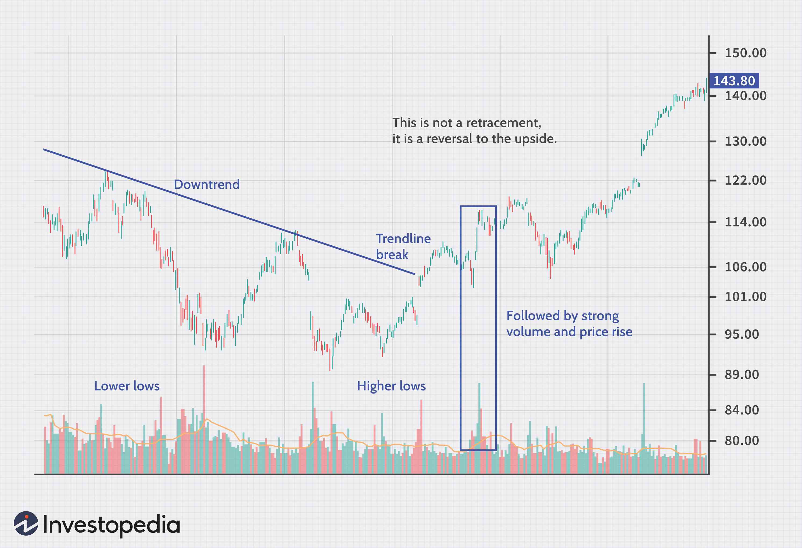

Financial markets are inherently dynamic and complex, characterized by perpetual fluctuations that can present significant challenges for traders and investors alike. These fluctuations are not arbitrary; they are driven by a vast array of factors, including economic indicators, geopolitical events, and investor sentiment, which collectively shape the movement of asset prices. In this ever-changing environment, recognizing and understanding market trends, specifically reversals and retracements, becomes crucial for executing successful trading strategies.

Market reversals signify a change in the direction of an asset's price trend. Identifying such reversals accurately allows traders to make informed decisions that can lead to profitable outcomes. Conversely, retracements are temporary movements in the opposite direction of the prevailing trend, often seen as minor corrections rather than signals for a full trend reversal. Distinguishing between these two phenomena is essential for traders to capitalize effectively on market opportunities and avoid potential pitfalls.



Algorithmic trading, or algo trading, has emerged as a sophisticated approach to harnessing these market dynamics. By integrating advanced computational techniques and models, algorithmic trading systems can swiftly analyze large volumes of market data to pinpoint trading opportunities arising from reversals and retracements. These systems are capable of executing trades with remarkable speed and precision, minimizing the emotional and psychological biases that can impede human decision-making.

This article explores the intricate concepts of financial market reversals and retracements, and elucidates how algorithmic trading can be strategically employed to exploit these phenomena. We will discuss the mechanics underlying algorithmic trading, examining the methodologies and strategies used to incorporate key market movements for enhanced financial outcomes. By understanding these strategies, traders can enhance their ability to navigate the complexities of financial markets successfully.

## Table of Contents

## Understanding Financial Market Reversals

A reversal in the financial markets signifies a change in the prevailing direction of an asset's price trend. This shift can occur abruptly or gradually and may be short-term, spanning a few trading sessions, or long-term, influencing market sentiment over several weeks or months. Reversals can present lucrative opportunities for traders who act promptly, as they signal potential entry or exit points.

Identifying reversals requires the use of technical indicators, which help to distinguish between genuine changes in trend and mere market noise. Among the most common indicators are moving averages and trendlines. Moving averages smooth out price data to highlight the direction of an asset's trend over a specified period. For instance, a cross of the shorter-term moving average above the longer-term moving average, known as a "golden cross," can indicate a potential upward reversal.

Trendlines, on the other hand, are constructed by connecting a series of highs or lows, providing a visual representation of support and resistance levels. A breach of a trendline suggests a weakening of the current trend, potentially signaling a reversal.

Understanding the patterns and factors that precipitate reversals is crucial for informed trading. Price patterns such as head and shoulders, double tops, or bottoms are visual predictors of potential reversals. Meanwhile, fundamental factors, including shifts in economic data, interest rates, or geopolitical developments, can also drive a market reversal.

By analyzing these indicators and patterns, traders can make strategic decisions to enter or [exit](/wiki/exit-strategy) positions, aligning their strategies with anticipated market movements.

## Exploring Market Retracements

Retracements within financial markets refer to temporary reversals in price movement that occur within a continuing trend. These transient shifts often cause momentary disruptions but eventually lead the asset back to its primary trajectory. Recognizing retracements is vital for traders seeking to distinguish these short-term deviations from full-fledged trend reversals.

Retracements can pose a significant opportunity for traders who can accurately identify them, as they provide entry points to trade along the direction of the overarching trend. During a retracement, the price of an asset pulls back to a recent support or resistance level before resuming its primary trend direction. This retracement or pullback is not an indication of a new trend but rather a brief correction in the market.

One of the most commonly used techniques to analyze and predict the extent of these pullbacks is through Fibonacci retracement levels. This method incorporates key Fibonacci ratios—typically 23.6%, 38.2%, 50%, 61.8%, and 100%—to determine potential levels of support or resistance during a retracement. Traders use these levels to identify price zones where reversals or continuation of the primary trend might occur.

For example, if a stock is trending upwards and then begins to decline, traders might look for it to find support near one of the Fibonacci levels before moving upward again. The formula for calculating these retracement levels is straightforward and can be implemented programmatically as follows in Python:

```python
def fibonacci_retracement_levels(high, low):
    diff = high - low
    levels = {
        "23.6%": high - 0.236 * diff,
        "38.2%": high - 0.382 * diff,
        "50%": high - 0.5 * diff,
        "61.8%": high - 0.618 * diff,
        "100%": low
    }
    return levels

# Example usage
high_price = 200
low_price = 150
retracement_levels = fibonacci_retracement_levels(high_price, low_price)
print(retracement_levels)
```

Understanding retracements and using tools like Fibonacci retracements allow traders to make more informed predictions about where price levels might stall or reverse slightly before continuing along their primary path. While these tools provide important insights, caution is necessary since retracements can be unpredictable and impacted by broader market conditions.

## Algorithmic Trading: A New Frontier

Algorithmic trading employs automated systems to execute trades based on predefined conditions and statistical models. These systems have revolutionized financial markets by leveraging computational power to process vast quantities of data at high speed, facilitating rapid and efficient decision-making processes. This capability is particularly advantageous in volatile markets where swift action can capture fleeting trading opportunities or mitigate losses.

At its core, [algorithmic trading](/wiki/algorithmic-trading) relies on a set of mathematical and statistical algorithms designed to detect patterns and anomalies in market data. These models frequently incorporate technical indicators such as moving averages, Relative Strength Index (RSI), and Bollinger Bands, which help identify potential reversal and retracement opportunities. The integration of technical indicators enables algorithms to interpret price action and predict future movements, thus guiding automated trading strategies.

The advent of [artificial intelligence](/wiki/ai-artificial-intelligence) (AI) and [machine learning](/wiki/machine-learning) has significantly enhanced the adaptability and evolution of algorithmic trading systems. These technologies allow algorithms to continuously learn from vast datasets, refining their predictive capabilities and adjusting to market changes in real-time. Machine learning models, such as support vector machines and neural networks, can be trained to recognize complex patterns in historical data, which are then applied to current market conditions to forecast price movements. Furthermore, [deep learning](/wiki/deep-learning) techniques can process unstructured data, such as financial news or social media sentiment, to inform trading decisions.

Below is a simple Python script that demonstrates the use of a moving average crossover strategy, a common technique in algorithmic trading:

```python
import yfinance as yf
import pandas as pd

# Fetch historical stock data
data = yf.download("AAPL", start="2023-01-01", end="2023-12-31")

# Calculate short and long moving averages
short_window = 40
long_window = 100

signals = pd.DataFrame(index=data.index)
signals['price'] = data['Adj Close']
signals['short_mavg'] = data['Adj Close'].rolling(window=short_window, min_periods=1, center=False).mean()
signals['long_mavg'] = data['Adj Close'].rolling(window=long_window, min_periods=1, center=False).mean()

# Generate signals
signals['signal'] = 0.0
signals['signal'][short_window:] = np.where(signals['short_mavg'][short_window:] > signals['long_mavg'][short_window:], 1.0, 0.0)
signals['positions'] = signals['signal'].diff()

# Print signals
print(signals.head())
```

This script utilizes the `yfinance` library to download historical stock data and computes short-term and long-term moving averages. The strategy generates buy signals when the short-term moving average exceeds the long-term moving average, and sell signals when the opposite occurs.

The continuous advancement in both hardware and software aspects of computing is expected to further accelerate the adoption of algorithmic trading. With greater access to expansive datasets and enhanced computational capabilities, future trading algorithms will likely exhibit superior accuracy and efficiency. As the integration of AI and machine learning deepens, these systems will become increasingly proficient at navigating the complexities of financial markets, ensuring that traders who harness these technologies remain at the forefront of market innovation.

## Strategies for Trading Reversals and Retracements with Algorithms

Fibonacci retracement levels serve as a prominent tool in trading strategies for detecting potential support and resistance levels during market retracements. These levels are built upon the idea that markets will often retrace a predictable portion of a move before continuing in the original direction. By dividing the peak-to-trough distance by key Fibonacci ratios—such as 23.6%, 38.2%, 50%, and 61.8%—traders can identify these potential areas of interest where the price may stall or reverse.

Trend-following indicators, particularly moving averages, play a crucial role in discerning the start and end of market reversals. Simple Moving Averages (SMA) and Exponential Moving Averages (EMA) smooth out price data to identify underlying trends, signaling possible reversal points when price crosses these averages. For instance, a crossover between a short-term and a long-term moving average, often referred to as a "Golden Cross" or "Death Cross", can suggest a potential reversal in trend direction.

Risk management is a fundamental component, and dynamic stop-loss placements driven by the Average True Range (ATR) adjust positions in response to market [volatility](/wiki/volatility-trading-strategies). The ATR, which measures market volatility by decomposing the entire range of an asset's price for that period, can be used to set a stop-loss at a multiple of the ATR value, ensuring that stop levels are neither too tight nor too loose, thus accommodating natural market fluctuations. This approach can be implemented in Python as follows:

```python
import pandas as pd

def calculate_atr(data, period=14):
    data['High-Low'] = data['High'] - data['Low']
    data['High-PrevClose'] = abs(data['High'] - data['Close'].shift())
    data['Low-PrevClose'] = abs(data['Low'] - data['Close'].shift())
    tr = data[['High-Low', 'High-PrevClose', 'Low-PrevClose']].max(axis=1)
    atr = tr.rolling(window=period, min_periods=1).mean()
    return atr

def dynamic_stop_loss(entry_price, atr_value, atr_multiplier=2.0):
    stop_loss = entry_price - (atr_value * atr_multiplier)
    return stop_loss
```

Advanced algorithms harness real-time data and undergo rigorous [backtesting](/wiki/backtesting) to optimize strategies for maximizing profit potential. By analyzing historical data and assessing strategy performance before live deployment, traders can adjust parameters to improve efficiency and adaptability under varied market conditions. Moreover, machine learning techniques can evolve these algorithms, allowing them to learn from new data inputs continually and recalibrate strategies dynamically, thus enhancing their predictive accuracy and execution speed.

## Challenges and Considerations in Algo Trading

Algorithmic trading, while offering numerous benefits such as speed and precision, also presents certain challenges and considerations that traders need to address to optimize their strategies effectively.

One significant challenge is the prevalence of false signals generated by technical indicators used within trading algorithms. False signals can lead to unintended trades, resulting in potential financial losses. This issue arises when indicators misrepresent market movements, either by predicting a reversal or retracement that does not materialize. To mitigate this risk, it is crucial for traders to understand the limitations of the technical tools they employ. This involves selecting appropriate indicators based on market conditions and complementing them with additional criteria to filter out noise.

Over-optimization, or "curve fitting," is another critical challenge. This occurs when an algorithm is excessively fine-tuned to specific historical data, often leading to poor performance in live trading. To combat over-optimization, robust backtesting methods must be employed. Backtesting should be carried out on diverse datasets, incorporating out-of-sample testing and walk-forward analysis to ensure the model's ability to generalize across varying market scenarios. Implementing techniques like cross-validation can enhance the robustness of backtesting practices.

Traders should also remain vigilant about market [liquidity](/wiki/liquidity-risk-premium) and slippage, which can significantly impact execution efficiency. Slippage occurs when a trade is executed at a different price than expected, often due to insufficient market liquidity or rapid price changes. Incorporating liquidity analysis within the trading algorithm can help in predicting and adjusting for slippage, thereby improving execution accuracy. Real-time data on [order book](/wiki/order-book-trading-strategies) depth and market [volume](/wiki/volume-trading-strategy) can aid in assessing the liquidity landscape, allowing the algorithm to adjust its behavior accordingly.

Regulatory considerations are increasingly influencing algorithmic trading practices. Regulatory bodies impose various rules to ensure market integrity and minimize systemic risk. Traders must ensure compliance with these regulations, including maintaining audit trails and adhering to market abuse prevention measures. The integration of compliance checks within the algorithm can help traders avoid regulatory pitfalls.

The ethical implications of high-frequency trading ([HFT](/wiki/high-frequency-trading-strategies)) also demand attention. HFT strategies, characterized by extremely short holding periods and rapid execution, raise concerns about market fairness and stability. While they contribute to market liquidity, they may also lead to increased volatility and pose risks to less sophisticated investors. Traders must weigh these ethical considerations, potentially reevaluating the moral impact of their trading activities.

Addressing these challenges and considerations requires a comprehensive understanding of both the technical and regulatory environments of algorithmic trading. Continuous monitoring and adaptation of trading models are essential for minimizing risks while capitalizing on the opportunities offered by this sophisticated approach to trading.

## The Future of Algorithmic Trading in Financial Markets

The advancements in artificial intelligence (AI) and machine learning are set to transform algorithmic trading into a more intelligent and adaptive practice. These technologies allow trading algorithms to process and analyze large volumes of financial data, refine prediction models, and adapt strategies in real-time, leading to more accurate and profitable trading decisions. AI techniques such as deep learning and natural language processing can process unstructured data from news articles, social media, and earnings reports, providing a comprehensive view of market sentiment and potential impacts on asset prices.

The increase in computational power, coupled with access to extensive datasets, is enhancing the efficacy of algorithmic trading models. Algorithms can now incorporate complex statistical methods and machine learning models to predict market behavior more accurately. For example, [reinforcement learning](/wiki/reinforcement-learning), a type of machine learning where algorithms learn optimal strategies through trial and error, has shown promise in adapting trading strategies based on historical patterns and real-time data.

Major financial institutions are progressively integrating algorithmic trading in their operations to capitalize on its efficiencies and precision. This trend is driven by the demand for faster execution times, reduced transaction costs, and the ability to manage vast portfolios effectively. As a result, innovation within the sector is accelerating, with increased investment in developing more sophisticated trading systems.

Traders must stay informed and adapt to harness the full potential of algorithmic trading technologies. This requires a commitment to continuous learning, not only in understanding new algorithms and technologies but also in staying abreast of regulatory changes and market dynamics. Developing skills in coding, data analysis, and machine learning can be particularly beneficial for those looking to engage with algorithmic trading.

As the financial markets evolve, so too will the algorithms that navigate them. The adaptability and learning capabilities of AI-driven trading systems are anticipated to become key competitive advantages in the financial sector. However, successful implementation and operation require careful consideration of the ethical implications, regulatory compliance, and the potential challenges posed by market volatility and complexities.

## Conclusion

Understanding reversals and retracements in the financial markets is crucial for making informed and strategic trading decisions. These market phenomena represent essential components of technical analysis, allowing traders to anticipate potential changes in trend directions. By mastering these concepts, traders can discern between temporary pullbacks and more significant trend shifts, enabling them to allocate resources more effectively and refine their strategies to mitigate risk.

Algorithmic trading presents a sophisticated approach to executing trades by utilizing advanced computational algorithms to automate and optimize the trading process. These algorithms analyze vast amounts of market data at incredible speeds, providing traders with a means to respond swiftly and accurately to market signals associated with reversals and retracements. Through the integration of algorithmic models, traders can enhance precision in entry and exit points, ensuring efficient and effective execution that can potentially improve financial outcomes.

Leveraging the power of algorithms, traders and investors can navigate and capitalize on market fluctuations more adeptly. By incorporating algorithms that process historical and real-time data, trading strategies can be optimized to identify profitable opportunities within market reversals and retracements. As these systems evolve with emerging technologies such as machine learning and artificial intelligence, the potential for enhanced predictive capabilities increases, offering a significant competitive edge in the market.

Continuous learning and adaptation are crucial as financial markets and technology progress. The dynamic nature of markets requires an ongoing commitment to understanding new tools and approaches, as well as a proactive stance in evaluating the performance of trading strategies. Adaptability ensures that traders remain responsive to changing market conditions and technological advancements, allowing them to harness the full potential of algorithmic trading in pursuit of sustained success.

## References & Further Reading

[1]: Bergstra, J., Bardenet, R., Bengio, Y., & Kégl, B. (2011). ["Algorithms for Hyper-Parameter Optimization."](https://papers.nips.cc/paper/4443-algorithms-for-hyper-parameter-optimization) Advances in Neural Information Processing Systems 24.

[2]: ["Advances in Financial Machine Learning"](https://www.amazon.com/Advances-Financial-Machine-Learning-Marcos/dp/1119482089) by Marcos Lopez de Prado

[3]: ["Evidence-Based Technical Analysis: Applying the Scientific Method and Statistical Inference to Trading Signals"](https://www.amazon.com/Evidence-Based-Technical-Analysis-Scientific-Statistical/dp/0470008741) by David Aronson

[4]: ["Machine Learning for Algorithmic Trading"](https://github.com/stefan-jansen/machine-learning-for-trading) by Stefan Jansen

[5]: ["Quantitative Trading: How to Build Your Own Algorithmic Trading Business"](https://www.amazon.com/Quantitative-Trading-Build-Algorithmic-Business/dp/1119800064) by Ernest P. Chan