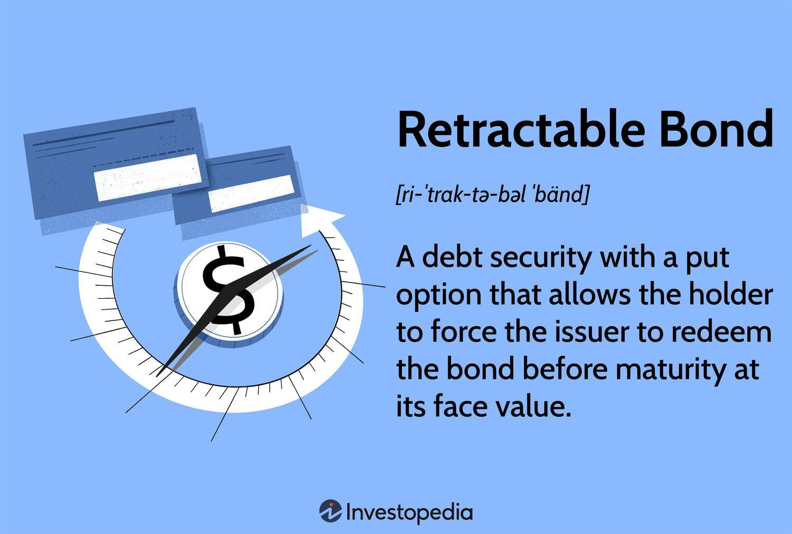

In fixed-income investments, retractable bonds and bond ladders offer compelling strategies for risk management and consistent returns. Fixed-income securities, such as bonds, are pivotal instruments for investors aiming to secure stable returns, and these strategies can significantly enhance portfolio diversification. Understanding these investment mechanisms enables investors to better tailor their portfolios to match their risk tolerance and financial goals.

Retractable bonds include a put option, granting bondholders the ability to redeem bonds prior to maturity, thus providing both flexibility and mitigation against interest rate risk. This makes them particularly advantageous in volatile markets where interest rates may rise unexpectedly. On the other hand, bond ladders involve the strategic purchase of bonds with staggered maturities, effectively managing interest rate risks while ensuring a stable income stream. This structured approach contrasts with holding single long-term bonds, offering more controlled exposure to market fluctuations.



Algorithmic trading plays a vital role in optimizing these strategies. By employing data-driven, automated processes, algorithmic trading can enhance portfolio management through improved precision and efficiency. These algorithms can execute trades based on real-time data, thereby maximizing yield, liquidity, and diversification across a bond portfolio. Integrating such advanced trading strategies with retractable bonds and bond ladders presents a sophisticated method for optimizing returns while managing risks.

## Table of Contents

## Understanding Retractable Bonds

Retractable bonds are a type of fixed-income security that embeds a put option, granting bondholders the right to redeem the bonds at predetermined intervals before maturity. This feature provides investors with increased flexibility and an effective risk management tool against interest rate fluctuations. By exercising the put option, investors can adapt to changing market conditions, mitigating potential losses from adverse interest rate movements.

Also known as variable-rate demand notes, retractable bonds are valued based on both their future cash flows and the embedded put option. This dual valuation approach considers the potential for early redemption, which can influence the bond's yield and attractiveness to investors. The embedded put option enables bondholders to counteract declining market conditions by obligating the issuer to repurchase the bond at its face value, thereby offering an additional layer of security.

Retractable bonds serve as a protective mechanism against interest rate risk, a key concern for fixed-income investors. During periods of rising interest rates, bond prices tend to decrease, leading to potential capital losses. However, the retractable feature allows investors to shorten the maturity of their holdings, reducing duration risk and exposure to interest rate volatility. This ability to exit unfavorable conditions early can significantly enhance the stability and performance of a bond portfolio.

In contrast, extendable bonds provide the opposite strategy, offering an option to extend the maturity at the discretion of the bondholder. This feature is useful when interest rates are falling, allowing investors to lock in higher yields for a longer period. The flexibility granted by both retractable and extendable bonds allows investors to strategically manage their portfolios, aligning investment horizons with evolving [interest rate](/wiki/interest-rate-trading-strategies) environments and personal financial objectives.

## The Benefits of Retractable Bonds

Retractable bonds are a versatile financial instrument that bolsters portfolio flexibility and [liquidity](/wiki/liquidity-risk-premium), particularly during periods of rising interest rates or economic uncertainty. The key attribute of retractable bonds is their embedded put option, which allows bondholders to sell the bond back to the issuer at par value before the maturity date. This feature provides investors with a strategic advantage by creating an early [exit](/wiki/exit-strategy) option from an investment that may be adversely affected by interest rate hikes or deteriorating market conditions.

During periods of rising interest rates, bond prices generally fall, resulting in capital losses for investors holding traditional fixed-rate bonds. Retractable bonds counter this risk by offering the flexibility to exit the bond at par value, thus avoiding the depreciation that typically accompanies rate increases. Investors can then use the returned capital to invest in newer bonds with higher yields, optimizing their income potential while maintaining the health of their portfolio.

Furthermore, the liquidity and flexibility provided by retractable bonds serve as a crucial risk management tool. The ability to redeem bonds early can be particularly advantageous during economic downturns. In uncertain economic environments, quick access to capital becomes imperative. Retractable bonds enable investors to better manage liquidity needs and redeploy assets to safer or more lucrative opportunities, thereby enhancing overall portfolio resilience and adaptability.

In summary, the option to retract bonds before maturity offers investors a proactive measure against interest rate [volatility](/wiki/volatility-trading-strategies) and economic instability. By ensuring the ability to liquidate investments at par value, retractable bonds present a significant advantage in maintaining and optimizing financial health amidst varying market conditions.

 to Bond Ladders

A bond ladder is a fixed-income investment strategy that involves purchasing a series of bonds with staggered maturity dates. This strategy is designed to manage interest rate risks and ensure a stable income over time. By spreading bond maturities across a range of dates, typically from short to long-term, an investor can create a structured portfolio that delivers regular income while mitigating potential reinvestment risks associated with fluctuating interest rates.

The mechanism by which bond ladders operate is straightforward: as each bond matures, the principal amount is typically reinvested into a new bond at the long end of the ladder. This cycle maintains the structure of the ladder and can potentially capture higher yields available in rising interest rate environments. The staggered maturity feature of bond ladders reduces the reinvestment risk that is commonly associated with single-maturity bond strategies, such as investing in a single long-term bond or a bond fund whose duration might not align with an investor's income needs or risk tolerance.

Bond ladders offer several advantages over investing in individual long-term bonds or bond funds. With individual long-term bonds, the investor is exposed to the risk of having to reinvest the entire principal amount at once at potentially unfavorable rates if the bond matures during a low-interest-rate period. Conversely, bond funds, while inherently diversified, might not provide the controlled exposure to interest rate movements that a ladder does, due to their dynamic nature and the ongoing management of the underlying assets.

Overall, the bond ladder strategy offers a disciplined approach to bond investments, ensuring periodic income and the flexibility to adjust the strategy as economic conditions and personal investment goals evolve.

## Benefits of a Bond Ladder Strategy

A bond ladder strategy represents a structured approach to bond investment, valuable for its inherent diversification benefits. By spreading investments across bonds with staggered maturities, it helps insulate against interest rate volatility. This strategy effectively manages interest rate risk since, at any point in time, some bonds within the ladder are nearing maturity, providing liquidity and the opportunity to reinvest at current interest rates.

The bond ladder enhances risk management by ensuring a portion of the portfolio consistently matures. This regularity offers the chance to reinvest proceeds in new bonds, possibly at higher yields, thus balancing income stability with the flexibility to adjust to changing market conditions. The predictable nature of cash flows from maturing bonds affords investors the ability to plan cash needs better, reducing the chance of needing to sell bonds prematurely, which might incur capital losses. 

In an environment characterized by volatile interest rates, the structure of a bond ladder proves beneficial. It automatically capitalizes on different interest rate cycles by providing liquidity at frequent intervals. For instance, if rates rise, maturing bonds can be reinvested at higher rates, potentially increasing overall yields. Conversely, if rates fall, the remaining longer-term bonds in the ladder could benefit from price appreciation. This staggered maturity approach provides a systematic method to manage income and potentially harness market movements to optimize returns over varied interest rate cycles.

## Role of Algorithmic Trading

Algorithmic trading plays a vital role in the management of bond ladder strategies by leveraging advanced data-driven technologies to enhance portfolio outcomes. At its core, [algorithmic trading](/wiki/algorithmic-trading) automates the process of buying and selling bonds, enabling investors to optimize yield, liquidity, and diversification with precision and efficiency.

By utilizing algorithms, bond ladder managers can execute trades based on real-time data, ensuring that decisions align closely with current market conditions. This real-time execution minimizes human error and reaction time, fostering a more responsive approach to bond market fluctuations. Algorithms can systematically identify and seize opportunities that may arise from transient market inefficiencies, thereby potentially improving investment returns.

Furthermore, the incorporation of [machine learning](/wiki/machine-learning) techniques allows algorithmic trading systems to adapt to shifting market conditions. Machine learning models can be trained on vast datasets to uncover patterns and predictive signals that inform trading strategies. For instance, these models can predict future interest rate movements, assess credit risk, or identify changes in bond liquidity conditions.

A practical example is the application of predictive models to adjust bond ladder compositions dynamically. Consider a machine learning model that predicts changes in interest rates based on macroeconomic indicators such as employment rates or inflation figures. This model can guide the algorithm to recalibrate the bond ladder, adjusting maturities or reallocating investments across different bonds to maximize yield while minimizing risk.

One can implement a simple algorithmic trading strategy in Python, utilizing historical bond price data and common machine learning libraries such as scikit-learn to predict bond price trends. Here's a basic illustration using linear regression to predict bond prices:

```python
import numpy as np
import pandas as pd
from sklearn.model_selection import train_test_split
from sklearn.linear_model import LinearRegression
from sklearn.metrics import mean_squared_error

# Load historical bond data
data = pd.read_csv('bond_prices.csv')
X = data[['interest_rate', 'inflation', 'economic_indicator']]
y = data['bond_price']

# Split data into train and test sets
X_train, X_test, y_train, y_test = train_test_split(X, y, test_size=0.2, random_state=42)

# Train a linear regression model
model = LinearRegression()
model.fit(X_train, y_train)

# Predict bond prices
y_pred = model.predict(X_test)

# Evaluate model
mse = mean_squared_error(y_test, y_pred)

print(f'Mean Squared Error: {mse}')
```

This code snippet demonstrates how algorithmic trading can be enhanced through machine learning, enabling more sophisticated and adaptive bond ladder strategies. Overall, integrating algorithmic trading into fixed-income investment strategies increases the potential for optimized performance and effective risk management.

## Challenges and Downsides

Bond ladders, while offering several benefits in fixed-income investment strategies, also present some challenges and downsides. One significant concern is the low yield environment. When interest rates are suppressed, the returns generated by the individual bonds within the ladder may not achieve the desired growth potential. This situation can be exacerbated by extended periods of low rates, which restrict the reinvestment opportunities for maturing bonds into higher-yielding alternatives. The formula for calculating the yield to maturity (YTM), which significantly impacts the expected returns, is:

$$
YTM = \frac{C + \frac{F-P}{n}}{\frac{F+P}{2}}
$$

where:
- $C$ is the annual coupon payment,
- $F$ is the face value of the bond,
- $P$ is the price paid for the bond,
- $n$ is the years to maturity.

Liquidity issues also pose a considerable risk. Non-governmental bonds, especially those issued by smaller entities or in less active markets, can suffer from reduced liquidity. This can become problematic if an investor needs to liquidate positions quickly to address urgent capital requirements. The ability to sell a bond without significantly affecting its price is critical, particularly during market stress or economic downturns.

Moreover, the use of algorithmic trading in managing bond ladders introduces additional challenges. The bond market can be less transparent compared to equities, often due to the over-the-counter nature of transactions and the varied liquidity across different issuances. This opacity can hinder the algorithms' ability to access and process real-time, accurate data, reducing their effectiveness. Machine learning models, which these algorithms might employ, typically require vast amounts of data to train effectively and are sensitive to data quality. For instance, if the historical price data or market activity feed is sparse or inaccurate, the predictions and automated decisions could lead to suboptimal portfolio adjustments.

Python, as a tool for implementing these algorithms, can illustrate the limitation with a basic script as follows:

```python
import numpy as np
from sklearn.ensemble import RandomForestRegressor

# Hypothetical bond market data
data = np.array([
    # Features: [Interest Rate, Liquidity, Credit Rating]
    [0.02, 0.1, 3],
    [0.025, 0.2, 4],
    # ... (more data)
])

# Target: Bond Yield
target = np.array([0.03, 0.035])

model = RandomForestRegressor()
model.fit(data, target)

# New market scenario for prediction
new_scenario = np.array([[0.018, 0.15, 3]])
predicted_yield = model.predict(new_scenario)

print(f"Predicted Bond Yield: {predicted_yield[0]:.4f}")
```

This code sketch demonstrates the use of a random forest regressor to predict bond yields based on features like interest rates, liquidity, and credit rating, but highlights the dependency on the complete and precise input data for reliable outcomes.

## Building a Bond Ladder

To effectively construct a bond ladder, the initial step is to clearly define your investment goals and the time horizon for your strategy. This foundational decision impacts the number and arrangement of bonds that you will select, influencing both risk and income stability. 

Next, plan the ladder with careful consideration of its structure. This includes determining the number of rungs, which represent the distinct maturity dates of the bonds you plan to purchase. Each rung should have a specified maturity interval that aligns with your investment timeframe. For instance, if your time horizon is ten years, you might opt for annual rungs, resulting in ten different maturity dates. The intervals between these maturity dates can be tailored to match your liquidity needs and market conditions, helping maintain a predictable income stream.

Investment amounts per rung need to be allocated in a way that balances risk diversely throughout the ladder. This approach ensures that not all capital is tied up in longer-dated bonds, which might be more vulnerable to interest rate fluctuations. A well-distributed investment across each maturity is crucial for income smoothing and managing reinvestment risk.

Selecting bonds for your ladder requires an emphasis on diversification across different types and issuers. This diversification helps shield the portfolio from issuer-specific risks and enhances the overall credit quality. Consider incorporating a mix of corporate, municipal, and government bonds to capitalize on varying interest rates and spreads, contributing to a robust portfolio.

Staggered maturities are integral to a bond ladder, as they allow for continuous income. As each bond matures, it provides an opportunity to either cash out funds or reinvest them in new bonds, ideally at prevailing interest rates, thus maintaining or potentially increasing the yield. This reinvestment process can be seen as a way to mitigate the risk of future interest rate changes impacting the entire portfolio's value.

To summarize, building a bond ladder involves a strategic approach to selecting bonds with staggered maturities and diversified issuers. This structured investment method supports achieving a consistent income stream while managing interest rate and reinvestment risks efficiently.

## Future Trends and Innovations

Technological advancements are actively reshaping fixed-income investments, offering novel ways to enhance returns and manage risks. Robo-advisors and smart beta strategies are leading the charge in this transformation. Robo-advisors utilize AI and algorithms to offer personalized portfolio management, optimizing bond allocations based on a combination of investor preferences and market conditions. This automation allows for efficient handling of large data sets and real-time market adjustments, enabling investors to capture more favorable yield opportunities. Smart beta strategies, while traditionally associated with equities, are gaining traction in fixed-income markets. By systematically selecting bonds based on factors such as value, size, or [momentum](/wiki/momentum) rather than merely market capitalization, these strategies aim to deliver superior risk-adjusted returns.

Machine learning and AI are further enhancing predictive capabilities in fixed-income markets. Algorithms can process vast amounts of historical and real-time data, identifying patterns and correlations that may not be apparent to human analysts. This advanced data processing power enables more precise interest rate forecasting and risk assessment, thereby improving trading precision. An example of such application is the use of recurrent neural networks (RNNs) for time series prediction of interest rate movements, which can significantly aid in strategic bond investments.

Blockchain technology holds promise for increasing transparency and security in fixed-income transactions. By providing a decentralized and immutable ledger, blockchain can streamline the process of issuing, trading, and settling bonds. This can reduce transaction costs and counterparty risk, while enhancing transparency and traceability of bond ownership. Smart contracts, a feature of blockchain technology, can automate and enforce the terms of bond agreements, reducing the need for intermediaries and increasing the efficiency and security of transactions.

Overall, these technological innovations are providing tools for more informed decision-making and efficient management of fixed-income portfolios, potentially leading to improved investment outcomes. As these technologies continue to evolve, they are likely to drive further innovation and competitiveness in the fixed-income market landscape.

## Conclusion

Integrating retractable bonds and bond ladders with algorithmic trading presents a sophisticated method for optimizing returns while effectively managing risks within fixed-income portfolios. These strategies enable investors to tailor their approaches according to specific investment goals, effectively balancing between risk tolerance and the dynamic market conditions they face. By using retractable bonds, investors gain the flexibility to redeem these securities before maturity, particularly beneficial during periods of rising interest rates, thus mitigating potential losses.

Furthermore, bond ladders provide a structured diversification across different maturities, fostering consistent cash flows and reducing reinvestment risk. This strategy acts as a hedge against interest rate volatility, allowing for methodical reinvestment at regular intervals, which can stabilize income streams in fluctuating markets. Algorithmic trading plays a pivotal role in this integration, automating processes to optimize for yield, liquidity, and diversification. By leveraging real-time data and machine learning, algorithms can swiftly adapt to market changes, enhancing both efficiency and precision in portfolio management.

For investors, understanding and harnessing these mechanisms provide a robust foundation for achieving diverse financial objectives through a well-diversified bond investment strategy. This approach not only aligns with individual risk profiles but also empowers investors to navigate the complexities of fixed-income markets with greater confidence and strategic foresight.

## References & Further Reading

- **Reilly, F. K., & Brown, K. C.** "Investment Analysis and Portfolio Management." South-Western College Pub. This book provides comprehensive insights into investment strategies, focusing on the theoretical and practical aspects of portfolio management. It covers various asset classes, including fixed-income securities, making it an essential resource for understanding bond strategies like retractable bonds and bond ladders.

- **Fabozzi, F. J.** "Fixed Income Analysis." Wiley. This text is an authoritative source on fixed-income markets and instruments. It explains the nuances of bond valuation, risk management, and strategic investment approaches essential for grasping the benefits and mechanisms of retractable bonds and bond ladders.

- **Lopez de Prado, M.** "Advances in Financial Machine Learning." Wiley. Lopez de Prado's work introduces readers to the intersection of finance and technology with a focus on machine learning applications in financial markets. This book is particularly relevant for understanding how algorithmic trading can enhance fixed-income investment strategies, including bond ladders.

- **Chan, E.** "Quantitative Trading: How to Build Your Own Algorithmic Trading Business." Wiley. Chan's book is a practical guide to developing algorithmic trading systems. It offers insights into quantitative strategies and the use of algorithms in trading, relevant for automating bond ladder strategies and optimizing returns through algorithmic approaches.

These references provide foundational knowledge and advanced strategies for investors interested in fixed-income securities and algorithmic trading methodologies.

