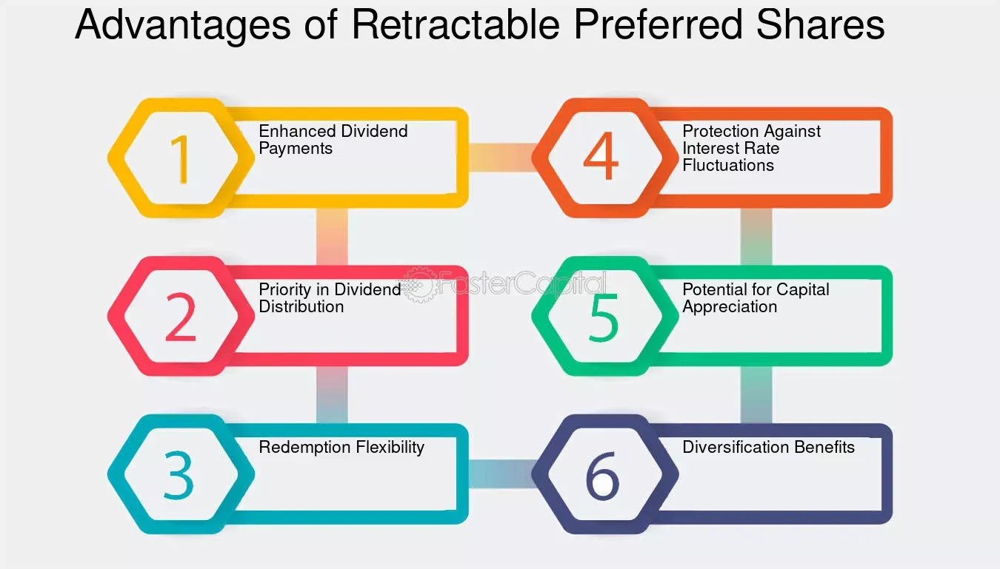

## Table of Contents

## What are retractable preferred shares?

Retractable preferred shares are a type of stock that gives the investor the right to sell the shares back to the company at a set price after a certain date. This feature makes them different from regular preferred shares, which don't have this option. The set price is usually the price the shares were first sold for, so investors know they can get their money back if they want to.

This kind of share can be good for investors who want more safety. They know they can get their money back at a certain time, which can make them feel more secure. But, the company might have to pay more to borrow money because they have to be ready to buy back the shares. So, it's a trade-off between safety for the investor and cost for the company.

## How do retractable preferred shares differ from regular preferred shares?

Retractable preferred shares and regular preferred shares are both types of stocks, but they have a key difference. Retractable preferred shares come with a special feature: the investor can choose to sell the shares back to the company at a set price after a certain date. This set price is usually the same as what the investor paid for the shares at the start. On the other hand, regular preferred shares do not have this option. If you own regular preferred shares, you can't ask the company to buy them back at a specific price.

This difference can make retractable preferred shares more attractive to some investors because they offer more security. Knowing they can get their money back at a set price can make investors feel safer about their investment. However, this safety comes at a cost for the company. They have to be ready to buy back the shares, which can make it more expensive for them to borrow money. So, while retractable preferred shares can be good for investors looking for safety, they might not be the best choice for every company.

## What is the main benefit of investing in retractable preferred shares?

The main benefit of investing in retractable preferred shares is the added security they offer. With these shares, you can choose to sell them back to the company at a set price after a certain time. This means you know you can get your money back if you need to. It's like having a safety net, which can make you feel more confident about your investment.

This feature can be really helpful if you're worried about the stock market going up and down. Knowing you have the option to get your money back at a fixed price can help you sleep better at night. It's a big reason why some investors prefer retractable preferred shares over regular ones.

## Can you explain the retraction feature of these shares?

The retraction feature of retractable preferred shares means that you, as an investor, have the right to sell your shares back to the company at a specific price after a certain date. This price is usually the same as what you paid for the shares when you bought them. So, if you decide you want your money back, you can ask the company to buy the shares from you at that set price.

This feature is like having a safety net for your investment. It gives you more control because you know you can get your money back if you need to. It's especially helpful if you're worried about the stock market going up and down. Knowing you have this option can make you feel more secure about your investment.

## What are the typical terms associated with the retraction right?

The typical terms for the retraction right on retractable preferred shares include a set retraction price and a specific retraction date. The retraction price is usually the same as what you paid for the shares when you bought them. This means if you decide to use the retraction right, you can sell the shares back to the company for the same amount you originally invested. The retraction date is the earliest time you can ask the company to buy the shares back. This date is set when the shares are first issued and can vary, but it's often several years after the shares are bought.

These terms give you a clear idea of when and how you can get your money back. Knowing the retraction price and date helps you plan your investment strategy. For example, if you think you might need your money back after a certain time, you can choose retractable preferred shares that match your timeline. This makes retractable preferred shares a good option if you want more control and security in your investments.

## How does the retraction price affect the value of retractable preferred shares?

The retraction price of retractable preferred shares can make them more valuable to investors. This is because the retraction price is usually the same as what you paid for the shares. So, if the market price of the shares goes down, you can still sell them back to the company at the higher retraction price. This safety net can make investors feel more secure, which can increase the demand for these shares and push their value up.

On the other hand, the retraction price can also limit how much the shares can go up in value. Since you can always sell them back at the retraction price, there's less reason for investors to buy the shares at a much higher price. This can keep the value of the shares from growing too much, even if the company does well. So, while the retraction price adds security, it can also put a ceiling on how high the share value can go.

## What are the risks associated with retractable preferred shares?

One risk of retractable preferred shares is that the company might not have enough money to buy back the shares when you want to use the retraction right. If the company is struggling financially, they might not be able to pay you the retraction price. This could leave you stuck with shares that are worth less than what you paid for them.

Another risk is that the retraction price can limit how much the shares can grow in value. Since you can always sell them back at the retraction price, there's less reason for investors to buy the shares at a much higher price. This can keep the value of the shares from going up a lot, even if the company does well. So, while the retraction feature adds security, it can also mean you might miss out on bigger gains.

Lastly, retractable preferred shares might not be as liquid as other types of shares. This means it can be harder to sell them to someone else if you want to get out of your investment before the retraction date. If there aren't many buyers interested in these shares, you might have to wait until the retraction date to get your money back, which could be a long time.

## How do companies benefit from issuing retractable preferred shares?

Companies can benefit from issuing retractable preferred shares because they can attract investors who want more safety in their investments. When a company offers these shares, it shows that they are willing to buy them back at a set price. This can make investors feel more secure about putting their money into the company. As a result, the company might find it easier to raise money, especially from investors who are more cautious.

However, there are also some downsides for the company. They have to keep enough money on hand to buy back the shares if investors decide to use the retraction right. This can make it more expensive for the company to borrow money, because they have to be ready to pay back investors at any time. So, while retractable preferred shares can help attract certain types of investors, they also come with extra costs and risks for the company.

## What are the tax implications of retracting preferred shares?

When you retract preferred shares, you might have to pay taxes on any profit you make. If you sell the shares back to the company at a higher price than what you paid for them, the difference is considered a capital gain. You'll need to report this gain on your tax return and pay taxes on it. The tax rate on capital gains can be different depending on how long you held the shares and your overall income.

On the other hand, if you retract the shares at a loss, meaning you sell them back for less than what you paid, you might be able to use that loss to reduce your taxes. You can claim this loss as a capital loss on your tax return, which can help lower the amount of taxes you owe on other gains or income. It's a good idea to talk to a tax professional to understand how retracting preferred shares will affect your taxes, as tax laws can change and be complicated.

## How do retractable preferred shares perform in different market conditions?

Retractable preferred shares can be a good choice when the stock market is going up and down a lot. This is because they give you a safety net. If the market goes down and the price of your shares drops, you can still sell them back to the company at the set retraction price. This can help you feel more secure because you know you can get your money back no matter what the market does. So, in uncertain times, retractable preferred shares might be more popular with investors who want to be safe.

On the other hand, when the market is doing really well, retractable preferred shares might not be as attractive. This is because the retraction price can limit how much the shares can grow in value. If the company is doing great and the stock price is going up a lot, you might not want to sell your shares back at the lower retraction price. You could miss out on bigger gains if you choose to retract the shares instead of holding onto them. So, in a strong market, investors might look for other types of investments that could give them higher returns.

## What are some real-world examples of retractable preferred shares?

One real-world example of retractable preferred shares is from the Canadian bank, Bank of Montreal (BMO). In 2014, BMO issued retractable preferred shares that gave investors the right to sell their shares back to the bank at a set price after a certain date. This was attractive to investors who wanted the safety of knowing they could get their money back if they needed to. The shares were popular because they offered a way to invest in a big bank while also having a safety net.

Another example is from a Canadian energy company, Enbridge Inc. In 2016, Enbridge issued retractable preferred shares that allowed investors to retract their shares at a fixed price after five years. This was a good option for investors who wanted to invest in the energy sector but were worried about the ups and downs of the market. The retraction feature gave them peace of mind, knowing they could get their money back at a set price if the market went down.

## How can an investor strategically use retractable preferred shares in their portfolio?

An investor can use retractable preferred shares in their portfolio to add a layer of safety. If you are worried about the stock market going up and down, these shares can be a good choice. You know you can sell them back to the company at a set price after a certain time. This can help you feel more secure, especially if you think you might need your money back at a specific time. You can use these shares to balance out riskier investments in your portfolio, making it more stable overall.

Another way to use retractable preferred shares is to take advantage of their steady income. These shares often pay regular dividends, which can give you a steady stream of money. If you're looking for a reliable source of income, adding these shares to your portfolio can help. Just remember that the retraction price might limit how much the shares can grow in value, so they might not be the best choice if you're looking for big gains. But for safety and income, they can be a smart part of your investment strategy.

## References & Further Reading

[1]: Bergstra, J., Bardenet, R., Bengio, Y., & Kégl, B. (2011). ["Algorithms for Hyper-Parameter Optimization."](https://dl.acm.org/doi/10.5555/2986459.2986743) Advances in Neural Information Processing Systems 24.

[2]: ["Advances in Financial Machine Learning"](https://www.amazon.com/Advances-Financial-Machine-Learning-Marcos/dp/1119482089) by Marcos Lopez de Prado

[3]: ["Evidence-Based Technical Analysis: Applying the Scientific Method and Statistical Inference to Trading Signals"](https://www.amazon.com/Evidence-Based-Technical-Analysis-Scientific-Statistical/dp/0470008741) by David Aronson

[4]: ["Machine Learning for Algorithmic Trading"](https://github.com/stefan-jansen/machine-learning-for-trading) by Stefan Jansen

[5]: ["Quantitative Trading: How to Build Your Own Algorithmic Trading Business"](https://github.com/LucindaYa/quant-resources/blob/master/Quantitative%20Trading%20How%20to%20Build%20Your%20Own%20Algorithmic%20Trading%20Business.pdf) by Ernest P. Chan