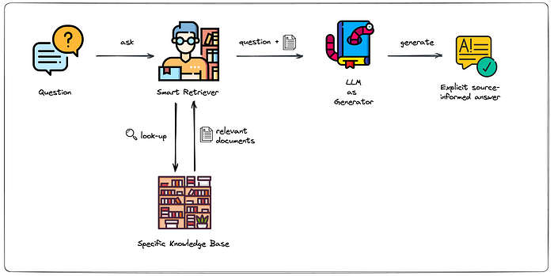

## Table of Contents

## What is Retrieval-Augmented Generation (RAG) in machine learning?

Retrieval-Augmented Generation (RAG) is a method in machine learning that combines the strengths of both retrieval-based and generative models. In simple terms, RAG works by first searching a large database to find relevant information, and then using that information to help generate a more accurate and contextually appropriate response. This approach is particularly useful in tasks like answering questions or generating text, where having access to a wide range of knowledge can significantly improve the quality of the output.

For example, if you ask a RAG model a question about a specific topic, it will first look through its database to find documents or pieces of information related to that topic. Once it has retrieved this information, the model then uses it as a reference to generate a response. This means that the answers provided by a RAG model are not only based on what it has learned during its training but are also enhanced by real-time data retrieval, making the responses more reliable and up-to-date.

## How does RAG differ from traditional language models?

RAG differs from traditional language models mainly in how it uses information to create responses. Traditional language models, like those based on transformer architectures, generate text based solely on what they've learned during training. They predict the next word in a sequence by considering the context of the words that came before it. This means their knowledge is limited to what was in their training data, and they can't access new information after training.

On the other hand, RAG can pull in fresh, relevant information from a large database when generating a response. It first searches for documents or data that match the query, then uses this retrieved information to help craft an answer. This makes RAG's responses more accurate and up-to-date because it combines the model's learned knowledge with real-time data. So, while traditional models rely only on their pre-existing knowledge, RAG enhances its answers by also considering current, external information.

## What are the key components of a RAG system?

A RAG system has two main parts: a retriever and a generator. The retriever's job is to search through a large database to find information that matches the user's question. It uses special methods, like similarity search, to quickly find the most relevant documents or pieces of data. Once it finds these, it sends them to the generator. The generator then takes this information and uses it, along with what it learned during its training, to create a detailed and accurate answer to the question.

The retriever often uses techniques like dense vector representations to find relevant information. For example, it might convert both the user's query and the documents in the database into numerical vectors and then calculate how similar they are using a formula like cosine similarity $$ \text{similarity} = \frac{\mathbf{A} \cdot \mathbf{B}}{\|\mathbf{A}\| \|\mathbf{B}\|} $$. This helps the retriever pick the most relevant pieces of information. The generator, on the other hand, uses a language model that has been trained to understand and generate text. When it gets the retrieved information, it combines it with its own knowledge to produce a response that's both informed and contextually appropriate.

## Can you explain the process of how RAG works?

When you ask a question to a RAG system, it starts by searching a big collection of documents or data to find information that matches your question. This part is done by the retriever, which uses special methods to quickly find the most relevant pieces of information. For example, it might turn both your question and the documents into numbers and then use a formula like $$ \text{similarity} = \frac{\mathbf{A} \cdot \mathbf{B}}{\|\mathbf{A}\| \|\mathbf{B}\|} $$ to see how similar they are. Once it finds the best matches, the retriever sends them to the next part of the system.

The second part of the RAG system is the generator, which takes the information found by the retriever and uses it to create an answer to your question. The generator is a smart language model that was trained to understand and generate text. It looks at the information it got from the retriever and combines it with what it already knows to come up with a detailed and accurate response. This way, the answer you get is not just based on what the model learned before but also includes up-to-date and relevant information from the database.

## What types of data sources can be used with RAG?

RAG can use many different types of data sources. It can work with text documents like [books](/wiki/algo-trading-books), articles, and websites. It can also use databases that store information in a structured way, like tables in a database. This means RAG can pull in information from places like Wikipedia, company reports, or even social media posts. As long as the data can be turned into text, RAG can use it to help answer questions.

The retriever part of RAG looks through all these different sources to find the best matches for the question asked. It turns the question and the data into numbers and uses a formula like $$ \text{similarity} = \frac{\mathbf{A} \cdot \mathbf{B}}{\|\mathbf{A}\| \|\mathbf{B}\|} $$ to see how similar they are. This helps the retriever pick the most useful information to send to the generator. The generator then uses this information, along with what it learned during its training, to create a detailed and accurate answer.

## What are the benefits of using RAG in natural language processing tasks?

Using RAG in natural language processing tasks can make answers more accurate and up-to-date. Traditional language models only use what they learned during training, so their knowledge can get old quickly. RAG, on the other hand, can search through a large collection of documents or data to find the latest information that matches the user's question. This means that when you ask a question, RAG can give you an answer that not only uses what it already knows but also includes new, relevant information. This makes RAG's responses more reliable and helpful, especially for questions that need the most current information.

Another benefit of RAG is that it can handle a wide range of topics. Because it can pull information from different sources like books, articles, and databases, RAG can answer questions on many different subjects. For example, if you ask about a recent event or a specific topic, RAG can search its sources to find the most relevant information. It then uses a formula like $$ \text{similarity} = \frac{\mathbf{A} \cdot \mathbf{B}}{\|\mathbf{A}\| \|\mathbf{B}\|} $$ to see how similar the question and the data are. This helps RAG pick the best information to use when creating its answer, making it versatile and useful for many different kinds of questions.

## How can RAG improve the accuracy of generated text?

RAG can make generated text more accurate by using up-to-date information. When you ask a question, RAG searches through a big collection of documents or data to find the latest information that matches your question. It then uses this information to help create an answer. This means that RAG's answers are not just based on what it learned a long time ago during training, but also include new, relevant information. This makes the answers more reliable and correct, especially for questions that need the most current information.

RAG also uses a special method to find the best information. It turns both your question and the documents into numbers and then uses a formula like $$ \text{similarity} = \frac{\mathbf{A} \cdot \mathbf{B}}{\|\mathbf{A}\| \|\mathbf{B}\|} $$ to see how similar they are. This helps RAG pick the most useful information to use when creating its answer. By combining this fresh information with what it already knows, RAG can give you answers that are more accurate and detailed. This makes RAG very helpful for many different kinds of questions, from simple facts to complex topics.

## What are some common applications of RAG in industry?

RAG is used in many industries to make answers to questions more accurate and up-to-date. For example, in customer service, companies use RAG to help their chatbots give better answers to customer questions. When a customer asks about a product or a service, the RAG system searches through a big collection of documents or data to find the latest information that matches the question. It then uses this information to help create an answer. This makes the chatbot's responses more helpful and reliable, improving the customer's experience.

Another common use of RAG is in the field of research and education. Researchers and students can use RAG to get quick and accurate answers to their questions. When someone asks a question, RAG searches through a large database of books, articles, and other sources to find the most relevant information. It then uses a formula like $$ \text{similarity} = \frac{\mathbf{A} \cdot \mathbf{B}}{\|\mathbf{A}\| \|\mathbf{B}\|} $$ to see how similar the question and the data are. This helps RAG pick the best information to use when creating its answer, making it a valuable tool for learning and research.

## What challenges might one face when implementing RAG?

One challenge when implementing RAG is making sure the retriever part can quickly and accurately find the right information from a big collection of documents or data. This can be hard because the retriever needs to turn the question and the documents into numbers and then use a formula like $$ \text{similarity} = \frac{\mathbf{A} \cdot \mathbf{B}}{\|\mathbf{A}\| \|\mathbf{B}\|} $$ to see how similar they are. If the retriever picks the wrong information, the generator part won't be able to give a good answer. Also, the system needs to be able to handle a lot of data and do the search quickly, which can be tough.

Another challenge is keeping the information in the database up-to-date. RAG relies on having the latest information to give accurate answers, but updating a big database can be a lot of work. If the information is old or wrong, the answers RAG gives won't be as helpful. Also, the generator part needs to be good at understanding and using the information it gets from the retriever. If the generator doesn't work well, the answers might not make sense or be correct, even if the retriever found the right information.

## How can the performance of a RAG system be evaluated?

To evaluate the performance of a RAG system, you can use different measures to see how well it answers questions. One way is to check how accurate the answers are. You can do this by comparing the answers RAG gives to the right answers. If the answers match a lot, then the RAG system is doing well. Another way is to see how relevant the information is that the retriever finds. You can use a formula like $$ \text{similarity} = \frac{\mathbf{A} \cdot \mathbf{B}}{\|\mathbf{A}\| \|\mathbf{B}\|} $$ to see if the retriever is [picking](/wiki/asset-class-picking) the right documents. If the similarity score is high, it means the retriever is finding good information.

Another important thing to check is how fast the RAG system works. It should be able to find and use information quickly so that users don't have to wait too long for answers. You can measure this by timing how long it takes for the system to give an answer. Also, you might want to see how well the RAG system can handle a lot of different questions. You can test it with many different kinds of questions to see if it can give good answers for all of them. This helps you know if the system is useful for many different situations.

## What are the latest advancements in RAG technology?

One of the latest advancements in RAG technology is the use of more advanced retriever models. These new models can find information more accurately and quickly. They use better ways to turn questions and documents into numbers, which helps them pick the right information. For example, they might use a formula like $$ \text{similarity} = \frac{\mathbf{A} \cdot \mathbf{B}}{\|\mathbf{A}\| \|\mathbf{B}\|} $$ to see how similar the question and the data are. This makes the answers from RAG systems even more helpful and up-to-date.

Another advancement is the integration of RAG with other AI technologies. For instance, RAG can now work with language models that are better at understanding context and generating text. This means that the generator part of RAG can create answers that are not only accurate but also sound more natural and are easier to understand. These improvements make RAG systems more versatile and useful in many different situations, like customer service or research, where giving the right answer quickly is very important.

## How can RAG be integrated with other AI technologies to enhance performance?

RAG can be integrated with other AI technologies to make it even better at answering questions. One way to do this is by using more advanced language models for the generator part of RAG. These language models are trained to understand context better and can generate text that sounds more natural. When RAG uses these models, the answers it gives are not only accurate but also easier to understand. This makes RAG more helpful in situations where clear and natural communication is important, like in customer service or education.

Another way to enhance RAG's performance is by improving the retriever part with new AI techniques. For example, newer retriever models can use better methods to find the right information quickly. They turn questions and documents into numbers and use a formula like $$ \text{similarity} = \frac{\mathbf{A} \cdot \mathbf{B}}{\|\mathbf{A}\| \|\mathbf{B}\|} $$ to see how similar they are. This helps the retriever pick the most relevant information, making the answers from RAG more up-to-date and reliable. By combining these advanced retriever models with better language models, RAG can provide even more accurate and useful answers.

## References & Further Reading

[1]: Lewis, D. D., & Croft, W. B. (1990). ["Retrieval techniques for automatically constructed thesauri."](https://onlinelibrary.wiley.com/doi/abs/10.1002/int.4550040305) ACM SIGIR, pp. 37-50.

[2]: Karpukhin, V., Oguz, B., Min, S., Lewis, P., Yih, W. T., Wu, S., & Ma, X. (2020). ["Dense Passage Retrieval for Open-Domain Question Answering."](https://arxiv.org/abs/2004.04906) Proceedings of the 2020 Conference on Empirical Methods in Natural Language Processing.

[3]: Guu, K., Lee, K., Tung, Z., Pasupat, P., & Chang, M. (2020). ["REALM: Retrieval-Augmented Language Model Pre-Training."](https://arxiv.org/abs/2002.08909) Advances in Neural Information Processing Systems 33.

[4]: Lewis, P., Perez, E., Piktus, A., Petroni, F., Karpukhin, V., Goyal, N., ... & Riedel, S. (2020). ["Retrieval-Augmented Generation for Knowledge-Intensive NLP Tasks."](https://arxiv.org/abs/2005.11401) arXiv preprint arXiv:2005.11401.

[5]: Lample, G., & Charton, F. (2020). ["Deep Learning for Symbolic Mathematics."](https://arxiv.org/abs/1912.01412) International Conference on Learning Representations.