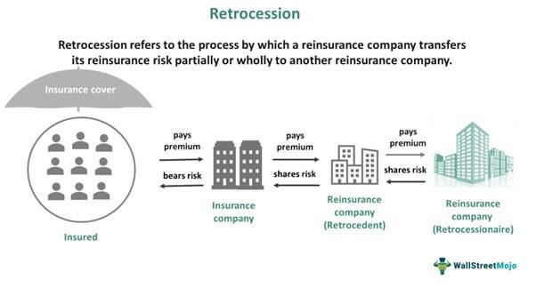

The landscape of insurance and reinsurance is continually evolving, with complex mechanisms such as retrocession playing a significant role in risk management. Retrocession refers to the process whereby a reinsurer transfers a portion of its risk to another reinsurer, known as a retrocessionaire, to mitigate their exposure and enhance capital efficiency. This practice is integral to the insurance industry's ability to manage and distribute large risks, providing financial stability across the sector.

In recent years, advancements in algorithmic trading have begun to influence these traditionally manual and complex processes, offering new avenues for efficiency. Algorithmic trading utilizes complex algorithms to automate trading processes, which in the context of insurance, can streamline risk transfer processes. Such automation not only improves the speed and accuracy of transactions but also facilitates more informed decision-making through enhanced data analysis capabilities.



This article explores the intricate relationships between insurance retrocession, reinsurance, and the increasing role of algorithmic trading in managing these processes. Understanding these connections is crucial for industry players aiming to optimize risk management and enhance financial stability in an ever-changing risk environment. By leveraging technology, insurers and reinsurers can achieve greater efficiency and flexibility, which are essential for navigating the uncertainties and challenges of modern global risks.

## Table of Contents

## Overview of Insurance and Reinsurance

Insurance and reinsurance are integral components of the financial ecosystem, serving as key mechanisms for risk mitigation and capital relief for primary insurers. Insurance provides individuals and entities with financial coverage against potential losses from specified events. Reinsurance, in turn, allows insurance companies to transfer portions of their risk portfolios to other entities, known as reinsurers. This process reduces the potential impact of substantial claims on the primary insurer, thereby enhancing its financial stability.

Reinsurance agreements are typically categorized into two types: proportional and non-proportional. In proportional reinsurance, the reinsurer receives a predetermined share of the premiums and, in return, assumes a proportional share of the losses. Non-proportional reinsurance, on the other hand, involves coverage only after the insurer's losses exceed a specified amount, known as the retention limit.

Retrocession further extends the chain of risk distribution by allowing reinsurers to offload a portion of their assumed risks to another reinsurer, known as a retrocessionaire. This practice creates a multilayered network for managing large-scale risks, enhancing the overall risk-bearing capacity of the insurance industry. By doing so, retrocession allows reinsurers to optimize their risk exposure and preserve their capital reserves.

The intricate dynamics of these relationships form the backbone of the insurance industry. They are crucial in ensuring that [volatility](/wiki/volatility-trading-strategies) is minimized and capital is preserved, particularly as insurers face increasing frequency and intensity of catastrophic events. These include natural disasters, economic downturns, and other large-scale disruptions that pose significant challenges to financial stability.

Given the growing unpredictability and severity of such events, the demand for both reinsurance and retrocession has surged. Insurers and reinsurers continually seek innovative risk management solutions to address these evolving challenges. Advances in data analytics, catastrophe modeling, and risk assessment have become vital tools in developing more efficient and effective reinsurance and retrocession strategies, enabling the industry to better anticipate and manage future risks.

## The Process and Purpose of Retrocession

Retrocession is a fundamental component of risk management in the insurance industry, serving as a mechanism through which reinsurers can transfer portions of their assumed risks to other reinsurers. This re-reinsurance process is essential for mitigating exposure to large or catastrophic claims and plays a pivotal role in maintaining the financial stability of insurance entities.

The primary purpose of retrocession is threefold: risk diversification, capital relief, and earnings stabilization. By distributing risks further down the chain, reinsurers can diversify their risk portfolios, thereby reducing the likelihood of incurring substantial losses from singular events. This distribution allows for more efficient utilization of capital, as reinsurers can allocate their resources more strategically while maintaining the capacity to underwrite new risks. Consequently, retrocession contributes to the stabilization of earnings, enabling insurers to meet policyholder claims even during adverse scenarios.

Retrocession agreements typically fall into two categories: proportional and non-proportional. In a proportional retrocession agreement, the retrocessionaire receives a proportion of the premiums and, in turn, pays a proportion of the claims. This arrangement directly links the premium and loss experiences of the parties involved. For example, if a reinsurer enters into a 50% proportional retrocession agreement, the retrocessionaire would receive 50% of the premiums and pay 50% of the claims.

Non-proportional retrocession agreements, however, function differently and are often structured as excess of loss arrangements. In these agreements, the retrocessionaire provides coverage for losses that exceed a pre-determined threshold. For example, a retrocessionaire might agree to cover losses above $10 million, with premiums and agreements focused on the size of the loss rather than the premiums collected.

Despite the clear benefits of retrocession, it comes with inherent complexities and requires careful management to avoid pitfalls. Among these challenges is counterparty risk, which refers to the possibility that the retrocessionaire may default on its obligations. Moreover, regulatory compliance is a critical consideration, as retrocession transactions must adhere to the regulatory frameworks governing insurance and financial practices. Ensuring compliance is imperative to avoid legal repercussions and maintain trust within the financial ecosystem.

In conclusion, while retrocession offers significant advantages in terms of risk management and financial stability, it necessitates meticulous oversight to navigate the complexities and risks associated with these transactions effectively.

## Algorithmic Trading in Retrocession and Reinsurance

Algorithmic trading, originally designed for the fast-paced and highly quantitative world of financial markets, has gradually found its application within the fields of insurance and reinsurance, including retrocession. This adoption is primarily driven by the need to enhance the efficiency and accuracy of risk transfer processes. By leveraging [algorithmic trading](/wiki/algorithmic-trading), insurers and reinsurers have the potential to automate various aspects of the risk transfer chain, significantly improving the speed and precision with which these transactions are executed.

The core advantage of algorithmic trading in this context lies in its data-driven approach. By employing sophisticated algorithms, insurers and reinsurers can access advanced risk assessment tools and pricing models. These models are powered by vast amounts of historical and real-time data, enabling more accurate and informed decision-making when structuring retrocession agreements. For instance, [machine learning](/wiki/machine-learning) models can be utilized to predict potential claim scenarios, optimizing the allocation of risk across diverse portfolios.

Moreover, algorithmic solutions facilitate dynamic risk adjustment and real-time monitoring of exposures. This continuous assessment is crucial for maintaining optimal levels of risk exposure, ensuring that capital reserves are aligned with the current risk landscape. For example, rapid adjustments to reinsurance treaties can be made in response to emerging threats, such as natural disasters or financial crises, minimizing the impact on insurers' capital reserves.

The integration of algorithmic trading into reinsurance and retrocession processes is set to bring transformational changes to traditional practices. By enhancing the speed and accuracy of risk assessments, insurers and reinsurers can develop a more resilient and adaptive insurance ecosystem. This technological progression not only promises increased cost efficiency but also contributes to the overall stability of the financial system. As such, the ongoing evolution of algorithmic tools and their growing application in retrocession represent a significant step forward in the optimization of risk management strategies within the insurance industry.

## Challenges and Risks in Retrocession and Algorithm Integration

Retrocession, despite its advantages in distributing risks and stabilizing the insurance sector, comes with an array of challenges that require careful management. One of the primary challenges involves the complexity of constructing retrocession agreements. These contracts often encompass sophisticated terms and conditions that require precise definition to adequately address risk-sharing arrangements. Reinsurers must meticulously negotiate these agreements to ensure clarity and allocate risks in a way that aligns with their strategic objectives.

Counterparty risk presents another significant hurdle in retrocession. This risk arises from the possibility of a retrocessionaire failing to fulfill its obligations, thereby exposing the reinsurer to financial instability. Managing this risk mandates comprehensive due diligence and robust credit risk assessments to gauge the financial strength and reliability of potential retrocessionaires. Effective management of counterparty risk is paramount for maintaining solvency and safeguarding against unexpected financial disruptions.

The incorporation of algorithmic trading into insurance processes introduces further complexities. One critical challenge is ensuring data security. As algorithms require extensive data inputs to function, safeguarding sensitive information becomes paramount. Insurers must implement stringent security protocols to protect against data breaches that could compromise both client confidentiality and the integrity of financial transactions.

Accurate data input is another fundamental requirement. Algorithms rely on high-quality data to produce reliable outputs. Inaccuracies or discrepancies in data can lead to skewed risk assessments and faulty decision-making, potentially resulting in suboptimal retrocession arrangements. Ensuring data consistency and accuracy is essential for leveraging the full potential of algorithmic trading in risk management.

The interoperability between traditional systems and cutting-edge algorithmic technologies often necessitates significant adjustments. Legacy systems may not seamlessly integrate with modern algorithms, requiring substantial IT investments and upgrades. These adaptations can strain existing resources and demand careful planning to ensure smooth transitions without disrupting ongoing operations. Moreover, aligning these systems to facilitate efficient data transfer and algorithm deployment is crucial for streamlined processes.

Furthermore, as algorithmic tools become more prevalent in the insurance industry, the regulatory landscape presents its own challenges. Technologies must adhere to evolving regulatory standards to ensure compliance and avoid repercussions. This necessitates robust governance frameworks and regular audits to validate that algorithmic processes do not compromise the integrity of financial reporting. Staying abreast of regulatory developments is essential to maintaining transparency and trust within the industry.

In conclusion, while retrocession and algorithmic integration offer substantial opportunities for enhanced risk management, addressing these challenges is critical. By focusing on precise contract formulations, managing counterparty risk, ensuring data accuracy and security, enabling system interoperability, and maintaining regulatory compliance, the insurance industry can harness the full potential of these innovations to create a more resilient financial ecosystem.

## Future Trends and Innovations

The future of insurance retrocession and reinsurance is poised to undergo significant transformation as technological advancements continue to reshape the industry. A pivotal aspect of this evolution is the integration of algorithmic trading and data analytics, which are expected to enhance risk management frameworks and improve capital efficiency.

As global risks become more complex and interconnected, insurers are anticipated to increasingly rely on algorithm-driven models to optimize risk assessment and allocation. These models, often powered by machine learning algorithms, can process vast amounts of data to identify emerging risk patterns and predict potential outcomes with greater accuracy. For instance, algorithms can be designed to analyze historical claim data, market trends, and environmental factors, enabling insurers to anticipate risks like cyber threats and climate change impacts.

Python code for a simple risk prediction model might look like this:

```python
import numpy as np
from sklearn.ensemble import RandomForestClassifier

# Sample data: X is feature set and y is target variable (risk level)
X = np.array([[100, 0.5, 30], [200, 1.5, 20], [300, 0.3, 40]])  # Example features: [exposure, volatility, economic index]
y = np.array([0, 1, 0])  # Example targets: 0 for low risk, 1 for high risk

# Train a Random Forest model
model = RandomForestClassifier()
model.fit(X, y)

# Predict risk for a new set of features
new_data = np.array([[150, 0.7, 35]])
predicted_risk = model.predict(new_data)
print(f"Predicted Risk Level: {predicted_risk[0]}")
```

Furthermore, the industry is witnessing the development of more sophisticated models that incorporate not only traditional financial metrics but also [alternative data](/wiki/best-alternative-data) sources such as social media sentiment and satellite imagery. This approach helps insurers refine their risk analysis capabilities and adjust their portfolios dynamically, allowing for real-time risk management adjustments and strategic decision-making.

Addressing emerging challenges such as cyber threats requires insurers to adapt rapidly to new types of risks that do not conform to traditional insurance paradigms. Machine learning and [artificial intelligence](/wiki/ai-artificial-intelligence) can play a crucial role in understanding these risks by modeling complex interactions and providing insights that are not immediately obvious through conventional methods.

Moreover, the ongoing collaboration between technology firms and the insurance industry is expected to foster innovation in risk transfer mechanisms. Partnerships are likely to yield new tools and platforms that facilitate seamless integration of technology into insurance operations, enabling more efficient risk distribution and capital management.

In conclusion, the convergence of algorithmic trading, machine learning, and innovative data analysis techniques is set to redefine the future of insurance retrocession and reinsurance. These advancements promise enhanced risk assessment, improved cost efficiency, and a more adaptive response to evolving global risks, ultimately contributing to a more robust financial ecosystem.

## Conclusion

Insurance retrocession and reinsurance serve as integral elements in global risk management, providing essential layers of protection against financial losses. These mechanisms enable insurers to distribute and mitigate risks across multiple parties, enhancing their capacity to withstand substantial claims. With the advent of algorithmic trading, this traditional landscape is undergoing a transformative shift that enhances the efficiency and effectiveness of risk management processes.

Algorithmic trading introduces advanced computational techniques that facilitate more precise risk assessment, pricing, and management. By automating complex calculations and decision-making processes, algorithmic trading can improve the speed and accuracy of transactions, offering significant advantages in the dynamic and often unpredictable nature of insurance markets. However, integrating these algorithms with established reinsurance and retrocession practices is not without its challenges. Issues such as data security, interoperability between legacy systems and new technologies, and compliance with regulatory standards must be carefully navigated.

Despite these challenges, the potential benefits of incorporating algorithmic trading into reinsurance frameworks are substantial. Enhanced data analytics enable insurers to better anticipate and respond to evolving risks, potentially leading to more effective capital utilization and cost efficiencies. This is particularly pertinent as global risks, influenced by factors such as climate change and emerging technologies, continue to evolve.

As the insurance industry continues to adapt to technological advancements, staying abreast of both technological and regulatory developments will be crucial for stakeholders. Informed decision-making and strategic investments in technology will enable insurers to leverage the full potential of algorithmic solutions, aligning with contemporary risk landscapes while maintaining financial stability.

Ultimately, the convergence of traditional reinsurance practices with modern algorithmic trading holds the promise of creating a more robust and resilient financial ecosystem. This synergy not only supports the current demands of risk management but also paves the way for innovative strategies that can address future challenges in the insurance and reinsurance sectors.

## References & Further Reading

[1]: Cummins, J. D., & Weiss, M. A. (2000). ["The Reinsurance Industry as a Financial System: Implications for Systemic Risk."](https://www.researchgate.net/profile/J-Cummins/publication/304113713_Systemic_Risk_and_the_Insurance_Industry/links/5773dc2008aead7ba06e5937/Systemic-Risk-and-the-Insurance-Industry.pdf) Journal of Risk and Insurance, 67(4), 541-568.

[2]: Lane, M. N. (2000). ["Pricing Risk Transfer Transactions."](https://www.researchgate.net/publication/286148972_Pricing_risk_transfer_transactions) Risk Books.

[3]: Lopez de Prado, M. (2018). ["Advances in Financial Machine Learning."](https://www.amazon.com/Advances-Financial-Machine-Learning-Marcos/dp/1119482089) Wiley.

[4]: Chan, E. (2009). ["Quantitative Trading: How to Build Your Own Algorithmic Trading Business."](https://github.com/ftvision/quant_trading_echan_book) Wiley.

[5]: Jansen, S. (2020). ["Machine Learning for Algorithmic Trading."](https://github.com/stefan-jansen/machine-learning-for-trading) Packt Publishing.

[6]: Abbreviated financial publications by Lloyd’s of London might offer insights on the intersection of algorithmic trading and reinsurance. More details can be found on their [website](https://www.lloyds.com/conducting-business/syndicate-accounts-and-financial-reporting).

[7]: Cummins, J. D., & Trainar, P. (2009). ["Securitization, Insurance, and Reinsurance."](https://www.jstor.org/stable/40247566) Annual Review of Financial Economics, 1(1), 173-195.