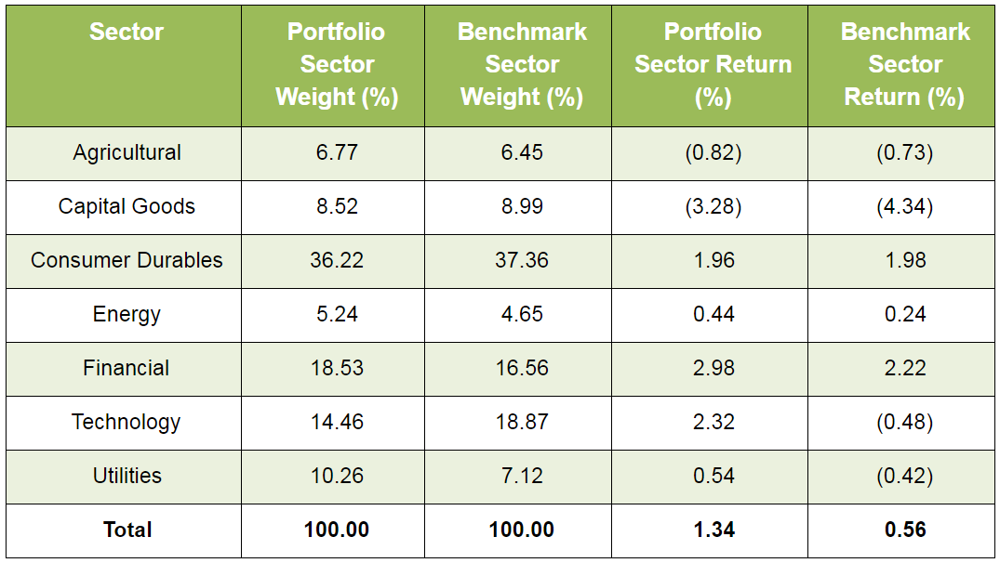

Algorithmic trading, commonly known as algo trading, has revolutionized financial markets by automating the execution of trades through advanced algorithms. These pre-programmed instructions allow traders to execute orders at speeds and frequencies far beyond human capability, enabling them to exploit market opportunities with precision and efficiency. A critical aspect of this domain is understanding the drivers behind a strategy's profitability, which is where the return attribution method becomes indispensable.

Return attribution is a methodical approach used to dissect a trading strategy's performance into various contributing factors. This analysis is pivotal in recognizing how specific elements, such as market movements, security selection, and trade timing, influence the outcome of a trading strategy. By evaluating these components, traders and investors gain insights into the effectiveness of their algorithmic strategies and can discern whether the returns align with the intended strategy or arise from unforeseen factors.

The significance of return attribution in algo trading extends to its ability to optimize trading strategies. By accurately identifying sources of return and risk, traders can refine their approaches, adjusting algorithms to improve performance and mitigate potential risks. This continuous process of refinement and optimization is key to maintaining competitive advantage in rapidly evolving financial markets.

Understanding return attribution is vital for traders aiming to optimize their strategies. By breaking down the complexities of return generation, it aids in discerning the contribution of different factors to a strategy's performance. This knowledge empowers traders to make informed decisions, enhancing their ability to craft strategies that consistently deliver desired outcomes.

## Table of Contents

## Understanding Return Attribution in Algorithmic Trading

Return attribution in [algorithmic trading](/wiki/algorithmic-trading) involves the detailed analysis and breakdown of a strategy's returns to understand the contribution of various components. This process is crucial in identifying how market movements, trading decisions, and other influential factors impact the strategy’s overall performance.

At its core, return attribution seeks to demystify the sources of returns by segregating them into identifiable elements. This enables traders to determine the effectiveness of specific algorithms within their strategies. By doing so, it not only affords the capacity to evaluate performance but also aids in the refinement and optimization of trading algorithms.

For example, market movements are a dominant force that can affect returns. However, purely attributing performance to market trends can undermine the assessment of active trading decisions that are expected to provide additional alpha. Therefore, return attribution helps in distinguishing between returns generated from market exposure and those arising from active management decisions. 

Moreover, return attribution is instrumental in verifying the alignment between actual returns and the strategy's intended objectives. In algorithmic trading, where strategies are often quantitatively defined, assessing whether the realized returns adhere to the planned approach or stem from unintended factors is key to maintaining strategy efficacy.

Mathematically, one could express a simplified return attribution model as follows:

$$
R_{\text{total}} = R_{\text{market}} + R_{\text{selection}} + R_{\text{timing}} + R_{\text{residual}}
$$

Where:
- $R_{\text{total}}$ is the total return of the strategy.
- $R_{\text{market}}$ represents returns attributable to broad market movement.
- $R_{\text{selection}}$ denotes returns arising from selecting specific securities.
- $R_{\text{timing}}$ captures returns due to the timing of trades.
- $R_{\text{residual}}$ includes any remaining contributions not explained by the identified factors.

This decomposition allows for a nuanced understanding of the elements driving performance, granting traders the insight necessary to fine-tune their strategies for optimal outcomes.

Return attribution is essential not only as a performance measurement tool but also as a diagnostic mechanism in algorithmic trading. By revealing how specific algorithms contribute to or detract from returns, it enables traders to strategically adjust their models to align more closely with performance goals, mitigate risks, and enhance overall trading effectiveness.

## Components of Return Attribution

A typical return attribution analysis involves a detailed decomposition of the overall returns into specific components. This multi-faceted approach allows traders and analysts to discern the underlying contributors to a trading strategy's performance, thereby providing a comprehensive view of how and why returns are achieved. The key components of return attribution include:

- **Market Return**: This component represents the segment of returns that can be attributed to broader market movements or trends. It essentially captures the performance of the market as a whole, against which the specific strategy's returns are measured. The market return is often viewed as the baseline, and understanding it is crucial for distinguishing between a strategy's intrinsic performance and what gains are due merely to market dynamics.

- **Selection Effect**: The selection effect accounts for the impact of choosing specific securities over others within the trading strategy. This effect captures the decisions related to asset selection and highlights how picking certain stocks or financial instruments can lead to differences in performance. The selection effect is calculated by comparing the performance of the chosen securities against a benchmark or a universe of potential investments, revealing the added value or detriment of these choices.

- **Timing Effect**: The timing effect refers to the consequences of the timing of trades on the returns. This component assesses how entry and exit points within the market cycle influence the effectiveness of a strategy. Successful timing can enhance returns by optimizing buy and sell actions, while poor timing can detract from overall performance. Analyzing the timing effect helps in understanding whether the strategy benefits from skillful trade execution or falls victim to suboptimal market entry and exit.

- **Residual Return**: The residual return involves any remaining unexplained components of performance not captured by the other categories. It may reflect factors such as fees, transaction costs, and unforeseen market events that could not be accounted for within the predefined attribution framework. This category often contains the complexities and nuances of a strategy that are not easily dissected into the primary categories but can nevertheless impact overall performance.

These components work in tandem to provide a holistic assessment of a trading strategy, enabling algorithmic traders to pinpoint areas of strength and opportunities for improvement within their operations. By systematically breaking down returns, traders can identify which aspects of their trading approach are yielding positive results and which areas may require adjustments.

## Applying Return Attribution in Algo Trading

Return attribution provides traders with crucial insights into assessing and improving algorithmic strategies within financial markets. By breaking down the sources of returns, return attribution enables algo traders to pinpoint which factors contribute most significantly to the overall performance of their strategies. This process involves analyzing components such as market returns, selection effects, timing effects, and potentially unexplained residuals.

In practice, understanding these components allows traders to make informed adjustments, thereby refining strategies to enhance their effectiveness. For instance, if a strategy’s return is predominantly influenced by favorable market conditions rather than the algorithm’s selection of assets or timing capabilities, it might indicate a reliance on external factors rather than intrinsic strategy merit. Conversely, identifying a strong selection effect could validate an algo’s effectiveness in asset [picking](/wiki/asset-class-picking), while a consistent timing effect might demonstrate skill in executing trades at optimal moments.

Return attribution is particularly valuable when identifying patterns or anomalies within trading strategies. Anomalies might indicate strategy elements that do not function as intended or uncover unforeseen risks, prompting further investigation and strategy recalibration. For example, if an algorithm suddenly begins underperforming, return attribution can help isolate whether the issue arises from a market-wide trend or an aspect of the strategy itself.

Leveraging return attribution, traders can construct dashboards or analytics platforms to monitor these performance facets continually. Such systems may employ Python libraries like Pandas for data manipulation or NumPy for numerical computations to automate the computation of these metrics in real-time. These tools enable traders to swiftly react to changing market conditions or strategy outcomes, focusing on data-driven decisions to optimize their trading portfolio.

Ultimately, the application of return attribution in algorithmic trading is about empowering traders to understand and control the dynamics affecting their strategies, leading to more refined approaches and potentially higher returns. As technology continues to evolve, the precision and accessibility of return attribution analyses are set to advance, equipping traders with even more powerful insights into their algorithmic trading operations.

## Benefits and Challenges of Return Attribution

Return attribution in algorithmic trading offers numerous benefits that enhance the understanding and management of trading strategies. By dissecting the performance into component factors, this method provides clarity on how and why a strategy generates returns. Such detailed insights allow traders to understand the complex interactions within their algorithms, enabling efficient risk management and strategy refinement. By identifying the precise sources of return, traders can adjust their models to better align with their intended outcomes.

One of the primary challenges in return attribution arises from the use of high-frequency data. High-frequency trading often involves the execution of thousands of trades in a short period, resulting in a complex dataset that can be difficult to analyze accurately. The sheer [volume](/wiki/volume-trading-strategy) of data and the need for real-time analysis necessitate sophisticated computational methods and robust systems to handle such information effectively.

Additionally, the complexity of trading strategies that include multiple simultaneous algorithms further complicates accurate attribution. When multiple strategies operate concurrently, isolating the impact of each action on overall returns becomes difficult. Interactions between strategies can lead to overlapping effects, making it challenging to attribute specific returns to individual strategies.

Despite these challenges, return attribution is an indispensable tool for systematic traders seeking sustained profitability. It provides the means to systematically evaluate and enhance trading strategies, offering the potential for significant gains in efficiency and performance. Ongoing advancements in computational capabilities and data analytics techniques continue to improve the precision and applicability of return attribution, making it an essential element of modern algorithmic trading.

## Conclusion

Return attribution in algorithmic trading serves as a vital tool in scrutinizing trading strategy performance. By analyzing distinct elements that contribute to the overall return, it provides critical insights into the conduct and efficacy of the strategies in place. This analysis empowers traders to refine their approaches, ensuring that each component of the strategy is aligned with the desired outcomes. The capacity to discern these nuances is paramount for optimizing performance and managing risk within a systematically driven trading environment.

The ongoing progression in technology plays a substantial role in enhancing the precision and practicality of return attribution methods. Improvements in computational power and data analytics allow for more granular and accurate evaluations of trading strategies. Advanced algorithms can process high-frequency trading data more effectively, providing traders with timely and comprehensive assessments of their strategy components. This capability enhances their ability to pinpoint inefficiencies, adjust strategies in real time, and exploit market opportunities more adeptly.

As algorithmic trading continues to evolve, the integration of sophisticated return attribution techniques becomes increasingly important. These advancements ensure that traders are equipped with the necessary tools to maintain a competitive edge, adapt to market changes swiftly, and achieve sustained profitability. In essence, return attribution not only demystifies the complexities of trading strategies but also facilitates a deeper understanding of the dynamic interplay between various influencing factors, ultimately leading to more informed strategic decisions.

## References & Further Reading

[1]: Bergstra, J., Bardenet, R., Bengio, Y., & Kégl, B. (2011). ["Algorithms for Hyper-Parameter Optimization."](https://papers.nips.cc/paper/4443-algorithms-for-hyper-parameter-optimization) Advances in Neural Information Processing Systems 24.

[2]: ["Advances in Financial Machine Learning"](https://www.amazon.com/Advances-Financial-Machine-Learning-Marcos/dp/1119482089) by Marcos Lopez de Prado

[3]: ["Evidence-Based Technical Analysis: Applying the Scientific Method and Statistical Inference to Trading Signals"](https://www.amazon.com/Evidence-Based-Technical-Analysis-Scientific-Statistical/dp/0470008741) by David Aronson

[4]: ["Machine Learning for Algorithmic Trading"](https://github.com/stefan-jansen/machine-learning-for-trading) by Stefan Jansen

[5]: ["Quantitative Trading: How to Build Your Own Algorithmic Trading Business"](https://books.google.com/books/about/Quantitative_Trading.html?id=j70yEAAAQBAJ) by Ernest P. Chan