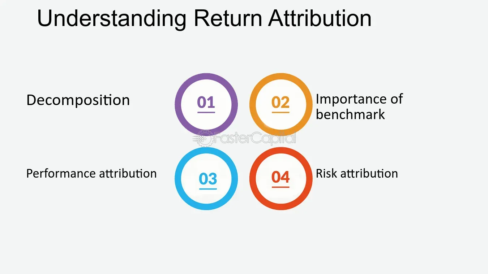

## Table of Contents

## What is the return attribution method?

Return attribution is a way to figure out where the returns or profits of an investment portfolio come from. It helps investors and managers understand which parts of their investment decisions are working well and which are not. By breaking down the overall return into smaller parts, return attribution shows how much of the return is due to the choice of assets, the timing of buying and selling, and other decisions made by the manager.

There are different methods to do return attribution, but a common one is to compare the portfolio's performance to a benchmark, like a stock market index. This comparison helps to see if the portfolio did better or worse than the market and why. For example, if a portfolio has more stocks from a sector that did well, like technology, that choice might explain a big part of the return. By understanding these details, investors can make better decisions in the future.

## Why is return attribution important in investment analysis?

Return attribution is important in investment analysis because it helps investors and managers see exactly where their money is coming from. When you know which parts of your investment choices are making money and which are not, you can make better decisions. For example, if you find out that choosing certain stocks or sectors is doing well, you might decide to put more money into those areas. On the other hand, if some choices are not working, you can change your strategy to avoid losing money.

By breaking down the overall return into smaller pieces, return attribution makes it clear how much of the return comes from picking the right assets, timing the market correctly, or other decisions made by the manager. This detailed information is very useful for comparing your portfolio's performance to a benchmark, like a stock market index. If your portfolio is doing better than the benchmark, return attribution can show you why, helping you to keep doing what works. If it's doing worse, it can point out what needs to be fixed. This way, return attribution helps in fine-tuning investment strategies for better results.

## What are the basic components of return attribution?

The basic components of return attribution are the allocation effect, the selection effect, and the interaction effect. The allocation effect shows how much of the return comes from deciding how much money to put into different types of investments, like stocks, bonds, or cash. If a manager puts more money into a sector that does well, like technology, the allocation effect will be positive. The selection effect shows how much of the return comes from choosing specific investments within those types. For example, if a manager picks stocks that do better than the average in their sector, the selection effect will be positive.

The interaction effect is a bit more complicated. It shows how the allocation and selection effects work together. If a manager puts a lot of money into a sector and also picks the best stocks in that sector, the interaction effect will be positive because these two choices work well together. By understanding these three components, investors can see which parts of their strategy are working and which need to be improved. This helps them make smarter decisions about where to invest their money in the future.

## How does return attribution differ from performance measurement?

Return attribution and performance measurement are two important tools in investment management, but they serve different purposes. Performance measurement is all about figuring out how well an investment or a portfolio has done over a certain time. It usually compares the returns of the portfolio to a benchmark, like a stock market index, to see if it did better, worse, or the same. This gives investors a big picture of how their investments are doing, but it doesn't tell them why the portfolio performed the way it did.

Return attribution goes deeper than performance measurement. It breaks down the overall return into smaller parts to show where the money is coming from. It looks at things like how much of the return came from choosing the right types of investments, picking the best stocks within those types, and even how these choices worked together. By understanding these details, investors can see which parts of their strategy are working well and which need to be changed. This helps them make better decisions about where to invest their money in the future.

## What are the common models used for return attribution?

There are a few common models used for return attribution, and two of the most popular ones are the Brinson model and the Brinson-Fachler model. The Brinson model is simple and easy to understand. It breaks down the return into three parts: the allocation effect, the selection effect, and the interaction effect. The allocation effect shows how much of the return comes from deciding how much money to put into different types of investments. The selection effect shows how much of the return comes from choosing the best stocks or bonds within those types. The interaction effect shows how these two choices work together. This model is good for seeing the big picture of where returns are coming from.

The Brinson-Fachler model is a bit more detailed than the Brinson model. It also uses the allocation, selection, and interaction effects, but it adds more layers to the analysis. This model looks at how the portfolio's performance compares to a benchmark in more detail. It can show how each sector or type of investment did compared to the benchmark, and it can even break down the performance by different time periods. This makes it easier to see which parts of the strategy are working well and which need to be improved. Both models help investors understand their returns better, but the Brinson-Fachler model gives a more detailed look at the performance.

## Can you explain the arithmetic attribution model?

The arithmetic attribution model is a way to figure out where the returns of an investment portfolio come from. It breaks down the overall return into different parts to show how much each decision made by the manager helped or hurt the portfolio. This model looks at things like how much money was put into different types of investments, like stocks or bonds, and how well the specific choices within those types did. For example, if a manager put a lot of money into technology stocks and those stocks did well, the model would show that this choice helped the portfolio's return.

The arithmetic attribution model is easy to understand because it uses simple math to add up the different parts of the return. It breaks the return into three main effects: the allocation effect, the selection effect, and the interaction effect. The allocation effect shows how much of the return came from deciding how much money to put into different types of investments. The selection effect shows how much of the return came from picking the best stocks or bonds within those types. The interaction effect shows how these two choices worked together. By looking at these effects, investors can see which parts of their strategy are working well and which need to be changed to make better decisions in the future.

## How does the geometric attribution model work?

The geometric attribution model is another way to figure out where the returns of an investment portfolio come from. Instead of using simple addition like the arithmetic model, the geometric model uses multiplication to break down the returns. This model looks at how the portfolio's performance compares to a benchmark over time, and it shows how the returns grow or shrink because of the manager's choices. The geometric model is good because it takes into account how the returns change over time, which can give a more accurate picture of how well the portfolio is doing.

In the geometric attribution model, the return is broken down into the same three parts as the arithmetic model: the allocation effect, the selection effect, and the interaction effect. The allocation effect shows how much of the return came from deciding how much money to put into different types of investments, like stocks or bonds. The selection effect shows how much of the return came from picking the best stocks or bonds within those types. The interaction effect shows how these two choices worked together. By using multiplication to combine these effects, the geometric model can show how the returns grow over time, helping investors see which parts of their strategy are working well and which need to be changed.

## What are the challenges in implementing return attribution?

Implementing return attribution can be tricky because it involves a lot of detailed calculations and data. You need to have accurate and complete data about all the investments in the portfolio, including when they were bought and sold, and how much they were worth at different times. If the data is missing or wrong, the return attribution results won't be right. Also, different types of investments, like stocks, bonds, and real estate, can be hard to compare because they work differently. This makes it challenging to figure out how much of the return came from each part of the portfolio.

Another challenge is choosing the right model for return attribution. There are different models, like the arithmetic and geometric models, and each one has its own way of breaking down the returns. Picking the wrong model can lead to confusing results that don't help investors understand their portfolio's performance. Plus, return attribution needs to be done regularly to keep up with changes in the market and the portfolio. This can take a lot of time and effort, especially for big portfolios with many different investments.

## How can return attribution be used to improve investment strategies?

Return attribution helps investors figure out where their money is coming from by breaking down the overall return into smaller parts. By looking at these parts, investors can see which choices, like picking certain stocks or putting money into different types of investments, are working well. For example, if return attribution shows that choosing technology stocks made a big difference in the portfolio's return, the investor might decide to put more money into technology in the future. This way, return attribution helps investors focus on what's working and do more of it.

But return attribution can also show what's not working. If a part of the portfolio, like the bond choices, is not doing well, return attribution can point that out. This gives investors a chance to change their strategy to avoid losing money. By regularly using return attribution, investors can keep fine-tuning their approach, making small changes over time to improve their overall performance. This ongoing process helps them make smarter decisions and hopefully get better returns in the long run.

## What are the advanced techniques in return attribution analysis?

Advanced techniques in return attribution analysis go beyond the basic models like the Brinson and Brinson-Fachler models. One such technique is multi-factor attribution, which looks at how different factors, like the size of companies or how much they grow, affect the portfolio's return. This helps investors see if their choices are based on these factors and how well those choices are working. Another advanced technique is risk-adjusted attribution, which takes into account the risk of the investments. It helps investors understand if the returns they're getting are worth the risk they're taking. These techniques give a deeper look at what's driving the portfolio's performance.

Another advanced method is currency attribution, which is important for portfolios that invest in different countries. It shows how changes in exchange rates affect the return. This can help investors decide if they should hedge against currency risk or if it's better to leave their investments unhedged. Lastly, there's transaction cost attribution, which looks at how the costs of buying and selling investments affect the return. By understanding these costs, investors can make better decisions about when and how to trade. These advanced techniques help investors get a more complete picture of their portfolio's performance and make smarter investment choices.

## How do multi-factor models enhance return attribution?

Multi-factor models make return attribution better by looking at more than just the basic choices investors make. These models think about things like how big a company is, how fast it's growing, and how risky it is. By doing this, they can show investors if their returns come from picking companies that are big, small, growing fast, or taking more risks. This helps investors understand which of these factors are helping their portfolio do well or not so well. It's like looking at a puzzle and seeing which pieces are the most important.

Using multi-factor models also helps investors see if their strategy matches what they want to do. If an investor wants to focus on companies that are growing quickly, the model can show if their choices are actually doing that. It can also tell them if they're taking too much risk or not enough. By understanding these details, investors can make their strategy better. They can put more money into the factors that are working and change the ones that aren't. This way, multi-factor models help investors make smarter choices and hopefully get better returns.

## What are the latest trends and developments in return attribution methods?

The latest trends in return attribution methods focus on using technology to make the process easier and more accurate. One big trend is the use of artificial intelligence (AI) and machine learning. These tools can look at huge amounts of data quickly and find patterns that humans might miss. They can help investors see which parts of their strategy are working well and which need to be changed. AI can also help with multi-factor models by figuring out which factors are most important for a portfolio's returns. This makes return attribution more detailed and useful for investors.

Another trend is the move towards more personalized return attribution. Instead of using the same model for everyone, investors are now using models that fit their specific goals and needs. For example, if an investor cares a lot about how their investments affect the environment, the return attribution model can include factors related to sustainability. This helps investors make choices that match what they care about. Also, there's more focus on real-time return attribution, where investors can see how their portfolio is doing every day or even every hour. This helps them make quick decisions and adjust their strategy as the market changes.

## What is Understanding Return Attribution in Algorithmic Trading?

Return attribution in [algorithmic trading](/wiki/algorithmic-trading) involves the detailed analysis and breakdown of a strategy's returns to understand the contribution of various components. This process is crucial in identifying how market movements, trading decisions, and other influential factors impact the strategy’s overall performance.

At its core, return attribution seeks to demystify the sources of returns by segregating them into identifiable elements. This enables traders to determine the effectiveness of specific algorithms within their strategies. By doing so, it not only affords the capacity to evaluate performance but also aids in the refinement and optimization of trading algorithms.

For example, market movements are a dominant force that can affect returns. However, purely attributing performance to market trends can undermine the assessment of active trading decisions that are expected to provide additional alpha. Therefore, return attribution helps in distinguishing between returns generated from market exposure and those arising from active management decisions. 

Moreover, return attribution is instrumental in verifying the alignment between actual returns and the strategy's intended objectives. In algorithmic trading, where strategies are often quantitatively defined, assessing whether the realized returns adhere to the planned approach or stem from unintended factors is key to maintaining strategy efficacy.

Mathematically, one could express a simplified return attribution model as follows:

$$
R_{\text{total}} = R_{\text{market}} + R_{\text{selection}} + R_{\text{timing}} + R_{\text{residual}}
$$

Where:
- $R_{\text{total}}$ is the total return of the strategy.
- $R_{\text{market}}$ represents returns attributable to broad market movement.
- $R_{\text{selection}}$ denotes returns arising from selecting specific securities.
- $R_{\text{timing}}$ captures returns due to the timing of trades.
- $R_{\text{residual}}$ includes any remaining contributions not explained by the identified factors.

This decomposition allows for a nuanced understanding of the elements driving performance, granting traders the insight necessary to fine-tune their strategies for optimal outcomes.

Return attribution is essential not only as a performance measurement tool but also as a diagnostic mechanism in algorithmic trading. By revealing how specific algorithms contribute to or detract from returns, it enables traders to strategically adjust their models to align more closely with performance goals, mitigate risks, and enhance overall trading effectiveness.

## References & Further Reading

[1]: Bergstra, J., Bardenet, R., Bengio, Y., & Kégl, B. (2011). ["Algorithms for Hyper-Parameter Optimization."](https://papers.nips.cc/paper/4443-algorithms-for-hyper-parameter-optimization) Advances in Neural Information Processing Systems 24.

[2]: ["Advances in Financial Machine Learning"](https://www.amazon.com/Advances-Financial-Machine-Learning-Marcos/dp/1119482089) by Marcos Lopez de Prado

[3]: ["Evidence-Based Technical Analysis: Applying the Scientific Method and Statistical Inference to Trading Signals"](https://www.amazon.com/Evidence-Based-Technical-Analysis-Scientific-Statistical/dp/0470008741) by David Aronson

[4]: ["Machine Learning for Algorithmic Trading"](https://github.com/stefan-jansen/machine-learning-for-trading) by Stefan Jansen

[5]: ["Quantitative Trading: How to Build Your Own Algorithmic Trading Business"](https://books.google.com/books/about/Quantitative_Trading.html?id=j70yEAAAQBAJ) by Ernest P. Chan