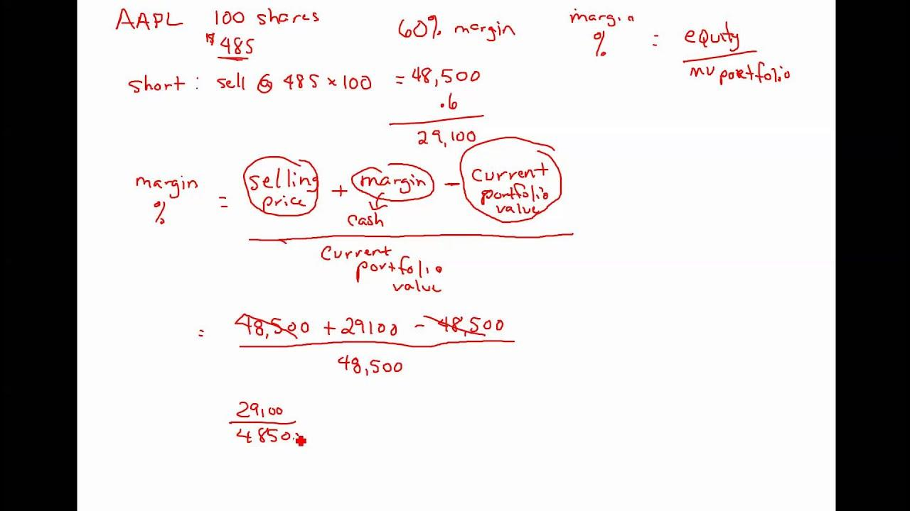

## Table of Contents

## What is a short sale?

A short sale is when someone sells a stock they don't own, hoping to buy it back later at a lower price. They borrow the stock from a broker to sell it. If the stock price goes down, they can buy it back cheaper and keep the difference as profit.

But, if the stock price goes up instead, they lose money. They have to buy it back at the higher price to return it to the broker. This can lead to big losses if the price rises a lot. It's a risky way to try to make money from stocks going down.

## How does short selling work?

Short selling is when you bet that a stock's price will go down. You borrow shares of that stock from your broker and sell them right away at the current price. If the price drops later, you can buy the same number of shares back at the lower price. Then, you give those shares back to your broker and keep the difference as your profit. It's like selling something you don't own yet, hoping to buy it cheaper later.

But, short selling can be risky. If the stock price goes up instead of down, you'll lose money. You still have to buy the shares back to return them to your broker, but now you have to pay more than what you sold them for. The more the price goes up, the more you lose. This is why short selling is considered a high-risk strategy, because your potential losses can be much bigger than your potential gains.

## Why would an investor engage in short selling?

An investor might engage in short selling if they believe a stock's price is going to drop. They see it as a way to make money even when the market is going down. For example, if they think a company is doing poorly and its stock will fall, they can short sell the stock. If they're right and the price does go down, they can buy the stock back at a lower price and make a profit from the difference.

However, short selling is risky. If the stock price goes up instead of down, the investor loses money. They have to buy the stock back at a higher price to return it to the broker, and the more the price rises, the more they lose. It's a gamble, and while it can lead to big profits if they guess right, it can also lead to big losses if they're wrong. This is why short selling is often used by more experienced investors who are willing to take on that risk.

## What are the basic steps to initiate a short sale?

To start a short sale, first, you need to find a broker who allows short selling. You'll need a margin account, which is a type of account where you can borrow money or stocks. Once you have the right account, you tell your broker which stock you want to short sell. The broker will then lend you the shares of that stock.

Next, you sell the borrowed shares at the current market price. The money from the sale goes into your account, but remember, you have to give the shares back later. You wait for the stock price to go down. If it does, you buy the same number of shares back at the lower price. Then, you return those shares to your broker and keep the difference as your profit. But, if the stock price goes up, you lose money because you'll have to buy the shares back at a higher price to return them.

## How is the return on a short sale calculated?

The return on a short sale is calculated by figuring out the difference between the price you sold the stock for and the price you bought it back at. Let's say you sold a stock short at $50 per share. If the price drops to $40 per share, you can buy it back at $40. The return on your short sale would be $10 per share because you sold at $50 and bought back at $40.

However, you also need to consider any fees or interest that you might have to pay to your broker for borrowing the stock. These costs can eat into your profits or increase your losses. So, if you made $10 per share but had to pay $2 in fees, your actual return would be $8 per share. If the stock price goes up instead of down, you'll lose money because you'll have to buy it back at a higher price than you sold it for.

## What is the formula for calculating the profit or loss on a short sale?

The profit or loss on a short sale is calculated by taking the difference between the price you sold the stock for and the price you bought it back at. If you sold the stock short at $50 and it drops to $40, you buy it back at $40. Your profit is $10 per share because you sold at $50 and bought back at $40. This $10 is your gross profit before any fees or interest.

However, you also need to think about the costs of borrowing the stock from your broker. These costs can reduce your profit or increase your loss. If you made $10 per share but had to pay $2 in fees, your actual profit would be $8 per share. If the stock price goes up instead of down, you'll lose money. For example, if the stock rises to $60, you'll lose $10 per share because you have to buy it back at $60 to return it, after selling it at $50.

## How does the cost of borrowing the stock affect the return on a short sale?

The cost of borrowing the stock can make a big difference in how much money you make or lose from a short sale. When you short sell, you borrow shares from your broker and then have to pay them back. But while you're holding onto those borrowed shares, the broker charges you a fee. This fee is like rent for using the stock. If the fee is high, it can eat into your profits. For example, if you make $10 per share from your short sale but have to pay $2 in fees, your actual profit is only $8 per share.

If the stock price doesn't drop as much as you hoped, or if it takes a long time for the price to go down, those borrowing costs can add up. They can turn a small profit into a loss or make a loss even bigger. So, when you're thinking about short selling, you need to consider not just how much the stock might fall, but also how much it will cost you to borrow the shares. This cost can really change how much money you end up with at the end of the day.

## What are the risks associated with short selling?

Short selling can be risky because if the stock price goes up instead of down, you lose money. When you short sell, you borrow shares and sell them, hoping to buy them back cheaper later. But if the price goes up, you have to buy the shares back at a higher price to return them to your broker. The more the price rises, the more money you lose. There's no limit to how high a stock price can go, so your potential losses could be huge.

Another risk is the cost of borrowing the stock. You have to pay fees to your broker for borrowing the shares, and these fees can add up over time. If the stock price doesn't drop quickly, these costs can eat into your profits or even turn a small profit into a loss. Also, sometimes it can be hard to find shares to borrow, especially if a lot of people want to short sell the same stock. This can make borrowing more expensive or even impossible, which adds another layer of risk to short selling.

## How can an investor manage the risks of short selling?

An investor can manage the risks of short selling by setting stop-loss orders. A stop-loss order is like a safety net. It tells your broker to buy back the stock if it reaches a certain price, so you don't lose too much money if the stock price goes up. This helps limit your losses. Also, it's important to do a lot of research before short selling. You need to understand the company and why you think its stock will go down. The more you know, the better your chances of making a good guess.

Another way to manage risk is to not put all your money into one short sale. It's safer to spread your money around and short sell different stocks. This way, if one stock goes up and you lose money, you might still make money on another stock that goes down. Also, keep an eye on how much it costs to borrow the stock. If the fees are too high, it might not be worth the risk. By being careful and planning ahead, you can lower the risks of short selling.

## What is a short squeeze and how does it impact returns?

A short squeeze happens when a lot of people have short sold a stock, and then the stock price starts to go up instead of down. When this happens, the people who short sold the stock get worried. They have to buy the stock back to return it to their broker, but now it's more expensive. So, they rush to buy it back, which makes the stock price go up even more. This can turn into a big problem for short sellers because they lose a lot of money as the price keeps going up.

A short squeeze can really hurt the returns for people who short sold the stock. If they guessed wrong and the stock price goes up a lot, they have to buy it back at a much higher price than they sold it for. This means they lose money, and the more the price goes up, the more they lose. It's like a snowball effect where the losses can get really big, really fast. That's why short squeezes can be scary for short sellers and can lead to big financial losses.

## How do dividends and corporate actions affect the returns on short sales?

When you short sell a stock, dividends and corporate actions can change how much money you make or lose. If the company pays a dividend while you're holding the borrowed shares, you have to pay that dividend to the person you borrowed the shares from. This means you lose money because you have to give away the dividend amount. It's like an extra cost that comes out of your pocket, making your short sale less profitable or increasing your losses.

Corporate actions, like stock splits or mergers, can also affect your short sale. If there's a stock split, the number of shares you have to return changes, and this can mess up your calculations. If there's a merger or acquisition, the stock might be replaced with something else, which can be confusing and might mean you have to buy back different shares at a different price. All these things can make short selling more complicated and can change your returns, sometimes in ways you don't expect.

## What advanced strategies can be used to optimize returns on short sales?

One advanced strategy to optimize returns on short sales is called "[pair trading](/wiki/pair-trading)." This means you short sell one stock while buying another stock at the same time. You pick two stocks that usually move in opposite directions. By doing this, you can make money if the stock you short sell goes down, and you might even make more money if the stock you buy goes up. This can help balance out your risks and maybe make you more money.

Another strategy is to use options to protect yourself. Options are like insurance for your short sale. You can buy a "call option" that gives you the right to buy the stock back at a set price. If the stock price goes up a lot, you can use the call option to buy it back at a lower price than the market price. This can limit how much money you lose. Using options like this can make short selling less risky, but it also costs money, so you have to think about if it's worth it.

## How do you calculate returns from short sales?

Short selling is a trading strategy that allows investors to profit from a decline in the price of a security. Calculating returns from short sales involves understanding the basic mathematics, considering influencing factors, and being aware of how market conditions affect the overall outcome.

### Basic Mathematics of Short Sale Returns

When an investor executes a short sale, they borrow shares of a stock and sell them at the current market price, hoping to repurchase them later at a lower price. The return on a short sale (R) can be expressed mathematically as:

$$
R = \frac{(P_{\text{sell}} - P_{\text{buy}} - C)}{C}
$$

where:
- $P_{\text{sell}}$ is the price at which the stock is initially sold.
- $P_{\text{buy}}$ is the price at which the stock is repurchased.
- $C$ represents the cost associated with the short sale, including interest and fees. 

### Influencing Factors for Short Sale Profitability

1. **Dividends**: If the security pays dividends while it is being shorted, the short seller is responsible for paying these dividends to the lender. This can reduce the returns from the short sale.

2. **Interest and Fees**: Short sellers often pay a "borrow fee" to the lender, and they may also incur commission fees for transactions. These expenses can decrease the profitability of the short sale.

3. **Margin Requirements**: Short sellers must maintain a margin account, which may incur interest charges, further eating into potential profits.

### Example Calculations

For instance, consider a situation where an investor shorts a stock at $100 per share and later buys it back at $90. If the associated costs (dividends, fees, interest) are $5 per share, the return would be calculated as follows:

$$
R = \frac{(100 - 90 - 5)}{5} = \frac{5}{5} = 1
$$

This demonstrates a 100% return on the initial $5 cost per share.

### Impact of Market Conditions

Market conditions greatly influence short sale returns. In a volatile market, prices can move sharply against the short seller, leading to potentially unlimited losses if the stock price rises significantly. Conversely, in a declining market, short sales can yield significant profits if the investor accurately predicts stock price movements.

### Tools and Resources for Accurate Short Sale Return Calculations

Investors seeking to accurately calculate short sale returns can utilize financial software tools such as Bloomberg Terminal and Reuters Eikon, which provide real-time data, short interest information, and cost of borrowing metrics. Additionally, Python libraries such as Pandas and NumPy can be employed to build custom models and simulations to project short sale outcomes.

For Python illustration:
```python
import pandas as pd

# Sample data
data = {'Price_Sell': [100], 'Price_Buy': [90], 'Cost': [5]}
df = pd.DataFrame(data)

# Calculate Return
df['Return'] = (df['Price_Sell'] - df['Price_Buy'] - df['Cost']) / df['Cost']
print(df[['Price_Sell', 'Price_Buy', 'Cost', 'Return']])
```

Thoroughly understanding these components ensures that investors can make informed decisions when engaging in short sales, optimizing their strategies for profitability even in turbulent markets.

## References & Further Reading

[1]: ["Short Selling: Strategies, Risks, and Rewards."](https://www.amazon.com/Short-Selling-Strategies-Risks-Rewards/dp/0471660205) Investopedia.

[2]: Aitken, M., Frino, A., McCorry, M., & Swan, P. (1998). ["Short Sales Are Almost Instantaneously Bad News: Evidence from the Australian Stock Exchange."](https://onlinelibrary.wiley.com/doi/10.1111/0022-1082.00088) Journal of Finance, 53(6), 2205-2223.

[3]: Dechow, P. M., Hutton, A. P., Meulbroek, L., & Sloan, R. G. (2001). ["Short-sellers, fundamental analysis, and stock returns."](https://www.sciencedirect.com/science/article/pii/S0304405X01000563) Journal of Financial Economics, 61(1), 77-106.

[4]: ["The Big Short: Inside the Doomsday Machine."](https://en.wikipedia.org/wiki/The_Big_Short) by Michael Lewis.

[5]: Asquith, P., Pathak, P. A., & Ritter, J. R. (2005). ["Short interest, institutional ownership, and stock returns."](https://www.sciencedirect.com/science/article/pii/S0304405X05001170) Journal of Financial Economics, 78(2), 243-276.

[6]: Jones, C. M., & Lamont, O. A. (2002). ["Short-sale constraints and stock returns."](https://www.sciencedirect.com/science/article/pii/S0304405X02002246) The Review of Financial Studies, 16(2), 511-556.

[7]: Brunnermeier, M. K., & Pedersen, L. H. (2009). ["Market Liquidity and Funding Liquidity."](https://www.jstor.org/stable/30225714) The Review of Financial Studies, 22(6), 2201-2238.

[8]: ["Quantitative Momentum: A Practitioner's Guide to Building a Momentum-Based Stock Selection System"](https://books.google.com/books/about/Quantitative_Momentum.html?id=K2npCgAAQBAJ) by Wesley R. Gray and Jack R. Vogel.