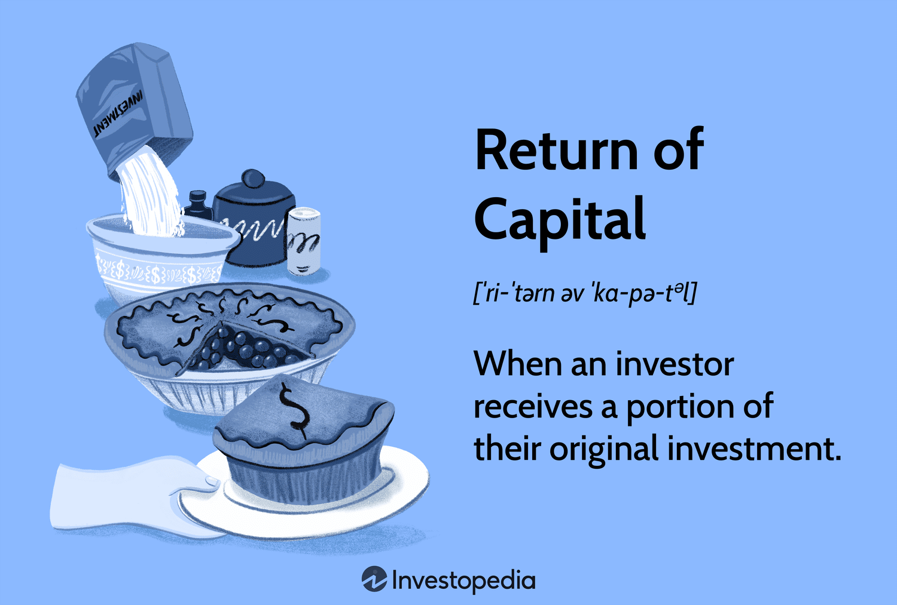

## Table of Contents

## What is Return of Capital?

Return of Capital is when a company gives money back to its investors. This happens when the company has extra money that it doesn't need for its business. Instead of keeping the money, the company decides to return it to the people who own its shares. This can be done by paying out special dividends or by buying back its own shares.

When investors get a return of capital, it's not considered income like regular dividends. Instead, it's seen as a return of the money they originally invested. This means that the investor's cost basis in the stock goes down. When they eventually sell their shares, they might have to pay taxes on the difference between what they paid for the shares and what they sold them for. This can be a good thing for investors because it can lower their tax bill in the short term.

## How does Return of Capital differ from other types of returns?

Return of Capital is different from other types of returns like dividends and capital gains. When a company pays dividends, it's giving shareholders a part of its profits. These dividends are usually taxed as income. But with Return of Capital, the company is not giving shareholders profits; it's giving back some of the money that shareholders originally invested. This means it's not taxed as income right away. Instead, it reduces the investor's cost basis in the stock, which can affect taxes later when the stock is sold.

Capital gains are another type of return, which happen when an investor sells a stock for more than they paid for it. The profit from this sale is a capital gain, and it's taxed differently depending on how long the investor held the stock. Return of Capital is different because it's not a profit from selling the stock; it's money returned by the company before the stock is sold. This can be good for investors because it can lower their taxes now, but it might mean they pay more taxes later when they sell the stock, depending on how much their cost basis has been reduced.

## What are the common sources of Return of Capital?

Return of Capital often comes from a company selling off some of its assets. When a company decides it doesn't need certain assets anymore, it can sell them and use the money to give back to its shareholders. This can happen when a company is shrinking its business or when it wants to focus on different parts of its business. For example, if a company sells a factory it no longer needs, it might use the money from that sale to pay a Return of Capital to its investors.

Another common source of Return of Capital is when a company has more cash than it needs for its day-to-day operations. This can happen if the company is very profitable or if it has been saving up money for a long time. Instead of using this extra cash to grow the business or invest in new projects, the company might decide to return it to shareholders. This can be a way for the company to reward its investors without having to pay taxes on the money as income right away.

## Can you explain how Return of Capital is taxed?

Return of Capital is not taxed right away like regular income or dividends. When you get Return of Capital, it's seen as getting back some of the money you originally put into the investment. This means it doesn't count as income for taxes at that time. Instead, the amount you get reduces your cost basis in the investment. Your cost basis is how much you paid for the stock to begin with.

When you eventually sell the stock, you'll have to pay taxes on the difference between your new, lower cost basis and the price you sell it for. This difference is called a capital gain. If your cost basis is lower because of Return of Capital, your capital gain might be higher, which could mean more taxes when you sell. But getting Return of Capital can still be good for you because it lets you put off paying taxes until you sell the stock, and sometimes you might end up paying less overall.

## What are the implications of Return of Capital on an investor's cost basis?

When you get Return of Capital, it changes how much you originally paid for your investment. This amount you paid is called your cost basis. When a company gives you Return of Capital, it reduces your cost basis. That means the number you use to figure out if you made money when you sell the stock goes down.

This can be good because it might mean you pay less in taxes right now. But when you do sell the stock, your profit might be bigger because your cost basis is lower. This bigger profit could mean you pay more in taxes later. So, Return of Capital can help you delay paying taxes and sometimes even pay less overall, but it depends on how much your cost basis goes down and what happens when you sell the stock.

## How do companies decide to return capital to shareholders?

Companies decide to return capital to shareholders when they have extra money they don't need for their business. This can happen if they sell something they don't need anymore, like a building or a part of their business. It can also happen if the company is making a lot of money and has more cash than it needs to run the business. When this happens, the company's leaders, like the board of directors, might decide it's a good idea to give some of that extra money back to the people who own the company's shares.

The decision to return capital is usually made after a lot of thinking and talking. The company's leaders look at things like how much money they have, what they plan to do in the future, and what's best for the shareholders. They might choose to return capital through special dividends or by buying back their own shares. This can be a way to reward shareholders and show that the company is doing well, but it's a big decision that needs to be thought through carefully.

## What are the potential benefits of receiving Return of Capital?

Getting Return of Capital can be good for investors because it lets them get some of their money back without having to sell their shares. This can be helpful if they want to use the money for something else but still want to keep their investment in the company. Also, when they get Return of Capital, they don't have to pay taxes on it right away. This is different from regular dividends, which are taxed as income. Instead, Return of Capital lowers the amount they originally paid for the stock, which is called their cost basis.

This lower cost basis can help investors when they eventually sell their shares. Because their cost basis is lower, the profit they make when they sell might be bigger. But this could mean they pay more taxes later when they sell the stock. Still, getting Return of Capital can be a smart way to delay paying taxes and sometimes even pay less overall. It's a way for companies to give money back to their shareholders without them having to do anything extra, and it can be a good thing for investors if they plan carefully.

## What are the risks associated with Return of Capital?

One risk of getting Return of Capital is that it can lower the value of your investment. When a company gives you Return of Capital, it's usually because they don't need the money for their business anymore. This might mean the company is not growing or is even shrinking. If the company is not doing well, the price of the stock might go down, which could make your investment worth less than before.

Another risk is that Return of Capital can make your taxes more complicated. When you get Return of Capital, it reduces the amount you originally paid for the stock, which is called your cost basis. This can be good because it might mean you pay less in taxes right now. But when you sell the stock later, you might have to pay more in taxes because your profit could be bigger. You need to keep good records and understand how it affects your taxes to avoid surprises later.

## How can Return of Capital impact a company's financial health?

When a company gives Return of Capital to its shareholders, it can affect its financial health in different ways. If the company is using extra money it doesn't need, like from selling off parts of its business, it might not hurt the company's finances too much. But if the company keeps giving out Return of Capital, it might not have enough money left to grow or to handle problems that come up. This could make it harder for the company to do well in the future.

Also, giving Return of Capital can send a message to people who might want to invest in the company. If investors think the company is doing well and has extra money to give back, they might feel good about the company. But if they think the company is giving back money because it can't find good ways to use it, they might worry that the company isn't growing or doing well. This can affect how much people are willing to pay for the company's stock and can impact the company's overall financial health.

## What should investors consider before reinvesting Return of Capital?

Before reinvesting Return of Capital, investors should think about what they want from their money. If they want to keep their money safe and not take big risks, they might not want to put the money back into the same company. They should look at how the company is doing and if it's growing or shrinking. If the company is not doing well, it might be better to put the money somewhere else that could be safer or have a better chance to grow.

Investors should also think about taxes. When they get Return of Capital, it lowers the amount they paid for the stock, which is called their cost basis. This can be good because it might mean they pay less in taxes now. But if they put the money back into the same company, they need to remember that this lower cost basis will affect their taxes later when they sell the stock. They should think about how this might change how much they pay in taxes and if it's worth it to reinvest the money.

## How does Return of Capital fit into different investment strategies?

Return of Capital can be a part of different investment strategies depending on what an investor wants. If an investor wants to get some money back without selling their shares, Return of Capital can be a good choice. It lets them keep their investment in the company while also getting some cash to use for other things. This can be helpful for people who want to keep their money safe but also want some of it back to spend or invest elsewhere.

For investors who are looking to grow their money over a long time, Return of Capital can also fit into their plans. When they get Return of Capital, it lowers the amount they paid for the stock, which is called their cost basis. This can be good because it might mean they pay less in taxes now. But they need to think about how this will affect their taxes later when they sell the stock. If they believe in the company and think it will do well in the future, they might choose to reinvest the Return of Capital back into the company to keep growing their investment.

## Can you provide examples of companies that have used Return of Capital effectively?

One company that has used Return of Capital well is Apple. A few years ago, Apple had a lot of money saved up and decided to give some of it back to its shareholders. They did this by buying back their own shares and paying special dividends. This made their investors happy because they got money back without having to sell their shares. It also showed that Apple was doing well and had more money than it needed for its business.

Another example is Costco. Costco has given Return of Capital to its shareholders through special dividends. They did this when they had extra money from their business. By giving back this money, Costco showed that it was doing well and that it cared about its shareholders. This made their investors feel good about keeping their money in Costco and helped the company's stock price stay strong.

## What is Return of Capital (ROC)?

Return of Capital (ROC) represents a financial concept where investors receive a portion of their original investment back from a company. This return is not categorized as income or capital gains. Instead, it serves primarily as a distribution that returns some of the investor's principal investment, effectively reducing the investment's adjusted cost basis. The adjusted cost basis is the original value of an asset for tax purposes, adjusted for stock splits, dividends, and return of capital distributions.

When an investor receives an ROC distribution, the adjusted cost basis of the investment is lowered by the amount of the distribution. For instance, if an individual purchases a stock for $10,000 and receives a $1,000 ROC, the new adjusted cost basis becomes $9,000 ($10,000 - $1,000). This adjustment mechanism is critical because it affects the calculation of taxable capital gains when the investment is eventually sold. If the cost basis is reduced to zero, any subsequent ROC distributions are taxed as capital gains, and future gains realized from the sale of the investment will be wholly subject to capital gains tax.

For example, let's assume an investor holds shares with an initial investment of $5,000, receiving ROC distributions over time amounting to $5,000. At this point, the adjusted cost basis reaches zero. Any further ROC or profits from selling these shares will be treated as taxable capital gains. This taxation process necessitates accurate record-keeping of cost basis adjustments for investors to fully capitalize on ROC while adhering to tax regulations.

The mathematical representation of the adjusted cost basis after an ROC can be expressed as:

$$
\text{Adjusted Cost Basis} = \text{Initial Cost Basis} - \text{Total ROC Received}
$$

This equation underscores the significance of ROC in financial planning and tax liability management, particularly for investors seeking effective strategies for optimizing their tax position over the life of an investment.

## How does ROC work?

Return of Capital (ROC) functions as a return of a portion of an investor's original investment, distinct from traditional income forms like interest payments or dividends. Unlike these forms, ROC is not considered taxable income. This is because it essentially represents the repayment of the invested capital, rather than a return on that capital. By returning part of the investment, ROC reduces the adjusted cost basis of the security. The adjusted cost basis is recalculated as follows:

$$
\text{New Adjusted Cost Basis} = \text{Original Cost Basis} - \text{ROC}
$$

The significant aspect of this reduction is that once the adjusted cost basis reaches zero, any further distributions will be treated as taxable capital gains, reflecting the investor's true gains.

The differentiation between Return of Capital (ROC) and Return on Capital (RoC) lies in their financial implications. RoC, often expressed as a percentage, measures the efficiency and profitability of the capital invested, typically in business contexts. RoC should be distinguished from ROC to prevent misunderstandings regarding investment returns and tax consequences.

Investment vehicles like Real Estate Investment Trusts (REITs) and some mutual funds commonly utilize ROC. These products often distribute ROC to provide immediate cash flow to investors without triggering taxable events prematurely. This strategy aligns with a broader tax-efficiency goal, allowing investors to defer taxes until actual capital gains are realized.

For investor portfolios, understanding how ROC operates is vital for strategic tax planning and investment management. The use of ROC in tax-advantaged accounts can further optimize this strategy, allowing investors greater control over when they realize income and incur tax liabilities.

## References & Further Reading

[1]: Lopez de Prado, M. (2018). ["Advances in Financial Machine Learning"](https://www.amazon.com/Advances-Financial-Machine-Learning-Marcos/dp/1119482089). Wiley.

[2]: Chan, E. P. (2009). ["Quantitative Trading: How to Build Your Own Algorithmic Trading Business"](https://github.com/ftvision/quant_trading_echan_book). Wiley.

[3]: Aronson, D. R. (2011). ["Evidence-Based Technical Analysis: Applying the Scientific Method and Statistical Inference to Trading Signals"](https://www.amazon.com/Evidence-Based-Technical-Analysis-Scientific-Statistical/dp/0470008741). Wiley.

[4]: Jansen, S. (2020). ["Machine Learning for Algorithmic Trading"](https://github.com/stefan-jansen/machine-learning-for-trading). Packt Publishing.

[5]: Bergstra, J., Bardenet, R., Bengio, Y., & Kégl, B. (2011). ["Algorithms for Hyper-Parameter Optimization."](https://dl.acm.org/doi/10.5555/2986459.2986743) Advances in Neural Information Processing Systems 24.