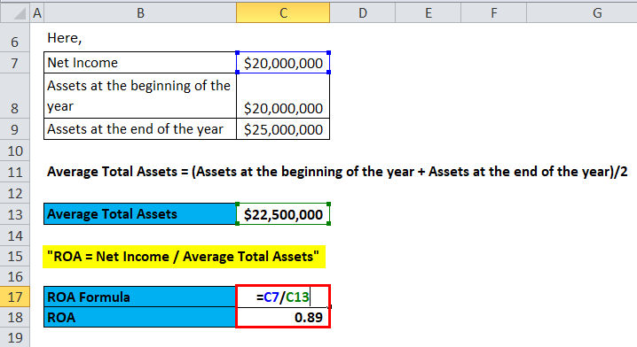

## Table of Contents

## What is Return on Assets (ROA) and why is it important?

Return on Assets (ROA) is a financial ratio that shows how well a company is using its assets to make money. It is calculated by dividing the company's net income by its total assets. This gives you a percentage that tells you how much profit the company makes for each dollar of assets it has. For example, if a company has a ROA of 5%, it means it earns 5 cents for every dollar of assets.

ROA is important because it helps investors and managers see how efficiently a company is being run. A higher ROA means the company is using its assets more effectively to generate profits. This can be a sign of good management and a strong business model. On the other hand, a low ROA might mean the company is not using its assets well, which could be a red flag for investors. By comparing the ROA of different companies, you can see which ones are better at turning their assets into profits.

## How do you calculate Return on Assets?

To calculate Return on Assets, you need two pieces of information: the company's net income and its total assets. Net income is the profit a company makes after paying all its expenses. Total assets include everything the company owns, like buildings, equipment, and cash. You find the ROA by dividing the net income by the total assets. The result is a percentage that shows how much profit the company makes for each dollar of assets it has.

For example, if a company has a net income of $100,000 and total assets of $1,000,000, you would divide $100,000 by $1,000,000. This gives you a ROA of 0.1 or 10%. This means the company earns 10 cents for every dollar of assets it has. ROA is a useful tool because it helps you see how well a company is using its resources to make money.

## What data do you need to calculate ROA in Excel?

To calculate Return on Assets (ROA) in Excel, you need two pieces of data: the company's net income and its total assets. Net income is the money the company makes after paying all its bills. You can find this number on the company's income statement. Total assets are all the things the company owns, like buildings, machines, and money in the bank. You can find this number on the company's balance sheet.

Once you have these two numbers, you can use Excel to do the calculation. In one cell, type in the net income. In another cell, type in the total assets. Then, in a third cell, you can use a simple formula to calculate ROA. Just type in the formula "=net income cell/total assets cell". Excel will do the math and show you the ROA as a decimal. To turn it into a percentage, you can format the cell to show the result as a percentage.

## How do you set up an Excel spreadsheet to calculate ROA?

To set up an Excel spreadsheet to calculate Return on Assets (ROA), start by opening a new Excel workbook. In cell A1, type "Net Income" and in cell B1, type the net income amount. Net income is the money the company makes after paying all its bills, which you can find on the company's income statement. Next, in cell A2, type "Total Assets" and in cell B2, type the total assets amount. Total assets are everything the company owns, like buildings, machines, and money in the bank, which you can find on the company's balance sheet.

Once you have entered the net income and total assets, you can calculate ROA. In cell A3, type "ROA". In cell B3, enter the formula "=B1/B2" to divide the net income by the total assets. This will give you the ROA as a decimal. To display the ROA as a percentage, right-click on cell B3, select "Format Cells", choose the "Percentage" category, and set the decimal places as desired. Now, your Excel spreadsheet will show the ROA as a percentage, making it easy to see how well the company is using its assets to make money.

## What are the basic Excel formulas needed for ROA calculation?

To calculate Return on Assets (ROA) in Excel, you need to know the net income and the total assets of a company. Net income is the money the company makes after paying all its bills. You can find this on the company's income statement. Total assets are everything the company owns, like buildings, machines, and money in the bank. You can find this on the company's balance sheet. In Excel, you would enter the net income in one cell, like B1, and the total assets in another cell, like B2.

Once you have entered the net income and total assets, you can calculate ROA using a simple formula. In a new cell, like B3, you would type "=B1/B2". This formula divides the net income by the total assets, giving you the ROA as a decimal. To turn this decimal into a percentage, you need to format the cell. Right-click on the cell with the ROA, choose "Format Cells", then select "Percentage" and set the number of decimal places you want. Now, your Excel sheet will show the ROA as a percentage, making it easy to understand how well the company is using its assets to make money.

## How can you use Excel functions to automate ROA calculations?

To automate ROA calculations in Excel, you can use the basic division formula along with cell references. First, enter the net income in one cell, let's say B1, and the total assets in another cell, like B2. Then, in a new cell, such as B3, you can type the formula "=B1/B2" to calculate the ROA. This formula divides the net income by the total assets, giving you the ROA as a decimal. To display it as a percentage, right-click on cell B3, choose "Format Cells", then select "Percentage" and set the decimal places you want. Now, whenever you update the net income or total assets, the ROA will automatically update.

To make the process even easier, you can use named ranges. Name cell B1 as "NetIncome" and cell B2 as "TotalAssets". Then, in cell B3, you can type the formula "=NetIncome/TotalAssets". This makes your formula more readable and easier to understand. If you need to calculate ROA for multiple periods, you can copy this formula down a column. For example, if you have monthly data, you can enter the net income and total assets for each month in columns B and C, and then the formula in column D will automatically calculate the ROA for each month. This way, you can quickly see how the ROA changes over time.

## What are common mistakes to avoid when calculating ROA in Excel?

When calculating Return on Assets (ROA) in Excel, a common mistake is using the wrong numbers for net income or total assets. Net income is the money the company makes after paying all its bills, which you can find on the income statement. Total assets are everything the company owns, like buildings and money in the bank, which you can find on the balance sheet. If you mix up these numbers or use the wrong financial statement, your ROA calculation will be wrong. Always double-check that you are using the correct figures from the right financial statements.

Another mistake is not formatting the ROA result correctly. When you divide net income by total assets, Excel gives you a decimal number. To make it easier to understand, you need to format this number as a percentage. If you forget to do this, the ROA will look like a small decimal, which can be confusing. To fix this, right-click on the cell with the ROA, choose "Format Cells", then select "Percentage" and set the decimal places you want. This way, you can see the ROA as a percentage, which makes it clear how well the company is using its assets to make money.

## How can you interpret the ROA results in Excel?

When you calculate Return on Assets (ROA) in Excel, the result is a percentage that shows how well a company is using its assets to make money. If the ROA is high, it means the company is good at turning its assets into profits. For example, a ROA of 10% means the company earns 10 cents for every dollar of assets it has. This can be a sign of good management and a strong business. On the other hand, a low ROA might mean the company is not using its assets well, which could be a warning sign for investors.

To make sense of the ROA, you can compare it with other companies in the same industry. If a company's ROA is higher than its competitors, it might be doing a better job at using its assets to make money. You can also look at how the ROA changes over time for the same company. If the ROA is going up, it's a good sign that the company is getting better at using its assets. But if the ROA is going down, it might mean the company is facing problems and needs to improve how it manages its assets.

## How can you compare ROA across different time periods in Excel?

To compare ROA across different time periods in Excel, you can set up a table with columns for each period. For example, you might have columns for each month or each year. In one column, you'll put the net income for each period, and in another column, you'll put the total assets for each period. Then, you can use a formula to calculate the ROA for each period. Just type "=net income/total assets" in a new column next to each period, and Excel will do the math for you. This way, you can see the ROA for each time period all in one place.

Once you have the ROA for each period, you can easily see how it changes over time. If the ROA is going up, it means the company is getting better at using its assets to make money. This is a good sign. But if the ROA is going down, it might mean the company is not using its assets as well as before, which could be a problem. You can also use Excel's charting tools to make a graph of the ROA over time. This can help you see the trends more clearly and understand how the company is doing at a glance.

## How do you adjust ROA calculations for different industries in Excel?

When you calculate Return on Assets (ROA) for different industries in Excel, you need to remember that what's a good ROA in one industry might not be good in another. Some industries, like tech companies, might have a higher ROA because they don't need as many physical assets to make money. Other industries, like manufacturing, might have a lower ROA because they need a lot of expensive equipment. So, when you compare ROA across industries, it's helpful to look at industry averages. You can find these averages in financial reports or on websites that track industry data. Once you have the industry averages, you can enter them into Excel next to your company's ROA to see how it stacks up.

To adjust your ROA calculations in Excel for different industries, you can set up a table where one column shows the ROA for your company and another column shows the industry average ROA. For example, if you're looking at a tech company, you might put the company's ROA in one cell and the average ROA for tech companies in another cell. Then, you can use Excel's formatting tools to highlight if your company's ROA is above or below the industry average. This makes it easy to see at a glance how well your company is doing compared to others in the same industry. By doing this, you can get a better idea of how efficient your company is at using its assets to make money, no matter which industry it's in.

## What advanced Excel techniques can enhance ROA analysis?

To make your ROA analysis better in Excel, you can use conditional formatting. This tool lets you highlight cells based on their values. For example, you can set it up so that if a company's ROA is higher than the industry average, the cell turns green. If it's lower, the cell turns red. This makes it easy to see at a glance which companies are doing well and which ones need to improve. You can also use conditional formatting to show trends over time, like if the ROA is going up or down.

Another advanced technique is using pivot tables. Pivot tables help you summarize and analyze large amounts of data quickly. You can set up a pivot table to show the ROA for different companies or different time periods. This makes it easy to compare ROA across different groups or over time. You can also add filters to your pivot table to focus on specific industries or time frames. This way, you can get a detailed view of how ROA changes and what might be affecting it.

## How can you integrate ROA calculations with other financial metrics in Excel?

To make your financial analysis better in Excel, you can combine ROA with other important numbers like Return on Equity (ROE) and Debt to Equity Ratio. ROE tells you how well a company is using the money its shareholders have put in. The Debt to Equity Ratio shows how much the company is borrowing compared to what the shareholders have invested. You can put all these numbers in a table in Excel. For example, you can have one column for ROA, another for ROE, and another for Debt to Equity Ratio. This way, you can see how these numbers relate to each other and get a fuller picture of how the company is doing.

When you put these numbers together, you can see trends and patterns that might not be clear if you only look at ROA by itself. For example, if a company has a high ROA but also a high Debt to Equity Ratio, it might mean the company is taking on a lot of debt to get that high ROA. This could be risky. On the other hand, if a company has a high ROA and a low Debt to Equity Ratio, it might be doing well without taking on too much risk. By looking at these numbers together in Excel, you can make smarter decisions about the company's financial health and future.

## What is Return on Assets (ROA) and how is it understood?

Return on Assets (ROA) is a financial metric used to assess how effectively a company employs its assets to generate profits. It is calculated using the formula:

$$
\text{ROA} = \frac{\text{Net Income}}{\text{Total Assets}}
$$

This ratio provides insight into the efficiency with which a company's management utilizes its assets to produce net income during a specific period. A higher ROA suggests that the company is more efficient at converting its investments in assets into profits. This efficiency makes ROA a crucial metric for investors who are keen to identify companies that display strong profitability and operational effectiveness.

ROA must be contextualized within the industry in which a company operates because asset structures and capital intensity can vary significantly across sectors. For example, industries that require substantial investments in fixed assets, such as manufacturing or utilities, might naturally exhibit lower ROA compared to sectors like technology or services, which operate with fewer assets. Consequently, comparing ROA figures is most meaningful when evaluating companies within the same industry, as this practice accounts for differing industry norms and asset requirements.

## How does ROA compare across different companies?

Comparative analysis of Return on Assets (ROA) across companies provides valuable insights for investors seeking to evaluate asset utilization efficiency within the same industry. By examining ROA, stakeholders can assess how well a company manages its resources to generate profits relative to its peers.

For instance, comparing Amazon and Netflix during a specific timeframe can reveal differences in their asset management capabilities. This involves computing each company's ROA and analyzing the results. Suppose Amazon's net income and total assets for a given period are $596 million and $30 billion, respectively, and Netflix's net income and total assets are $23.696 million and $9.240 billion, respectively. The ROA for Amazon would be calculated as follows:

$$
\text{ROA}_{\text{Amazon}} = \frac{\text{Net Income}}{\text{Total Assets}} = \frac{596 \text{ million}}{30 \text{ billion}} \times 100\% = 1.99\%
$$

Similarly, the ROA for Netflix, as calculated previously, is approximately 0.26%. These figures highlight significant differences in how each company utilizes its assets to generate income.

Using Excel to streamline these calculations allows analysts to efficiently prepare comparative dashboards that guide strategic investment decisions. By inputting the required financial data into Excel, users can automate the calculation of ROA across multiple firms:

```python
import pandas as pd

data = {
    'Company': ['Amazon', 'Netflix'],
    'Net Income': [596_000_000, 23_696_000],
    'Total Assets': [30_000_000_000, 9_240_626_000]
}

df = pd.DataFrame(data)
df['ROA'] = (df['Net Income'] / df['Total Assets']) * 100

print(df)
```

The above Python code snippet demonstrates how similar calculations can be performed programmatically, further enhancing the capability to undertake exhaustive comparative analysis efficiently. Excel's features like pivot tables and charts can then be employed to visually represent this data, assisting analysts and investors in making well-informed decisions based on a clear understanding of asset utilization efficiency across competing firms.

## References & Further Reading

[1]: ["Advances in Financial Machine Learning"](https://www.amazon.com/Advances-Financial-Machine-Learning-Marcos/dp/1119482089) by Marcos Lopez de Prado

[2]: ["Machine Learning for Algorithmic Trading"](https://www.amazon.com/Machine-Learning-Algorithmic-Trading-alternative/dp/1839217715) by Stefan Jansen

[3]: ["Quantitative Trading: How to Build Your Own Algorithmic Trading Business"](https://github.com/LucindaYa/quant-resources/blob/master/Quantitative%20Trading%20How%20to%20Build%20Your%20Own%20Algorithmic%20Trading%20Business.pdf) by Ernest P. Chan

[4]: ["Financial Modeling in Excel For Dummies"](https://www.dummies.com/book/technology/software/microsoft-products/excel/financial-modeling-in-excel-for-dummies-281721/) by Danielle Stein Fairhurst

[5]: ["Hands-On Machine Learning with Scikit-Learn, Keras, and TensorFlow"](https://www.amazon.com/Hands-Machine-Learning-Scikit-Learn-TensorFlow/dp/1491962291) by Aurélien Géron

[6]: ["Financial Analysis with Microsoft Excel"](https://www.amazon.com/Financial-Analysis-Microsoft-Excel-Timothy/dp/0357442059) by Timothy R. Mayes and Todd M. Shank