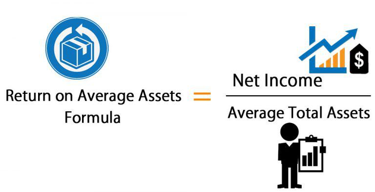

In the fast-paced landscape of financial analysis and algorithmic trading, key financial metrics are essential for evaluating asset performance and shaping effective strategies. Among these metrics, Return on Assets (ROA) plays a pivotal role in assessing a company's efficiency in generating profit from its total assets—a significant factor for fundamental analysis and informed investment decisions. ROA provides insight into how well a company leverages its assets to produce earnings, making it a critical indicator of financial health and operational efficiency.

This article focuses on calculating ROA using Excel, a widely-used tool for financial modeling due to its versatility and capacity to handle complex data. Excel's robust functions allow traders and investors to compute ROA efficiently, facilitating the assessment of asset performance across various scenarios. By learning to calculate and compare ROA, market participants can gain deeper insights into asset utilization and enhance their strategy-development processes.



In the context of algorithmic trading, ROA is particularly valuable. Trader's algorithms can incorporate ROA calculations to refine stock selection and optimize portfolio returns, ensuring strategies remain data-driven and adaptable to shifting market conditions. Understanding how ROA metrics interplay leads to better resource allocation and strategic decision-making, essential for maintaining a competitive edge in today's financial markets.

## Table of Contents

## Understanding Return on Assets (ROA)

Return on Assets (ROA) is a financial metric used to assess how effectively a company employs its assets to generate profits. It is calculated using the formula:

$$
\text{ROA} = \frac{\text{Net Income}}{\text{Total Assets}}
$$

This ratio provides insight into the efficiency with which a company's management utilizes its assets to produce net income during a specific period. A higher ROA suggests that the company is more efficient at converting its investments in assets into profits. This efficiency makes ROA a crucial metric for investors who are keen to identify companies that display strong profitability and operational effectiveness.

ROA must be contextualized within the industry in which a company operates because asset structures and capital intensity can vary significantly across sectors. For example, industries that require substantial investments in fixed assets, such as manufacturing or utilities, might naturally exhibit lower ROA compared to sectors like technology or services, which operate with fewer assets. Consequently, comparing ROA figures is most meaningful when evaluating companies within the same industry, as this practice accounts for differing industry norms and asset requirements.

## Calculating ROA in Excel

Excel is a widely-used tool that simplifies the calculation of Return on Assets (ROA), providing users with a straightforward method to evaluate the efficiency of a company's asset utilization. The process of calculating ROA in Excel involves a simple formula: dividing the company's net income by its total assets. The formula used in Excel is expressed as `=Net_Income/Total_Assets`.

To practically demonstrate this calculation in Excel, follow these steps:

1. **Input Data**: 
   Begin by entering the relevant financial data into Excel. For instance, place the net income value in one cell (e.g., B2) and the total assets figure in another cell (e.g., B3).

2. **Apply the Formula**: 
   In a third cell (e.g., B4), input the formula `=B2/B3`. This formula instructs Excel to divide the net income by the total assets, thereby calculating the ROA.

3. **Analyze the Result**:
   The resulting value in cell B4 represents the ROA, indicating how efficiently the company is using its assets to generate profit.

Excel’s powerful features allow users to manipulate large datasets and conduct quick analyses efficiently. This is particularly useful for analyzing financial statements across different time periods or comparing the financial metrics of multiple companies. Additionally, Excel allows for the automation of these calculations, where ROA can be computed for a range of periods using similar formula setups across several rows or columns, thus facilitating comprehensive financial analysis.

## Example: ROA Calculation for Netflix

Consider Netflix's financial data from March 31, 2015, where the company reported a net income of $23.696 million and total assets of $9.240 billion. To calculate the Return on Assets (ROA) using Excel, follow these simple steps:

1. Enter the net income in one cell. For example, input `23696000` in cell A1.
2. Enter the total assets in another cell, such as `9240626000` in cell B1.
3. Apply the ROA formula, which divides net income by total assets: `=A1/B1`.

By executing this calculation, Excel will display the ROA, which is approximately 0.26%. This result signifies Netflix's proficiency in generating earnings from its asset base at that time. Such computations are not only straightforward but also provide valuable insights into financial efficiency.

This calculation methodology can be easily extended to different companies, enhancing comparative analysis. By comparing the ROA of Netflix with those of other firms within the same industry, investors can benchmark asset utilization efficiency and make informed decisions.

## Comparing ROA Across Companies

Comparative analysis of Return on Assets (ROA) across companies provides valuable insights for investors seeking to evaluate asset utilization efficiency within the same industry. By examining ROA, stakeholders can assess how well a company manages its resources to generate profits relative to its peers.

For instance, comparing Amazon and Netflix during a specific timeframe can reveal differences in their asset management capabilities. This involves computing each company's ROA and analyzing the results. Suppose Amazon's net income and total assets for a given period are $596 million and $30 billion, respectively, and Netflix's net income and total assets are $23.696 million and $9.240 billion, respectively. The ROA for Amazon would be calculated as follows:

$$
\text{ROA}_{\text{Amazon}} = \frac{\text{Net Income}}{\text{Total Assets}} = \frac{596 \text{ million}}{30 \text{ billion}} \times 100\% = 1.99\%
$$

Similarly, the ROA for Netflix, as calculated previously, is approximately 0.26%. These figures highlight significant differences in how each company utilizes its assets to generate income.

Using Excel to streamline these calculations allows analysts to efficiently prepare comparative dashboards that guide strategic investment decisions. By inputting the required financial data into Excel, users can automate the calculation of ROA across multiple firms:

```python
import pandas as pd

data = {
    'Company': ['Amazon', 'Netflix'],
    'Net Income': [596_000_000, 23_696_000],
    'Total Assets': [30_000_000_000, 9_240_626_000]
}

df = pd.DataFrame(data)
df['ROA'] = (df['Net Income'] / df['Total Assets']) * 100

print(df)
```

The above Python code snippet demonstrates how similar calculations can be performed programmatically, further enhancing the capability to undertake exhaustive comparative analysis efficiently. Excel's features like pivot tables and charts can then be employed to visually represent this data, assisting analysts and investors in making well-informed decisions based on a clear understanding of asset utilization efficiency across competing firms.

## Integrating ROA into Algorithmic Trading Strategies

Return on Assets (ROA) is pivotal in the development and execution of [algorithmic trading](/wiki/algorithmic-trading) strategies, where the aim is to optimize both efficiency and profitability. By integrating ROA into these strategies, traders can more effectively filter out underperforming assets and hone in on stocks that complement their strategic objectives.

Algorithmic trading systems leverage ROA by setting specific thresholds that help in the automatic recalibration of stock selections. These systems can continuously assess the profitability derived from a company's assets, ensuring that the portfolio aligns with desired return levels. For example, an algorithm could be configured in Python as follows:

```python
def filter_stocks_by_roa(stock_list, roa_threshold):
    return [stock for stock in stock_list if stock['roa'] >= roa_threshold]

# Example stock data
stocks = [{'name': 'Company A', 'roa': 0.03}, {'name': 'Company B', 'roa': 0.07}, {'name': 'Company C', 'roa': 0.01}]
filtered_stocks = filter_stocks_by_roa(stocks, 0.05)
print(filtered_stocks)  # Output: [{'name': 'Company B', 'roa': 0.07}]
```

In this script, the function `filter_stocks_by_roa` filters and selects stocks from a list that meet or exceed a specified ROA threshold, directing focus only to those assets reflecting efficient asset utilization.

Moreover, integrating ROA supports the alignment of strategies with ever-changing market conditions. As ROA provides insights into how well a company is utilizing its assets to generate profits, having this metric built into trading algorithms ensures decisions are data-driven and adaptive. The automated aspect allows traders to react promptly to new financial data, recalibrating their portfolios dynamically.

Such an approach not only maintains efficiency and responsiveness but also enhances the strategic management of investments, ultimately aiding in achieving more consistent portfolio returns. As financial markets continue to evolve, the integration of robust metrics like ROA will remain essential in maintaining a competitive edge.

## Conclusion

Mastering the calculation of Return on Assets (ROA) using Excel provides traders and investors with an effective tool for conducting financial analysis. Excel, with its robust functions and accessibility, allows users to quickly compute ROA, enabling them to assess a company's asset efficiency and profitability. This metric is particularly important as it facilitates a deeper understanding of how well a company utilizes its resources to generate earnings. By embedding ROA within broader investment strategies, stakeholders are better equipped to make informed decisions that can potentially enhance the overall performance of their portfolios.

As algorithmic trading becomes increasingly prevalent in financial markets, the ability to understand and apply financial metrics such as ROA remains vital for maintaining a competitive edge. Traders and analysts can incorporate ROA into algorithms to filter and select stocks, focusing on those that demonstrate superior asset utilization. Moreover, these strategies can be designed to adapt to changing market conditions by adjusting stock selections according to predefined ROA thresholds, ensuring that trading initiatives continue to align with strategic objectives.

Ongoing analysis and Excel-based modeling provide traders with the tools to maintain efficiency and responsiveness in the ever-evolving financial markets. By continuously evaluating ROA and updating Excel models, traders can dynamically adjust their strategies to reflect current market realities, optimize returns, and sustain competitiveness. This approach not only secures a more responsive investment framework but also reinforces the importance of financial metrics in strategic trading decisions.

## References & Further Reading

[1]: ["Advances in Financial Machine Learning"](https://www.amazon.com/Advances-Financial-Machine-Learning-Marcos/dp/1119482089) by Marcos Lopez de Prado

[2]: ["Machine Learning for Algorithmic Trading"](https://www.amazon.com/Machine-Learning-Algorithmic-Trading-alternative/dp/1839217715) by Stefan Jansen

[3]: ["Quantitative Trading: How to Build Your Own Algorithmic Trading Business"](https://github.com/LucindaYa/quant-resources/blob/master/Quantitative%20Trading%20How%20to%20Build%20Your%20Own%20Algorithmic%20Trading%20Business.pdf) by Ernest P. Chan

[4]: ["Financial Modeling in Excel For Dummies"](https://www.dummies.com/book/technology/software/microsoft-products/excel/financial-modeling-in-excel-for-dummies-281721/) by Danielle Stein Fairhurst

[5]: ["Hands-On Machine Learning with Scikit-Learn, Keras, and TensorFlow"](https://www.amazon.com/Hands-Machine-Learning-Scikit-Learn-TensorFlow/dp/1491962291) by Aurélien Géron

[6]: ["Financial Analysis with Microsoft Excel"](https://www.amazon.com/Financial-Analysis-Microsoft-Excel-Timothy/dp/0357442059) by Timothy R. Mayes and Todd M. Shank