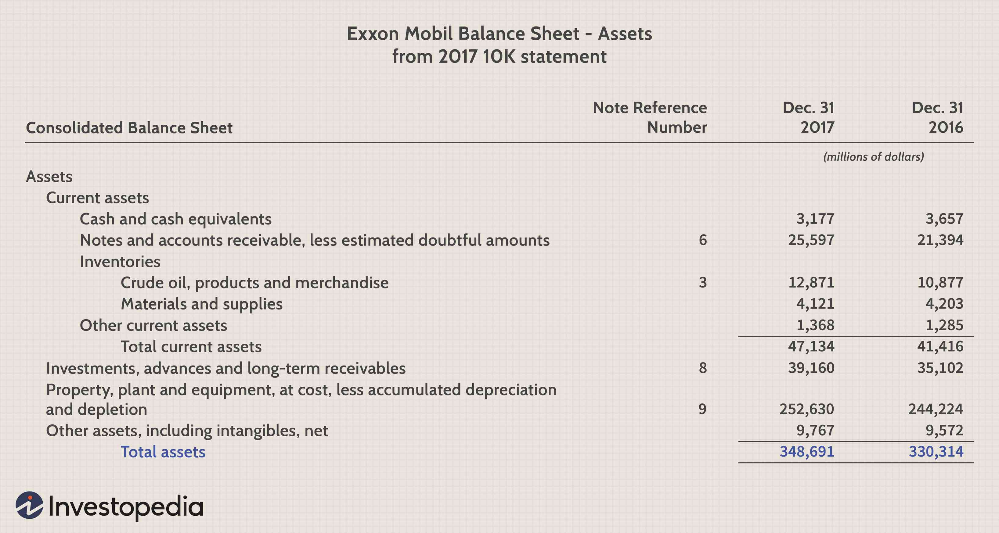

## Table of Contents

## What is Return on Assets (ROA)?

Return on Assets (ROA) is a financial ratio that shows how well a company is using its assets to make money. It tells you how much profit a company makes for each dollar of assets it owns. To find the ROA, you divide the company's net income by its total assets. A higher ROA means the company is using its assets more efficiently to generate profit.

ROA is important because it helps investors and managers see how well a company is doing compared to others. If a company has a high ROA, it means it's good at turning its assets into profit. On the other hand, a low ROA might mean the company needs to find better ways to use its assets. By looking at ROA, people can make better decisions about where to invest their money or how to improve a company's performance.

## Why is ROA important for businesses?

ROA is important for businesses because it shows how well they are using their stuff to make money. It tells business owners and investors if the company is good at turning its buildings, machines, and other things into profits. If a company has a high ROA, it means they are doing a great job at using what they have to make more money. This can make the company look good to people who might want to invest in it.

On the other hand, if a company has a low ROA, it might mean they need to find better ways to use their stuff. This can help business leaders see where they need to make changes or improvements. By looking at ROA, companies can compare themselves to other businesses and see how they are doing. This helps them make smart choices about how to grow and become more successful.

## How do you calculate ROA?

To calculate Return on Assets (ROA), you need to divide the company's net income by its total assets. Net income is the money the company makes after paying all its expenses. Total assets include everything the company owns, like buildings, machines, and money in the bank. So, if a company made $100,000 in net income and has $1,000,000 in total assets, the ROA would be $100,000 divided by $1,000,000, which equals 0.10 or 10%.

ROA is usually shown as a percentage. It helps show how good a company is at using its stuff to make money. If a company has a high ROA, it means they are doing a great job at turning what they own into profit. If the ROA is low, it might mean they need to find better ways to use their assets. By figuring out ROA, businesses can see how well they are doing and compare themselves to other companies.

## What are the components of the ROA formula?

The ROA formula has two main parts: net income and total assets. Net income is the money a company makes after paying all its bills and expenses. It's like the profit left over at the end of the year. Total assets are all the things a company owns, like buildings, machines, and money in the bank. These assets are what the company uses to make money.

To find the ROA, you divide the net income by the total assets. This gives you a number that shows how good the company is at using its stuff to make money. If a company has a high ROA, it means they are doing a great job at turning what they own into profit. If the ROA is low, it might mean they need to find better ways to use their assets. By figuring out ROA, businesses can see how well they are doing and compare themselves to other companies.

## Can you provide an example of ROA calculation?

Let's say a company made $50,000 in net income last year. Net income is the money left after paying all the bills. The company also has total assets worth $500,000. Total assets are all the things the company owns, like buildings and machines.

To find the ROA, you divide the net income by the total assets. So, $50,000 divided by $500,000 equals 0.10. When you turn that into a percentage, it's 10%. This means the company made 10 cents of profit for every dollar of assets it owns. A 10% ROA shows that the company is doing a good job at using its stuff to make money.

## How does ROA differ from Return on Equity (ROE)?

Return on Assets (ROA) and Return on Equity (ROE) are both ways to see how well a company is doing, but they look at different things. ROA shows how good a company is at using all its stuff, like buildings and machines, to make money. You find ROA by dividing the company's net income by its total assets. It tells you how much profit the company makes for every dollar of assets it has.

ROE, on the other hand, looks at how well a company is using the money that shareholders put into it. ROE is calculated by dividing the net income by the shareholders' equity. Shareholders' equity is the money that the owners have invested in the company. ROE shows how much profit the company makes for every dollar the shareholders have put in. So, while ROA is about using all assets to make money, ROE is about making money from the money the owners have invested.

## What is considered a good ROA percentage?

A good ROA percentage can depend on the industry, but generally, a higher ROA means a company is doing well at turning its stuff into profit. For many industries, an ROA of 5% to 10% is seen as pretty good. But some industries, like technology or finance, might have higher ROAs because they don't need as much stuff to make money.

It's also important to compare a company's ROA to other companies in the same industry. What might be a good ROA in one industry could be low in another. By looking at the ROA of similar companies, you can see if a company is doing better or worse than its competitors. This helps people decide if they want to invest in that company or if the company needs to find better ways to use its stuff.

## How can ROA be used to compare companies within the same industry?

ROA can help you see how well a company is doing compared to other companies in the same industry. If you want to know if a company is good at using its stuff to make money, you can look at its ROA and compare it to the ROA of other companies in the same field. For example, if a company has an ROA of 8% and the average ROA in its industry is 5%, that company is doing better than most at turning its assets into profit.

This comparison is helpful because different industries have different norms. What might be a good ROA in one industry could be low in another. By looking at ROA, investors and business owners can see if a company is doing better or worse than its competitors. This can help them decide where to put their money or if a company needs to find better ways to use its stuff.

## What are the limitations of using ROA as a performance metric?

ROA is a helpful way to see how well a company uses its stuff to make money, but it has some limits. One problem is that ROA can be different across industries. What is a good ROA in one industry might not be good in another. This makes it hard to compare companies in different fields. Also, ROA doesn't tell you everything about a company's health. It only looks at how well assets are used, but it doesn't show if a company has a lot of debt or if it's growing.

Another limit of ROA is that it can be affected by how a company decides to spend money on its assets. If a company buys a lot of new stuff, its total assets go up, and that can make the ROA go down, even if the company is still making the same amount of money. This can make it look like the company is doing worse than it really is. Also, companies can change their accounting methods to make their ROA look better, which can be confusing for people trying to understand how well the company is really doing.

## How does depreciation affect ROA calculations?

Depreciation is when a company lowers the value of its stuff, like machines or buildings, over time because they get old or wear out. This can change the ROA because it affects both the net income and the total assets. When a company calculates its net income, it subtracts depreciation as an expense. So, if depreciation is high, the net income will be lower, which can make the ROA look worse.

On the other hand, depreciation also lowers the value of total assets on the balance sheet. When you calculate ROA, you divide net income by total assets. If total assets go down because of depreciation, the ROA might go up, even if the net income stays the same. This can make it tricky to understand if a company is really doing better or if it's just because of how they handle depreciation.

## How can a company improve its ROA?

A company can improve its ROA by making more money or by using its stuff better. One way to make more money is to sell more things or find ways to charge more for what they sell. They can also cut costs by finding cheaper ways to make their products or by spending less on things like rent or supplies. If a company can make more money without buying more stuff, their ROA will go up because their net income will be higher while their total assets stay the same.

Another way to improve ROA is to use the stuff the company already has more efficiently. This means making sure machines and buildings are used as much as possible to make money. If a company can make more money with the same amount of stuff, their ROA will go up. They can also sell off stuff they don't need anymore, which will lower their total assets and make their ROA look better. By focusing on making more money and using their stuff better, a company can improve its ROA and show that it's good at turning what it owns into profit.

## What advanced techniques can be used to analyze ROA trends over time?

To analyze ROA trends over time, one advanced technique is to use time series analysis. This means looking at the ROA numbers from different years and seeing if there are patterns or changes. You can use graphs to show how the ROA goes up or down over time. This helps you see if the company is getting better or worse at using its stuff to make money. You can also use statistical tools to predict what the ROA might be in the future based on past numbers. This can help investors and business owners make smart choices about what to do next.

Another technique is to compare the company's ROA to industry benchmarks over time. This means looking at how the company's ROA changes compared to other companies in the same field. If the company's ROA is going up while the industry average stays the same or goes down, it might mean the company is doing something right. You can also use something called a DuPont analysis, which breaks down ROA into smaller parts like profit margin and asset turnover. This can help you see exactly where the company is getting better or worse at using its stuff to make money. By using these advanced techniques, you can get a deeper understanding of how a company's performance is changing over time.

## What is Return on Assets (ROA)?

Return on Assets (ROA) is a financial ratio that measures the efficiency with which a company employs its assets to generate profit. The formula for calculating ROA is:

$$
\text{ROA} = \frac{\text{Net Income}}{\text{Total Assets}}
$$

Net income, the numerator of this equation, refers to the profit remaining after all operational expenses, taxes, and interest have been subtracted from total revenue. Total assets, the denominator, encompass all resources owned by the company, inclusive of both current and fixed assets, as well as intangible assets such as patents or trademarks.

ROA is an indicator of management effectiveness in deploying resources. A higher ROA signifies that a company is efficiently utilizing its assets to create earnings, making it an essential metric for comparing the operational efficiency among companies in the same industry. By expressing how well a company is performing relative to the total capital at its disposal, ROA offers a broad measure of a company's profitability and asset management practices.

It is particularly useful because it standardizes results and provides a percentage that can easily be compared across companies and industries, assuming similar business conditions. However, since ROA is influenced by the asset structure and capital intensity of a business, comparisons should be limited to companies within the same sector to ensure the accuracy of insights.

In practice, financial analysts and investors look to ROA to assess a company’s ability to turn investments into profits which can reflect the firm’s management quality. Therefore, ROA serves as a benchmark for evaluating management's competency in generating earnings from available resources.

## What is the ROA Formula and How Can It Be Understood?

The Return on Assets (ROA) is a financial metric calculated using the formula:

$$
\text{ROA} = \frac{\text{Net Income}}{\text{Total Assets}}
$$

This formula represents how effectively a company utilizes its assets to generate profit. Net income, the numerator in the equation, is the company’s profit after subtracting all expenses and taxes. It serves as a crucial indicator of the company's profitability over a specified period. The denominator, total assets, encompasses all resources owned by the company, including both tangible assets like buildings and machinery, and intangible assets such as patents and trademarks.

By dividing net income by total assets, ROA offers insights into a company's ability to convert investments in resources into earnings. This measure reflects management's effectiveness in deploying resources to maximize profits. A high ROA indicates that a company is efficiently managing its assets to generate income, while a low ROA suggests less efficient asset utilization.

Incorporating ROA into financial analysis is vital for assessing a company's operational efficiency relative to its peers. By examining this ratio, investors and analysts can gauge how well a company uses its asset base to produce economic value. For instance, two companies with similar net incomes might have different ROAs; the company with the higher ROA demonstrates superior asset management capabilities.

For those interested in implementing this calculation programmatically, the ROA can be easily computed using Python with libraries such as Pandas:

```python
import pandas as pd

# Assume df is a DataFrame containing 'Net Income' and 'Total Assets' columns
df['ROA'] = df['Net Income'] / df['Total Assets']
```

This simple script calculates the ROA for each record within a dataset, facilitating its analysis across a portfolio of companies or within a specific industry. By leveraging ROA, analysts can derive meaningful insights into a company's operational proficiency in utilizing its assets to generate profitability.

## How does ROA compare to other financial ratios?

Return on Assets (ROA), Return on Equity (ROE), and Return on Investment (ROI) are pivotal financial ratios that provide distinct perspectives on a company's financial performance. ROA is a comprehensive metric as it considers both debt and equity in evaluating how effectively a company uses its assets to generate profits. Calculated as:

$$
\text{ROA} = \frac{\text{Net Income}}{\text{Total Assets}}
$$

it reflects the company's capability to convert investments into earnings, thus providing a broader efficiency measure.

In contrast, Return on Equity (ROE) focuses solely on the effectiveness of equity utilization. ROE expresses the profitability relative to shareholders' equity, calculated by:

$$
\text{ROE} = \frac{\text{Net Income}}{\text{Shareholders' Equity}}
$$

This metric is particularly valuable for investors interested in understanding how well their capital is being reinvested by the company.

Return on Investment (ROI) evaluates the profitability of an investment by comparing the benefits relative to its cost. The formula for ROI is:

$$
\text{ROI} = \frac{\text{Net Profit}}{\text{Cost of Investment}} \times 100
$$

ROI is widely used to assess potential returns on different ventures, making it a versatile tool for both corporate decision-making and investor analysis.

Combining ROA with ROE and ROI provides a more comprehensive overview of a company's financial health. While ROA offers a holistic view of efficiency by considering total assets, ROE and ROI complement this by spotlighting equity performance and investment returns, respectively. Using these ratios together allows investors and analysts to gain a nuanced understanding of a company's operational effectiveness, risk profile, and investment potential, ultimately informing more robust decision-making.

## References & Further Reading

To gain a more comprehensive understanding of Return on Assets (ROA) and its application in financial analysis and [algorithmic trading](/wiki/algorithmic-trading), several resources may prove useful for further exploration. 

1. **Financial Ratios for Executives: How to Assess Company Strength, Fix Problems, and Make Better Decisions** by Michael Rist. This book provides a broad overview of financial ratios, including ROA, and their significance in corporate decision-making processes.

2. **"The Little Book That Still Beats the Market"** by Joel Greenblatt offers insights into utilizing financial ratios, like ROA, to evaluate company performance and investment potential effectively.

3. **Investopedia** is a valuable online resource offering in-depth articles on financial metrics, including ROA, along with other essential ratios and their interpretations. They provide clarity on how these metrics can influence investment decisions.

4. To understand ROA in the context of algorithmic trading, the book **"Algorithmic Trading and DMA: An Introduction to Direct Access Trading Strategies"** by Barry Johnson discusses various strategies, including the incorporation of financial metrics like ROA in trading algorithms.

5. **Python for Finance: Analyze Big Financial Data** by Yves Hilpisch details the use of Python modules such as Pandas for analyzing financial ratios, making it a useful resource for those interested in applying ROA in algorithmic trading.

6. The **Journal of Finance** features numerous academic papers and articles discussing the implications of financial ratios like ROA on asset management and investment strategies.

Exploring these resources will enhance your understanding of Return on Assets, providing deeper insights into its calculation, application, and strategic importance in finance and trading.

