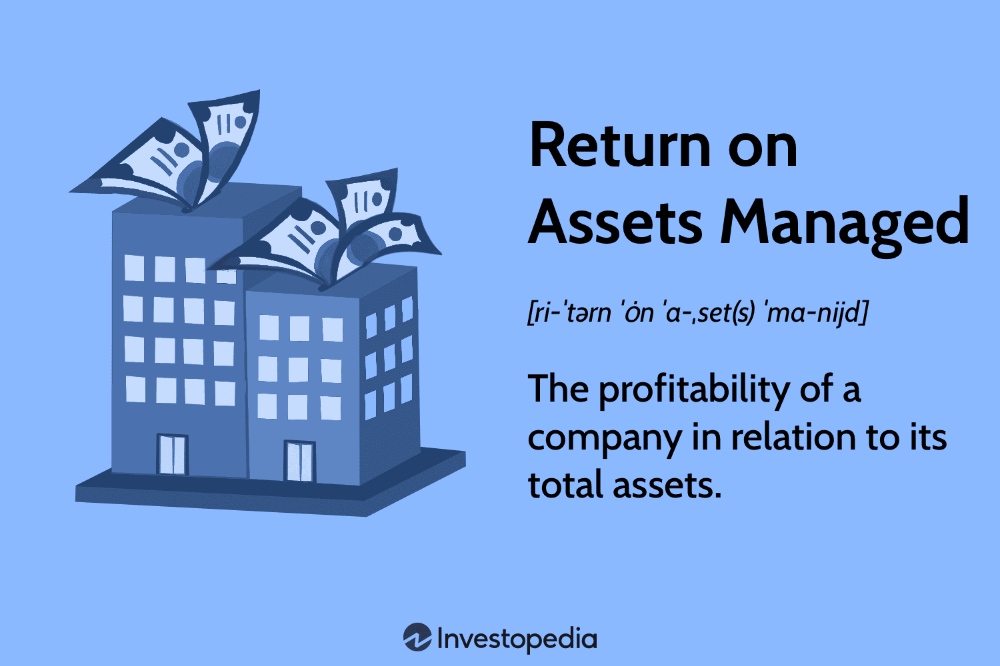

## Table of Contents

## What is Return on Assets Managed (ROAM)?

Return on Assets Managed (ROAM) is a financial measure that shows how well a company is using its assets to make money. It tells you how much profit a company makes for each dollar of assets it has. To find ROAM, you take the company's net income and divide it by the total assets. This number is usually shown as a percentage. A higher ROAM means the company is doing a good job at turning its assets into profit.

ROAM is useful for comparing how different companies are doing, especially in the same industry. If one company has a higher ROAM than another, it might mean that the first company is better at managing its assets. But, it's important to remember that ROAM is just one measure. It doesn't tell the whole story about a company's health. Other things like debt, industry trends, and the economy can also affect how well a company is doing.

## How is ROAM calculated?

ROAM, or Return on Assets Managed, is calculated by dividing a company's net income by its total assets. Net income is the money a company makes after paying all its expenses. Total assets are everything the company owns that has value, like buildings, equipment, and money in the bank. The result of this calculation is a percentage that shows how much profit the company makes for every dollar of assets it has.

For example, if a company has a net income of $100,000 and total assets of $1,000,000, you would divide $100,000 by $1,000,000 to get 0.10, or 10%. This means the company earns a 10% return on its assets. ROAM helps investors and managers see how well a company is using its assets to make money. A higher percentage means the company is doing a better job at turning its assets into profit.

## Why is ROAM important for investors and managers?

ROAM is important for investors and managers because it shows how well a company is using its stuff to make money. When investors look at ROAM, they can see if a company is good at turning its buildings, machines, and cash into profits. A high ROAM means the company is doing a great job with what it has. This can make investors feel more confident about putting their money into the company, hoping to get good returns.

Managers also use ROAM to check how well they are running the company. If ROAM is low, it might mean they need to find better ways to use the company's assets. Maybe they can sell some things they don't need or find ways to make more money with what they have. By keeping an eye on ROAM, managers can make smart choices to help the company do better and grow.

## What is considered a good ROAM percentage?

A good ROAM percentage can change depending on the industry. In some industries, like tech or finance, a ROAM of 5% to 10% might be seen as good. But in other industries, like retail or manufacturing, a good ROAM might be lower, around 2% to 5%. It's important to compare a company's ROAM with others in the same industry to know if it's doing well.

When looking at ROAM, it's also helpful to see how it changes over time. If a company's ROAM keeps going up, it means they're getting better at using their stuff to make money. But if ROAM is going down, it might be a sign that the company needs to do things differently. So, a good ROAM isn't just about the number itself, but also about how it's moving and how it stacks up against others in the same field.

## How does ROAM differ from Return on Assets (ROA)?

ROAM and ROA both look at how well a company uses its stuff to make money, but they are a bit different. ROAM stands for Return on Assets Managed, and it looks at how much profit a company makes for every dollar of assets it has. It's all about how well the company is managing its assets. ROA, or Return on Assets, is very similar. It also divides net income by total assets to see how profitable the company is compared to its assets.

The main difference is in what they focus on. ROAM is often used to see how well a company's management is doing with the assets they have. It's about management's effectiveness. ROA, on the other hand, is a broader measure that just looks at the overall profit the company makes from its assets. Both are useful, but ROAM can give a more detailed look at how well the people in charge are doing their job with the company's resources.

## Can ROAM be applied to different industries, and if so, how?

ROAM can be used in different industries to see how well companies are using their stuff to make money. Each industry might have its own idea of what a good ROAM percentage is. For example, in the tech industry, a ROAM of 5% to 10% might be seen as good. But in the retail industry, a good ROAM might be lower, around 2% to 5%. So, when you look at ROAM, it's important to compare companies in the same industry to know if they're doing well.

To use ROAM in different industries, you start by figuring out the net income and total assets for each company. Then, you divide the net income by the total assets to get the ROAM percentage. This number helps you see how well the company is turning its buildings, machines, and cash into profits. By comparing ROAM across companies in the same industry, you can see which ones are doing a better job at managing their assets. This helps investors and managers make smart choices about where to put their money or how to run their business better.

## What are the limitations of using ROAM as a performance metric?

Using ROAM as a performance metric has some limitations. One big problem is that ROAM doesn't tell the whole story about a company's health. It only looks at how well a company uses its stuff to make money, but it doesn't say anything about other important things like how much debt the company has or how well it's doing compared to others in the industry. So, if you only look at ROAM, you might miss out on important information that could affect your decisions.

Another limitation is that ROAM can be different from one industry to another. What's a good ROAM in one industry might not be good in another. This makes it hard to compare companies across different industries. Plus, ROAM can be affected by how a company decides to value its assets. If a company uses different ways to figure out what its stuff is worth, the ROAM number can change a lot. This means you need to be careful when using ROAM and think about these limitations when making choices based on it.

## How can a company improve its ROAM?

A company can improve its ROAM by finding ways to make more money with the stuff it has. One way to do this is by selling things that the company doesn't need anymore. If a company has old machines or buildings that aren't being used, selling them can lower the total assets and make the ROAM go up. Another way is by making the stuff they have work harder. For example, if a company can use its machines to make more products or find new ways to use its buildings, it can make more money without buying more stuff.

Another way to boost ROAM is by cutting costs. If a company can spend less money on things like rent, electricity, or supplies, it can keep more of its earnings as profit. This means the net income goes up, which makes the ROAM higher. Also, a company can look for new ways to make money with what it has. Maybe it can start selling new products or services that use the same assets but bring in more cash. By doing these things, a company can use its stuff better and improve its ROAM.

## What role does asset management play in optimizing ROAM?

Asset management is super important for making ROAM better. It's all about using the stuff a company has in the best way possible to make more money. If a company can use its buildings, machines, and cash smarter, it can make more profit without needing to buy more things. Good asset management means looking at what the company has and figuring out how to use it better. Maybe they can sell things they don't need or find new ways to use what they have to make more money.

By managing assets well, a company can also cut down on costs. If they can spend less on things like rent or supplies, they can keep more of their earnings as profit. This makes the net income go up, which helps improve the ROAM. Good asset management isn't just about using what you have; it's also about making smart choices to make the company more profitable. By doing this, a company can turn its assets into more money and make its ROAM higher.

## How does ROAM impact a company's financial strategy?

ROAM can really change how a company thinks about its money plans. If a company sees that its ROAM is low, it might decide to look for ways to use its stuff better. This could mean selling things they don't need or finding new ways to make money with what they have. A company might also decide to spend less on things like rent or supplies to keep more profit. By doing these things, the company can make its ROAM go up and become more profitable.

On the other hand, if a company has a high ROAM, it might feel good about how it's using its assets. This could make the company want to keep doing what it's doing or even put more money into things that are working well. But even with a high ROAM, the company still needs to watch out for other things like debt or industry changes that could affect its money plans. So, ROAM helps a company see where it stands and make smart choices about how to use its money and assets.

## What are some advanced techniques for analyzing ROAM trends over time?

One advanced way to look at ROAM trends over time is by using something called time series analysis. This means you look at the ROAM numbers from different times, like every month or every year, and see how they change. You can use special math tools to see if there are patterns or if the ROAM is going up or down in a certain way. This can help you guess what might happen next with the ROAM and make better plans for the future. It's like looking at a weather forecast but for a company's money.

Another way to dig deeper into ROAM trends is by comparing them with other numbers that matter, like how much debt the company has or how the whole industry is doing. You can use something called regression analysis to see how these other things affect the ROAM. This can show you if the ROAM is going up because the company is doing a better job or if it's because of something else, like the economy getting better. By looking at ROAM this way, you can get a fuller picture of what's really going on and make smarter choices about the company's money plans.

## How can ROAM be integrated into broader financial analysis models?

ROAM can be added to bigger money analysis models to help see how well a company is doing with its stuff. In these models, ROAM can be used along with other numbers like how much profit the company makes, how much it owes, and how it's doing compared to other companies in the same field. By looking at ROAM together with these other numbers, you can get a better idea of the company's overall health. For example, if ROAM is high but the company has a lot of debt, it might mean the company is good at using its stuff but could be risky because of the debt.

Using ROAM in these bigger models can also help make better guesses about what might happen next with the company's money. Special math tools, like time series analysis, can look at how ROAM changes over time and find patterns. This can help predict if the company will keep doing well or if it needs to change something. By putting ROAM into these models, people who make money decisions can see the full picture and make smarter choices about where to put their money or how to run the company better.

## What is ROAM in Asset Management?

Return on Assets Managed (ROAM) is a crucial financial metric that indicates how efficiently a company utilizes its assets to generate profits. It offers insights into the effectiveness of asset management by evaluating the relationship between operating profits and the total assets managed. The formula for calculating ROAM is given by:

$$
\text{ROAM} = \frac{\text{Operating Profits}}{\text{Total Assets Managed}}
$$

In this equation, the "Operating Profits" represents the earnings generated from normal business operations, while the "Total Assets Managed" encompasses assets like accounts receivable and inventory. This calculation helps in understanding how well a company is leveraging its assets to produce income.

ROAM serves as an indicator of a company's financial health, particularly in relation to asset management efficiency. By analyzing ROAM, stakeholders can assess whether a company's asset management strategies are effectively contributing to revenue generation. For instance, a higher ROAM indicates that a company is utilizing its assets more efficiently to generate profits, which can be a sign of sound management and operational strategies.

This metric is particularly insightful when used for comparative analysis. Evaluating a company's ROAM against its industry peers provides a benchmark to gauge competitive performance. Additionally, analyzing ROAM over time allows for the assessment of a company's historical performance, offering insights into trends and potential areas for improvement. By understanding and leveraging these comparisons, firms can make informed decisions aimed at enhancing their asset management practices and overall operational success.

## What is the conclusion?

ROAM provides valuable insights into asset management efficiency, especially when integrated with [algorithmic trading](/wiki/algorithmic-trading) strategies. By utilizing these metrics, investors can more effectively deploy their assets, enhance trading efficiency, and achieve higher profitability. The increasing sophistication of technology continues to evolve the role of financial metrics like ROAM, facilitating automation and delivering data-driven decision-making capabilities. For example, return on assets managed (ROAM) can be calculated as:

$$
ROAM = \frac{\text{Operating Profits}}{\text{Total Assets Managed}}
$$

This formula can be incorporated into algorithmic trading systems to dynamically assess and optimize asset utilization.

As technological advancements, such as [artificial intelligence](/wiki/ai-artificial-intelligence) and [machine learning](/wiki/machine-learning), continue to reshape the financial landscape, the importance and utility of metrics like ROAM are only anticipated to grow. These tools will enable more precise and rapid analyses of trading opportunities, allowing for better strategy adjustments and risk assessments in real-time.

Therefore, it is crucial for stakeholders to maintain flexibility and continuously update their strategies to effectively navigate financial markets. They should be committed to leveraging new technologies and refining their methodologies to stay competitive and reap the full benefits of the data and computational power at their disposal. This proactive approach will ensure they meet the challenges of an ever-changing market environment successfully.

## References & Further Reading

[1]: Pojenka, G., & Ermou, C. (2020). ["Return on Assets Managed: Metrics and Methodologies."](https://onlinelibrary.wiley.com/toc/13652702/2020/29/11-12) Springer Finance.

[2]: Lopez de Prado, M. (2018). ["Advances in Financial Machine Learning."](https://www.amazon.com/Advances-Financial-Machine-Learning-Marcos/dp/1119482089) John Wiley & Sons.

[3]: Hasbrouck, J., & Saar, G. (2013). ["Low-latency trading."](https://www.sciencedirect.com/science/article/abs/pii/S1386418113000165) The Review of Financial Studies, 26(7), 2313-2354.

[4]: Chan, E. P. (2009). ["Quantitative Trading: How to Build Your Own Algorithmic Trading Business."](https://github.com/ftvision/quant_trading_echan_book) John Wiley & Sons.

[5]: Aronson, D. R. (2006). ["Evidence-Based Technical Analysis: Applying the Scientific Method and Statistical Inference to Trading Signals."](https://www.amazon.com/Evidence-Based-Technical-Analysis-Scientific-Statistical/dp/0470008741) John Wiley & Sons.

[6]: Jansen, S. (2020). ["Machine Learning for Algorithmic Trading."](https://github.com/stefan-jansen/machine-learning-for-trading) Packt Publishing.