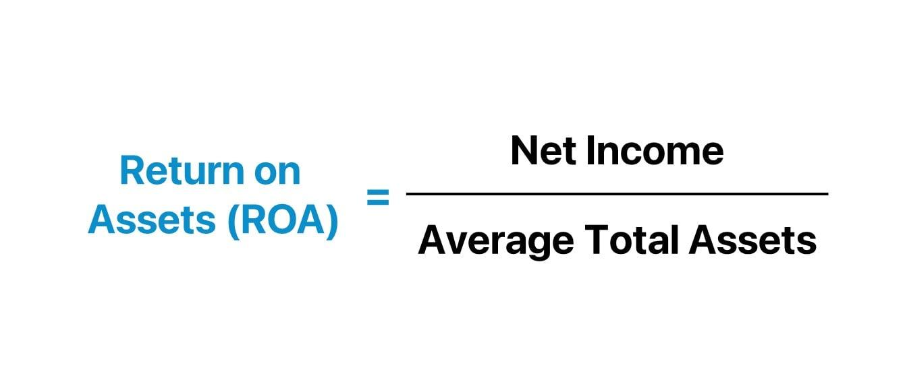

In the world of finance, understanding a company's profitability and efficiency is critical for investors and analysts. One key metric that stands out in this regard is Return on Assets (ROA). ROA is an essential financial ratio that measures how effectively a company utilizes its assets to generate profits. By evaluating how well a company's assets are being used, investors can gain insights into the operational efficiency and management effectiveness of an organization.

This article explores the concept of ROA, its formula, and how it is calculated. The ROA formula is expressed as:



$$
\text{ROA} = \frac{\text{Net Income}}{\text{Total Assets}}
$$

where net income represents the profit a company earns after all expenses and taxes have been deducted, and total assets encompass everything a company owns, including both tangible and intangible assets. Understanding this metric provides a snapshot of the company's ability to convert its investment in assets into net earnings.

Additionally, the role of financial ratios in algorithmic trading is examined. As algorithmic trading involves using computer algorithms to make trading decisions, financial ratios like ROA can be integrated into these algorithms. By identifying well-managed companies that efficiently utilize their assets, traders can enhance their trading strategies, potentially targeting companies with strong growth potential.

Understanding these concepts can help traders make informed decisions, ensuring that they are not only assessing a company's current performance but also its future prospects.

## Table of Contents

## What is Return on Assets (ROA)?

Return on Assets (ROA) is a critical financial metric used to gauge a company's ability to generate profit from its assets. As a profitability ratio, ROA sheds light on how well a company is leveraging its asset base to produce earnings. It is calculated by dividing net income by total assets and is expressed as a percentage. The formula can be represented as:

$$
\text{ROA} = \left( \frac{\text{Net Income}}{\text{Total Assets}} \right) \times 100
$$

Net income refers to the profit a company makes after all expenses, including taxes, are subtracted from its total revenue. Total assets encompass all resources owned by the company, such as cash, inventory, and property. A higher ROA indicates more efficient management in employing company assets to generate earnings.

By comparing a company's ROA to industry averages, analysts can gain insight into its operational efficiency. A company with an ROA above the industry average typically signifies superior management effectiveness in using assets to produce profits. This comparison is essential because it accounts for industry-specific factors that can influence the efficiency of asset utilization. For instance, companies in capital-intensive industries, such as manufacturing, might naturally report lower ROAs compared to those in service industries due to the heavy investment in physical assets.

Thus, ROA serves as a valuable tool for investors and analysts in assessing and comparing the profitability and efficiency of companies within and across industries.

## Understanding the ROA Formula

The Return on Assets (ROA) formula is a pivotal metric in evaluating a company's efficiency in utilizing its assets to generate profits. Mathematically, ROA is expressed as:

$$
\text{ROA} = \frac{\text{Net Income}}{\text{Total Assets}}
$$

In this equation, net income represents the profit a company retains after accounting for all taxes and expenses. It provides a clear indication of the company's profitability within a specific period, typically a fiscal year. Essentially, net income is the final figure on the income statement that showcases a company's ability to convert revenues into profit after meeting all its obligations and expenses.

Total assets are the aggregate of everything a company owns, which can include cash, inventory, property, and equipment. Assets are typically listed on the company's balance sheet and symbolize the resources a company has at its disposal to generate revenue. It encompasses both current assets, which are expected to be converted into cash or consumed within a year, and non-current assets, which are held for more extended periods.

The ROA formula offers a critical assessment by illustrating the profit a company can generate for every dollar of its assets. This efficiency ratio allows analysts and investors to gauge how well a company is managing its assets relative to its peers. A higher ROA indicates that the company is efficient in utilizing its assets, thereby producing more income per asset dollar.

Incorporating this formula into Python for computational analysis, one could write a simple function as follows:

```python
def calculate_roa(net_income, total_assets):
    """
    Calculate the Return on Assets (ROA).

    Parameters:
    net_income (float): The net income of the company.
    total_assets (float): The total assets of the company.

    Returns:
    float: The ROA percentage.
    """
    if total_assets == 0:
        raise ValueError("Total assets cannot be zero.")
    roa = (net_income / total_assets) * 100
    return roa

# Example usage:
net_income_example = 5000000
total_assets_example = 25000000
roa_result = calculate_roa(net_income_example, total_assets_example)
print(f"The ROA is {roa_result}%")
```

This function provides a streamlined approach to calculate ROA, ensuring that essential business evaluations are efficiently performed. Understanding these calculations can significantly aid in assessing a company's operational prowess and investment potential.

## Special Considerations in ROA Calculation

While Return on Assets (ROA) is a valuable metric in assessing a company's efficiency in utilizing its assets to generate profits, it is important to apply this measure cautiously. Different industries exhibit varying operational characteristics that can significantly influence a company's ROA. 

Businesses operating in asset-heavy industries such as manufacturing or utilities often display lower ROAs compared to those in service-based industries, such as technology or finance. This variation arises from the substantial capital investments and infrastructure required in asset-heavy sectors, which inflate the total assets denominator in the ROA formula:

$$
\text{ROA} = \frac{\text{Net Income}}{\text{Total Assets}}
$$

For instance, manufacturing companies typically have significant investments in machinery and facilities, resulting in higher total asset values. Consequently, even if these companies generate substantial net income, their ROA might still appear modest due to the high asset base. Conversely, service-oriented companies, requiring fewer tangible assets, can achieve higher ROAs with similar income levels since their asset base is comparatively smaller.

When evaluating a company's ROA, it is essential to take into account the industry standards and historical performance metrics. Comparing a company's ROA solely against a universal benchmark without considering industry-specific contexts may lead to misleading conclusions. A more appropriate approach involves benchmarking the company's ROA against industry averages or peers within the same sector. This adjusted comparison can provide a clearer picture of how effectively the company is using its assets relative to its industry counterparts.

Furthermore, assessing historical performance can offer additional insights into the company's asset utilization trends over time. It helps in understanding whether the ROA variations are part of a consistent operational strategy or indicative of other strategic shifts. Analysts and investors should therefore integrate these considerations when employing ROA as a measure of financial efficiency, ensuring a comprehensive analysis that reflects the true operational dynamics specific to the industry in which a company operates.

## ROA in Algorithmic Trading

Algorithmic trading utilizes computer algorithms designed to execute trades at high speed and frequency, leveraging predefined criteria. One crucial aspect of these algorithms is the incorporation of financial ratios such as Return on Assets (ROA). The integration of ROA into trading algorithms allows traders to identify companies that demonstrate efficiency in asset utilization, which is indicative of proficient management.

ROA is a useful metric in determining how effectively a company uses its assets to produce earnings. Traders aiming for algorithmic strategies might consider companies with a high ROA as potential targets. A higher ROA indicates a company is generating more profit per dollar of assets, implying efficient management and operational success.

To implement ROA in [algorithmic trading](/wiki/algorithmic-trading), traders often write algorithms that screen for companies meeting specific ROA thresholds. Python, a popular programming language in trading due to its simplicity and extensive libraries, provides the tools necessary to create these algorithms. Below is an illustrative example in Python using the Pandas library for processing financial data:

```python
import pandas as pd

# Sample financial data
data = {
    'Company': ['A', 'B', 'C'],
    'Net Income': [500000, 800000, 200000],
    'Total Assets': [2000000, 3000000, 1000000]
}

# Create DataFrame
df = pd.DataFrame(data)

# Calculate ROA
df['ROA'] = (df['Net Income'] / df['Total Assets']) * 100

# Filter companies with ROA greater than a specific threshold
threshold = 15  # Example threshold
high_roa_companies = df[df['ROA'] > threshold]

print(high_roa_companies)
```

In this script, companies with an ROA above the chosen threshold are identified. Such filtering is a key step in algorithmic trading to target well-managed companies with strong growth potential. Once potential targets are identified based on ROA, algorithms can proceed with further analysis or execute trades directly, leveraging market conditions and other financial metrics to optimize decision-making.

By incorporating ROA into algorithmic trading, traders can enhance their strategies by focusing on companies that efficiently utilize resources, aiming for superior performance in asset management. This approach can help detect investment opportunities in companies with both stable financial health and growth prospects.

## Comparing ROA to Other Financial Ratios

Return on Assets (ROA), Return on Equity (ROE), and Return on Investment (ROI) are critical financial ratios used to evaluate a company's financial performance. Each offers unique insights, providing a distinct angle from which to assess the efficiency and profitability of a company's operations.

ROA is a measure that evaluates how efficiently a company uses its assets to generate profits. The formula for calculating ROA is:

$$
\text{ROA} = \frac{\text{Net Income}}{\text{Total Assets}}
$$

It reflects the company's ability to convert the investment in assets into net income and includes both equity and debt in its consideration.

On the other hand, ROE focuses on profitability relative to shareholders' equity. It is calculated as:

$$
\text{ROE} = \frac{\text{Net Income}}{\text{Shareholders' Equity}}
$$

This ratio highlights how well a company uses shareholders' funds to generate profits, making it a preferred metric for equity investors. ROE does not consider a company's debt, unlike ROA, which encompasses the overall capital structure (equity and debt). This distinction makes ROA a broader measure of a company's financial health while offering insights into its dependency on debt for profitability.

Return on Investment (ROI) is a performance measure used to evaluate the efficiency of an investment. It is calculated as:

$$
\text{ROI} = \frac{\text{Gain from Investment} - \text{Cost of Investment}}{\text{Cost of Investment}}
$$

ROI is versatile, providing a straightforward approach to assess the profitability of an investment across different contexts, including marketing campaigns, project investments, and capital expenditures.

Understanding these distinctions is crucial for a comprehensive assessment of a company’s performance. While ROA provides insights into the asset efficiency of a company, ROE gives a perspective on shareholder profitability, and ROI offers a general efficiency evaluation on an investment basis. These ratios, when used together, allow analysts and investors to gain a well-rounded understanding of a company's financial health, enabling informed investment decisions.

## Limitations of ROA

Return on Assets (ROA) is a valuable metric in assessing a company's operational efficiency, yet it also has notable limitations that necessitate cautious interpretation. Firstly, ROA does not account for future growth potential or cash flow management, key components of long-term financial health. While net income, used in the ROA formula, reflects past earnings, it does not provide insights into future profitability or the company's ability to manage cash flows effectively.

Additionally, ROA may fail to fully represent the true value of intangible assets such as intellectual property, brand value, or human capital. These intangibles, often critical to a company's competitive edge, might not be captured on the balance sheet, potentially skewing the ROA figure. For instance, technology companies with significant investments in research and development might report lower ROA figures despite having strong intellectual capital.

Given these limitations, it is vital for investors to use ROA in conjunction with other financial metrics to form a comprehensive view of a company's financial health. Metrics like cash flow analysis, Return on Equity (ROE), and a detailed assessment of intangible assets can complement ROA, offering additional perspectives on a company's viability and future prospects. By integrating various metrics, investors can mitigate the shortcomings of relying solely on ROA, thus achieving a more nuanced understanding of a company's overall performance.

## Conclusion

Return on Assets is a crucial financial ratio for assessing a company's efficiency in utilizing its assets to generate profits. It serves as an important yardstick for investors seeking to evaluate how effectively a company manages its resources. In the context of algorithmic trading, incorporating ROA can potentially enhance trading strategies by enabling the identification of companies with strong asset management capabilities. By analyzing ROA, traders can focus on well-managed companies that may offer stable growth opportunities.

However, while ROA offers valuable insights into a company’s operational efficiency, relying solely on this metric can be misleading. It is important to integrate ROA with a broader set of financial metrics to capture a comprehensive view of a company's financial health. Other financial ratios, such as Return on Equity (ROE) and Return on Investment (ROI), can offer additional perspectives by considering factors like equity and overall investment performance.

For investors and traders, understanding and applying ROA in conjunction with other indicators provides a more robust foundation for making informed decisions. This multifaceted approach ensures that the assessment considers various dimensions of a company's financial performance, leading to more balanced and strategic investment choices.

## References & Further Reading

[1]: Almarzoqi, R., Naceur, S. B., & Kotak, A. (2015). ["What Matters in the Yield Curve? Financial Ratios, Inflation Expectations, and Macroeconomic Conditions."](https://www.imf.org/-/media/Websites/IMF/imported-full-text-pdf/external/pubs/ft/wp/2015/_wp15173.ashx) International Monetary Fund.

[2]: ["Financial Statement Analysis and Security Valuation"](https://www.mheducation.com/highered/product/financial-statement-analysis-security-valuation-penman/M9780078025310.html) by Stephen Penman

[3]: Damodaran, A. (2007). ["Return on Capital (ROC), Return on Invested Capital (ROIC), and Return on Equity (ROE): Measurement and Implications."](https://pages.stern.nyu.edu/~adamodar/pdfiles/papers/returnmeasures.pdf) 

[4]: ["Principles of Corporate Finance"](https://www.mheducation.com/highered/product/principles-corporate-finance-brealey-myers/M9781264080946.html) by Richard A. Brealey, Stewart C. Myers, and Franklin Allen

[5]: DeFusco, R. A., McLeavey, D. W., Pinto, J. E., & Runkle, D. E. (2007). ["Quantitative Investment Analysis" (2nd ed.).](https://books.google.com/books/about/Quantitative_Investment_Analysis.html?id=0S_dCQAAQBAJ) CFA Institute Investment Series.