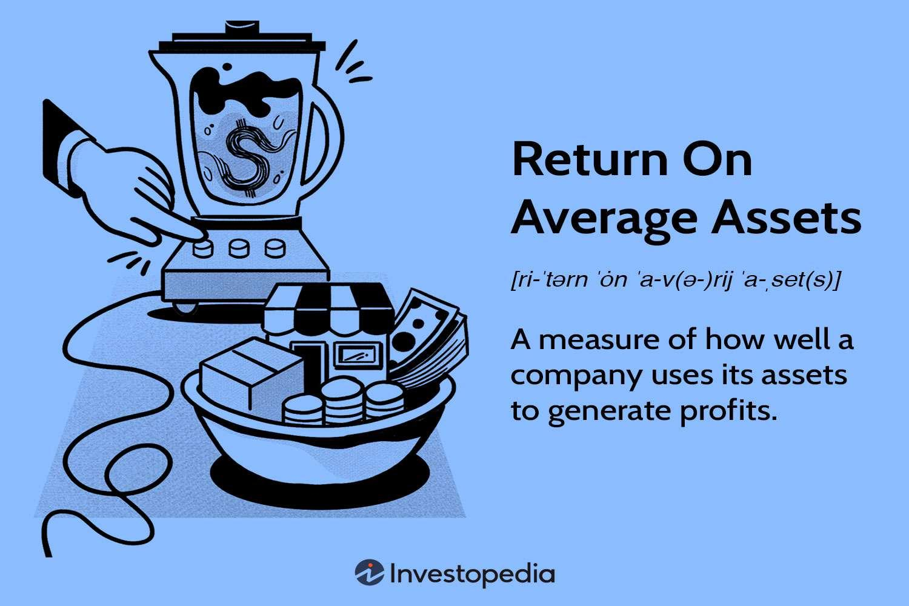

In today's ever-evolving financial landscape, understanding the performance of financial assets is critical for both individual and institutional investors. Investors must navigate a complex array of factors influencing asset performance to achieve their financial goals. Among these factors, financial metrics and technological advances play pivotal roles in shaping investment strategies.

One of the key financial metrics frequently analyzed is the Return on Average Assets (ROAA). ROAA is a measure of how efficiently a company utilizes its average total assets to generate net income. It provides insights into how well a company is managing its resources, a crucial factor in determining asset profitability.



Alongside traditional financial metrics, algorithmic trading, often referred to as algo trading, has become an integral component of financial markets. It employs advanced mathematical models and algorithms to execute trades at speeds and frequencies impossible for human traders. Algorithmic trading helps in capitalizing on fleeting market opportunities and reducing the emotional biases that can detract from rational trading decisions.

By examining ROAA and algorithmic trading within the context of asset performance, investors can gain valuable insights into optimizing their portfolios. These strategies enable more nuanced evaluations of investments, focusing on efficiency and long-term profitability. This article aims to inform readers about how such metrics and strategies can enhance investment outcomes, honing their ability to make informed, data-driven decisions in financial markets.

## Table of Contents

## Understanding Key Financial Metrics

Financial metrics serve as crucial analytical instruments for assessing the health and performance of businesses or investments. These metrics provide quantitative insights into various aspects of a company’s financial performance, enabling investors and analysts to make informed judgments about potential investments or business strategies.

Among financial metrics, Return on Average Assets (ROAA) stands out as particularly significant. ROAA measures the efficiency with which a company utilizes its average total assets to produce net income. This metric is calculated as:

$$
\text{ROAA} = \frac{\text{Net Income}}{\text{Average Total Assets}}
$$

where Average Total Assets is typically computed as the average of total assets at the beginning and end of a given period. ROAA provides insights into asset profitability by revealing how well a company can convert its asset investments into earnings. A higher ROAA indicates more effective asset utilization and management, suggesting that the business is capable of generating substantial returns relative to its asset base.

In addition to ROAA, a comprehensive evaluation of a company’s efficiency often involves comparing it with other financial metrics. Metrics such as Return on Equity (ROE) and Return on Investment (ROI) provide alternative perspectives on profitability and asset utilization. ROE, for instance, measures the profitability from shareholders' equity and offers insights into how effectively management is using equity capital.

Understanding these metrics in conjunction helps investors discern an organization’s operational efficiency and financial health. For example, while ROAA focuses on asset utilization, ROE emphasizes shareholder returns. Comparing such indicators can reveal whether a company's asset or equity utilization contributes more significantly to profitability. By analyzing these relationships, investors can better gauge a company's operational efficiency and overall financial performance.

Continual monitoring of financial metrics like ROAA allows investors to track changes in efficiency and profitability over time, which is essential for making timely investment decisions. As financial markets and business environments continue to evolve, these metrics provide valuable insights that aid in the identification of investment opportunities and the management of financial risks.

## The Importance of ROAA in Financial Analysis

Return on Average Assets (ROAA) is a critical financial metric for assessing profitability relative to a company's asset base, particularly for financial institutions and banks. By providing insights into how effectively a bank or corporation utilizes its assets to generate earnings, ROAA plays a significant role in financial analysis and decision-making.

The calculation of ROAA involves dividing the net income by the average total assets over a specific period, typically a fiscal year. The formula is expressed as:

$$
\text{ROAA} = \left( \frac{\text{Net Income}}{\text{Average Total Assets}} \right) \times 100
$$

This metric is instrumental in highlighting the efficiency with which management deploys assets to generate profit. A higher ROAA percentage signifies superior asset management and utilization, which can differentiate a well-managed company from its peers. In industries where asset usage varies significantly, such as banking, comparing ROAA among similar companies provides a clearer picture of operational efficiency. 

Considering ROAA's implications is crucial for understanding a company's resource management practices. High ROAA values indicate a robust ability to convert investment in assets into profitable outcomes, reflecting effective management strategies and operational competencies. Conversely, a declining ROAA may signal inefficiencies or underutilized assets, prompting a need for strategic reassessment.

Beyond individual institutions, ROAA is also valuable for stakeholders and investors looking to compare companies within the same industry. It offers a level playing field for assessing financial health, independent of company size, thereby aiding investors in identifying potential investment candidates with proficient asset management. Effective use of ROAA can lead to strategic investments that align with long-term financial objectives. 

In summary, understanding ROAA's calculation and implications empowers financial analysts, investors, and managers to make informed decisions by identifying companies with efficient resource management. This metric not only illuminates the current operational efficiency but also guides stakeholders in anticipating future profitability trends based on asset utilization strategies.

## Role of Algorithmic Trading in Modern Finance

Algorithmic trading has fundamentally transformed financial markets by incorporating automation into trading strategies, thereby enhancing speed and minimizing the emotional biases that often cloud human judgment. By using sophisticated mathematical models and data analysis, algorithmic traders seek to identify and exploit market inefficiencies more effectively than traditional methods. 

The primary advantage of [algorithmic trading](/wiki/algorithmic-trading) lies in its ability to process vast amounts of market data with unprecedented speed, allowing traders to capitalize on fleeting opportunities. Automated systems can scan multiple markets simultaneously and execute orders at optimal times, a feat that human traders find challenging due to the sheer [volume](/wiki/volume-trading-strategy) and complexity of the data involved. This automation significantly reduces latency—the delay between a market event and the corresponding trade execution—which is crucial for capturing minor price discrepancies in high-frequency trading environments.

Mathematical models are at the heart of algorithmic trading. These models are designed to predict market movements by analyzing historical data and identifying patterns. For instance, quantitative analysis techniques, such as regression analysis, [machine learning](/wiki/machine-learning) algorithms, and stochastic calculus, are used to develop trading strategies tailored to specific market conditions. Python is a popular programming language for implementing these models due to its extensive libraries like NumPy, pandas, and scikit-learn, which facilitate data manipulation and predictive modeling.

Evaluating the performance of trading algorithms involves several key metrics. The Sharpe Ratio, for instance, measures the risk-adjusted return of an investment:

$$
\text{Sharpe Ratio} = \frac{E[R_p - R_f]}{\sigma_p}
$$

where $E[R_p - R_f]$ is the expected return of the portfolio minus the risk-free rate, and $\sigma_p$ is the standard deviation of the portfolio's excess return. A higher Sharpe Ratio implies a more desirable balance between the risk taken and the return achieved, indicating a more efficient trading strategy.

Another critical metric is Maximum Drawdown, which quantifies the largest decline in portfolio value from a peak to a trough before a new peak is attained. This metric is essential for understanding the potential losses an algorithmic strategy may incur under adverse conditions and helps in assessing the strategy's risk profile.

The Win Rate, or the proportion of profitable trades out of the total number of trades executed, is also an important measure, although it should be interpreted with caution. A high win rate does not necessarily indicate a successful strategy, especially if the gains from winning trades are marginal compared to the losses from losing trades. Thus, it is often considered alongside other metrics to gain a comprehensive understanding of an algorithm's performance.

In summary, algorithmic trading enhances market participation by enabling rapid and objective trading decisions founded on data-driven insights. Its integration with cutting-edge computational techniques provides traders with the ability to navigate the complexities of modern financial markets and optimize their trading outcomes.

## Integrating ROAA with Algorithmic Trading

Integrating financial metrics such as Return on Average Assets (ROAA) with algorithmic trading offers a comprehensive approach to evaluating investment performance. By incorporating ROAA into trading algorithms, investors can optimize portfolio management by assessing long-term profitability in relation to the asset base. This methodology involves blending traditional financial analysis with modern trading techniques to create strategies that are both informed and adaptable.

ROAA, defined as net income divided by average total assets, provides insights into how efficiently a company utilizes its assets to generate earnings. In the context of algorithmic trading, using ROAA as a parameter allows traders to screen and select assets based on their efficiency. This ensures that the assets included in the trading strategy have a proven track record of effective resource management, potentially improving overall portfolio returns.

Python, a commonly used programming language in algorithmic trading, can facilitate the integration of ROAA in trading strategies. For example, a simple strategy might involve calculating the ROAA for a set of companies and using this metric as part of the decision-making process for trade execution. Below is a basic example of how one might code such a filter using Python:

```python
import pandas as pd

# Sample dataframe containing company financials
data = pd.DataFrame({
    'Company': ['Company A', 'Company B', 'Company C'],
    'Net Income': [500000, 750000, 620000],
    'Total Assets Start': [10000000, 15000000, 10500000],
    'Total Assets End': [12000000, 16500000, 11000000]
})

# Calculate Average Total Assets
data['Average Total Assets'] = (data['Total Assets Start'] + data['Total Assets End']) / 2

# Calculate ROAA
data['ROAA'] = data['Net Income'] / data['Average Total Assets']

# Filter based on a ROAA threshold
roaa_threshold = 0.05
selected_assets = data[data['ROAA'] > roaa_threshold]

print(selected_assets)
```

In this context, integrating ROAA helps in developing adaptive trading strategies capable of responding efficiently to changing market conditions while focusing on asset utilization. By incorporating such metrics, traders not only enhance the quantitative rigor of their strategies but also potentially improve their performance through better asset selection.

Additionally, integrating financial metrics into algorithmic trading facilitates a feedback loop where performance data can be continually analyzed and strategies refined accordingly. This approach ensures that trading algorithms remain relevant and effective over time, adapting to new data while maintaining an emphasis on the efficient use of assets.

## Case Study: Application of ROAA in Algorithmic Trading

In applying Return on Average Assets (ROAA) as a filter criterion within algorithmic trading, investors can refine asset selection by targeting companies demonstrating efficient asset management. The process involves a strategic combination of ROAA analysis with algorithmic trading techniques to optimize investment decisions.

### Step 1: Data Collection and Preprocessing
To employ ROAA effectively, traders initially gather historical financial data, including net income and total assets for prospective firms, over a review period. This data forms the backbone of calculating ROAA:

$$
\text{ROAA} = \frac{\text{Net Income}}{\text{Average Total Assets}}
$$

Average Total Assets are computed by averaging the total asset values at the beginning and end of the fiscal period.

### Step 2: Defining the Trading Algorithm
An algorithm is developed with ROAA as a primary screening criterion. Firms exhibiting consistently high ROAA are deemed as having superior asset management capabilities. Incorporating ROAA, the trading algorithm can be designed in Python as follows:

```python
def calculate_roaa(net_income, total_assets_start, total_assets_end):
    average_assets = (total_assets_start + total_assets_end) / 2
    return net_income / average_assets

def select_assets(firms_data):
    selected_firms = []
    for firm in firms_data:
        roaa = calculate_roaa(firm['net_income'], firm['assets_start'], firm['assets_end'])
        if roaa > threshold:  # Set a benchmark ROAA value
            selected_firms.append(firm)
    return selected_firms

# Example data structure
firms_data = [
    {'name': 'Firm A', 'net_income': 120000, 'assets_start': 1000000, 'assets_end': 1100000},
    {'name': 'Firm B', 'net_income': 150000, 'assets_start': 1300000, 'assets_end': 1200000},
    # More firm data
]

selected = select_assets(firms_data)
```

### Step 3: Backtesting Strategy
Backtesting is crucial to assess how effectively the selected high-ROAA assets perform in actual trading scenarios. Historical market data is utilized to simulate trades and evaluate the strategy's robustness. This phase involves testing the correlation between high ROAA values and positive trading outcomes.

```python
def backtest_strategy(selected_firms, historical_market_data):
    results = []
    for firm in selected_firms:
        # Implement backtesting logic
        historical_performance = historical_market_data[firm['name']]
        results.append(analyze_performance(historical_performance))
    return results
```

### Step 4: Quantitative Analysis and Decision-Making
Quantitative benefits manifest through enhanced insights into asset performance and improved decision-making. High-ROAA firms, often indicative of effective resource management, may provide more stable and profitable investment opportunities. The integration of ROAA in algorithmic trading facilitates the development of adaptive trading strategies responsive to the evolving market landscape.

By leveraging financial metrics within algorithmic frameworks, this approach exemplifies how understanding financial information can enhance trading strategies, promoting efficient asset management, and robust investment outcomes.

## Conclusion

Understanding and utilizing financial metrics like Return on Average Assets (ROAA) and algorithmic trading are crucial in modern investing and financial performance evaluation. These methodologies offer unique insights into asset utilization and trading efficiency, equipping investors with the tools necessary to make informed decisions. By measuring how effectively a firm uses its assets to generate net income, ROAA provides a benchmark for assessing profitability. This insight, in combination with the speed and precision offered by algorithmic trading, allows for an enhanced approach to asset performance analysis.

Algorithmic trading automates trading strategies, relying on mathematical models and data analysis to identify and exploit market opportunities swiftly. This method reduces human bias and emotional trading, resulting in more objective decision-making. By incorporating financial metrics like ROAA into algorithmic models, investors can construct robust portfolios that not only focus on short-term gains but also evaluate the long-term profitability relative to the asset base. 

Furthermore, these tools aid in optimizing asset performance, targeting higher returns while minimizing risks. Metrics such as the Sharpe Ratio and Maximum Drawdown become particularly valuable in assessing the risk-adjusted returns of trading strategies. Employing a combination of ROAA and algorithmic trading, investors can achieve a more comprehensive understanding of market dynamics, enhancing their ability to respond to shifting financial landscapes effectively.

As the financial industry continues to evolve, the importance of continuous learning and adaptability cannot be understated. Investors must stay abreast of emerging methodologies and integrate them into their decision-making processes to maintain competitive advantage. By doing so, they can navigate the complexities of today's financial markets with greater confidence and precision, ultimately achieving better risk-adjusted outcomes.

## References & Further Reading

[1]: ["Advances in Financial Machine Learning"](https://www.amazon.com/Advances-Financial-Machine-Learning-Marcos/dp/1119482089) by Marcos Lopez de Prado

[2]: ["Machine Learning for Algorithmic Trading"](https://github.com/stefan-jansen/machine-learning-for-trading) by Stefan Jansen

[3]: ["Quantitative Trading: How to Build Your Own Algorithmic Trading Business"](https://www.amazon.com/Quantitative-Trading-Build-Algorithmic-Business/dp/1119800064) by Ernest P. Chan

[4]: Bergstra, J., Bardenet, R., Bengio, Y., & Kégl, B. (2011). ["Algorithms for Hyper-Parameter Optimization."](https://dl.acm.org/doi/10.5555/2986459.2986743) Advances in Neural Information Processing Systems 24.

[5]: ["Evidence-Based Technical Analysis: Applying the Scientific Method and Statistical Inference to Trading Signals"](https://www.amazon.com/Evidence-Based-Technical-Analysis-Scientific-Statistical/dp/0470008741) by David Aronson